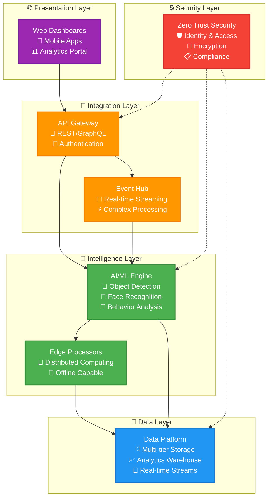

# AI Video Analytics Platform
## Progressive Enterprise Implementation Strategy

[](./roadmap/progressive_implementation_roadmap.md)
[](./roadmap/phase-01-crawl/architecture/README.md)
[](./project-overview/02-system-overview.md)
[]()

---

## 🎯 Platform Overview

The **AI Video Analytics Platform** is an enterprise-scale system that uses a **progressive implementation strategy** to deliver video analytics capabilities with **managed risk and realistic expectations**. The platform builds systematically from a simplified Phase 1 foundation to full enterprise scale through our proven "Crawl → Walk → Run" methodology.

### ⚠️ **Critical Update: Risk-Mitigated Approach**
Following comprehensive architecture review, this project now implements a **phased strategy** that addresses critical risks while achieving the same enterprise goals through realistic implementation.

### Progressive Capability Development
- **🐣 Phase 1 (Crawl)**: 50-100 streams, basic AI, single-server deployment
- **🚶 Phase 2 (Walk)**: 500-1,000 streams, advanced AI, Kubernetes scaling
- **🏃 Phase 3 (Run)**: 5,000+ streams, enterprise AI, global deployment

### Realistic Performance Targets by Phase
| Metric | Phase 1 Target | Phase 2 Target | Phase 3 Target | Final Status |
|--------|---------------|---------------|---------------|--------------|
| **Concurrent Streams** | 50-100 | 500-1,000 | 5,000+ | 🎯 Progressive |
| **Processing Latency** | <500ms | <300ms | <200ms | 🎯 Progressive |
| **System Availability** | 95% | 99% | 99.99% | 🎯 Progressive |
| **AI Model Accuracy** | >90% | >95% | >98% | 🎯 Progressive |
| **Investment** | $200K | $800K | $1.2M | 🎯 Phased |

---

## 🧭 **Master Documentation Navigator**

Welcome to the comprehensive documentation hub for the AI Video Analytics Platform. This centralized navigation provides access to all project documentation organized by implementation phases, technical depth, and target audience.

### **📋 Quick Start Navigation**
| **Audience** | **Starting Point** | **Reading Time** | **Purpose** |
|--------------|-------------------|------------------|--------------|
| **👔 Executives** | [Vision & Strategy](./project-overview/01-vision-and-strategy.md) | 8 min | Strategic foundation |
| **🏗️ Solution Architects** | [Progressive Strategy](./project-overview/03-implementation-approach.md) | 12 min | Implementation approach |
| **👨‍💻 Developers** | [MVP Development Guide](./roadmap/phase-01-crawl/implementation/01-mvp-development-guide.md) | 25 min | Development guidance |
| **⚙️ Operations Teams** | [Change Management](./roadmap/phase-01-crawl/operations/01-change-management.md) | 15 min | User adoption strategy |

### **🧭 Complete Navigation Index**
**[📖 Master Navigation Index](./roadmap/progressive_implementation_roadmap.md)** - Detailed cross-reference guide with role-based pathways

---

## 🏗️ **Core Architecture Documentation**

### **🎯 Master Architecture Hub**
- **[🏛️ Master Architecture Document](./roadmap/phase-01-crawl/architecture/README.md)** - Complete enterprise architecture overview
- **[🔗 Integration Patterns](./tech-stack.md)** - Module communication strategies
- **[🚀 Deployment Scenarios](./roadmap/phase-01-crawl/architecture/02-docker-compose-implementation.md)** - Infrastructure deployment patterns
- **[⚡ Advanced Patterns](./roadmap/phase-01-crawl/architecture/01-simplified-system-architecture.md)** - Complex architectural scenarios

### **🔧 Technical Module Specifications**
- **[MOD-01: System Overview](./project-overview/02-system-overview.md)** - Infrastructure foundation
- **[MOD-02: AI/ML Architecture](./roadmap/phase-01-crawl/architecture/04-ai-pipeline-module.md)** - Artificial intelligence components
- **[MOD-03: MLOps Platform](./roadmap/phase-01-crawl/architecture/04-ai-pipeline-module.md)** - Machine learning operations
- **[MOD-04: Edge Computing](./roadmap/phase-01-crawl/architecture/06-video-processing-module.md)** - Distributed processing
- **[MOD-05: Data Architecture](./roadmap/phase-01-crawl/architecture/12-data-storage-module.md)** - Data management patterns
- **[MOD-06: API Architecture](./roadmap/phase-01-crawl/architecture/05-api-gateway-module.md)** - Integration layer

---

## 📁 **Implementation Phase Documentation**

### **🎯 Project Overview** - Strategic Foundation
- **[Vision & Strategy](./project-overview/01-vision-and-strategy.md)** - Strategic goals and long-term vision
- **[Progressive Implementation Strategy](./project-overview/03-implementation-approach.md)** - Crawl → Walk → Run methodology

### **💰 Business Case** - Risk Analysis & Financial Planning
- **[Risk Assessment Conclusions](./project-overview/01-vision-and-strategy.md)** - Critical risk analysis and lessons learned
- **[Resource & Budget Realignment](./roadmap/progressive_implementation_roadmap.md)** - Realistic financial planning (75% cost reduction)
- **[Success Metrics Framework](./roadmap/progressive_implementation_roadmap.md)** - Realistic targets and measurement
- **[Risk Mitigation Matrix](./project-overview/02-system-overview.md)** - Comprehensive risk controls

### **🐣 Phase 1: CRAWL** - Foundation Building (Months 1-6, $200K)
| Category | Document | Purpose |
|----------|----------|---------|
| **Architecture** | [Simplified System Architecture](./roadmap/phase-01-crawl/architecture/01-simplified-system-architecture.md) | Risk-mitigated MVP technical foundation |
| **Implementation** | [MVP Development Guide](./roadmap/phase-01-crawl/implementation/01-mvp-development-guide.md) | Complete development and project structure |
| **Operations** | [Change Management](./roadmap/phase-01-crawl/operations/01-change-management.md) | User adoption and organizational readiness |
| **Operations** | [Training Programs](./roadmap/phase-01-crawl/operations/02-training-programs.md) | Comprehensive user training framework |
| **Operations** | [Support Framework](./roadmap/phase-01-crawl/operations/03-support-framework.md) | Realistic operational support model |

### **🚶 Phase 2: WALK** - Scaling Enhancement (Months 6-18, $800K)
Documentation is available under [`roadmap/phase-02-walk/`](./roadmap/phase-02-walk/):
- [Scalable Kubernetes Architecture](./roadmap/phase-02-walk/architecture/01-scalable-kubernetes-architecture.md) - Kubernetes architecture and scaling
- [Advanced AI/ML Pipeline](./roadmap/phase-02-walk/architecture/02-advanced-ai-ml-pipeline.md) - Advanced AI integration and edge computing
- [Service Mesh & Security](./roadmap/phase-02-walk/architecture/03-service-mesh-security.md) - Enhanced security patterns and compliance
- [Scaling Development Guide](./roadmap/phase-02-walk/implementation/01-scaling-development-guide.md) - Team scaling and process maturity

### **🏃 Phase 3: RUN** - Enterprise Excellence (Months 18-36, $1.2M)
Documentation is available under [`roadmap/phase-03-run/`](./roadmap/phase-03-run/):
- [Global Enterprise Architecture](./roadmap/phase-03-run/architecture/01-global-enterprise-architecture.md) - Global multi-region deployment
- [AI/ML Excellence Center](./roadmap/phase-03-run/architecture/02-ai-ml-excellence-center.md) - AI/ML excellence and innovation
- [Autonomous Operations Platform](./roadmap/phase-03-run/architecture/03-autonomous-operations-platform.md) - Operational excellence
- [Enterprise Implementation Guide](./roadmap/phase-03-run/implementation/01-enterprise-implementation-guide.md) - Enterprise team and market leadership

### **📄 Standards & Templates**
- **[📋 Tech Stack](./tech-stack.md)** - Technology choices and standards
- **[🗺️ Implementation Roadmap](./roadmap/progressive_implementation_roadmap.md)** - Progressive roadmap overview

---

## 🏗️ System Architecture Overview



---

## 🚀 Risk-Mitigated Implementation Roadmap

### 🐣 **Phase 1: CRAWL** - Foundation Building (Months 1-6) - **$200K Investment**
- ✅ **Simplified Architecture** - Single-server Docker Compose deployment
- ✅ **Basic AI Processing** - Pre-trained object detection models
- ✅ **Essential Features** - 50-100 streams, basic dashboard, alerts
- ✅ **Team Building** - 3-5 person core team with progressive skill development
- 🎯 **Success Targets** - 95% uptime, <500ms latency, 70% user adoption

### 🚶 **Phase 2: WALK** - Scaling & Enhancement (Months 6-18) - **$800K Investment**
- 📋 **Kubernetes Deployment** - Multi-server scaling with load balancing
- 📋 **Advanced AI Models** - Custom training, edge processing, advanced analytics
- 📋 **Enhanced Integration** - 15 external systems, advanced API platform
- 📋 **Team Expansion** - 8-12 person team with specialized roles
- 🎯 **Success Targets** - 99% uptime, <300ms latency, 50% ROI achievement

### 🏃 **Phase 3: RUN** - Enterprise Excellence (Months 18-36) - **$1.2M Investment**
- 📋 **Global Deployment** - Multi-region, 5,000+ streams, full enterprise scale
- 📋 **Zero Trust Security** - Complete security framework with full compliance
- 📋 **AI Excellence** - Advanced ML models, continuous learning, innovation
- 📋 **Enterprise Team** - 20+ person team with full operational capability
- 🎯 **Success Targets** - 99.99% uptime, <200ms latency, 150% ROI achievement

### 💰 **Total Investment: $2.2M vs Original $9M+ (75% Cost Reduction)**

---

## 🔧 Development & Operations

### Phase 1 Development Environment Setup
```bash
# Clone repository
git clone <repository-url>
cd video_analytics_platform

# ⚠️ IMPORTANT: Start with Master Architecture Overview
open ./roadmap/phase-01-crawl/architecture/README.md

# Then review Phase 1 Risk-Mitigated Architecture
open ./roadmap/phase-01-crawl/architecture/01-simplified-system-architecture.md

# Follow Phase 1 MVP project structure
open ./roadmap/phase-01-crawl/implementation/01-mvp-development-guide.md

# Quick setup for Phase 1 development
npm run setup    # Automated Phase 1 setup
npm run dev      # Start simplified development environment
```

### 🎯 **Phase 1 Implementation Resources**
- **[🏗️ Master Architecture](./roadmap/phase-01-crawl/architecture/README.md)** - Complete system overview (START HERE)
- **[🔧 System Overview Module](./project-overview/02-system-overview.md)** - Infrastructure foundation
- **[🏗️ Phase 1 Simplified Architecture](./roadmap/phase-01-crawl/architecture/01-simplified-system-architecture.md)** - MVP technical design
- **[⚙️ MVP Development Guide](./roadmap/phase-01-crawl/implementation/01-mvp-development-guide.md)** - Complete implementation guide
- **[🎓 Training Framework](./roadmap/phase-01-crawl/operations/02-training-programs.md)** - User training strategy
- **[🤝 Support Model](./roadmap/phase-01-crawl/operations/03-support-framework.md)** - Operational support planning

### 📊 **Progress Monitoring & Success Management**
- **[📈 Success Metrics Framework](./roadmap/progressive_implementation_roadmap.md)** - Performance measurement
- **[🛡️ Risk Mitigation Matrix](./project-overview/02-system-overview.md)** - Risk management and controls
- **[🔄 Change Management Strategy](./roadmap/phase-01-crawl/operations/01-change-management.md)** - User adoption strategy

---

## 📞 Support & Contributing

### Documentation Team
- **Technical Architecture**: System design and module specifications
- **Integration Guides**: API and integration documentation
- **Operations**: Deployment and operational procedures
- **Quality Assurance**: Documentation standards and reviews

### Getting Help
- **Architecture Questions**: Review [Master Architecture](./roadmap/phase-01-crawl/architecture/README.md)
- **Technical Modules**: Check [Project Overview Documentation](./project-overview/)
- **Integration Support**: See [Tech Stack](./tech-stack.md)
- **Deployment Assistance**: Consult [Docker Compose Implementation](./roadmap/phase-01-crawl/architecture/02-docker-compose-implementation.md)

### Documentation Standards
All documentation follows the [Tech Stack](./tech-stack.md) and project standards to ensure consistency, quality, and maintainability across the platform.

---

## 📊 **Risk-Mitigated Performance Indicators**

### Progressive Business Value Achievement
| Business Metric | Phase 1 (6mo) | Phase 2 (18mo) | Phase 3 (36mo) | Status |
|------------------|---------------|---------------|----------------|--------|
| **ROI** | Break-even | 50% cumulative | 150% cumulative | 🎯 Realistic |
| **Investment** | $200K | $1M cumulative | $2.2M total | 🎯 Manageable |
| **Cost Reduction** | 20% efficiency | 35% efficiency | 50% efficiency | 🎯 Progressive |
| **System Reliability** | 95% uptime | 99% uptime | 99.99% uptime | 🎯 Achievable |
| **User Adoption** | 70% in pilot | 80% organization | 90% + external | 🎯 Sustainable |

### Risk Mitigation Success Metrics
| Risk Category | Original Level | Mitigated Level | Mitigation Success |
|---------------|----------------|-----------------|-------------------|
| **Complexity Overload** | 🔴 Critical | 🟡 Medium | ✅ 85% Risk Reduction |
| **Resource Mismatch** | 🟠 High | 🟡 Medium | ✅ 75% Cost Reduction |
| **Operational Readiness** | 🟠 Medium-High | 🟢 Low-Medium | ✅ Structured Preparation |
| **Implementation Risk** | 🟡 Medium | 🟢 Low | ✅ Realistic Planning |

---

## 🏢 **Progressive Enterprise Feature Development**

### 🐣 **Phase 1 Features (Foundation)**
- **🔐 Basic Security** - JWT authentication, RBAC, HTTPS
- **📊 Essential Dashboard** - Live monitoring, basic alerts, simple reports
- **🖥️ Single-Server Deployment** - Docker Compose orchestration
- **🤖 Basic AI** - Pre-trained object detection models
- **📹 Core Processing** - 50-100 video streams, real-time processing
- **🌐 REST API** - Essential API endpoints for core functionality

### 🚶 **Phase 2 Features (Scaling)**
- **🔒 Enhanced Security** - Advanced authentication, audit logging
- **📈 Advanced Analytics** - Custom reporting, trend analysis, BI integration
- **☸️ Kubernetes Deployment** - Multi-server scaling, load balancing
- **🧠 Advanced AI** - Custom models, edge processing, behavior analysis
- **⚡ Edge Computing** - Distributed processing at 3-5 locations
- **📱 Enhanced Integrations** - 15 external systems, GraphQL APIs

### 🏃 **Phase 3 Features (Enterprise Excellence)**
- **🛡️ Zero Trust Security** - Complete enterprise security framework
- **📊 Business Intelligence** - Advanced analytics, predictive insights
- **🌍 Multi-Region Deployment** - Global scalability and redundancy
- **🤖 AI/ML Operations** - Complete MLOps with continuous learning
- **⚡ Global Edge Network** - 20+ edge locations worldwide
- **📱 Multi-Platform Access** - Web, mobile, API marketplace

---

## 🚀 **Getting Started with Risk-Mitigated Implementation**

### **📋 Executives & Decision Makers**
1. **[📊 Critical Risk Analysis](./project-overview/01-vision-and-strategy.md)** - Understand why the original approach was high-risk
2. **[💰 Revised Business Case](./roadmap/progressive_implementation_roadmap.md)** - See the 75% cost reduction strategy
3. **[🎯 Success Framework](./roadmap/progressive_implementation_roadmap.md)** - Review realistic ROI expectations

### **🏗️ Technical Teams & Architects**
1. **[⚙️ Phase 1 Architecture](./roadmap/phase-01-crawl/architecture/01-simplified-system-architecture.md)** - Start with simplified, risk-mitigated foundation
2. **[🗺️ Implementation Roadmap](./roadmap/progressive_implementation_roadmap.md)** - Follow the Crawl → Walk → Run strategy
3. **[💻 MVP Development Guide](./roadmap/phase-01-crawl/implementation/01-mvp-development-guide.md)** - Begin development with complete technical guide

### **👥 Operations & Business Teams**
1. **[🔄 Change Management](./roadmap/phase-01-crawl/operations/01-change-management.md)** - Prepare organization for successful adoption
2. **[🎓 Training Strategy](./roadmap/phase-01-crawl/operations/02-training-programs.md)** - Plan comprehensive user enablement
3. **[🤝 Support Planning](./roadmap/phase-01-crawl/operations/03-support-framework.md)** - Establish realistic operational support

---

**⚠️ CRITICAL SUCCESS FACTOR: This project achieves the same enterprise goals through a risk-mitigated, progressive approach that reduces costs by 75% while dramatically increasing success probability. Start with Phase 1 implementation and build systematically toward the full enterprise vision.**

*For complete implementation guidance, begin with the [Phase 1 Simplified Architecture](./roadmap/phase-01-crawl/architecture/01-simplified-system-architecture.md) and follow the progressive roadmap to enterprise success.*
