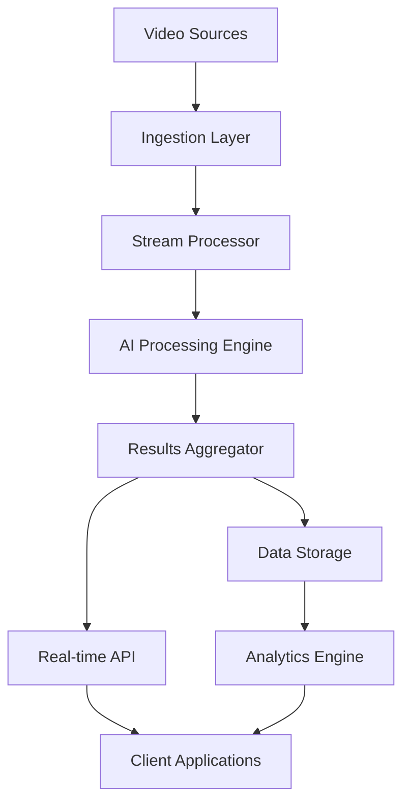

# AI Video Analytics Platform - System Overview
## Enterprise Technology Architecture

---

## 🎯 Platform Overview

The **AI Video Analytics Platform** is a cloud-native, enterprise-scale system designed to process thousands of concurrent video streams with real-time AI-powered analytics. The platform follows a **progressive implementation strategy** that scales from simple single-server deployments to global multi-region enterprise architectures.

### **Core Technology Principles**
- **Cloud-Native Architecture**: Kubernetes orchestration with microservices design
- **Progressive Scaling**: Crawl → Walk → Run implementation phases
- **API-First Design**: Comprehensive REST and GraphQL APIs
- **Edge Computing**: Distributed processing with edge-cloud orchestration
- **Zero Trust Security**: End-to-end encryption and authentication

---

## 🏗️ High-Level Architecture

### **System Components**
```yaml
PLATFORM_ARCHITECTURE:
  Video_Ingestion_Layer:
    Protocol_Support: "RTSP, HTTP, WebRTC, proprietary protocols"
    Stream_Management: "Connection pooling and stream lifecycle"
    Load_Balancing: "Intelligent stream distribution"
    Edge_Integration: "Edge device connectivity and management"

  AI_Processing_Engine:
    Computer_Vision: "Object detection, tracking, behavior analysis"
    Machine_Learning: "Real-time inference with continuous learning"
    Model_Management: "Version control and A/B testing"
    Performance_Optimization: "GPU acceleration and model optimization"

  Data_Management:
    Real_Time_Processing: "Stream processing with Apache Kafka"
    Data_Storage: "Multi-tier storage (hot, warm, cold)"
    Metadata_Management: "Comprehensive metadata indexing"
    Analytics_Database: "Time-series and graph databases"

  API_Gateway:
    REST_APIs: "RESTful services for all platform functions"
    GraphQL_Endpoint: "Flexible query interface"
    WebSocket_Support: "Real-time notifications and streaming"
    Rate_Limiting: "API throttling and quota management"

  User_Interface:
    Dashboard: "Real-time monitoring and analytics"
    Configuration: "System configuration and management"
    Reporting: "Advanced reporting and visualization"
    Mobile_Support: "Cross-platform mobile access"
```

---

## 🚀 Technology Stack

### **Core Technologies**
```yaml
TECHNOLOGY_STACK:
  Container_Orchestration:
    Primary: "Kubernetes (k8s) for container orchestration"
    Service_Mesh: "Istio for service communication"
    Ingress: "NGINX Ingress Controller"
    Monitoring: "Prometheus and Grafana"

  Programming_Languages:
    Backend_Services: "Go for high-performance services"
    AI_ML_Pipeline: "Python for AI/ML development"
    Frontend: "TypeScript with React/Next.js"
    Configuration: "YAML and Helm charts"

  Databases:
    Primary_Database: "PostgreSQL for transactional data"
    Time_Series: "InfluxDB for metrics and analytics"
    Caching: "Redis for high-speed caching"
    Search: "Elasticsearch for full-text search"

  Message_Queuing:
    Stream_Processing: "Apache Kafka for real-time streams"
    Task_Queue: "RabbitMQ for background processing"
    Event_Bus: "NATS for lightweight messaging"

  AI_ML_Framework:
    Deep_Learning: "PyTorch for model development"
    Computer_Vision: "OpenCV for image processing"
    Model_Serving: "TorchServe for model deployment"
    GPU_Computing: "CUDA for GPU acceleration"

  Cloud_Platforms:
    Multi_Cloud: "AWS, Azure, GCP support"
    Edge_Computing: "AWS Greengrass, Azure IoT Edge"
    Container_Registry: "Cloud-native container registries"
    Object_Storage: "S3-compatible storage"
```

---

## 📊 Data Flow Architecture

### **Video Processing Pipeline**


### **Processing Flow**
1. **Video Ingestion**: Multi-protocol video stream ingestion
2. **Stream Processing**: Real-time stream processing and routing
3. **AI Analysis**: Computer vision and machine learning processing
4. **Results Aggregation**: Intelligent results correlation and filtering
5. **Data Storage**: Multi-tier storage strategy
6. **API Services**: Real-time and batch API access
7. **Client Delivery**: Dashboard, mobile, and integration APIs

---

## 🔐 Security Architecture

### **Zero Trust Security Model**
```yaml
SECURITY_FRAMEWORK:
  Authentication:
    Identity_Provider: "OAuth 2.0 / OpenID Connect"
    Multi_Factor_Auth: "TOTP and hardware token support"
    Service_Auth: "mTLS for service-to-service communication"
    API_Keys: "Scoped API key management"

  Authorization:
    RBAC: "Role-based access control"
    ABAC: "Attribute-based access control"
    Policy_Engine: "Open Policy Agent (OPA)"
    Resource_Scoping: "Granular resource access control"

  Encryption:
    Data_in_Transit: "TLS 1.3 for all communications"
    Data_at_Rest: "AES-256 encryption for stored data"
    Key_Management: "Hardware Security Module (HSM)"
    Certificate_Management: "Automated certificate lifecycle"

  Network_Security:
    Network_Segmentation: "Kubernetes network policies"
    Firewall: "Web Application Firewall (WAF)"
    DDoS_Protection: "Multi-layer DDoS mitigation"
    VPN_Access: "WireGuard VPN for administrative access"
```

---

## ⚡ Performance Specifications

### **System Performance Targets**
```yaml
PERFORMANCE_SPECIFICATIONS:
  Scalability:
    Concurrent_Streams: "5,000+ simultaneous video streams"
    Processing_Latency: "<200ms end-to-end processing"
    API_Response_Time: "<100ms for 95th percentile"
    Horizontal_Scaling: "Linear scaling to 10,000+ streams"

  Availability:
    System_Uptime: "99.99% availability (4.3 minutes downtime/month)"
    Disaster_Recovery: "RTO <30 minutes, RPO <15 minutes"
    Geographic_Redundancy: "Multi-region deployment support"
    Auto_Failover: "Automatic failover with health monitoring"

  Throughput:
    Video_Processing: "100TB+ daily video processing"
    API_Requests: "1M+ API requests per minute"
    Data_Ingestion: "50GB/second peak ingestion rate"
    Concurrent_Users: "10,000+ concurrent dashboard users"

  AI_Performance:
    Inference_Speed: "Real-time inference on 4K video streams"
    Model_Accuracy: "99%+ accuracy for critical detection tasks"
    GPU_Utilization: "90%+ GPU utilization efficiency"
    Model_Updates: "Hot-swappable model updates"
```

---

## 🌐 Deployment Architecture

### **Progressive Deployment Strategy**
```yaml
DEPLOYMENT_PHASES:
  Phase_1_Crawl:
    Architecture: "Single-server Docker Compose deployment"
    Scale: "50-100 concurrent streams"
    Technology: "Simplified stack with proven components"
    Duration: "6 months implementation"

  Phase_2_Walk:
    Architecture: "Multi-server Kubernetes cluster"
    Scale: "500-1,000 concurrent streams"
    Technology: "Microservices with advanced orchestration"
    Duration: "12 months implementation"

  Phase_3_Run:
    Architecture: "Global multi-region enterprise deployment"
    Scale: "5,000+ concurrent streams"
    Technology: "Complete enterprise platform"
    Duration: "18 months implementation"
```

---

## 🔧 Integration Capabilities

### **Enterprise Integration**
```yaml
INTEGRATION_FRAMEWORK:
  APIs:
    REST_API: "Comprehensive RESTful API"
    GraphQL: "Flexible query interface"
    WebSocket: "Real-time streaming API"
    Webhook: "Event-driven notifications"

  Protocols:
    Video_Protocols: "RTSP, HTTP, WebRTC, ONVIF"
    Messaging: "MQTT, AMQP, HTTP/2"
    Data_Exchange: "JSON, XML, Protocol Buffers"
    Authentication: "OAuth 2.0, SAML, LDAP"

  Enterprise_Systems:
    SIEM_Integration: "Security Information and Event Management"
    ERP_Systems: "Enterprise Resource Planning integration"
    CRM_Platforms: "Customer Relationship Management"
    Business_Intelligence: "BI and analytics platforms"

  Third_Party_Services:
    Cloud_Storage: "AWS S3, Azure Blob, Google Cloud Storage"
    CDN_Services: "Content Delivery Network integration"
    Notification_Services: "Email, SMS, push notifications"
    External_APIs: "Third-party service integrations"
```

---

## 📈 Monitoring and Observability

### **Comprehensive Observability**
```yaml
OBSERVABILITY_STACK:
  Metrics_Collection:
    System_Metrics: "CPU, memory, network, disk utilization"
    Application_Metrics: "Custom business and technical metrics"
    Performance_Metrics: "Latency, throughput, error rates"
    User_Metrics: "User behavior and experience metrics"

  Logging:
    Structured_Logging: "JSON-formatted logs with correlation IDs"
    Log_Aggregation: "Centralized log collection and search"
    Log_Retention: "Tiered log retention policies"
    Security_Logging: "Audit and security event logging"

  Tracing:
    Distributed_Tracing: "Request tracing across microservices"
    Performance_Profiling: "Application performance insights"
    Error_Tracking: "Error correlation and root cause analysis"
    User_Journey_Tracking: "End-to-end user experience tracing"

  Alerting:
    Intelligent_Alerting: "ML-powered anomaly detection"
    Escalation_Policies: "Multi-tier alert escalation"
    Notification_Channels: "Multiple notification mechanisms"
    Alert_Correlation: "Related alert grouping and deduplication"
```

---

## 🎯 Technology Innovation Areas

### **Advanced Technology Integration**
- **Edge Computing**: Distributed processing with intelligent workload placement
- **5G Integration**: Ultra-low latency processing with 5G networks
- **Quantum Computing**: Quantum-enhanced machine learning algorithms
- **Neuromorphic Computing**: Brain-inspired computing architectures
- **Federated Learning**: Privacy-preserving distributed machine learning

### **AI/ML Excellence**
- **Computer Vision**: State-of-the-art object detection and tracking
- **Behavioral Analytics**: Advanced human and object behavior analysis
- **Predictive Analytics**: Proactive incident prediction and prevention
- **Autonomous Systems**: Self-managing and self-healing capabilities
- **Continuous Learning**: Real-time model improvement and adaptation

---

## 🚀 Platform Benefits

### **Technical Benefits**
- **Scalable Architecture**: Linear scaling from hundreds to thousands of streams
- **High Performance**: Sub-200ms processing with 99.99% availability
- **Modern Technology**: Cloud-native, container-based architecture
- **API-First Design**: Comprehensive integration capabilities
- **Security Excellence**: Zero trust security with end-to-end encryption

### **Business Benefits**
- **Operational Intelligence**: Real-time insights for better decision-making
- **Cost Efficiency**: Optimized resource utilization and automation
- **Future-Proof Design**: Modular architecture supporting emerging technologies
- **Global Deployment**: Multi-region support with local processing
- **Vendor Independence**: Multi-cloud support avoiding vendor lock-in

---

**Document Status**: Foundation Document
**Next Document**: [Implementation Approach](./03-implementation-approach.md)
**Related**: [Vision and Strategy](./01-vision-and-strategy.md)