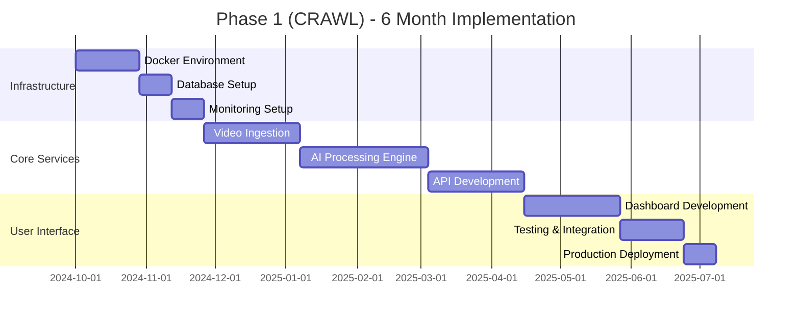

# AI Video Analytics Platform - Implementation Approach
## Progressive Technology Implementation Strategy

---

## 🎯 Implementation Philosophy

The **AI Video Analytics Platform** follows a **progressive implementation approach** that systematically builds technology capabilities while minimizing complexity and risk. This "Crawl → Walk → Run" methodology ensures reliable technology foundation while scaling toward enterprise excellence.

### **Core Implementation Principles**
- **Progressive Complexity**: Build capabilities systematically and methodically
- **Proven Foundations**: Use reliable, battle-tested technology foundations
- **Technology Focus**: Prioritize technical excellence and architectural quality
- **Scalable Design**: Architecture supports seamless scaling across phases
- **Continuous Learning**: Apply lessons learned to improve each phase

---

## 🚀 Three-Phase Implementation Strategy

### **Phase Overview**
```yaml
IMPLEMENTATION_PHASES:
  Phase_1_CRAWL:
    Duration: "6 months"
    Focus: "Technology foundation and proof of concept"
    Architecture: "Single-server deployment with modular design"
    Scale: "50-100 concurrent streams"
    Technology_Complexity: "Simplified, proven stack"

  Phase_2_WALK:
    Duration: "12 months"
    Focus: "Technology scaling and enhanced capabilities"
    Architecture: "Multi-server Kubernetes cluster"
    Scale: "500-1,000 concurrent streams"
    Technology_Complexity: "Microservices with advanced orchestration"

  Phase_3_RUN:
    Duration: "18 months"
    Focus: "Global enterprise-scale technology excellence"
    Architecture: "Multi-region global deployment"
    Scale: "5,000+ concurrent streams"
    Technology_Complexity: "Complete enterprise platform"
```

---

## 🐣 Phase 1: CRAWL - Foundation Technology

### **Technology Foundation Objectives**
```yaml
PHASE_1_TECHNOLOGY:
  Architecture_Approach:
    Deployment: "Single-server Docker Compose deployment"
    Technology_Stack: "Simplified, proven components"
    Database: "PostgreSQL for all data needs"
    Processing: "CPU-based processing with GPU optional"

  Technical_Capabilities:
    Video_Processing: "Basic object detection and tracking"
    Stream_Capacity: "50-100 concurrent video streams"
    Latency_Target: "<500ms processing latency"
    API_Framework: "RESTful APIs with basic functionality"

  Technology_Components:
    Container_Platform: "Docker Compose for orchestration"
    Programming_Language: "Go for backend services"
    AI_Framework: "Pre-trained models with OpenCV"
    Frontend: "React-based dashboard"
    Database: "PostgreSQL with Redis caching"

  Success_Criteria:
    Functionality: "Core video analytics capabilities operational"
    Performance: "Stable processing of target stream count"
    Reliability: "95% uptime with basic monitoring"
    Scalability: "Architecture supports Phase 2 evolution"
```

### **Phase 1 Implementation Timeline**


---

## 🚶 Phase 2: WALK - Technology Scaling

### **Enhanced Technology Objectives**
```yaml
PHASE_2_TECHNOLOGY:
  Architecture_Evolution:
    Deployment: "Kubernetes cluster with microservices"
    Technology_Stack: "Advanced cloud-native components"
    Database: "Multi-database architecture (PostgreSQL, InfluxDB, Redis)"
    Processing: "GPU-accelerated AI processing"

  Technical_Capabilities:
    Video_Processing: "Advanced analytics with custom models"
    Stream_Capacity: "500-1,000 concurrent video streams"
    Latency_Target: "<300ms processing latency"
    API_Framework: "GraphQL and WebSocket support"

  Technology_Components:
    Container_Platform: "Kubernetes with Istio service mesh"
    Programming_Language: "Go microservices with Python AI pipeline"
    AI_Framework: "PyTorch with custom model training"
    Frontend: "React with real-time updates"
    Database: "Multi-tier data architecture"

  Success_Criteria:
    Functionality: "Advanced analytics with custom AI models"
    Performance: "Sub-300ms latency at target scale"
    Reliability: "99% uptime with comprehensive monitoring"
    Scalability: "Linear scaling demonstrated"
```

### **Phase 2 Technology Transition**
```yaml
TECHNOLOGY_MIGRATION:
  From_Phase_1:
    Architecture: "Docker Compose → Kubernetes migration"
    Database: "Single PostgreSQL → Multi-database architecture"
    AI_Processing: "Pre-trained models → Custom model pipeline"
    Monitoring: "Basic metrics → Comprehensive observability"

  Migration_Strategy:
    Approach: "Blue-green deployment with gradual migration"
    Data_Migration: "Zero-downtime data migration procedures"
    Service_Migration: "Service-by-service migration approach"
    Testing: "Comprehensive testing at each migration step"
```

---

## 🏃 Phase 3: RUN - Enterprise Technology Excellence

### **Global Enterprise Technology**
```yaml
PHASE_3_TECHNOLOGY:
  Architecture_Excellence:
    Deployment: "Multi-region global enterprise deployment"
    Technology_Stack: "Complete enterprise technology platform"
    Database: "Global distributed data architecture"
    Processing: "Edge-cloud hybrid processing"

  Technical_Capabilities:
    Video_Processing: "Enterprise-scale AI with continuous learning"
    Stream_Capacity: "5,000+ concurrent video streams globally"
    Latency_Target: "<200ms processing latency worldwide"
    API_Framework: "Complete API platform with marketplace"

  Technology_Components:
    Container_Platform: "Multi-region Kubernetes with edge computing"
    Programming_Language: "Full-stack with multiple language support"
    AI_Framework: "Complete ML/AI platform with research capabilities"
    Frontend: "Enterprise dashboard with mobile support"
    Database: "Global data fabric with edge synchronization"

  Success_Criteria:
    Functionality: "Complete enterprise platform capabilities"
    Performance: "Sub-200ms latency at global scale"
    Reliability: "99.99% uptime with autonomous operations"
    Scalability: "Proven scaling to 10,000+ streams"
```

---

## 🔄 Technology Transition Strategy

### **Seamless Technology Evolution**
```yaml
TRANSITION_METHODOLOGY:
  Phase_1_to_2_Transition:
    Duration: "3 months overlap period"
    Approach: "Parallel deployment with gradual migration"
    Risk_Mitigation: "Rollback capability at each step"
    Data_Continuity: "Zero data loss during transition"

  Phase_2_to_3_Transition:
    Duration: "6 months overlap period"
    Approach: "Multi-region deployment with phased rollout"
    Risk_Mitigation: "Regional isolation and gradual expansion"
    Data_Continuity: "Global data consistency and availability"

  Technology_Preservation:
    Code_Reuse: "Maximum code reuse across phases"
    Configuration: "Configuration-driven deployment differences"
    Skills: "Team skill building aligned with technology evolution"
    Architecture: "Forward-compatible architecture decisions"
```

---

## 📊 Implementation Success Metrics

### **Technology Implementation KPIs**
```yaml
IMPLEMENTATION_METRICS:
  Phase_1_Success:
    Technical_Delivery: "All core features operational"
    Performance: "Target latency and throughput achieved"
    Reliability: "95% uptime maintained"
    Architecture: "Phase 2 readiness validated"

  Phase_2_Success:
    Technical_Delivery: "Advanced features and scaling operational"
    Performance: "Enhanced latency and throughput targets met"
    Reliability: "99% uptime with comprehensive monitoring"
    Architecture: "Phase 3 readiness demonstrated"

  Phase_3_Success:
    Technical_Delivery: "Enterprise-scale platform operational"
    Performance: "Global latency and throughput targets achieved"
    Reliability: "99.99% uptime with autonomous operations"
    Architecture: "Proven scalability and global deployment"

  Overall_Success:
    Technology_Leadership: "Industry-leading technical capabilities"
    Market_Position: "Competitive technical advantage established"
    Innovation_Platform: "Foundation for continuous innovation"
    Scalability_Proof: "Demonstrated enterprise-scale capabilities"
```

---

## 🛠️ Technology Implementation Framework

### **Development Methodology**
```yaml
DEVELOPMENT_APPROACH:
  Agile_Framework:
    Methodology: "Scrum with DevOps integration"
    Sprint_Duration: "2-week sprints with continuous integration"
    Release_Cycle: "Monthly releases with feature flags"
    Quality_Assurance: "Automated testing with manual validation"

  DevOps_Pipeline:
    Source_Control: "Git with branching strategy"
    CI_CD: "Jenkins/GitLab with automated deployment"
    Testing: "Unit, integration, and end-to-end testing"
    Deployment: "Blue-green with canary releases"

  Quality_Standards:
    Code_Quality: "Automated code review and static analysis"
    Performance: "Continuous performance monitoring"
    Security: "Security scanning and penetration testing"
    Documentation: "Comprehensive technical documentation"
```

---

## 🎯 Risk Management and Mitigation

### **Technical Risk Management**
```yaml
RISK_MANAGEMENT:
  Technology_Risks:
    Scalability_Risk: "Comprehensive load testing and capacity planning"
    Performance_Risk: "Continuous performance monitoring and optimization"
    Security_Risk: "Multi-layer security and regular penetration testing"
    Integration_Risk: "Thorough integration testing and validation"

  Mitigation_Strategies:
    Proof_of_Concept: "Early technical validation for critical components"
    Incremental_Delivery: "Regular delivery milestones with validation"
    Technology_Validation: "Continuous technology stack validation"
    Rollback_Capability: "Always maintain rollback and recovery options"

  Success_Factors:
    Technical_Expertise: "Strong technical team with relevant experience"
    Architecture_Excellence: "Sound architectural foundation and decisions"
    Quality_Focus: "Comprehensive quality assurance and testing"
    Continuous_Learning: "Regular retrospectives and improvement cycles"
```

---

## 🚀 Implementation Success Path

This **progressive implementation approach** ensures reliable technology delivery:

- ✅ **Phase 1**: Solid technology foundation with proven components
- ✅ **Phase 2**: Successful scaling with advanced technology capabilities
- ✅ **Phase 3**: Enterprise excellence with global technology deployment
- ✅ **Technology Evolution**: Seamless technology transition between phases
- ✅ **Risk Mitigation**: Comprehensive risk management and quality assurance

**The progressive approach minimizes technology risk while building toward enterprise-scale excellence.**

---

**Document Status**: Foundation Document
**Next Documents**: [Phase 1 Architecture](../roadmap/phase-01-crawl/architecture/)
**Related**: [Vision and Strategy](./01-vision-and-strategy.md) | [System Overview](./02-system-overview.md)