# Phase 1 Simplified System Architecture
## Technology Foundation - CRAWL Phase

---

## 🎯 Architecture Overview

Phase 1 establishes a **solid technology foundation** using proven, reliable technologies in a simplified single-server deployment. This architecture focuses on **functional completeness** with **minimal complexity**, creating a robust base for future scaling.

### **Architecture Principles**
- **Simplicity First**: Use well-proven technology components
- **Single Server**: Deploy on single server with Docker Compose
- **Modular Design**: Prepare for future microservices evolution
- **Technology Focus**: Emphasize technical reliability over complexity
- **Functional Completeness**: Deliver all core video analytics capabilities

---

## 🏗️ System Architecture Diagram

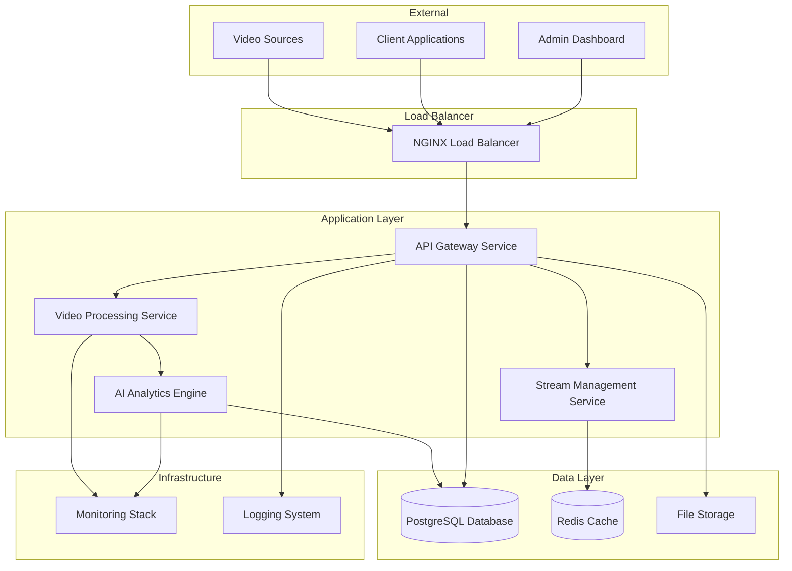

---

## 🐳 Docker Compose Architecture

### **Service Stack Configuration**
```yaml
DOCKER_COMPOSE_STACK:
  Core_Services:
    nginx:
      image: "nginx:alpine"
      purpose: "Load balancer and reverse proxy"
      ports: ["80:80", "443:443"]

    api_gateway:
      image: "video_analytics/api:v1"
      purpose: "Main API service and request routing"
      technology: "Go with Gin framework"

    video_processor:
      image: "video_analytics/processor:v1"
      purpose: "Video stream processing and management"
      technology: "Go with FFmpeg integration"

    ai_engine:
      image: "video_analytics/ai:v1"
      purpose: "AI analytics and machine learning"
      technology: "Python with PyTorch and OpenCV"

    stream_manager:
      image: "video_analytics/streams:v1"
      purpose: "Stream lifecycle and connection management"
      technology: "Go with WebRTC support"

  Data_Services:
    postgresql:
      image: "postgres:15-alpine"
      purpose: "Primary database for all application data"
      storage: "Persistent volume for data retention"

    redis:
      image: "redis:7-alpine"
      purpose: "Caching and session management"
      configuration: "Optimized for video metadata caching"

    file_storage:
      image: "minio/minio:latest"
      purpose: "S3-compatible object storage"
      usage: "Video clips and processed results"

  Infrastructure_Services:
    prometheus:
      image: "prom/prometheus:latest"
      purpose: "Metrics collection and monitoring"

    grafana:
      image: "grafana/grafana:latest"
      purpose: "Metrics visualization and dashboards"

    loki:
      image: "grafana/loki:latest"
      purpose: "Log aggregation and analysis"
```

---

## 💾 Data Architecture

### **Database Design**
```yaml
DATA_ARCHITECTURE:
  PostgreSQL_Schema:
    Core_Tables:
      video_sources: "Video stream configuration and metadata"
      processing_jobs: "Video processing job tracking"
      ai_results: "AI analysis results and detections"
      user_accounts: "User authentication and authorization"
      system_config: "System configuration and settings"

    Performance_Optimization:
      Indexing: "Strategic indexes for query performance"
      Partitioning: "Time-based partitioning for large tables"
      Connection_Pooling: "pgBouncer for connection management"

  Redis_Cache_Strategy:
    Session_Cache: "User session and authentication tokens"
    Metadata_Cache: "Frequently accessed video metadata"
    Result_Cache: "Recent AI analysis results"
    Configuration_Cache: "System and user configuration"

  File_Storage_Organization:
    Raw_Video: "Original video streams and clips"
    Processed_Results: "AI-processed video outputs"
    Thumbnails: "Generated thumbnail images"
    Analytics_Data: "Exported analytics and reports"
```

---

## 🔧 Technology Stack

### **Core Technologies**
```yaml
TECHNOLOGY_STACK:
  Backend_Services:
    Primary_Language: "Go 1.21+ for high-performance services"
    Web_Framework: "Gin for HTTP routing and middleware"
    Database_ORM: "GORM for database operations"
    Video_Processing: "FFmpeg for video manipulation"

  AI_ML_Pipeline:
    Language: "Python 3.11+ for AI/ML development"
    Deep_Learning: "PyTorch for neural network models"
    Computer_Vision: "OpenCV for image processing"
    Model_Format: "ONNX for cross-platform model deployment"

  Frontend_Technology:
    Framework: "React 18+ with TypeScript"
    State_Management: "React Context API"
    UI_Components: "Material-UI for consistent design"
    Real_Time: "WebSocket for live updates"

  Infrastructure:
    Containerization: "Docker and Docker Compose"
    Reverse_Proxy: "NGINX for load balancing"
    Monitoring: "Prometheus and Grafana"
    Logging: "Grafana Loki with structured logs"
```

---

## 📊 Data Flow Architecture

### **Video Processing Data Flow**
```mermaid
graph LR
    subgraph "🎥 Video Sources"
        CAM1[IP Camera 1<br/>RTSP Stream]
        CAM2[IP Camera 2<br/>HTTP Stream]
        CAM3[IP Camera 3<br/>WebRTC Stream]
        FILE[File Upload<br/>MP4/AVI]
    end

    subgraph "📡 Stream Ingestion Layer"
        INGEST[Stream Ingestion Service<br/>Protocol Normalization]
        BUFFER[Circular Buffer<br/>Frame Queue Management]
        VALIDATE[Stream Validator<br/>Format & Quality Check]
    end

    subgraph "🧠 AI Processing Pipeline"
        PREPROCESS[Video Preprocessor<br/>Frame Extraction & Resize]
        DETECT[Object Detection<br/>YOLOv8 Inference]
        TRACK[Object Tracking<br/>DeepSORT Algorithm]
        ANALYZE[Behavior Analysis<br/>Custom ML Models]
    end

    subgraph "💾 Data Storage Flow"
        METADATA[(PostgreSQL<br/>Metadata & Results)]
        CACHE[(Redis<br/>Real-time Cache)]
        FILES[MinIO Storage<br/>Video Clips & Images]
    end

    subgraph "📤 Output Delivery"
        API[REST API<br/>Real-time Results]
        ALERTS[Alert System<br/>Webhook Delivery]
        DASHBOARD[Web Dashboard<br/>Live Visualization]
    end

    CAM1 --> INGEST
    CAM2 --> INGEST
    CAM3 --> INGEST
    FILE --> INGEST

    INGEST --> VALIDATE
    VALIDATE --> BUFFER
    BUFFER --> PREPROCESS

    PREPROCESS --> DETECT
    DETECT --> TRACK
    TRACK --> ANALYZE

    ANALYZE --> METADATA
    ANALYZE --> CACHE
    PREPROCESS --> FILES

    METADATA --> API
    CACHE --> API
    API --> ALERTS
    API --> DASHBOARD

    classDef source fill:#ff9800,stroke:#f57c00,stroke-width:2px,color:#fff
    classDef ingestion fill:#2196f3,stroke:#1976d2,stroke-width:2px,color:#fff
    classDef processing fill:#4caf50,stroke:#388e3c,stroke-width:2px,color:#fff
    classDef storage fill:#9c27b0,stroke:#7b1fa2,stroke-width:2px,color:#fff
    classDef output fill:#f44336,stroke:#d32f2f,stroke-width:2px,color:#fff

    class CAM1,CAM2,CAM3,FILE source
    class INGEST,BUFFER,VALIDATE ingestion
    class PREPROCESS,DETECT,TRACK,ANALYZE processing
    class METADATA,CACHE,FILES storage
    class API,ALERTS,DASHBOARD output
```

### **Real-time Event Flow Architecture**
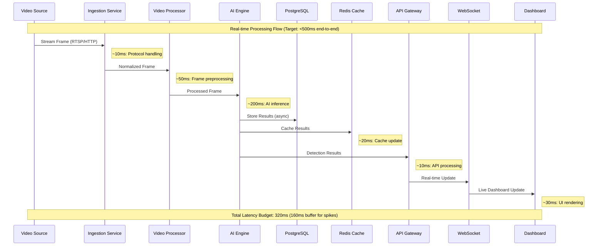

### **Database Transaction Patterns**
```mermaid
graph TB
    subgraph "📝 Write Operations"
        STREAM_META[Stream Metadata<br/>INSERT operations]
        AI_RESULTS[AI Detection Results<br/>BULK INSERT]
        USER_ACTIONS[User Actions<br/>UPDATE operations]
        SYSTEM_LOGS[System Logs<br/>APPEND operations]
    end

    subgraph "📖 Read Operations"
        LIVE_QUERIES[Live Dashboard Queries<br/>SELECT with time windows]
        REPORT_QUERIES[Report Generation<br/>Analytical queries]
        CONFIG_READS[Configuration Reads<br/>Cached lookups]
        SEARCH_QUERIES[Search Operations<br/>Indexed queries]
    end

    subgraph "💾 PostgreSQL Optimization"
        PARTITIONING[Time-based Partitioning<br/>ai_results table by day]
        INDEXING[Strategic Indexing<br/>timestamp, stream_id, object_type]
        POOLING[Connection Pooling<br/>pgBouncer configuration]
        VACUUM[Automated Maintenance<br/>VACUUM and ANALYZE]
    end

    subgraph "⚡ Redis Caching Strategy"
        SESSION_CACHE[User Sessions<br/>TTL: 24 hours]
        RESULT_CACHE[Recent AI Results<br/>TTL: 1 hour]
        CONFIG_CACHE[System Configuration<br/>TTL: 12 hours]
        STREAM_STATUS[Stream Status<br/>TTL: 5 minutes]
    end

    STREAM_META --> PARTITIONING
    AI_RESULTS --> PARTITIONING
    USER_ACTIONS --> INDEXING

    LIVE_QUERIES --> RESULT_CACHE
    REPORT_QUERIES --> PARTITIONING
    CONFIG_READS --> CONFIG_CACHE

    classDef write fill:#4caf50,stroke:#388e3c,stroke-width:2px,color:#fff
    classDef read fill:#2196f3,stroke:#1976d2,stroke-width:2px,color:#fff
    classDef optimization fill:#ff9800,stroke:#f57c00,stroke-width:2px,color:#fff
    classDef cache fill:#9c27b0,stroke:#7b1fa2,stroke-width:2px,color:#fff

    class STREAM_META,AI_RESULTS,USER_ACTIONS,SYSTEM_LOGS write
    class LIVE_QUERIES,REPORT_QUERIES,CONFIG_READS,SEARCH_QUERIES read
    class PARTITIONING,INDEXING,POOLING,VACUUM optimization
    class SESSION_CACHE,RESULT_CACHE,CONFIG_CACHE,STREAM_STATUS cache
```

### **Processing Pipeline Specifications**
```yaml
PROCESSING_PIPELINE:
  Video_Ingestion:
    Protocol_Support: "RTSP, HTTP, WebRTC input streams"
    Stream_Validation: "Format and quality validation"
    Connection_Management: "Robust connection handling with retry"
    Buffer_Management: "Circular buffer for smooth processing"
    Throughput_Target: "50-100 concurrent streams"

  AI_Processing_Engine:
    Model_Loading: "ONNX runtime for efficient inference"
    Object_Detection: "YOLOv8 for real-time object detection"
    Tracking: "DeepSORT for multi-object tracking"
    Behavior_Analysis: "Custom models for behavior recognition"
    Processing_Target: "<200ms inference time per frame"

  Results_Processing:
    Data_Aggregation: "Intelligent result correlation"
    Alert_Generation: "Rule-based alert generation"
    Storage_Management: "Efficient result storage and retrieval"
    API_Delivery: "Real-time API result delivery"
    Response_Target: "<100ms API response time"
```

---

## 🔐 Security Architecture and Implementation

### **Authentication and Authorization Flow**
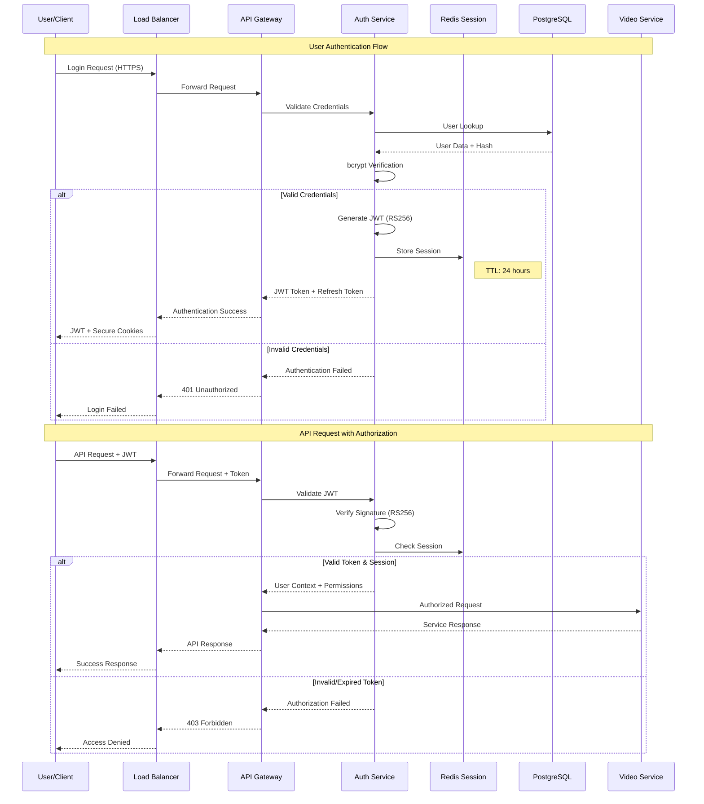

### **Network Security Topology**
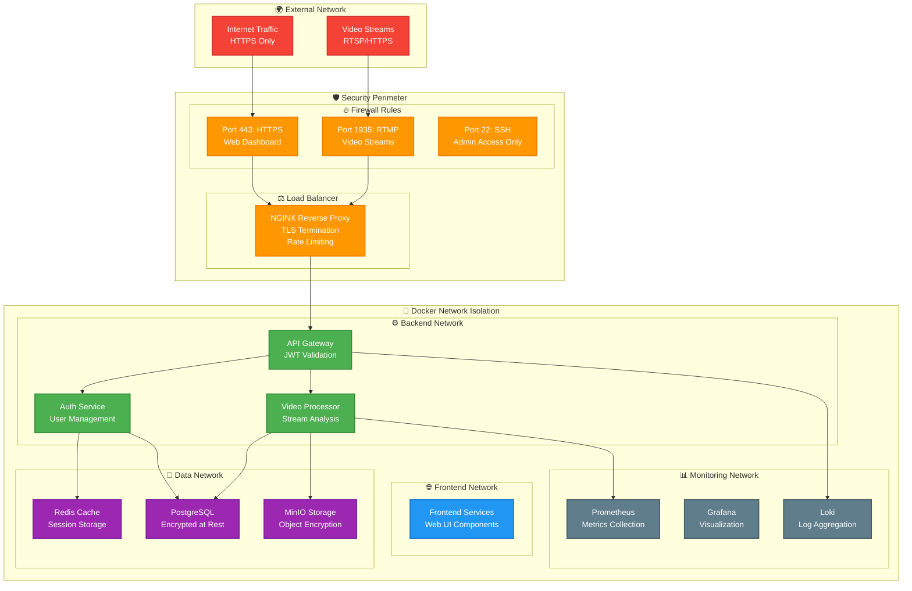

### **Data Encryption Architecture**
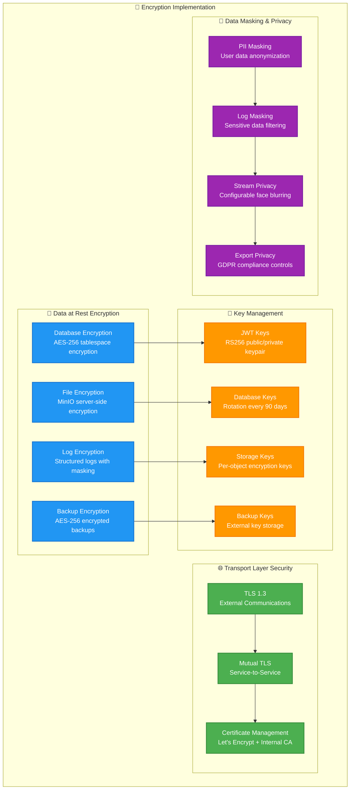

### **Role-Based Access Control (RBAC) Model**
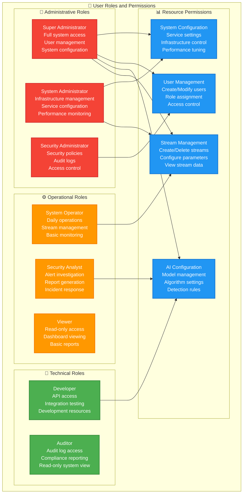

### **Security Implementation Framework**
```yaml
SECURITY_IMPLEMENTATION:
  Authentication:
    Method: "JWT tokens with RS256 signing (2048-bit keys)"
    Session_Management: "Redis-based session storage with TTL"
    Password_Security: "bcrypt hashing with salt (cost factor: 12)"
    API_Security: "API key authentication with rate limiting"
    Multi_Factor: "TOTP-based 2FA for administrative accounts"

  Authorization:
    Access_Control: "Role-based access control (RBAC) with fine-grained permissions"
    Resource_Permissions: "Granular resource-level permissions matrix"
    API_Authorization: "Middleware-based API authorization with JWT validation"
    Permission_Caching: "Redis-cached permissions with 5-minute TTL"

  Network_Security:
    TLS_Encryption: "TLS 1.3 for all external communications"
    Internal_Communication: "Mutual TLS for service-to-service authentication"
    Firewall_Rules: "Docker network isolation with minimal port exposure"
    Rate_Limiting: "API rate limiting: 1000 req/min per user, 100 req/min per IP"

  Data_Protection:
    Data_Encryption: "AES-256 encryption for sensitive data at rest"
    Backup_Security: "Encrypted backup storage with separate key management"
    Log_Security: "Structured logging with PII masking and secure storage"
    Video_Privacy: "Configurable face blurring and anonymization options"

  Security_Monitoring:
    Audit_Logging: "Comprehensive audit trail for all user actions"
    Intrusion_Detection: "Basic anomaly detection for unusual access patterns"
    Vulnerability_Scanning: "Weekly automated security scans"
    Incident_Response: "Documented incident response procedures"
```

---

## 📈 Performance Architecture and Analysis

### **Latency Breakdown Analysis**
```mermaid
graph TB
    subgraph "🎯 End-to-End Latency Budget: 500ms"
        subgraph "📡 Network & Ingestion: 60ms"
            NET_IN[Network Ingestion<br/>10-20ms]
            PROTOCOL[Protocol Processing<br/>10-15ms]
            VALIDATION[Stream Validation<br/>5-10ms]
            BUFFER_IN[Buffer Management<br/>10-15ms]
        end

        subgraph "🖼️ Video Processing: 80ms"
            DECODE[Video Decoding<br/>20-30ms]
            PREPROCESS[Frame Preprocessing<br/>15-25ms]
            RESIZE[Image Resizing<br/>10-15ms]
            FORMAT[Format Conversion<br/>10-15ms]
        end

        subgraph "🧠 AI Inference: 200ms"
            MODEL_LOAD[Model Loading<br/>5-10ms*]
            INFERENCE[AI Inference<br/>150-180ms]
            POST_PROCESS[Post-processing<br/>15-25ms]
            TRACKING[Object Tracking<br/>15-20ms]
        end

        subgraph "💾 Data Operations: 50ms"
            CACHE_WRITE[Cache Update<br/>5-10ms]
            DB_WRITE[Database Write<br/>20-30ms]
            RESULT_PROCESS[Result Processing<br/>10-15ms]
            API_PREP[API Preparation<br/>5-10ms]
        end

        subgraph "📤 Response Delivery: 40ms"
            API_ROUTE[API Routing<br/>5-10ms]
            JSON_SERIAL[JSON Serialization<br/>5-10ms]
            WEBSOCKET[WebSocket Push<br/>10-15ms]
            UI_UPDATE[UI Update<br/>10-15ms]
        end

        subgraph "⚡ Performance Buffer: 70ms"
            SPIKE_BUFFER[Latency Spike Buffer<br/>50ms]
            NETWORK_VAR[Network Variability<br/>20ms]
        end
    end

    NET_IN --> PROTOCOL
    PROTOCOL --> VALIDATION
    VALIDATION --> BUFFER_IN

    BUFFER_IN --> DECODE
    DECODE --> PREPROCESS
    PREPROCESS --> RESIZE
    RESIZE --> FORMAT

    FORMAT --> MODEL_LOAD
    MODEL_LOAD --> INFERENCE
    INFERENCE --> POST_PROCESS
    POST_PROCESS --> TRACKING

    TRACKING --> CACHE_WRITE
    CACHE_WRITE --> DB_WRITE
    DB_WRITE --> RESULT_PROCESS
    RESULT_PROCESS --> API_PREP

    API_PREP --> API_ROUTE
    API_ROUTE --> JSON_SERIAL
    JSON_SERIAL --> WEBSOCKET
    WEBSOCKET --> UI_UPDATE

    classDef network fill:#2196f3,stroke:#1976d2,stroke-width:2px,color:#fff
    classDef video fill:#ff9800,stroke:#f57c00,stroke-width:2px,color:#fff
    classDef ai fill:#4caf50,stroke:#388e3c,stroke-width:2px,color:#fff
    classDef data fill:#9c27b0,stroke:#7b1fa2,stroke-width:2px,color:#fff
    classDef response fill:#f44336,stroke:#d32f2f,stroke-width:2px,color:#fff
    classDef buffer fill:#607d8b,stroke:#455a64,stroke-width:2px,color:#fff

    class NET_IN,PROTOCOL,VALIDATION,BUFFER_IN network
    class DECODE,PREPROCESS,RESIZE,FORMAT video
    class MODEL_LOAD,INFERENCE,POST_PROCESS,TRACKING ai
    class CACHE_WRITE,DB_WRITE,RESULT_PROCESS,API_PREP data
    class API_ROUTE,JSON_SERIAL,WEBSOCKET,UI_UPDATE response
    class SPIKE_BUFFER,NETWORK_VAR buffer
```

### **Throughput and Capacity Analysis**
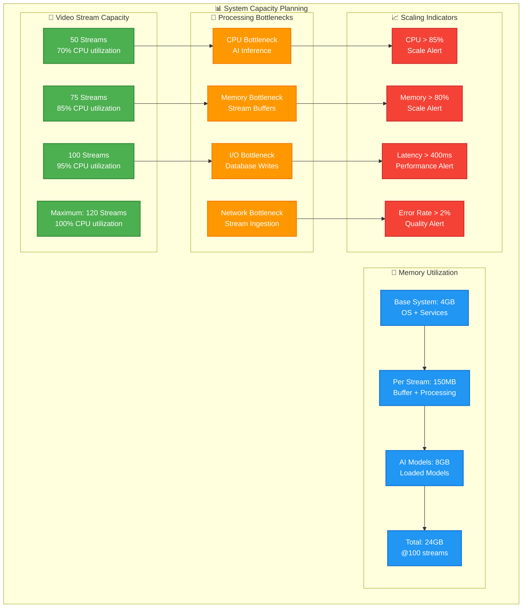

### **Resource Utilization Patterns**
```mermaid
graph LR
    subgraph "📊 Resource Monitoring Dashboard"
        subgraph "💻 CPU Utilization"
            CPU_NORMAL[Normal Load<br/>40-60% CPU<br/>30-50 streams]
            CPU_HIGH[High Load<br/>70-85% CPU<br/>60-80 streams]
            CPU_CRITICAL[Critical Load<br/>90-95% CPU<br/>90-100 streams]
        end

        subgraph "💾 Memory Patterns"
            MEM_STEADY[Steady State<br/>12-16GB RAM<br/>Buffer management]
            MEM_GROWING[Growth Pattern<br/>16-20GB RAM<br/>Cache accumulation]
            MEM_PEAK[Peak Usage<br/>20-24GB RAM<br/>Maximum capacity]
        end

        subgraph "🌐 Network I/O"
            NET_INBOUND[Inbound Traffic<br/>500MB/s - 1GB/s<br/>Video stream data]
            NET_OUTBOUND[Outbound Traffic<br/>50MB/s - 100MB/s<br/>API responses]
            NET_INTERNAL[Internal Traffic<br/>200MB/s - 400MB/s<br/>Database/Cache]
        end

        subgraph "💿 Storage I/O"
            DISK_READ[Read Operations<br/>100-200 IOPS<br/>Config/Model loading]
            DISK_WRITE[Write Operations<br/>500-1000 IOPS<br/>Results/Logs]
            DISK_SPACE[Storage Growth<br/>10-50GB/day<br/>Video clips/Results]
        end
    end

    CPU_NORMAL --> CPU_HIGH
    CPU_HIGH --> CPU_CRITICAL

    MEM_STEADY --> MEM_GROWING
    MEM_GROWING --> MEM_PEAK

    NET_INBOUND --> NET_OUTBOUND
    NET_OUTBOUND --> NET_INTERNAL

    DISK_READ --> DISK_WRITE
    DISK_WRITE --> DISK_SPACE

    classDef normal fill:#4caf50,stroke:#388e3c,stroke-width:2px,color:#fff
    classDef warning fill:#ff9800,stroke:#f57c00,stroke-width:2px,color:#fff
    classDef critical fill:#f44336,stroke:#d32f2f,stroke-width:2px,color:#fff

    class CPU_NORMAL,MEM_STEADY normal
    class CPU_HIGH,MEM_GROWING,NET_INBOUND,NET_OUTBOUND,DISK_READ,DISK_WRITE warning
    class CPU_CRITICAL,MEM_PEAK,NET_INTERNAL,DISK_SPACE critical
```

### **Performance Optimization Strategy**
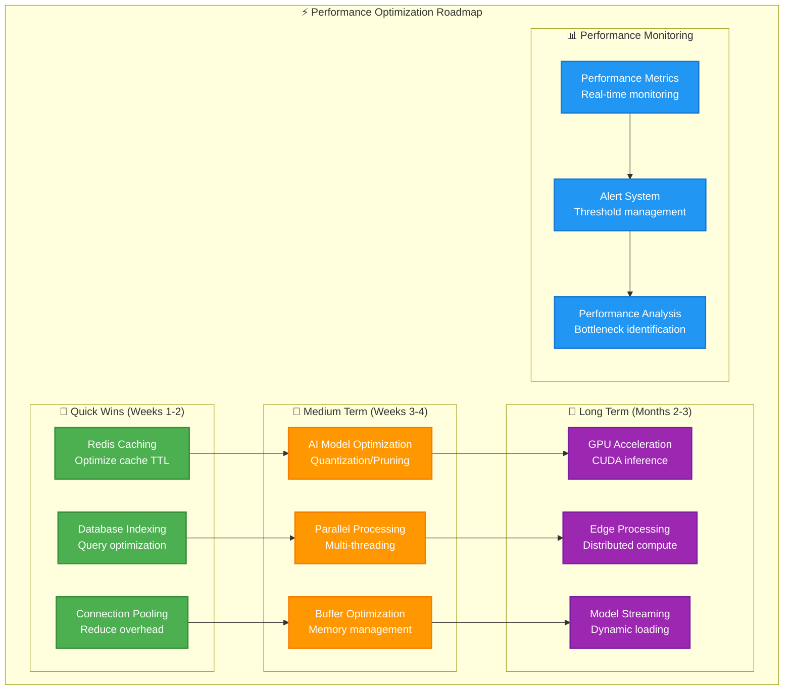

### **Phase 1 Performance Targets**
```yaml
PERFORMANCE_TARGETS:
  Video_Processing:
    Concurrent_Streams: "50-100 simultaneous video streams"
    Processing_Latency: "<500ms end-to-end processing (320ms avg + 180ms buffer)"
    Stream_Resolution: "Up to 1080p at 30fps"
    AI_Inference_Speed: "150-200ms per frame with CPU optimization"

  System_Performance:
    API_Response_Time: "<200ms for 95th percentile"
    Database_Performance: "Sub-100ms query response with indexing"
    Memory_Usage: "Efficient management: 150MB per stream + 12GB base"
    CPU_Utilization: "70-85% optimal range with 15% scaling headroom"

  Availability_Targets:
    System_Uptime: "95% availability target (36 hours downtime/month max)"
    Error_Rate: "<1% error rate for all operations"
    Recovery_Time: "<30 minutes for system recovery"
    Data_Integrity: "100% data consistency with transactional guarantees"

  Scalability_Metrics:
    Stream_Scaling: "Linear scaling up to 100 streams"
    Resource_Efficiency: "95% resource utilization at peak"
    Bottleneck_Identification: "Real-time bottleneck monitoring"
    Performance_Prediction: "Capacity planning with 2-week forecast"
```

---

## 🚀 Deployment Configuration

### **Single Server Deployment**
```yaml
DEPLOYMENT_SPECS:
  Hardware_Requirements:
    CPU: "8+ cores (Intel/AMD x86_64)"
    RAM: "32GB+ system memory"
    Storage: "1TB+ SSD storage"
    GPU: "Optional: NVIDIA GPU for AI acceleration"
    Network: "Gigabit Ethernet connectivity"

  Software_Requirements:
    Operating_System: "Ubuntu 22.04 LTS or CentOS Stream 9"
    Docker: "Docker 24.0+ with Docker Compose v2"
    GPU_Support: "NVIDIA Container Toolkit (if GPU present)"

  Network_Configuration:
    External_Ports: "80 (HTTP), 443 (HTTPS), 1935 (RTMP)"
    Internal_Networks: "Docker bridge networks for service isolation"
    Firewall: "UFW or firewalld for basic security"
```

---

## 📊 Monitoring and Observability Architecture

### **Comprehensive Monitoring Stack**
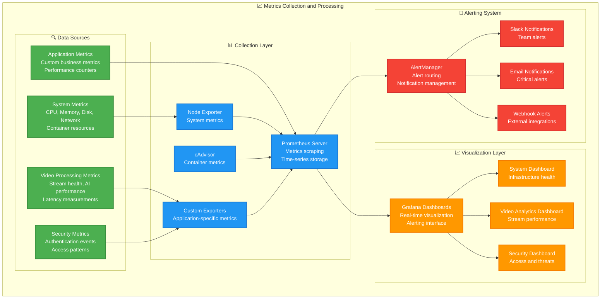

### **Log Aggregation and Analysis**
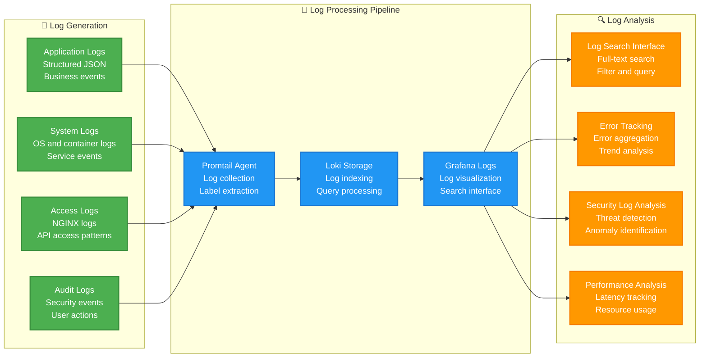

### **Health Check and Alerting Strategy**
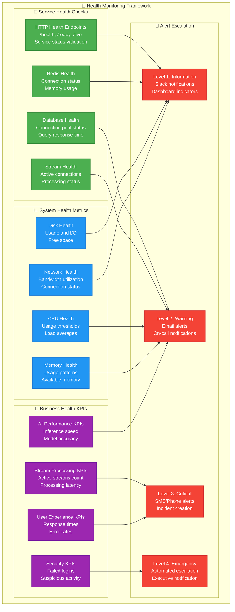

### **Performance Monitoring Dashboard Design**
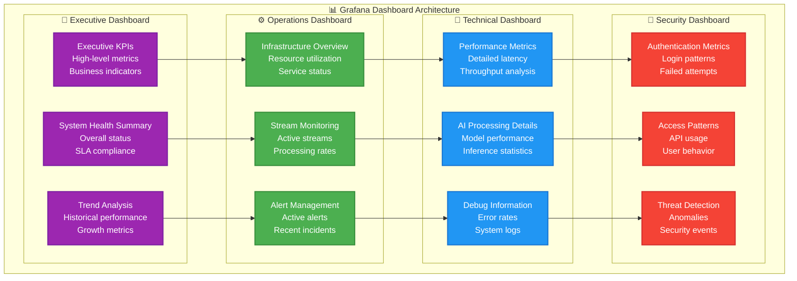

### **Monitoring Implementation Strategy**
```yaml
MONITORING_IMPLEMENTATION:
  Metrics_Collection:
    Prometheus_Config: "15-second scrape interval, 7-day retention"
    Custom_Metrics: "Application-specific KPIs and business metrics"
    System_Metrics: "Node Exporter for infrastructure monitoring"
    Container_Metrics: "cAdvisor for Docker container monitoring"

  Dashboard_Configuration:
    Executive_Dashboard: "High-level KPIs, SLA metrics, business indicators"
    Operations_Dashboard: "Real-time system health, alerts, capacity planning"
    Technical_Dashboard: "Detailed performance metrics, debugging information"
    Security_Dashboard: "Authentication events, access patterns, threats"

  Alerting_Rules:
    Critical_Alerts: "System down, database failures, security breaches"
    Warning_Alerts: "High resource usage, performance degradation"
    Information_Alerts: "Scheduled maintenance, configuration changes"
    Escalation_Policy: "Tiered escalation with increasing urgency"

  Log_Management:
    Structured_Logging: "JSON format with consistent fields and labels"
    Log_Retention: "30 days for application logs, 90 days for audit logs"
    Log_Analysis: "Real-time search, error tracking, security analysis"
    Performance_Monitoring: "Request tracing, latency analysis"

  Health_Checks:
    Service_Health: "HTTP endpoints for readiness and liveness"
    Dependency_Checks: "Database, cache, external service validation"
    Business_Metrics: "Stream processing, AI performance, user experience"
    Automated_Recovery: "Basic self-healing for common issues"
```

---

## 🔧 Development and Operations

### **CI/CD Pipeline Architecture**
```mermaid
graph LR
    subgraph "👨‍💻 Development Workflow"
        DEV_LOCAL[Local Development<br/>Feature development<br/>Unit testing]
        GIT_BRANCH[Feature Branch<br/>Git workflow<br/>Code reviews]
        PR_REVIEW[Pull Request<br/>Peer review<br/>Automated checks]
    end

    subgraph "🔍 Continuous Integration"
        CI_TRIGGER[CI Trigger<br/>GitHub Actions<br/>Automated pipeline]
        CODE_QUALITY[Code Quality<br/>Linting, formatting<br/>Security scanning]
        UNIT_TESTS[Unit Tests<br/>Test execution<br/>Coverage reports]
        INTEGRATION_TESTS[Integration Tests<br/>API testing<br/>Component testing]
    end

    subgraph "🏗️ Build and Package"
        DOCKER_BUILD[Docker Build<br/>Multi-stage builds<br/>Image optimization]
        IMAGE_SCAN[Security Scan<br/>Vulnerability assessment<br/>Compliance check]
        REGISTRY_PUSH[Registry Push<br/>Docker Hub/ECR<br/>Versioned images]
    end

    subgraph "🚀 Deployment Pipeline"
        DEPLOY_STAGING[Staging Deployment<br/>Automated deployment<br/>Integration testing]
        HEALTH_CHECK[Health Verification<br/>Service validation<br/>Smoke tests]
        DEPLOY_PROD[Production Deployment<br/>Blue-green strategy<br/>Rollback capability]
    end

    DEV_LOCAL --> GIT_BRANCH
    GIT_BRANCH --> PR_REVIEW
    PR_REVIEW --> CI_TRIGGER

    CI_TRIGGER --> CODE_QUALITY
    CODE_QUALITY --> UNIT_TESTS
    UNIT_TESTS --> INTEGRATION_TESTS

    INTEGRATION_TESTS --> DOCKER_BUILD
    DOCKER_BUILD --> IMAGE_SCAN
    IMAGE_SCAN --> REGISTRY_PUSH

    REGISTRY_PUSH --> DEPLOY_STAGING
    DEPLOY_STAGING --> HEALTH_CHECK
    HEALTH_CHECK --> DEPLOY_PROD

    classDef development fill:#4caf50,stroke:#388e3c,stroke-width:2px,color:#fff
    classDef integration fill:#2196f3,stroke:#1976d2,stroke-width:2px,color:#fff
    classDef build fill:#ff9800,stroke:#f57c00,stroke-width:2px,color:#fff
    classDef deployment fill:#9c27b0,stroke:#7b1fa2,stroke-width:2px,color:#fff

    class DEV_LOCAL,GIT_BRANCH,PR_REVIEW development
    class CI_TRIGGER,CODE_QUALITY,UNIT_TESTS,INTEGRATION_TESTS integration
    class DOCKER_BUILD,IMAGE_SCAN,REGISTRY_PUSH build
    class DEPLOY_STAGING,HEALTH_CHECK,DEPLOY_PROD deployment
```

### **Infrastructure as Code (IaC) Workflow**
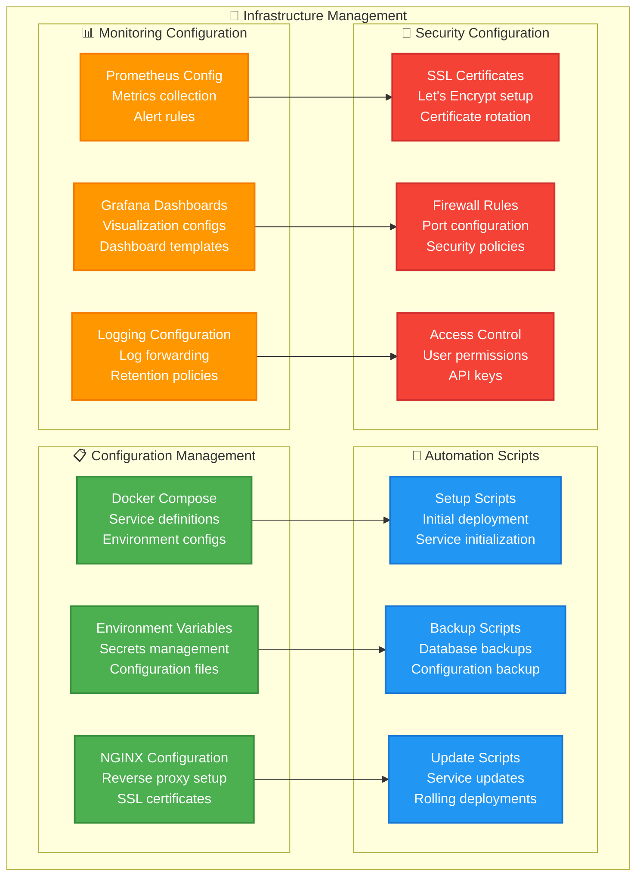

### **Deployment Strategy and Rollback**
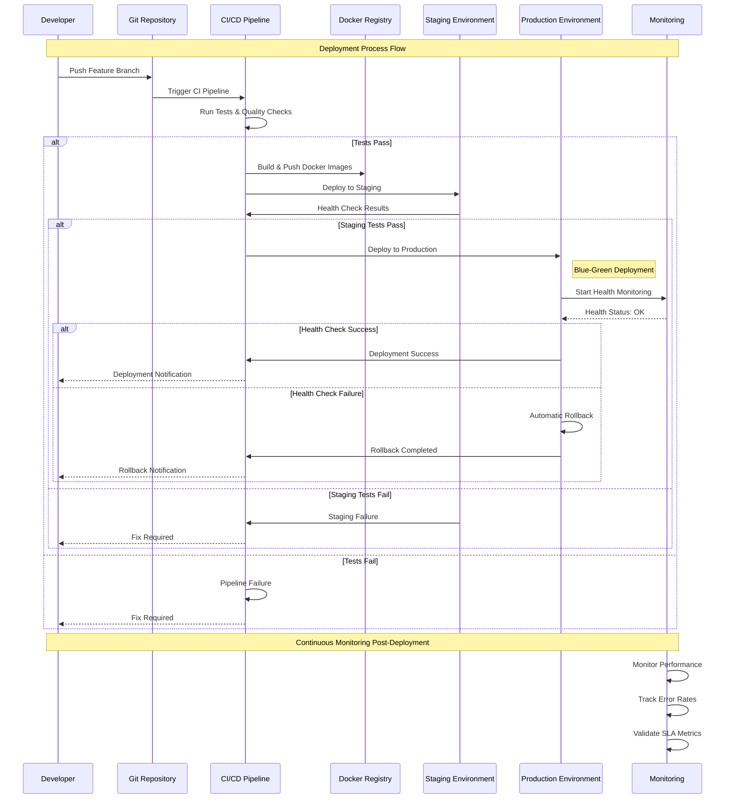

### **Backup and Recovery Procedures**
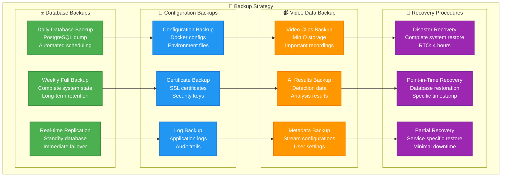

### **DevOps Implementation Framework**
```yaml
DEVOPS_IMPLEMENTATION:
  Development_Workflow:
    Version_Control: "Git with feature branch workflow and protected main branch"
    Code_Quality: "golangci-lint for Go, flake8 for Python, ESLint for JavaScript"
    Testing: "Unit tests with 80%+ coverage, integration tests, end-to-end tests"
    Code_Review: "Mandatory peer review with at least one approval required"

  CI_CD_Pipeline:
    Platform: "GitHub Actions with self-hosted runners"
    Build_System: "Docker multi-stage builds with layer caching"
    Testing_Strategy: "Parallel test execution with fast feedback"
    Security_Scanning: "Dependency scanning, container vulnerability assessment"

  Deployment_Process:
    Staging_Environment: "Identical to production for reliable testing"
    Production_Deployment: "Blue-green deployment with automatic rollback"
    Health_Checks: "Comprehensive health validation before traffic routing"
    Rollback_Strategy: "Automated rollback on health check failures"

  Infrastructure_Management:
    Configuration_Management: "Docker Compose with environment-specific configs"
    Secrets_Management: "Encrypted secrets with rotation policies"
    SSL_Certificate_Management: "Let's Encrypt with automatic renewal"
    Backup_Automation: "Automated daily backups with 30-day retention"

  Monitoring_and_Alerting:
    Metrics_Collection: "Prometheus with custom application metrics"
    Log_Aggregation: "Centralized logging with Grafana Loki"
    Dashboard_Management: "Grafana dashboards with role-based access"
    Incident_Response: "Automated alerting with escalation procedures"

  Security_Integration:
    Access_Control: "SSH key-based access with multi-factor authentication"
    Container_Security: "Regular image scanning and minimal base images"
    Network_Security: "Firewall rules with principle of least privilege"
    Audit_Logging: "Comprehensive audit trail for all operations"
```

---

## 🎯 Migration Readiness

### **Phase 2 Preparation**
```yaml
FUTURE_SCALABILITY:
  Architecture_Preparation:
    Service_Boundaries: "Clear service boundaries for microservices split"
    Configuration_Management: "External configuration for easy migration"
    State_Management: "Stateless service design where possible"

  Data_Migration_Readiness:
    Schema_Versioning: "Database schema version management"
    Data_Export: "Easy data export capabilities"
    Backup_Strategy: "Comprehensive backup and restore procedures"

  Technology_Evolution:
    Container_Ready: "Full containerization for Kubernetes migration"
    API_Versioning: "API versioning for backward compatibility"
    Monitoring_Integration: "Metrics format compatible with Kubernetes"
```

---

## 🎯 Phase 1 Success Criteria

The **Phase 1 Architecture** delivers a solid technology foundation:

- ✅ **Functional Completeness**: All core video analytics capabilities operational
- ✅ **Performance Achievement**: 50-100 concurrent streams with <500ms latency
- ✅ **Technology Reliability**: 95% uptime with proven technology stack
- ✅ **Scalability Preparation**: Architecture ready for Phase 2 evolution
- ✅ **Security Foundation**: Basic security framework operational

**This architecture provides the proven foundation needed for successful scaling to enterprise levels.**

---

**Document Status**: Ready for Implementation
**Next Document**: [Docker Compose Implementation](./02-docker-compose-implementation.md)
**Related**: [Business Considerations](../business-considerations/) | [Implementation Considerations](../implementation-considerations/)