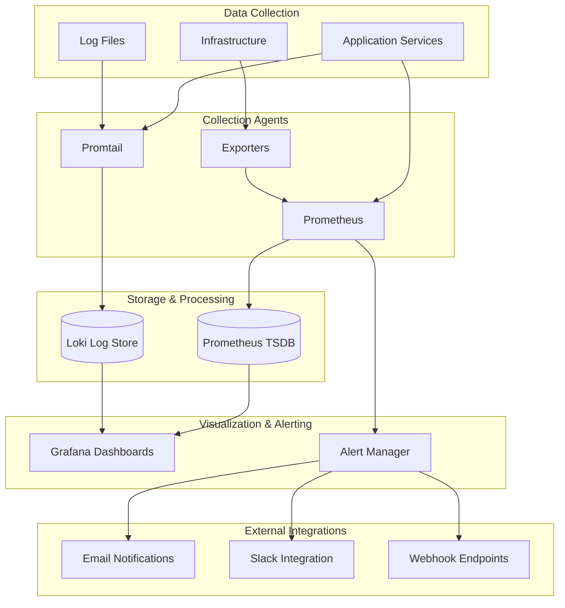

# Phase 1 Monitoring and Observability
## Foundation Framework - CRAWL Phase

---

## 🎯 Observability Overview

Phase 1 establishes a **comprehensive monitoring foundation** using industry-standard tools (Prometheus, Grafana, Loki) that provides essential visibility into system health, performance, and behavior. This observability stack scales seamlessly into Phase 2 Kubernetes environments.

### **Observability Principles**
- **Three Pillars**: Metrics, Logs, and Traces (basic distributed tracing)
- **Real-time Visibility**: Live monitoring with sub-minute granularity
- **Proactive Alerting**: Intelligent alerting before issues impact users
- **Operational Intelligence**: Data-driven operational decision making
- **Scalable Foundation**: Architecture ready for enterprise observability

---

## 📊 Monitoring Architecture

### **Observability Stack Overview**


---

## 📈 Metrics Collection Framework

### **Application Metrics**
```yaml
APPLICATION_METRICS:
  API_Gateway_Metrics:
    http_requests_total: "Counter: Total HTTP requests by method, status, endpoint"
    http_request_duration_seconds: "Histogram: Request latency by endpoint"
    active_connections: "Gauge: Number of active connections"
    jwt_token_validations_total: "Counter: JWT validation attempts and results"
    api_rate_limit_hits_total: "Counter: Rate limit violations by endpoint"

  Video_Processor_Metrics:
    video_streams_active: "Gauge: Number of active video streams"
    video_processing_duration_seconds: "Histogram: Video processing latency"
    video_frames_processed_total: "Counter: Total frames processed"
    video_processing_errors_total: "Counter: Processing errors by type"
    video_stream_connections_total: "Counter: Stream connections by protocol"

  AI_Engine_Metrics:
    ai_inference_duration_seconds: "Histogram: AI model inference time"
    ai_detections_total: "Counter: Object detections by type and confidence"
    ai_model_accuracy: "Gauge: Current model accuracy metrics"
    ai_gpu_utilization: "Gauge: GPU utilization percentage"
    ai_processing_queue_size: "Gauge: Processing queue depth"

  Stream_Manager_Metrics:
    rtmp_connections_active: "Gauge: Active RTMP connections"
    stream_bandwidth_bytes: "Gauge: Bandwidth usage by stream"
    stream_connection_duration_seconds: "Histogram: Connection duration"
    stream_reconnections_total: "Counter: Stream reconnection attempts"
    stream_health_status: "Gauge: Stream health status by source"
```

### **Infrastructure Metrics**
```yaml
INFRASTRUCTURE_METRICS:
  System_Metrics:
    node_cpu_usage_percent: "Gauge: CPU utilization by core"
    node_memory_usage_bytes: "Gauge: Memory usage and availability"
    node_disk_usage_bytes: "Gauge: Disk usage by mount point"
    node_network_bytes: "Counter: Network I/O by interface"
    node_load_average: "Gauge: System load average (1m, 5m, 15m)"

  Container_Metrics:
    container_cpu_usage_seconds_total: "Counter: Container CPU usage"
    container_memory_usage_bytes: "Gauge: Container memory usage"
    container_network_receive_bytes_total: "Counter: Container network RX"
    container_network_transmit_bytes_total: "Counter: Container network TX"
    container_fs_usage_bytes: "Gauge: Container filesystem usage"

  Database_Metrics:
    postgresql_connections_active: "Gauge: Active database connections"
    postgresql_query_duration_seconds: "Histogram: Query execution time"
    postgresql_transactions_total: "Counter: Database transactions"
    postgresql_database_size_bytes: "Gauge: Database size"
    postgresql_replication_lag_seconds: "Gauge: Replication lag (if applicable)"

  Cache_Metrics:
    redis_connected_clients: "Gauge: Connected Redis clients"
    redis_memory_usage_bytes: "Gauge: Redis memory usage"
    redis_operations_total: "Counter: Redis operations by command"
    redis_keyspace_hits_total: "Counter: Cache hits"
    redis_keyspace_misses_total: "Counter: Cache misses"
```

---

## 📋 Logging Framework

### **Structured Logging Configuration**
```yaml
LOGGING_ARCHITECTURE:
  Log_Levels:
    ERROR: "System errors, failures, and exceptions"
    WARN: "Warning conditions that might need attention"
    INFO: "General operational messages"
    DEBUG: "Detailed debug information (development only)"

  Log_Format:
    timestamp: "ISO 8601 timestamp with timezone"
    level: "Log level (ERROR, WARN, INFO, DEBUG)"
    service: "Service name generating the log"
    trace_id: "Distributed tracing correlation ID"
    message: "Human-readable log message"
    fields: "Additional structured data"

  Log_Categories:
    application: "Application-specific business logic logs"
    security: "Authentication, authorization, and security events"
    performance: "Performance-related logs and metrics"
    audit: "User actions and system changes"
    system: "System-level operational logs"
```

### **Log Aggregation Strategy**
```yaml
LOG_COLLECTION:
  Promtail_Configuration:
    scrape_configs:
      - job_name: "application-logs"
        static_configs:
          - targets: ["localhost"]
            labels:
              job: "video-analytics"
              __path__: "/var/log/app/*/*.log"

      - job_name: "system-logs"
        static_configs:
          - targets: ["localhost"]
            labels:
              job: "system"
              __path__: "/var/log/*.log"

      - job_name: "container-logs"
        docker_sd_configs:
          - host: "unix:///var/run/docker.sock"
            refresh_interval: "5s"

  Log_Retention:
    application_logs: "30 days"
    security_logs: "90 days"
    audit_logs: "365 days"
    debug_logs: "7 days"
    system_logs: "60 days"
```

---

## 📊 Grafana Dashboard Configuration

### **Core System Dashboard**
```json
{
  "dashboard": {
    "title": "Video Analytics Platform - System Overview",
    "tags": ["video-analytics", "phase-1", "overview"],
    "refresh": "30s",
    "panels": [
      {
        "title": "System Health",
        "type": "stat",
        "targets": [
          {
            "expr": "up{job=\"video-analytics\"}",
            "legendFormat": "{{instance}}"
          }
        ]
      },
      {
        "title": "CPU Usage",
        "type": "timeseries",
        "targets": [
          {
            "expr": "100 - (avg(rate(node_cpu_seconds_total{mode=\"idle\"}[5m])) * 100)",
            "legendFormat": "CPU Usage %"
          }
        ]
      },
      {
        "title": "Memory Usage",
        "type": "timeseries",
        "targets": [
          {
            "expr": "(node_memory_MemTotal_bytes - node_memory_MemAvailable_bytes) / node_memory_MemTotal_bytes * 100",
            "legendFormat": "Memory Usage %"
          }
        ]
      },
      {
        "title": "Active Video Streams",
        "type": "stat",
        "targets": [
          {
            "expr": "sum(video_streams_active)",
            "legendFormat": "Active Streams"
          }
        ]
      },
      {
        "title": "API Request Rate",
        "type": "timeseries",
        "targets": [
          {
            "expr": "rate(http_requests_total[5m])",
            "legendFormat": "{{method}} {{endpoint}}"
          }
        ]
      },
      {
        "title": "Processing Latency",
        "type": "timeseries",
        "targets": [
          {
            "expr": "histogram_quantile(0.95, rate(video_processing_duration_seconds_bucket[5m]))",
            "legendFormat": "95th Percentile"
          }
        ]
      }
    ]
  }
}
```

### **Application Performance Dashboard**
```json
{
  "dashboard": {
    "title": "Video Analytics Platform - Application Performance",
    "tags": ["video-analytics", "performance", "application"],
    "refresh": "15s",
    "panels": [
      {
        "title": "Video Processing Pipeline",
        "type": "timeseries",
        "targets": [
          {
            "expr": "rate(video_frames_processed_total[5m])",
            "legendFormat": "Frames/sec"
          }
        ]
      },
      {
        "title": "AI Detection Performance",
        "type": "timeseries",
        "targets": [
          {
            "expr": "histogram_quantile(0.95, rate(ai_inference_duration_seconds_bucket[5m]))",
            "legendFormat": "AI Inference Latency (95th)"
          }
        ]
      },
      {
        "title": "Database Performance",
        "type": "timeseries",
        "targets": [
          {
            "expr": "rate(postgresql_transactions_total[5m])",
            "legendFormat": "Transactions/sec"
          }
        ]
      },
      {
        "title": "Cache Hit Rate",
        "type": "stat",
        "targets": [
          {
            "expr": "redis_keyspace_hits_total / (redis_keyspace_hits_total + redis_keyspace_misses_total) * 100",
            "legendFormat": "Cache Hit Rate %"
          }
        ]
      }
    ]
  }
}
```

---

## 🚨 Alerting Framework

### **Alert Rules Configuration**
```yaml
ALERT_RULES:
  Critical_Alerts:
    ServiceDown:
      expr: "up == 0"
      for: "2m"
      severity: "critical"
      description: "Service {{$labels.instance}} is down"
      runbook: "https://docs.company.com/runbooks/service-down"

    HighCPUUsage:
      expr: "(100 - (avg(rate(node_cpu_seconds_total{mode=\"idle\"}[5m])) * 100)) > 90"
      for: "5m"
      severity: "critical"
      description: "CPU usage is above 90% on {{$labels.instance}}"

    HighMemoryUsage:
      expr: "(node_memory_MemTotal_bytes - node_memory_MemAvailable_bytes) / node_memory_MemTotal_bytes * 100 > 90"
      for: "5m"
      severity: "critical"
      description: "Memory usage is above 90% on {{$labels.instance}}"

    DatabaseConnectionsHigh:
      expr: "postgresql_connections_active > 80"
      for: "3m"
      severity: "critical"
      description: "Database connections are approaching limit"

  Warning_Alerts:
    HighLatency:
      expr: "histogram_quantile(0.95, rate(http_request_duration_seconds_bucket[5m])) > 1"
      for: "10m"
      severity: "warning"
      description: "API latency is above 1 second (95th percentile)"

    VideoProcessingBacklog:
      expr: "ai_processing_queue_size > 100"
      for: "5m"
      severity: "warning"
      description: "Video processing queue is backing up"

    DiskSpaceHigh:
      expr: "node_filesystem_avail_bytes / node_filesystem_size_bytes * 100 < 20"
      for: "15m"
      severity: "warning"
      description: "Disk space is below 20% on {{$labels.mountpoint}}"

    StreamConnectionErrors:
      expr: "rate(stream_reconnections_total[5m]) > 0.1"
      for: "5m"
      severity: "warning"
      description: "High rate of stream reconnections detected"

  Informational_Alerts:
    NewStreamConnected:
      expr: "increase(stream_connection_duration_seconds_count[1m]) > 0"
      for: "0s"
      severity: "info"
      description: "New video stream connected"

    ModelAccuracyDrop:
      expr: "ai_model_accuracy < 0.85"
      for: "30m"
      severity: "info"
      description: "AI model accuracy has dropped below 85%"
```

### **Notification Configuration**
```yaml
NOTIFICATION_ROUTING:
  Routes:
    - match:
        severity: "critical"
      receiver: "critical-alerts"
      group_wait: "10s"
      group_interval: "10m"
      repeat_interval: "1h"

    - match:
        severity: "warning"
      receiver: "warning-alerts"
      group_wait: "30s"
      group_interval: "5m"
      repeat_interval: "12h"

    - match:
        severity: "info"
      receiver: "info-alerts"
      group_wait: "5m"
      group_interval: "30m"
      repeat_interval: "24h"

  Receivers:
    critical-alerts:
      email_configs:
        - to: "ops-team@company.com"
          subject: "🚨 CRITICAL: {{.GroupLabels.alertname}}"
          body: "{{range .Alerts}}{{.Annotations.description}}{{end}}"
      slack_configs:
        - api_url: "https://hooks.slack.com/services/..."
          channel: "#alerts-critical"
          title: "Critical Alert: {{.GroupLabels.alertname}}"

    warning-alerts:
      email_configs:
        - to: "dev-team@company.com"
          subject: "⚠️ WARNING: {{.GroupLabels.alertname}}"
      slack_configs:
        - api_url: "https://hooks.slack.com/services/..."
          channel: "#alerts-warning"

    info-alerts:
      slack_configs:
        - api_url: "https://hooks.slack.com/services/..."
          channel: "#system-info"
```

---

## 🔍 Performance Monitoring

### **Key Performance Indicators (KPIs)**
```yaml
PERFORMANCE_KPIS:
  Availability_Metrics:
    system_uptime: "Target: >95% monthly uptime"
    service_availability: "Target: >99% per service"
    mttr: "Target: <30 minutes mean time to recovery"
    mttd: "Target: <5 minutes mean time to detection"

  Performance_Metrics:
    api_response_time: "Target: <200ms 95th percentile"
    video_processing_latency: "Target: <500ms end-to-end"
    concurrent_streams: "Target: 50-100 streams successfully processed"
    throughput: "Target: >1000 API requests/minute"

  Quality_Metrics:
    error_rate: "Target: <1% error rate across all operations"
    ai_accuracy: "Target: >90% detection accuracy"
    data_consistency: "Target: 100% data integrity"
    user_satisfaction: "Target: >4/5 user rating"

  Resource_Metrics:
    cpu_utilization: "Target: <80% average CPU usage"
    memory_utilization: "Target: <80% average memory usage"
    disk_utilization: "Target: <70% disk usage"
    network_utilization: "Target: <60% network bandwidth"
```

---

## 📱 Operational Dashboards

### **Executive Dashboard**
- **System Health Overview**: High-level service status
- **Business Metrics**: Stream count, user activity, processing volume
- **SLA Compliance**: Availability and performance targets
- **Cost Metrics**: Resource utilization and efficiency

### **Operations Dashboard**
- **Infrastructure Health**: Server resources, network, storage
- **Service Performance**: Latency, throughput, error rates
- **Alert Status**: Active alerts and escalations
- **Capacity Planning**: Resource trends and projections

### **Development Dashboard**
- **Application Metrics**: Code performance, deployment status
- **Error Tracking**: Exception rates, error distribution
- **Feature Usage**: API endpoint utilization
- **Performance Profiling**: Detailed performance analysis

---

## 🎯 Phase 1 Monitoring Success Criteria

The **Phase 1 Monitoring Framework** delivers comprehensive observability:

- ✅ **Complete Visibility**: All services and infrastructure monitored
- ✅ **Proactive Alerting**: Issues detected before user impact
- ✅ **Performance Tracking**: SLA compliance monitoring
- ✅ **Operational Intelligence**: Data-driven decision support
- ✅ **Scalable Foundation**: Ready for Phase 2 Kubernetes migration

**This monitoring foundation provides the visibility and control needed for reliable operations and continuous improvement.**

---

**Document Status**: Ready for Implementation
**Next Document**: [Business Considerations](../business-considerations/01-technology-value-proposition.md)
**Related**: [System Architecture](./01-simplified-system-architecture.md) | [Docker Implementation](./02-docker-compose-implementation.md)