# Phase 1 AI Pipeline Module
## Computer Vision Processing Framework - CRAWL Phase

---

## 🎯 AI Pipeline Overview

The **AI Pipeline Module** is the core intelligence component of the Phase 1 Video Analytics Platform, responsible for **real-time computer vision processing** and **object detection** across video streams. This module transforms raw video data into actionable insights using proven AI/ML technologies.

### **AI Pipeline Mission**
- **Real-time Processing**: Sub-200ms inference time for object detection
- **Scalable Architecture**: Support for 50-100 concurrent video streams
- **Proven Models**: Leverage pre-trained, production-ready AI models
- **Extensible Design**: Foundation for advanced AI capabilities in Phase 2
- **Operational Excellence**: Robust, monitorable, and maintainable AI services

### **Key Capabilities Delivered**
- **Object Detection**: Person, vehicle, and general object recognition
- **Motion Analysis**: Movement detection and tracking
- **Anomaly Detection**: Unusual activity identification
- **Real-time Alerts**: Instant notification generation
- **Metadata Extraction**: Rich video content analysis

---

## 🏗️ AI Pipeline Architecture

### **High-Level AI Processing Flow**

```mermaid
graph TB
    subgraph "🎥 Video Input Layer"
        STREAMS[Video Streams<br/>RTSP/HTTP/WebRTC]
        FRAMES[Frame Extraction<br/>1-30 FPS processing]
        BUFFER[Frame Buffer<br/>Circular queue management]
    end

    subgraph "🔄 Preprocessing Layer"
        RESIZE[Image Resizing<br/>Model input dimensions]
        NORMALIZE[Normalization<br/>Pixel value scaling]
        AUGMENT[Data Augmentation<br/>Quality enhancement]
        BATCH[Batch Formation<br/>Inference optimization]
    end

    subgraph "🧠 AI Inference Layer"
        MODEL_LOADER[Model Manager<br/>Dynamic model loading]
        INFERENCE[Inference Engine<br/>TensorFlow/ONNX runtime]
        GPU_ACCEL[GPU Acceleration<br/>Optional CUDA support]
        CONFIDENCE[Confidence Filtering<br/>Threshold application]
    end

    subgraph "📊 Post-Processing Layer"
        NMS[Non-Max Suppression<br/>Duplicate removal]
        TRACKING[Object Tracking<br/>DeepSORT algorithm]
        TEMPORAL[Temporal Analysis<br/>Movement patterns]
        AGGREGATION[Result Aggregation<br/>Multi-frame analysis]
    end

    subgraph "📤 Output Layer"
        FORMATTING[Result Formatting<br/>JSON standardization]
        ALERTS[Alert Generation<br/>Rule-based triggers]
        STORAGE[Result Storage<br/>Database persistence]
        STREAMING[Real-time Streaming<br/>WebSocket delivery]
    end

    STREAMS --> FRAMES
    FRAMES --> BUFFER
    BUFFER --> RESIZE

    RESIZE --> NORMALIZE
    NORMALIZE --> AUGMENT
    AUGMENT --> BATCH

    BATCH --> MODEL_LOADER
    MODEL_LOADER --> INFERENCE
    INFERENCE --> GPU_ACCEL
    GPU_ACCEL --> CONFIDENCE

    CONFIDENCE --> NMS
    NMS --> TRACKING
    TRACKING --> TEMPORAL
    TEMPORAL --> AGGREGATION

    AGGREGATION --> FORMATTING
    FORMATTING --> ALERTS
    ALERTS --> STORAGE
    STORAGE --> STREAMING

    classDef input fill:#4caf50,stroke:#388e3c,stroke-width:2px,color:#fff
    classDef preprocessing fill:#ff9800,stroke:#f57c00,stroke-width:2px,color:#fff
    classDef inference fill:#2196f3,stroke:#1976d2,stroke-width:2px,color:#fff
    classDef postprocessing fill:#9c27b0,stroke:#7b1fa2,stroke-width:2px,color:#fff
    classDef output fill:#f44336,stroke:#d32f2f,stroke-width:2px,color:#fff

    class STREAMS,FRAMES,BUFFER input
    class RESIZE,NORMALIZE,AUGMENT,BATCH preprocessing
    class MODEL_LOADER,INFERENCE,GPU_ACCEL,CONFIDENCE inference
    class NMS,TRACKING,TEMPORAL,AGGREGATION postprocessing
    class FORMATTING,ALERTS,STORAGE,STREAMING output
```


### **AI Service Container Architecture**
```yaml
AI_SERVICE_ARCHITECTURE:
  Service_Components:
    inference_engine: "Core AI inference and model management"
    preprocessing_service: "Video frame preprocessing and optimization"
    postprocessing_service: "Result analysis and enhancement"
    model_manager: "Dynamic model loading and versioning"
    alert_engine: "Real-time alert generation and routing"

  Technology_Stack:
    Runtime: "Node.js 20.x with Python 3.11 bridge"
    ML_Framework: "TensorFlow.js 4.x + OpenCV 4.x"
    Model_Format: "ONNX for cross-platform compatibility"
    GPU_Support: "Optional CUDA/TensorRT acceleration"
    API_Framework: "Express.js with WebSocket support"

  Performance_Targets:
    Inference_Latency: "<200ms per frame"
    Throughput: "50-100 concurrent streams"
    Accuracy: ">90% object detection accuracy"
    Resource_Usage: "<4GB RAM, <2 CPU cores per stream"
    Availability: ">99% service uptime"
```

---

## 🤖 Computer Vision Pipeline

### **Object Detection Framework**
```yaml
OBJECT_DETECTION:
  Primary_Models:
    YOLOv8_Nano:
      purpose: "Lightweight real-time object detection"
      accuracy: "~85% mAP on COCO dataset"
      speed: "~100 FPS on modern CPU"
      model_size: "6.2MB"
      supported_classes: "80 COCO classes (person, vehicle, etc.)"

    YOLOv8_Small:
      purpose: "Balanced accuracy and performance"
      accuracy: "~89% mAP on COCO dataset"
      speed: "~50 FPS on modern CPU"
      model_size: "21.5MB"
      use_case: "Higher accuracy requirements"

  Custom_Models:
    Security_Detection:
      classes: "Person, Vehicle, Weapon, Intrusion"
      training_data: "Security-specific dataset"
      optimization: "Specialized for surveillance scenarios"
      accuracy_target: ">95% for security-critical objects"

  Model_Configuration:
    Input_Resolution: "640x640 (standard), 416x416 (fast), 832x832 (accurate)"
    Confidence_Threshold: "0.5 (default), configurable per use case"
    IoU_Threshold: "0.45 for Non-Maximum Suppression"
    Batch_Size: "1-8 frames depending on hardware capacity"
```

### **Video Frame Processing Pipeline**
```yaml
FRAME_PROCESSING:
  Input_Handling:
    Supported_Formats: "MP4, AVI, MOV, WebM, RTSP streams"
    Frame_Extraction: "FFmpeg-based extraction at configurable FPS"
    Resolution_Support: "240p to 4K (auto-scaling to model requirements)"
    Color_Space: "RGB/BGR conversion for model compatibility"

  Preprocessing_Steps:
    Step_1_Resize:
      method: "Maintain aspect ratio with padding"
      target_size: "Model-specific input dimensions"
      interpolation: "Bilinear for speed, bicubic for quality"

    Step_2_Normalize:
      method: "Pixel value normalization to [0,1] or [-1,1]"
      mean_subtraction: "ImageNet mean values [0.485, 0.456, 0.406]"
      std_normalization: "ImageNet std values [0.229, 0.224, 0.225]"

    Step_3_Augmentation:
      brightness_adjustment: "Auto-exposure correction"
      noise_reduction: "Gaussian blur for noisy inputs"
      contrast_enhancement: "Histogram equalization"
      quality_assessment: "Blur detection and quality scoring"

  Optimization_Techniques:
    Frame_Skipping: "Intelligent frame sampling based on motion"
    ROI_Processing: "Region-of-interest focused inference"
    Multi_Scale: "Multiple resolution inference for accuracy"
    Temporal_Coherence: "Frame-to-frame consistency checking"
```

### **Object Tracking Implementation**
```yaml
OBJECT_TRACKING:
  Tracking_Algorithm:
    Primary: "DeepSORT (Deep Simple Online Realtime Tracking)"
    Features: "Appearance descriptors + motion prediction"
    Kalman_Filter: "Position and velocity prediction"
    Hungarian_Algorithm: "Optimal assignment solving"

  Tracking_Configuration:
    Max_Disappeared: "30 frames before track deletion"
    Max_Distance: "50 pixels for association threshold"
    Feature_Extractor: "ResNet-50 based appearance model"
    Tracking_Memory: "Store last 100 frames of features"

  Track_Management:
    Track_Initialization: "3 consecutive detections for new track"
    Track_Termination: "30 frames without detection"
    Track_Recovery: "Re-identification after brief occlusion"
    Cross_Camera_Tracking: "Prepared for Phase 2 multi-camera scenarios"

  Performance_Optimization:
    Feature_Caching: "Cache appearance features for efficiency"
    Distance_Calculation: "Optimized cosine similarity computation"
    Memory_Management: "Sliding window for track history"
    Parallel_Processing: "Multi-threaded track updates"
```

---

## 📊 Model Management Framework

### **Model Lifecycle Management**
```yaml
MODEL_MANAGEMENT:
  Model_Loading:
    Dynamic_Loading: "Load models on demand based on stream requirements"
    Memory_Management: "Intelligent model caching and unloading"
    Model_Warmup: "Pre-inference warm-up for consistent performance"
    Version_Control: "Support for multiple model versions"

  Model_Storage:
    Local_Storage: "/app/models directory with organized structure"
    Cloud_Integration: "S3/MinIO integration for model distribution"
    Model_Registry: "Metadata database for model tracking"
    Checksums: "Model integrity verification"

  Model_Updates:
    Hot_Swapping: "Runtime model updates without service restart"
    A_B_Testing: "Compare model performance in parallel"
    Rollback_Capability: "Quick rollback to previous model versions"
    Performance_Monitoring: "Continuous model performance tracking"

  Model_Optimization:
    Quantization: "INT8 quantization for reduced memory usage"
    Pruning: "Remove redundant model parameters"
    ONNX_Conversion: "Cross-platform model format conversion"
    TensorRT_Optimization: "NVIDIA GPU optimization (when available)"
```

### **Pre-trained Model Library**
```yaml
MODEL_LIBRARY:
  Object_Detection_Models:
    YOLOv8_Nano_COCO:
      file: "yolov8n.onnx"
      size: "6.2MB"
      classes: "80 COCO classes"
      use_case: "General purpose, fast detection"

    YOLOv8_Small_COCO:
      file: "yolov8s.onnx"
      size: "21.5MB"
      classes: "80 COCO classes"
      use_case: "Higher accuracy detection"

    YOLOv5_Security:
      file: "yolov5_security.onnx"
      size: "14MB"
      classes: "Person, Vehicle, Weapon, Bag"
      use_case: "Security-specific detection"

  Classification_Models:
    ResNet50_Features:
      file: "resnet50_features.onnx"
      size: "98MB"
      purpose: "Feature extraction for tracking"
      output: "2048-dimensional feature vectors"

    MobileNet_Classifier:
      file: "mobilenet_v3.onnx"
      size: "5.4MB"
      purpose: "Lightweight image classification"
      classes: "1000 ImageNet classes"

  Model_Download_Scripts:
    automatic_download: "Download models on first startup"
    integrity_verification: "SHA256 checksum validation"
    fallback_models: "Local fallback for network issues"
    update_mechanism: "Automatic model update checking"
```

---

## 🔌 API Specifications and Data Flow

### **AI Service REST API**
```yaml
AI_SERVICE_API:
  Base_URL: "http://ai-engine:8082"

  Endpoints:
    Health_Check:
      path: "/health"
      method: "GET"
      response: "Service health status and model availability"

    Model_Info:
      path: "/models"
      method: "GET"
      response: "Available models and their configurations"

    Process_Frame:
      path: "/detect"
      method: "POST"
      content_type: "multipart/form-data"
      payload: "Image file + processing parameters"
      response: "Detection results with bounding boxes"

    Process_Stream:
      path: "/stream/{stream_id}"
      method: "POST"
      payload: "Stream configuration and processing options"
      response: "Stream processing session ID"

    Get_Results:
      path: "/results/{session_id}"
      method: "GET"
      response: "Processing results for session"

    Configure_Model:
      path: "/models/{model_id}/config"
      method: "PUT"
      payload: "Model configuration parameters"
      response: "Configuration status"

  Authentication:
    method: "JWT token validation"
    header: "Authorization: Bearer <token>"
    scope: "ai-service access permissions"
```

### **Data Formats and Schemas**
```yaml
DATA_FORMATS:
  Detection_Result_Schema:
    timestamp: "ISO 8601 timestamp"
    stream_id: "Unique stream identifier"
    frame_number: "Sequential frame number"
    processing_time_ms: "Total processing time"
    detections: "Array of detection objects"
    metadata: "Additional processing metadata"

  Detection_Object_Schema:
    object_id: "Unique detection identifier"
    class_name: "Object class (person, car, etc.)"
    confidence: "Detection confidence (0.0-1.0)"
    bounding_box: "x, y, width, height coordinates"
    center_point: "Object center coordinates"
    area: "Bounding box area in pixels"
    track_id: "Tracking identifier (if tracking enabled)"

  Alert_Schema:
    alert_id: "Unique alert identifier"
    alert_type: "Type of alert (intrusion, loitering, etc.)"
    severity: "Alert severity level (low, medium, high, critical)"
    trigger_conditions: "Conditions that triggered the alert"
    associated_detections: "Related detection objects"
    actions_taken: "Automated actions performed"
    acknowledgment_status: "Alert acknowledgment state"
```

### **WebSocket Real-time Integration**
```yaml
WEBSOCKET_INTEGRATION:
  Connection_Endpoint: "ws://ai-engine:8082/realtime"

  Message_Types:
    Detection_Update:
      type: "detection"
      payload: "Real-time detection results"
      frequency: "Per frame or configurable intervals"

    Alert_Notification:
      type: "alert"
      payload: "Alert information and metadata"
      priority: "High priority immediate delivery"

    Status_Update:
      type: "status"
      payload: "Processing status and performance metrics"
      frequency: "Every 30 seconds"

    Configuration_Change:
      type: "config"
      payload: "Model or processing configuration updates"
      acknowledgment: "Required client acknowledgment"

  Connection_Management:
    authentication: "JWT token-based authentication"
    reconnection: "Automatic reconnection with exponential backoff"
    heartbeat: "Ping/pong heartbeat every 30 seconds"
    multiplexing: "Support for multiple concurrent subscriptions"
```

---

## ⚡ Performance Optimization

### **Inference Performance Optimization**
```yaml
PERFORMANCE_OPTIMIZATION:
  Model_Optimization:
    Quantization:
      int8_quantization: "Reduce model size by 75% with minimal accuracy loss"
      dynamic_quantization: "Runtime quantization for variable precision"
      calibration_dataset: "Representative data for quantization tuning"

    Model_Pruning:
      structured_pruning: "Remove entire neurons/channels"
      unstructured_pruning: "Remove individual weights"
      iterative_pruning: "Gradual pruning with retraining"

    Knowledge_Distillation:
      teacher_model: "Large, accurate model for training"
      student_model: "Smaller, faster model for deployment"
      distillation_loss: "Combined task and distillation losses"

  Runtime_Optimization:
    Batch_Processing:
      optimal_batch_size: "Hardware-specific batch size tuning"
      dynamic_batching: "Variable batch sizes based on load"
      batch_timeout: "Maximum wait time for batch formation"

    Memory_Management:
      memory_pools: "Pre-allocated memory pools for tensors"
      garbage_collection: "Optimized memory cleanup strategies"
      memory_mapping: "Memory-mapped model loading"

    CPU_Optimization:
      threading: "Multi-threaded inference for CPU"
      vectorization: "SIMD instructions utilization"
      cache_optimization: "CPU cache-friendly memory access patterns"

  GPU_Acceleration:
    CUDA_Support:
      tensor_cores: "Utilize Tensor Cores for mixed precision"
      streams: "Multiple CUDA streams for parallel processing"
      memory_management: "Optimized GPU memory allocation"

    TensorRT_Integration:
      engine_optimization: "TensorRT engine building and caching"
      precision_modes: "FP32, FP16, INT8 precision options"
      dynamic_shapes: "Support for variable input sizes"
```

### **Scalability Architecture**
```yaml
SCALABILITY_DESIGN:
  Horizontal_Scaling:
    Load_Balancing:
      algorithm: "Round-robin with health checks"
      sticky_sessions: "Stream affinity for tracking consistency"
      failover: "Automatic failover to healthy instances"

    Service_Replication:
      stateless_design: "Stateless AI service instances"
      shared_storage: "Shared model storage across instances"
      result_distribution: "Distributed result collection"

    Auto_Scaling:
      metrics_based: "CPU/memory utilization triggers"
      queue_depth: "Processing queue length monitoring"
      response_time: "SLA-based scaling decisions"

  Resource_Management:
    Resource_Allocation:
      cpu_limits: "Container CPU limits and requests"
      memory_limits: "Memory limits with safety margins"
      gpu_sharing: "GPU resource sharing strategies"

    Quality_of_Service:
      priority_queues: "High-priority stream processing"
      resource_isolation: "Isolated resources per stream type"
      degraded_mode: "Graceful degradation under load"

    Monitoring_Integration:
      performance_metrics: "Real-time performance monitoring"
      resource_utilization: "Resource usage tracking"
      bottleneck_detection: "Automatic bottleneck identification"
```

---

## 🔧 Configuration and Operations

### **Service Configuration**
```yaml
AI_SERVICE_CONFIGURATION:
  Environment_Variables:
    NODE_ENV: "development/staging/production"
    AI_SERVICE_PORT: "8082"
    MODEL_PATH: "/app/models"
    GPU_ENABLED: "true/false"
    CUDA_VISIBLE_DEVICES: "0,1 (GPU device selection)"
    MAX_CONCURRENT_STREAMS: "50"
    INFERENCE_TIMEOUT_MS: "5000"
    MODEL_CACHE_SIZE_MB: "2048"
    LOG_LEVEL: "debug/info/warn/error"

  Model_Configuration:
    default_detection_model: "yolov8n"
    confidence_threshold: "0.5"
    nms_threshold: "0.45"
    max_detections_per_frame: "100"
    tracking_enabled: "true"
    tracking_max_age: "30"
    feature_extraction_model: "resnet50"

  Performance_Configuration:
    batch_size: "1-8 (auto-tuned based on hardware)"
    max_queue_size: "100"
    worker_threads: "4"
    memory_limit_mb: "4096"
    preprocessing_workers: "2"
    postprocessing_workers: "2"

  Alert_Configuration:
    alert_cooldown_seconds: "30"
    min_confidence_for_alert: "0.8"
    spatial_filters: "Configurable ROI zones"
    temporal_filters: "Minimum duration thresholds"
    notification_channels: "webhook/email/slack"
```

### **Health Checks and Monitoring**
```yaml
HEALTH_MONITORING:
  Health_Check_Endpoints:
    Basic_Health:
      endpoint: "/health"
      checks: ["Service responsive", "Model loaded", "Memory usage OK"]
      response_time: "<100ms"

    Detailed_Health:
      endpoint: "/health/detailed"
      checks: ["GPU status", "Model performance", "Queue status"]
      response_time: "<500ms"

    Readiness_Check:
      endpoint: "/ready"
      checks: ["Models loaded", "Dependencies available", "Resources sufficient"]
      response_time: "<200ms"

  Monitoring_Metrics:
    Performance_Metrics:
      inference_latency_ms: "Per-frame inference time"
      throughput_fps: "Frames processed per second"
      queue_depth: "Processing queue size"
      error_rate: "Processing error percentage"

    Resource_Metrics:
      cpu_utilization: "CPU usage percentage"
      memory_usage_mb: "Memory consumption"
      gpu_utilization: "GPU usage percentage (if available)"
      model_memory_mb: "Model memory consumption"

    Business_Metrics:
      detections_per_minute: "Detection rate"
      alerts_generated: "Alert generation rate"
      accuracy_score: "Model accuracy metrics"
      active_streams: "Currently processed streams"

  Alerting_Rules:
    Critical_Alerts:
      service_down: "Service health check failures"
      high_error_rate: ">5% processing errors"
      memory_exhaustion: ">90% memory usage"
      inference_timeout: "Inference time >2x normal"

    Warning_Alerts:
      high_latency: "Inference time >500ms"
      queue_backup: "Queue depth >50 items"
      model_accuracy_drop: "Accuracy drop >10%"
      resource_contention: "CPU/Memory >80%"
```

### **Troubleshooting Guide**
```yaml
TROUBLESHOOTING:
  Common_Issues:
    High_Latency:
      symptoms: "Inference time >500ms consistently"
      causes: ["Model too large", "Insufficient resources", "Input resolution too high"]
      solutions: ["Use smaller model", "Scale resources", "Reduce input size"]

    Memory_Issues:
      symptoms: "Out of memory errors, service crashes"
      causes: ["Model too large", "Batch size too high", "Memory leaks"]
      solutions: ["Model quantization", "Reduce batch size", "Restart service"]

    Low_Accuracy:
      symptoms: "Detection accuracy below expected"
      causes: ["Wrong model", "Poor input quality", "Incorrect preprocessing"]
      solutions: ["Switch model", "Improve input", "Adjust preprocessing"]

    GPU_Issues:
      symptoms: "GPU not utilized, CUDA errors"
      causes: ["Driver issues", "CUDA version mismatch", "Memory exhaustion"]
      solutions: ["Update drivers", "Check CUDA version", "Reduce GPU memory usage"]

  Diagnostic_Commands:
    check_models: "curl http://ai-engine:8082/models"
    check_health: "curl http://ai-engine:8082/health/detailed"
    monitor_metrics: "curl http://ai-engine:8082/metrics"
    test_inference: "curl -X POST -F 'image=@test.jpg' http://ai-engine:8082/detect"

  Log_Analysis:
    log_locations: "/app/logs/ai-service.log"
    log_levels: "DEBUG, INFO, WARN, ERROR"
    key_patterns: ["INFERENCE_START", "INFERENCE_END", "MODEL_LOAD", "ERROR"]
    performance_patterns: ["Processing time:", "Queue depth:", "Memory usage:"]
```

---

## 🚀 Implementation Roadmap

### **Phase 1A: Core AI Infrastructure (Weeks 1-4)**
```yaml
CORE_INFRASTRUCTURE:
  Week_1_Foundation:
    tasks:
      - "AI service containerization and basic API framework"
      - "Model loading and management infrastructure"
      - "Basic image preprocessing pipeline"
      - "Health check and monitoring endpoints"
    deliverables:
      - "Working AI service container"
      - "Model loading capability"
      - "Basic API endpoints"

  Week_2_Object_Detection:
    tasks:
      - "YOLOv8 model integration"
      - "Object detection inference pipeline"
      - "Result formatting and API integration"
      - "Basic performance optimization"
    deliverables:
      - "Working object detection"
      - "Standardized result format"
      - "Performance benchmarks"

  Week_3_Integration:
    tasks:
      - "Video processor integration"
      - "Real-time processing pipeline"
      - "WebSocket result streaming"
      - "Database result storage"
    deliverables:
      - "End-to-end video processing"
      - "Real-time result delivery"
      - "Database integration"

  Week_4_Optimization:
    tasks:
      - "Performance tuning and optimization"
      - "Error handling and resilience"
      - "Monitoring and alerting integration"
      - "Documentation and testing"
    deliverables:
      - "Optimized performance"
      - "Robust error handling"
      - "Complete monitoring"
```

### **Phase 1B: Advanced Processing (Weeks 5-8)**
```yaml
ADVANCED_PROCESSING:
  Week_5_Tracking:
    tasks:
      - "DeepSORT tracking implementation"
      - "Object persistence across frames"
      - "Track management and lifecycle"
      - "Tracking performance optimization"
    deliverables:
      - "Working object tracking"
      - "Persistent object IDs"
      - "Track history management"

  Week_6_Alerts:
    tasks:
      - "Alert generation framework"
      - "Configurable alert rules"
      - "Alert notification system"
      - "Alert management API"
    deliverables:
      - "Real-time alert generation"
      - "Configurable alert rules"
      - "Alert delivery system"

  Week_7_Enhancement:
    tasks:
      - "Multiple model support"
      - "Advanced preprocessing"
      - "Quality assessment"
      - "Performance analytics"
    deliverables:
      - "Multi-model capability"
      - "Enhanced preprocessing"
      - "Quality metrics"

  Week_8_Production:
    tasks:
      - "Production optimization"
      - "Comprehensive testing"
      - "Documentation completion"
      - "Deployment preparation"
    deliverables:
      - "Production-ready service"
      - "Complete test suite"
      - "Deployment documentation"
```

---

## 📊 Success Metrics and Validation

### **Technical Performance KPIs**
```yaml
TECHNICAL_KPIS:
  Latency_Metrics:
    target_inference_time: "<200ms per frame"
    target_end_to_end_latency: "<500ms"
    target_api_response_time: "<100ms"
    measurement: "95th percentile over 1-hour periods"

  Throughput_Metrics:
    target_concurrent_streams: "50-100 streams"
    target_frames_per_second: "1000+ FPS aggregate"
    target_detections_per_minute: "10,000+ detections"
    measurement: "Sustained performance over 8-hour periods"

  Accuracy_Metrics:
    target_detection_accuracy: ">90% mAP"
    target_tracking_accuracy: ">85% MOTA"
    target_false_positive_rate: "<5%"
    measurement: "Validation on test dataset"

  Reliability_Metrics:
    target_service_uptime: ">99%"
    target_error_rate: "<1%"
    target_recovery_time: "<30 seconds"
    measurement: "Monthly operational metrics"
```

### **Business Value Validation**
```yaml
BUSINESS_VALIDATION:
  Operational_Impact:
    automated_detection_rate: "% of incidents detected automatically"
    false_alarm_reduction: "% reduction in false alarms vs manual"
    response_time_improvement: "% improvement in incident response"
    cost_per_detection: "Cost per successful detection"

  User_Experience:
    dashboard_response_time: "Real-time dashboard update latency"
    alert_accuracy: "% of alerts that require action"
    user_satisfaction: "User feedback scores"
    training_time_required: "Time to train new users"

  Technology_Foundation:
    scalability_validation: "Successful scaling to target capacity"
    integration_success: "Successful integration with existing systems"
    maintenance_overhead: "Operational maintenance requirements"
    upgrade_capability: "Readiness for Phase 2 capabilities"
```

---

## 🎯 Phase 1 AI Pipeline Success

The **Phase 1 AI Pipeline Module** delivers comprehensive computer vision capabilities:

- ✅ **Real-time Processing**: Sub-200ms inference with 50-100 stream capacity
- ✅ **Production-Ready Models**: Proven YOLO and tracking algorithms
- ✅ **Scalable Architecture**: Container-native design ready for enterprise scaling
- ✅ **Operational Excellence**: Comprehensive monitoring, alerting, and troubleshooting
- ✅ **Integration Ready**: APIs and data formats designed for system integration

**This AI pipeline provides the intelligent foundation for automated video analytics with proven performance and reliability.**

---

**Document Status**: Ready for Implementation
**Next Document**: [Stream Management Module](./05-stream-management-module.md)
**Related**: [System Architecture](./01-simplified-system-architecture.md) | [Docker Implementation](./02-docker-compose-implementation.md)