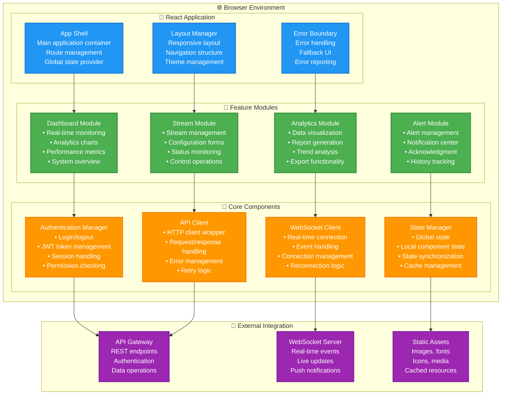
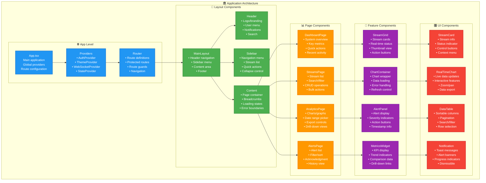
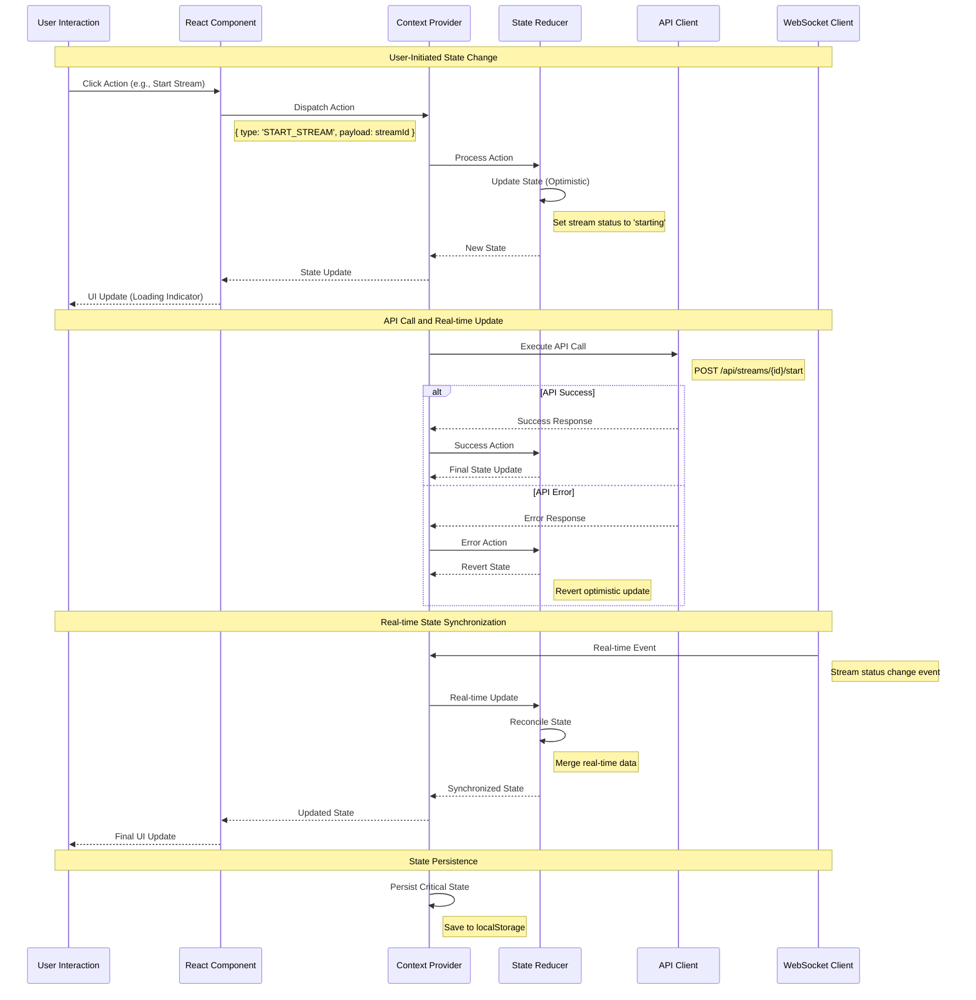
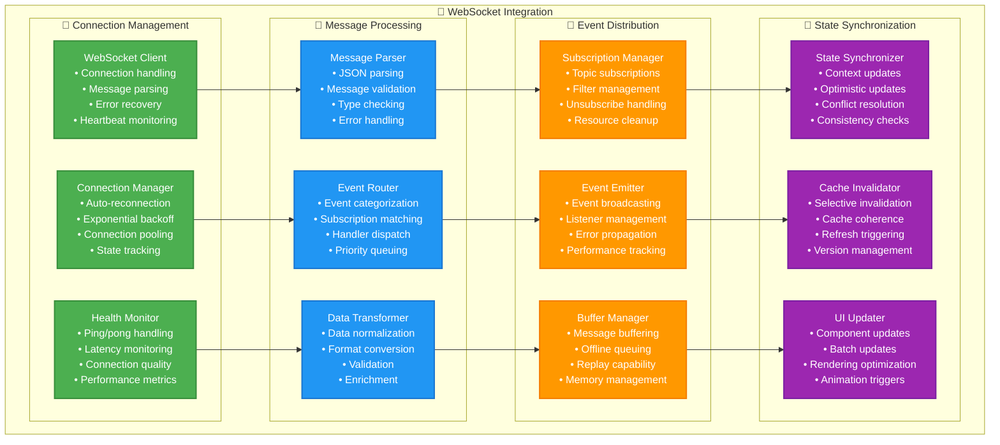
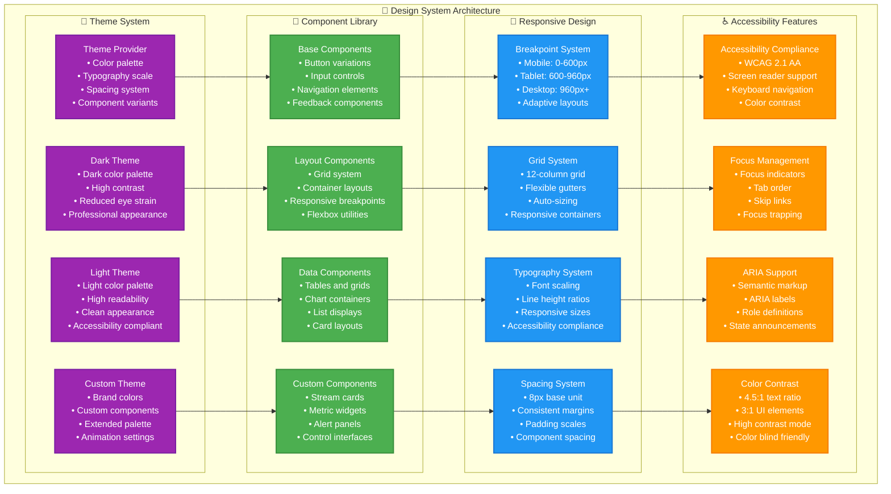
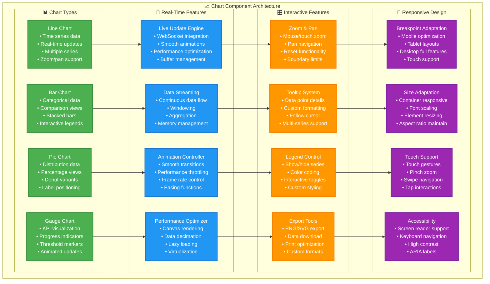

# Phase 1 Frontend Dashboard Module
## Real-Time Video Analytics Interface - CRAWL Phase

---

## 🎯 Frontend Dashboard Overview

The **Frontend Dashboard Module** serves as the primary user interface for the Phase 1 Video Analytics Platform, providing **real-time monitoring**, **stream management**, **analytics visualization**, and **system control** through a modern, responsive web application.

### **Frontend Dashboard Mission**
- **Real-Time Visualization**: Live video analytics data with real-time updates
- **Intuitive User Experience**: Modern, responsive interface optimized for efficiency
- **Comprehensive Management**: Complete stream and system management capabilities
- **Performance Optimization**: Fast, responsive interface with minimal latency
- **Cross-Device Compatibility**: Responsive design for desktop, tablet, and mobile

### **Key Capabilities Delivered**
- **Live Stream Monitoring**: Real-time stream status and performance visualization
- **Analytics Dashboard**: Interactive charts and metrics for video analytics
- **Stream Management Interface**: Complete CRUD operations for stream configuration
- **Alert Management**: Real-time alert notifications and acknowledgment
- **User Management**: Authentication, authorization, and user profile management
- **System Monitoring**: Infrastructure health and performance dashboards
- **Data Export**: Analytics data export and reporting capabilities

---

## 🏗️ Frontend Dashboard Architecture

### **High-Level Frontend Architecture**


### **Frontend Technology Stack**
```yaml
FRONTEND_TECHNOLOGY_STACK:
  Core_Framework: "React 18+ with TypeScript for type safety and modern features"
  State_Management: "React Context API with useReducer for centralized state"
  UI_Framework: "Material-UI (MUI) 5+ for consistent design system"
  Routing: "React Router 6+ for client-side routing and navigation"
  Build_Tool: "Vite for fast development and optimized builds"

  Real_Time_Communication:
    WebSocket_Client: "Native WebSocket API with reconnection logic"
    Event_Handling: "Custom event system for real-time updates"
    Data_Synchronization: "Optimistic updates with server reconciliation"

  Data_Visualization:
    Charting_Library: "Chart.js with react-chartjs-2 for analytics"
    Real_Time_Charts: "Custom real-time chart components"
    Data_Tables: "MUI DataGrid for tabular data display"
    Interactive_Elements: "Custom controls for stream management"

  Development_Tools:
    TypeScript: "Strict type checking for code quality"
    ESLint: "Code linting with React and TypeScript rules"
    Prettier: "Code formatting for consistency"
    Testing: "Jest + React Testing Library for unit tests"

  Performance_Optimization:
    Code_Splitting: "Route-based and component-based code splitting"
    Lazy_Loading: "Lazy loading for non-critical components"
    Memoization: "React.memo and useMemo for optimization"
    Bundle_Analysis: "Webpack Bundle Analyzer for optimization"

  Build_and_Deployment:
    Development_Server: "Vite dev server with hot module replacement"
    Production_Build: "Optimized build with minification and compression"
    Static_Assets: "CDN-ready static asset optimization"
    Progressive_Web_App: "PWA features for enhanced user experience"
```

---

## 🧩 Component Architecture Design

### **React Component Hierarchy**


### **Component Design Patterns**
```yaml
COMPONENT_DESIGN_PATTERNS:
  Container_Components:
    Purpose: "Manage state and business logic"
    Responsibilities:
      - "Data fetching and state management"
      - "Event handling and side effects"
      - "Child component coordination"
      - "Integration with external services"
    Examples:
      - "StreamsContainer - Manages stream data and operations"
      - "DashboardContainer - Orchestrates dashboard data"
      - "AlertsContainer - Handles alert management"

  Presentation_Components:
    Purpose: "Pure UI components without business logic"
    Responsibilities:
      - "Render UI based on props"
      - "Handle user interactions via callbacks"
      - "Display data in formatted manner"
      - "Provide consistent visual design"
    Examples:
      - "StreamCard - Displays stream information"
      - "MetricWidget - Shows individual metrics"
      - "AlertBanner - Displays alert notifications"

  Higher_Order_Components:
    Purpose: "Reusable logic across components"
    Implementations:
      - "withAuth - Authentication wrapper"
      - "withLoading - Loading state management"
      - "withErrorBoundary - Error handling"
      - "withRealTime - WebSocket integration"

  Custom_Hooks:
    Purpose: "Reusable stateful logic"
    Implementations:
      - "useAuth - Authentication state and operations"
      - "useWebSocket - WebSocket connection management"
      - "useApi - API call management with caching"
      - "useLocalStorage - Persistent local state"

  Component_Composition:
    Patterns:
      - "Render Props - Flexible component composition"
      - "Compound Components - Related component grouping"
      - "Provider Pattern - Context-based data sharing"
      - "Portal Pattern - Modal and overlay rendering"
```

---

## 📊 State Management Architecture

### **React Context State Management**
```mermaid
graph TB
    subgraph "🗂️ Global State Architecture"
        subgraph "🔐 Authentication Context"
            AUTH_STATE[Authentication State<br/>• User information<br/>• JWT tokens<br/>• Permissions<br/>• Session status]
            AUTH_ACTIONS[Auth Actions<br/>• login()<br/>• logout()<br/>• refreshToken()<br/>• checkPermission()]
            AUTH_REDUCER[Auth Reducer<br/>• State transitions<br/>• Action handling<br/>• Side effects<br/>• Persistence]
        end

        subgraph "📡 WebSocket Context"
            WS_STATE[WebSocket State<br/>• Connection status<br/>• Real-time data<br/>• Event queue<br/>• Reconnection state]
            WS_ACTIONS[WebSocket Actions<br/>• connect()<br/>• disconnect()<br/>• subscribe()<br/>• sendMessage()]
            WS_MANAGER[WebSocket Manager<br/>• Connection handling<br/>• Event distribution<br/>• Reconnection logic<br/>• Error recovery]
        end

        subgraph "🎛️ Application Context"
            APP_STATE[Application State<br/>• UI preferences<br/>• Theme settings<br/>• Navigation state<br/>• Global flags]
            APP_ACTIONS[App Actions<br/>• setTheme()<br/>• toggleSidebar()<br/>• setLoading()<br/>• showNotification()]
            APP_REDUCER[App Reducer<br/>• UI state management<br/>• Preference handling<br/>• Global updates<br/>• Local storage sync]
        end

        subgraph "📈 Data Context"
            DATA_STATE[Data State<br/>• Streams data<br/>• Analytics data<br/>• Alerts data<br/>• Cache status]
            DATA_ACTIONS[Data Actions<br/>• fetchStreams()<br/>• updateStream()<br/>• loadAnalytics()<br/>• acknowledgeAlert()]
            DATA_CACHE[Data Cache<br/>• Cache management<br/>• Invalidation<br/>• Background refresh<br/>• Optimistic updates]
        end
    end

    subgraph "🔄 State Synchronization"
        STATE_SYNC[State Synchronizer<br/>• Cross-context updates<br/>• Event coordination<br/>• Consistency checks<br/>• Conflict resolution]
        PERSISTENCE[Persistence Layer<br/>• Local storage<br/>• Session storage<br/>• IndexedDB<br/>• State recovery]
        MIDDLEWARE[Middleware<br/>• Logging<br/>• Analytics<br/>• Error tracking<br/>• Performance monitoring]
    end

    AUTH_STATE --> STATE_SYNC
    WS_STATE --> STATE_SYNC
    APP_STATE --> STATE_SYNC
    DATA_STATE --> STATE_SYNC

    AUTH_ACTIONS --> PERSISTENCE
    WS_ACTIONS --> PERSISTENCE
    APP_ACTIONS --> PERSISTENCE
    DATA_ACTIONS --> PERSISTENCE

    AUTH_REDUCER --> MIDDLEWARE
    WS_MANAGER --> MIDDLEWARE
    APP_REDUCER --> MIDDLEWARE
    DATA_CACHE --> MIDDLEWARE

    classDef auth fill:#4caf50,stroke:#388e3c,stroke-width:2px,color:#fff
    classDef websocket fill:#2196f3,stroke:#1976d2,stroke-width:2px,color:#fff
    classDef app fill:#ff9800,stroke:#f57c00,stroke-width:2px,color:#fff
    classDef data fill:#9c27b0,stroke:#7b1fa2,stroke-width:2px,color:#fff
    classDef sync fill:#f44336,stroke:#d32f2f,stroke-width:2px,color:#fff

    class AUTH_STATE,AUTH_ACTIONS,AUTH_REDUCER auth
    class WS_STATE,WS_ACTIONS,WS_MANAGER websocket
    class APP_STATE,APP_ACTIONS,APP_REDUCER app
    class DATA_STATE,DATA_ACTIONS,DATA_CACHE data
    class STATE_SYNC,PERSISTENCE,MIDDLEWARE sync
```

### **State Management Flow**


### **State Structure and Types**
```typescript
// State Type Definitions
interface AuthState {
  user: User | null;
  accessToken: string | null;
  refreshToken: string | null;
  permissions: Permission[];
  isAuthenticated: boolean;
  isLoading: boolean;
  error: string | null;
}

interface WebSocketState {
  isConnected: boolean;
  connectionStatus: 'connecting' | 'connected' | 'disconnected' | 'error';
  lastError: string | null;
  reconnectAttempts: number;
  subscriptions: Set<string>;
  messageQueue: WebSocketMessage[];
}

interface ApplicationState {
  theme: 'light' | 'dark' | 'auto';
  sidebarOpen: boolean;
  notifications: Notification[];
  loading: Record<string, boolean>;
  preferences: UserPreferences;
  currentPage: string;
}

interface DataState {
  streams: {
    items: Stream[];
    loading: boolean;
    error: string | null;
    lastUpdated: Date;
    selectedIds: Set<string>;
  };
  analytics: {
    metrics: MetricData[];
    timeRange: TimeRange;
    loading: boolean;
    error: string | null;
  };
  alerts: {
    items: Alert[];
    unreadCount: number;
    filters: AlertFilters;
    loading: boolean;
  };
}

// Action Type Definitions
type AuthAction =
  | { type: 'LOGIN_START' }
  | { type: 'LOGIN_SUCCESS'; payload: { user: User; tokens: Tokens } }
  | { type: 'LOGIN_FAILURE'; payload: { error: string } }
  | { type: 'LOGOUT' }
  | { type: 'REFRESH_TOKEN_SUCCESS'; payload: { accessToken: string } }
  | { type: 'UPDATE_PERMISSIONS'; payload: { permissions: Permission[] } };

type DataAction =
  | { type: 'FETCH_STREAMS_START' }
  | { type: 'FETCH_STREAMS_SUCCESS'; payload: { streams: Stream[] } }
  | { type: 'FETCH_STREAMS_FAILURE'; payload: { error: string } }
  | { type: 'UPDATE_STREAM'; payload: { stream: Stream } }
  | { type: 'SELECT_STREAMS'; payload: { streamIds: string[] } }
  | { type: 'REAL_TIME_STREAM_UPDATE'; payload: { streamId: string; status: StreamStatus } };

// Context Provider Implementation
const DataProvider: React.FC<{ children: React.ReactNode }> = ({ children }) => {
  const [state, dispatch] = useReducer(dataReducer, initialDataState);

  const actions = useMemo(() => ({
    fetchStreams: async () => {
      dispatch({ type: 'FETCH_STREAMS_START' });
      try {
        const streams = await apiClient.get('/streams');
        dispatch({ type: 'FETCH_STREAMS_SUCCESS', payload: { streams } });
      } catch (error) {
        dispatch({ type: 'FETCH_STREAMS_FAILURE', payload: { error: error.message } });
      }
    },
    updateStream: (stream: Stream) => {
      dispatch({ type: 'UPDATE_STREAM', payload: { stream } });
    },
    // ... other actions
  }), []);

  return (
    <DataContext.Provider value={{ state, actions }}>
      {children}
    </DataContext.Provider>
  );
};
```

---

## 🔄 Real-Time Data Integration

### **WebSocket Client Architecture**


### **Real-Time Data Flow Implementation**
```typescript
// WebSocket Client Implementation
class WebSocketClient {
  private socket: WebSocket | null = null;
  private reconnectAttempts = 0;
  private maxReconnectAttempts = 5;
  private reconnectDelay = 1000; // Start with 1 second
  private heartbeatInterval: NodeJS.Timeout | null = null;
  private subscriptions = new Map<string, Set<(data: any) => void>>();

  constructor(private url: string, private token: string) {}

  connect(): Promise<void> {
    return new Promise((resolve, reject) => {
      try {
        this.socket = new WebSocket(`${this.url}?token=${this.token}`);

        this.socket.onopen = (event) => {
          console.log('WebSocket connected');
          this.reconnectAttempts = 0;
          this.reconnectDelay = 1000;
          this.startHeartbeat();
          resolve();
        };

        this.socket.onmessage = (event) => {
          this.handleMessage(event.data);
        };

        this.socket.onclose = (event) => {
          console.log('WebSocket disconnected:', event.code, event.reason);
          this.stopHeartbeat();
          if (!event.wasClean && this.reconnectAttempts < this.maxReconnectAttempts) {
            this.scheduleReconnect();
          }
        };

        this.socket.onerror = (error) => {
          console.error('WebSocket error:', error);
          reject(error);
        };
      } catch (error) {
        reject(error);
      }
    });
  }

  private handleMessage(data: string) {
    try {
      const message = JSON.parse(data);

      // Handle different message types
      switch (message.type) {
        case 'stream_status':
          this.notifySubscribers('streams', message.data);
          break;
        case 'alert':
          this.notifySubscribers('alerts', message.data);
          break;
        case 'metrics':
          this.notifySubscribers('metrics', message.data);
          break;
        case 'pong':
          // Handle heartbeat response
          break;
        default:
          console.warn('Unknown message type:', message.type);
      }
    } catch (error) {
      console.error('Error parsing WebSocket message:', error);
    }
  }

  subscribe(topic: string, callback: (data: any) => void) {
    if (!this.subscriptions.has(topic)) {
      this.subscriptions.set(topic, new Set());
    }
    this.subscriptions.get(topic)!.add(callback);

    // Send subscription message to server
    this.send({
      action: 'subscribe',
      topic,
    });
  }

  unsubscribe(topic: string, callback: (data: any) => void) {
    const subscribers = this.subscriptions.get(topic);
    if (subscribers) {
      subscribers.delete(callback);
      if (subscribers.size === 0) {
        this.subscriptions.delete(topic);
        // Send unsubscription message to server
        this.send({
          action: 'unsubscribe',
          topic,
        });
      }
    }
  }

  private notifySubscribers(topic: string, data: any) {
    const subscribers = this.subscriptions.get(topic);
    if (subscribers) {
      subscribers.forEach(callback => {
        try {
          callback(data);
        } catch (error) {
          console.error('Error in subscriber callback:', error);
        }
      });
    }
  }

  private send(data: any) {
    if (this.socket && this.socket.readyState === WebSocket.OPEN) {
      this.socket.send(JSON.stringify(data));
    }
  }

  private startHeartbeat() {
    this.heartbeatInterval = setInterval(() => {
      this.send({ action: 'ping', timestamp: Date.now() });
    }, 30000); // Send ping every 30 seconds
  }

  private stopHeartbeat() {
    if (this.heartbeatInterval) {
      clearInterval(this.heartbeatInterval);
      this.heartbeatInterval = null;
    }
  }

  private scheduleReconnect() {
    setTimeout(() => {
      this.reconnectAttempts++;
      console.log(`Attempting to reconnect (${this.reconnectAttempts}/${this.maxReconnectAttempts})`);
      this.connect().catch(() => {
        // Exponential backoff
        this.reconnectDelay = Math.min(this.reconnectDelay * 2, 30000);
      });
    }, this.reconnectDelay);
  }

  disconnect() {
    if (this.socket) {
      this.socket.close(1000, 'Client disconnect');
      this.socket = null;
    }
    this.stopHeartbeat();
  }
}

// React Hook for WebSocket Integration
const useWebSocket = () => {
  const { state, dispatch } = useContext(WebSocketContext);
  const { accessToken } = useAuth();

  const connect = useCallback(async () => {
    if (!accessToken || state.isConnected) return;

    dispatch({ type: 'WS_CONNECTING' });

    try {
      const client = new WebSocketClient(WS_URL, accessToken);
      await client.connect();

      dispatch({ type: 'WS_CONNECTED', payload: { client } });
    } catch (error) {
      dispatch({ type: 'WS_ERROR', payload: { error: error.message } });
    }
  }, [accessToken, state.isConnected, dispatch]);

  const subscribe = useCallback((topic: string, callback: (data: any) => void) => {
    if (state.client) {
      state.client.subscribe(topic, callback);
    }
  }, [state.client]);

  const unsubscribe = useCallback((topic: string, callback: (data: any) => void) => {
    if (state.client) {
      state.client.unsubscribe(topic, callback);
    }
  }, [state.client]);

  return {
    isConnected: state.isConnected,
    connectionStatus: state.connectionStatus,
    connect,
    subscribe,
    unsubscribe,
  };
};
```

---

## 🎨 User Interface Design System

### **Material-UI Design System Implementation**


### **Theme Configuration**
```typescript
// Theme Configuration
import { createTheme, ThemeOptions } from '@mui/material/styles';

const baseTheme: ThemeOptions = {
  typography: {
    fontFamily: '"Inter", "Roboto", "Helvetica", "Arial", sans-serif',
    h1: {
      fontSize: '2.5rem',
      fontWeight: 600,
      lineHeight: 1.2,
    },
    h2: {
      fontSize: '2rem',
      fontWeight: 600,
      lineHeight: 1.3,
    },
    h3: {
      fontSize: '1.5rem',
      fontWeight: 500,
      lineHeight: 1.4,
    },
    body1: {
      fontSize: '1rem',
      lineHeight: 1.5,
    },
    body2: {
      fontSize: '0.875rem',
      lineHeight: 1.43,
    },
  },
  shape: {
    borderRadius: 8,
  },
  spacing: 8,
  breakpoints: {
    values: {
      xs: 0,
      sm: 600,
      md: 960,
      lg: 1280,
      xl: 1920,
    },
  },
};

const lightTheme = createTheme({
  ...baseTheme,
  palette: {
    mode: 'light',
    primary: {
      main: '#1976d2',
      light: '#42a5f5',
      dark: '#1565c0',
      contrastText: '#ffffff',
    },
    secondary: {
      main: '#dc004e',
      light: '#ff5983',
      dark: '#9a0036',
      contrastText: '#ffffff',
    },
    background: {
      default: '#fafafa',
      paper: '#ffffff',
    },
    text: {
      primary: 'rgba(0, 0, 0, 0.87)',
      secondary: 'rgba(0, 0, 0, 0.6)',
    },
    success: {
      main: '#4caf50',
      light: '#81c784',
      dark: '#388e3c',
    },
    warning: {
      main: '#ff9800',
      light: '#ffb74d',
      dark: '#f57c00',
    },
    error: {
      main: '#f44336',
      light: '#e57373',
      dark: '#d32f2f',
    },
    info: {
      main: '#2196f3',
      light: '#64b5f6',
      dark: '#1976d2',
    },
  },
});

const darkTheme = createTheme({
  ...baseTheme,
  palette: {
    mode: 'dark',
    primary: {
      main: '#90caf9',
      light: '#e3f2fd',
      dark: '#42a5f5',
      contrastText: 'rgba(0, 0, 0, 0.87)',
    },
    secondary: {
      main: '#f48fb1',
      light: '#fce4ec',
      dark: '#e91e63',
      contrastText: 'rgba(0, 0, 0, 0.87)',
    },
    background: {
      default: '#121212',
      paper: '#1e1e1e',
    },
    text: {
      primary: '#ffffff',
      secondary: 'rgba(255, 255, 255, 0.7)',
    },
    success: {
      main: '#66bb6a',
      light: '#a5d6a7',
      dark: '#388e3c',
    },
    warning: {
      main: '#ffa726',
      light: '#ffcc02',
      dark: '#f57c00',
    },
    error: {
      main: '#ef5350',
      light: '#ffcdd2',
      dark: '#c62828',
    },
    info: {
      main: '#29b6f6',
      light: '#b3e5fc',
      dark: '#0277bd',
    },
  },
});

// Custom Components
const customComponents = {
  MuiButton: {
    styleOverrides: {
      root: {
        textTransform: 'none',
        borderRadius: 8,
        fontWeight: 500,
        boxShadow: 'none',
        '&:hover': {
          boxShadow: '0 2px 8px rgba(0, 0, 0, 0.15)',
        },
      },
    },
  },
  MuiCard: {
    styleOverrides: {
      root: {
        boxShadow: '0 1px 3px rgba(0, 0, 0, 0.12)',
        borderRadius: 12,
        '&:hover': {
          boxShadow: '0 4px 20px rgba(0, 0, 0, 0.15)',
        },
      },
    },
  },
  MuiAppBar: {
    styleOverrides: {
      root: {
        boxShadow: '0 1px 3px rgba(0, 0, 0, 0.12)',
        borderBottom: '1px solid rgba(0, 0, 0, 0.12)',
      },
    },
  },
};

// Theme Provider Component
const ThemeProvider: React.FC<{ children: React.ReactNode }> = ({ children }) => {
  const { themeMode } = useApplicationContext();

  const theme = useMemo(() => {
    const selectedTheme = themeMode === 'dark' ? darkTheme : lightTheme;
    return createTheme({
      ...selectedTheme,
      components: customComponents,
    });
  }, [themeMode]);

  return (
    <MuiThemeProvider theme={theme}>
      <CssBaseline />
      {children}
    </MuiThemeProvider>
  );
};
```

---

## 📊 Data Visualization Components

### **Real-Time Chart Components**


### **Chart Component Implementation**
```typescript
// Real-Time Line Chart Component
interface RealTimeLineChartProps {
  data: TimeSeriesData[];
  title: string;
  height?: number;
  maxDataPoints?: number;
  refreshInterval?: number;
  showLegend?: boolean;
  showTooltip?: boolean;
  allowZoom?: boolean;
  allowExport?: boolean;
}

const RealTimeLineChart: React.FC<RealTimeLineChartProps> = ({
  data,
  title,
  height = 400,
  maxDataPoints = 100,
  refreshInterval = 1000,
  showLegend = true,
  showTooltip = true,
  allowZoom = true,
  allowExport = true,
}) => {
  const chartRef = useRef<Chart | null>(null);
  const canvasRef = useRef<HTMLCanvasElement>(null);
  const [isLive, setIsLive] = useState(true);
  const [chartData, setChartData] = useState<ChartData>({ datasets: [] });

  // WebSocket integration for real-time updates
  const { subscribe, unsubscribe } = useWebSocket();

  useEffect(() => {
    const handleRealTimeData = (newData: TimeSeriesPoint) => {
      if (!isLive) return;

      setChartData(prevData => {
        const updatedData = { ...prevData };

        // Update each dataset
        updatedData.datasets = updatedData.datasets.map(dataset => {
          const newDataset = { ...dataset };
          const dataPoints = [...(newDataset.data as number[])];

          // Add new data point
          dataPoints.push(newData.value);

          // Remove old data points if exceeding max
          if (dataPoints.length > maxDataPoints) {
            dataPoints.shift();
          }

          newDataset.data = dataPoints;
          return newDataset;
        });

        return updatedData;
      });
    };

    // Subscribe to real-time updates
    subscribe('metrics', handleRealTimeData);

    return () => {
      unsubscribe('metrics', handleRealTimeData);
    };
  }, [subscribe, unsubscribe, isLive, maxDataPoints]);

  // Initialize chart
  useEffect(() => {
    if (!canvasRef.current) return;

    const ctx = canvasRef.current.getContext('2d');
    if (!ctx) return;

    chartRef.current = new Chart(ctx, {
      type: 'line',
      data: chartData,
      options: {
        responsive: true,
        maintainAspectRatio: false,
        interaction: {
          intersect: false,
          mode: 'index',
        },
        plugins: {
          legend: {
            display: showLegend,
            position: 'top',
          },
          title: {
            display: true,
            text: title,
          },
          tooltip: {
            enabled: showTooltip,
            mode: 'index',
            intersect: false,
            callbacks: {
              label: (context) => {
                return `${context.dataset.label}: ${context.parsed.y.toFixed(2)}`;
              },
            },
          },
        },
        scales: {
          x: {
            type: 'time',
            time: {
              displayFormats: {
                second: 'HH:mm:ss',
                minute: 'HH:mm',
                hour: 'HH:mm',
              },
            },
            title: {
              display: true,
              text: 'Time',
            },
          },
          y: {
            beginAtZero: true,
            title: {
              display: true,
              text: 'Value',
            },
          },
        },
        elements: {
          point: {
            radius: 0, // Hide points for performance
            hoverRadius: 4,
          },
          line: {
            tension: 0.1,
            borderWidth: 2,
          },
        },
        animation: {
          duration: isLive ? 750 : 0, // Smooth animation for live updates
        },
      },
    });

    return () => {
      if (chartRef.current) {
        chartRef.current.destroy();
      }
    };
  }, [title, showLegend, showTooltip, isLive]);

  // Update chart data
  useEffect(() => {
    if (chartRef.current) {
      chartRef.current.data = chartData;
      chartRef.current.update('none'); // Update without animation for performance
    }
  }, [chartData]);

  const toggleLiveMode = () => {
    setIsLive(!isLive);
  };

  const exportChart = () => {
    if (chartRef.current) {
      const url = chartRef.current.toBase64Image();
      const link = document.createElement('a');
      link.download = `${title.replace(/\s+/g, '_')}_chart.png`;
      link.href = url;
      link.click();
    }
  };

  return (
    <Card sx={{ height: height + 100 }}>
      <CardHeader
        title={title}
        action={
          <Box sx={{ display: 'flex', gap: 1 }}>
            <Tooltip title={isLive ? 'Pause updates' : 'Resume updates'}>
              <IconButton onClick={toggleLiveMode} color={isLive ? 'primary' : 'default'}>
                {isLive ? <PauseIcon /> : <PlayArrowIcon />}
              </IconButton>
            </Tooltip>
            {allowExport && (
              <Tooltip title="Export chart">
                <IconButton onClick={exportChart}>
                  <DownloadIcon />
                </IconButton>
              </Tooltip>
            )}
          </Box>
        }
      />
      <CardContent sx={{ height: height, position: 'relative' }}>
        <canvas
          ref={canvasRef}
          style={{
            position: 'absolute',
            top: 0,
            left: 0,
            width: '100%',
            height: '100%',
          }}
        />
      </CardContent>
    </Card>
  );
};

// Stream Status Grid Component
const StreamStatusGrid: React.FC = () => {
  const { streams } = useDataContext();
  const { subscribe, unsubscribe } = useWebSocket();

  useEffect(() => {
    const handleStreamUpdate = (streamData: StreamStatus) => {
      // Update stream status in context
      updateStreamStatus(streamData);
    };

    subscribe('streams', handleStreamUpdate);
    return () => unsubscribe('streams', handleStreamUpdate);
  }, [subscribe, unsubscribe]);

  return (
    <Grid container spacing={3}>
      {streams.items.map((stream) => (
        <Grid item xs={12} sm={6} md={4} lg={3} key={stream.id}>
          <StreamCard
            stream={stream}
            onStart={() => startStream(stream.id)}
            onStop={() => stopStream(stream.id)}
            onConfigure={() => openStreamConfig(stream.id)}
          />
        </Grid>
      ))}
    </Grid>
  );
};
```

---

## ⚡ Performance Optimization

### **React Performance Optimization Strategy**
```yaml
PERFORMANCE_OPTIMIZATION:
  Component_Optimization:
    React_Memo: "Memoize components to prevent unnecessary re-renders"
    Use_Callback: "Memoize event handlers and functions"
    Use_Memo: "Memoize expensive calculations"
    Pure_Components: "Use pure functional components where possible"

  Rendering_Optimization:
    Virtual_Scrolling: "Implement virtual scrolling for large lists"
    Lazy_Loading: "Lazy load components and routes"
    Code_Splitting: "Split code by routes and features"
    Bundle_Optimization: "Analyze and optimize bundle sizes"

  State_Management_Optimization:
    Selective_Subscriptions: "Subscribe only to necessary state changes"
    State_Normalization: "Normalize state structure for efficient updates"
    Batch_Updates: "Batch multiple state updates"
    Context_Splitting: "Split contexts to avoid unnecessary re-renders"

  Network_Optimization:
    Request_Deduplication: "Deduplicate identical API requests"
    Response_Caching: "Cache API responses with appropriate TTL"
    Background_Refresh: "Refresh data in background for better UX"
    Optimistic_Updates: "Update UI optimistically for better perceived performance"

  Asset_Optimization:
    Image_Optimization: "Optimize images with appropriate formats and sizes"
    Font_Optimization: "Use web fonts with font-display: swap"
    CSS_Optimization: "Minimize and optimize CSS"
    JavaScript_Optimization: "Minimize and optimize JavaScript bundles"

  Real_Time_Optimization:
    WebSocket_Batching: "Batch WebSocket messages for efficiency"
    Update_Throttling: "Throttle high-frequency updates"
    Animation_Optimization: "Use CSS animations and RAF for smooth animations"
    Chart_Performance: "Optimize chart rendering for real-time data"
```

### **Performance Monitoring Implementation**
```typescript
// Performance Monitoring Hook
const usePerformanceMonitoring = () => {
  const [metrics, setMetrics] = useState<PerformanceMetrics>({
    renderTime: 0,
    bundleSize: 0,
    memoryUsage: 0,
    networkRequests: 0,
  });

  useEffect(() => {
    // Monitor component render time
    const measureRenderTime = () => {
      performance.mark('render-start');

      requestIdleCallback(() => {
        performance.mark('render-end');
        performance.measure('render-time', 'render-start', 'render-end');

        const measure = performance.getEntriesByName('render-time')[0];
        if (measure) {
          setMetrics(prev => ({ ...prev, renderTime: measure.duration }));
        }
      });
    };

    measureRenderTime();
  }, []);

  // Monitor memory usage
  useEffect(() => {
    if ('memory' in performance) {
      const memory = (performance as any).memory;
      setMetrics(prev => ({
        ...prev,
        memoryUsage: memory.usedJSHeapSize / 1024 / 1024, // MB
      }));
    }
  }, []);

  // Monitor network requests
  useEffect(() => {
    const observer = new PerformanceObserver((list) => {
      const entries = list.getEntries();
      setMetrics(prev => ({
        ...prev,
        networkRequests: entries.length,
      }));
    });

    observer.observe({ entryTypes: ['resource'] });

    return () => observer.disconnect();
  }, []);

  return metrics;
};

// Component Performance Wrapper
const withPerformanceMonitoring = <P extends object>(
  WrappedComponent: React.ComponentType<P>
) => {
  return React.memo((props: P) => {
    const startTime = performance.now();

    useEffect(() => {
      const endTime = performance.now();
      const renderTime = endTime - startTime;

      if (renderTime > 16) { // Longer than one frame (60fps)
        console.warn(`Slow render detected: ${WrappedComponent.name} took ${renderTime.toFixed(2)}ms`);
      }
    });

    return <WrappedComponent {...props} />;
  });
};

// Bundle Size Analyzer
const analyzeBundleSize = () => {
  import('webpack-bundle-analyzer').then(({ BundleAnalyzerPlugin }) => {
    // Only in development
    if (process.env.NODE_ENV === 'development') {
      new BundleAnalyzerPlugin({
        analyzerMode: 'server',
        openAnalyzer: true,
      });
    }
  });
};
```

---

## 🛠️ Development and Build Configuration

### **Development Environment Setup**
```typescript
// Vite Configuration
import { defineConfig } from 'vite';
import react from '@vitejs/plugin-react';
import { resolve } from 'path';

export default defineConfig({
  plugins: [react()],
  resolve: {
    alias: {
      '@': resolve(__dirname, 'src'),
      '@components': resolve(__dirname, 'src/components'),
      '@pages': resolve(__dirname, 'src/pages'),
      '@hooks': resolve(__dirname, 'src/hooks'),
      '@services': resolve(__dirname, 'src/services'),
      '@utils': resolve(__dirname, 'src/utils'),
      '@types': resolve(__dirname, 'src/types'),
    },
  },
  server: {
    port: 3000,
    proxy: {
      '/api': {
        target: 'http://localhost:8080',
        changeOrigin: true,
      },
      '/ws': {
        target: 'ws://localhost:8080',
        ws: true,
      },
    },
  },
  build: {
    outDir: 'dist',
    sourcemap: true,
    rollupOptions: {
      output: {
        manualChunks: {
          vendor: ['react', 'react-dom'],
          mui: ['@mui/material', '@mui/icons-material'],
          charts: ['chart.js', 'react-chartjs-2'],
        },
      },
    },
  },
  optimizeDeps: {
    include: ['react', 'react-dom', '@mui/material', 'chart.js'],
  },
});
```

### **Docker Configuration for Frontend**
```yaml
# docker-compose.yml Frontend Service Configuration
FRONTEND_DOCKER_CONFIG:
  frontend:
    build:
      context: "./frontend"
      dockerfile: "Dockerfile"
      target: "production"
    container_name: "video_analytics_frontend"
    restart: "unless-stopped"
    ports:
      - "3000:80"
    environment:
      - "REACT_APP_API_URL=http://api_gateway:8080"
      - "REACT_APP_WS_URL=ws://api_gateway:8080/ws"
      - "REACT_APP_VERSION=${VERSION:-latest}"
      - "REACT_APP_ENVIRONMENT=production"
    volumes:
      - "./frontend/nginx.conf:/etc/nginx/nginx.conf:ro"
    depends_on:
      - api_gateway
    networks:
      - frontend
      - monitoring
    healthcheck:
      test: ["CMD", "curl", "-f", "http://localhost/health"]
      interval: "30s"
      timeout: "10s"
      retries: 3
      start_period: "20s"
    deploy:
      resources:
        limits:
          memory: "512M"
          cpus: "0.5"
        reservations:
          memory: "256M"
          cpus: "0.25"
```

### **Multi-Stage Dockerfile for Frontend**
```dockerfile
# Multi-stage Docker build for Frontend
FROM node:18-alpine AS dependencies

WORKDIR /app

# Copy package files
COPY package.json package-lock.json ./

# Install dependencies
RUN npm ci --only=production && npm cache clean --force

# Development stage
FROM node:18-alpine AS development

WORKDIR /app

# Copy dependencies
COPY --from=dependencies /app/node_modules ./node_modules

# Copy source code
COPY . .

# Install dev dependencies
RUN npm ci

# Expose development port
EXPOSE 3000

# Start development server
CMD ["npm", "run", "dev"]

# Build stage
FROM node:18-alpine AS build

WORKDIR /app

# Copy dependencies and source
COPY --from=dependencies /app/node_modules ./node_modules
COPY . .

# Install all dependencies (including dev)
RUN npm ci

# Build the application
RUN npm run build

# Production stage
FROM nginx:alpine AS production

# Copy built app
COPY --from=build /app/dist /usr/share/nginx/html

# Copy nginx configuration
COPY nginx.conf /etc/nginx/nginx.conf

# Add health check endpoint
RUN echo '<!DOCTYPE html><html><body>OK</body></html>' > /usr/share/nginx/html/health

# Expose port
EXPOSE 80

# Health check
HEALTHCHECK --interval=30s --timeout=10s --start-period=20s --retries=3 \
  CMD curl -f http://localhost/health || exit 1

# Start nginx
CMD ["nginx", "-g", "daemon off;"]
```

### **NGINX Configuration**
```nginx
events {
    worker_connections 1024;
}

http {
    include /etc/nginx/mime.types;
    default_type application/octet-stream;

    # Gzip compression
    gzip on;
    gzip_vary on;
    gzip_min_length 1024;
    gzip_types
        text/plain
        text/css
        text/xml
        text/javascript
        application/javascript
        application/xml+rss
        application/json;

    # Security headers
    add_header X-Frame-Options DENY;
    add_header X-Content-Type-Options nosniff;
    add_header X-XSS-Protection "1; mode=block";
    add_header Strict-Transport-Security "max-age=31536000; includeSubDomains";

    server {
        listen 80;
        server_name localhost;

        root /usr/share/nginx/html;
        index index.html;

        # Serve static files
        location /static {
            expires 1y;
            add_header Cache-Control "public, immutable";
            try_files $uri =404;
        }

        # API proxy
        location /api {
            proxy_pass http://api_gateway:8080;
            proxy_set_header Host $host;
            proxy_set_header X-Real-IP $remote_addr;
            proxy_set_header X-Forwarded-For $proxy_add_x_forwarded_for;
            proxy_set_header X-Forwarded-Proto $scheme;
        }

        # WebSocket proxy
        location /ws {
            proxy_pass http://api_gateway:8080;
            proxy_http_version 1.1;
            proxy_set_header Upgrade $http_upgrade;
            proxy_set_header Connection "upgrade";
            proxy_set_header Host $host;
            proxy_set_header X-Real-IP $remote_addr;
            proxy_set_header X-Forwarded-For $proxy_add_x_forwarded_for;
            proxy_set_header X-Forwarded-Proto $scheme;
        }

        # React app - serve index.html for all routes
        location / {
            try_files $uri $uri/ /index.html;
            add_header Cache-Control "no-cache, no-store, must-revalidate";
            add_header Pragma "no-cache";
            add_header Expires "0";
        }

        # Health check endpoint
        location /health {
            access_log off;
            return 200 "OK\n";
            add_header Content-Type text/plain;
        }
    }
}
```

---

## 📊 Monitoring and Analytics

### **Frontend Performance Monitoring**
```yaml
FRONTEND_MONITORING:
  Performance_Metrics:
    Page_Load_Time: "First Contentful Paint < 1.5s, Largest Contentful Paint < 2.5s"
    Interactive_Response: "First Input Delay < 100ms, Cumulative Layout Shift < 0.1"
    Bundle_Size: "Initial bundle < 250KB gzipped, Total size < 1MB"
    Memory_Usage: "Heap size < 50MB during normal operation"

  User_Experience_Metrics:
    Time_to_Interactive: "< 3 seconds on 3G connection"
    Error_Rate: "< 0.1% JavaScript errors"
    Crash_Rate: "< 0.01% application crashes"
    User_Satisfaction: "> 4.5/5 satisfaction rating"

  Real_Time_Monitoring:
    WebSocket_Latency: "< 100ms message delivery"
    Chart_Update_Rate: "30 FPS for real-time charts"
    UI_Responsiveness: "< 16ms per frame for 60 FPS"
    Data_Synchronization: "< 500ms for state updates"

  Browser_Compatibility:
    Modern_Browsers: "Chrome 90+, Firefox 88+, Safari 14+, Edge 90+"
    Mobile_Support: "iOS Safari 14+, Chrome Mobile 90+"
    Progressive_Enhancement: "Graceful degradation for older browsers"
    Accessibility: "WCAG 2.1 AA compliance"
```

### **Error Tracking and Analytics**
```typescript
// Error Boundary with Reporting
class ErrorBoundary extends React.Component<
  { children: React.ReactNode },
  { hasError: boolean; error: Error | null }
> {
  constructor(props: { children: React.ReactNode }) {
    super(props);
    this.state = { hasError: false, error: null };
  }

  static getDerivedStateFromError(error: Error) {
    return { hasError: true, error };
  }

  componentDidCatch(error: Error, errorInfo: React.ErrorInfo) {
    // Log error to monitoring service
    console.error('Frontend Error:', error, errorInfo);

    // Send to error tracking service
    if (window.gtag) {
      window.gtag('event', 'exception', {
        description: error.message,
        fatal: false,
      });
    }

    // Report to custom analytics
    this.reportError(error, errorInfo);
  }

  private reportError(error: Error, errorInfo: React.ErrorInfo) {
    fetch('/api/analytics/errors', {
      method: 'POST',
      headers: {
        'Content-Type': 'application/json',
      },
      body: JSON.stringify({
        message: error.message,
        stack: error.stack,
        componentStack: errorInfo.componentStack,
        timestamp: new Date().toISOString(),
        userAgent: navigator.userAgent,
        url: window.location.href,
      }),
    }).catch(console.error);
  }

  render() {
    if (this.state.hasError) {
      return (
        <Box
          sx={{
            display: 'flex',
            flexDirection: 'column',
            alignItems: 'center',
            justifyContent: 'center',
            height: '100vh',
            padding: 4,
          }}
        >
          <ErrorOutlineIcon sx={{ fontSize: 64, color: 'error.main', mb: 2 }} />
          <Typography variant="h4" gutterBottom>
            Something went wrong
          </Typography>
          <Typography variant="body1" color="text.secondary" sx={{ mb: 3 }}>
            We're sorry for the inconvenience. The error has been reported and we're working on a fix.
          </Typography>
          <Button
            variant="contained"
            onClick={() => window.location.reload()}
          >
            Reload Page
          </Button>
        </Box>
      );
    }

    return this.props.children;
  }
}

// Performance Analytics Hook
const useAnalytics = () => {
  useEffect(() => {
    // Track page views
    const trackPageView = () => {
      if (window.gtag) {
        window.gtag('config', 'GA_MEASUREMENT_ID', {
          page_path: window.location.pathname,
        });
      }
    };

    // Track performance metrics
    const trackPerformance = () => {
      if ('performance' in window) {
        const navigation = performance.getEntriesByType('navigation')[0] as PerformanceNavigationTiming;

        // Track page load time
        const loadTime = navigation.loadEventEnd - navigation.loadEventStart;
        if (window.gtag && loadTime > 0) {
          window.gtag('event', 'timing_complete', {
            name: 'load',
            value: loadTime,
          });
        }

        // Track First Contentful Paint
        const paintEntries = performance.getEntriesByType('paint');
        const fcp = paintEntries.find(entry => entry.name === 'first-contentful-paint');
        if (fcp && window.gtag) {
          window.gtag('event', 'timing_complete', {
            name: 'first_contentful_paint',
            value: fcp.startTime,
          });
        }
      }
    };

    trackPageView();
    trackPerformance();
  }, []);

  const trackEvent = (action: string, category: string, label?: string, value?: number) => {
    if (window.gtag) {
      window.gtag('event', action, {
        event_category: category,
        event_label: label,
        value: value,
      });
    }
  };

  const trackUserInteraction = (element: string, action: string) => {
    trackEvent(action, 'user_interaction', element);
  };

  return {
    trackEvent,
    trackUserInteraction,
  };
};
```

---

## 🔧 Testing Strategy

### **Comprehensive Testing Framework**
```yaml
TESTING_STRATEGY:
  Unit_Testing:
    Framework: "Jest with React Testing Library"
    Coverage_Target: "> 80% code coverage"
    Test_Categories:
      - "Component rendering and props"
      - "User interactions and events"
      - "Custom hooks functionality"
      - "Utility functions"
      - "State management logic"

  Integration_Testing:
    Framework: "Jest with MSW (Mock Service Worker)"
    Test_Categories:
      - "API integration"
      - "WebSocket communication"
      - "Component integration"
      - "State management integration"
      - "Route navigation"

  End_to_End_Testing:
    Framework: "Playwright or Cypress"
    Test_Scenarios:
      - "User authentication flow"
      - "Stream management operations"
      - "Real-time data updates"
      - "Alert handling"
      - "Data export functionality"

  Visual_Testing:
    Framework: "Chromatic or Percy"
    Test_Categories:
      - "Component visual regression"
      - "Responsive design validation"
      - "Theme consistency"
      - "Accessibility compliance"

  Performance_Testing:
    Framework: "Lighthouse CI"
    Metrics:
      - "Page load performance"
      - "JavaScript bundle size"
      - "Memory usage patterns"
      - "Runtime performance"
```

### **Testing Implementation Examples**
```typescript
// Component Unit Test
import { render, screen, fireEvent, waitFor } from '@testing-library/react';
import { StreamCard } from '@/components/StreamCard';

describe('StreamCard', () => {
  const mockStream = {
    id: '1',
    name: 'Test Stream',
    status: 'active',
    url: 'rtsp://example.com/stream',
    health: 4.5,
  };

  it('renders stream information correctly', () => {
    render(
      <StreamCard
        stream={mockStream}
        onStart={jest.fn()}
        onStop={jest.fn()}
        onConfigure={jest.fn()}
      />
    );

    expect(screen.getByText('Test Stream')).toBeInTheDocument();
    expect(screen.getByText('active')).toBeInTheDocument();
  });

  it('calls onStart when start button is clicked', async () => {
    const mockOnStart = jest.fn();

    render(
      <StreamCard
        stream={{ ...mockStream, status: 'inactive' }}
        onStart={mockOnStart}
        onStop={jest.fn()}
        onConfigure={jest.fn()}
      />
    );

    fireEvent.click(screen.getByRole('button', { name: /start/i }));

    await waitFor(() => {
      expect(mockOnStart).toHaveBeenCalledWith(mockStream.id);
    });
  });
});

// Integration Test with API
import { rest } from 'msw';
import { setupServer } from 'msw/node';
import { StreamsPage } from '@/pages/StreamsPage';

const server = setupServer(
  rest.get('/api/streams', (req, res, ctx) => {
    return res(ctx.json([mockStream]));
  }),
  rest.post('/api/streams/:id/start', (req, res, ctx) => {
    return res(ctx.json({ success: true }));
  })
);

beforeAll(() => server.listen());
afterEach(() => server.resetHandlers());
afterAll(() => server.close());

describe('StreamsPage Integration', () => {
  it('loads and displays streams from API', async () => {
    render(<StreamsPage />);

    await waitFor(() => {
      expect(screen.getByText('Test Stream')).toBeInTheDocument();
    });
  });

  it('starts stream via API call', async () => {
    render(<StreamsPage />);

    await waitFor(() => {
      expect(screen.getByText('Test Stream')).toBeInTheDocument();
    });

    fireEvent.click(screen.getByRole('button', { name: /start/i }));

    await waitFor(() => {
      expect(screen.getByText('Starting...')).toBeInTheDocument();
    });
  });
});

// E2E Test Example (Playwright)
import { test, expect } from '@playwright/test';

test.describe('Stream Management Flow', () => {
  test('user can create and start a stream', async ({ page }) => {
    // Login
    await page.goto('/login');
    await page.fill('[data-testid=username]', 'testuser');
    await page.fill('[data-testid=password]', 'password');
    await page.click('[data-testid=login-button]');

    // Navigate to streams
    await page.click('[data-testid=streams-nav]');
    await expect(page).toHaveURL('/streams');

    // Create new stream
    await page.click('[data-testid=create-stream-button]');
    await page.fill('[data-testid=stream-name]', 'Test Stream');
    await page.fill('[data-testid=stream-url]', 'rtsp://example.com/test');
    await page.click('[data-testid=save-stream-button]');

    // Verify stream created
    await expect(page.locator('[data-testid=stream-card]')).toContainText('Test Stream');

    // Start stream
    await page.click('[data-testid=start-stream-button]');
    await expect(page.locator('[data-testid=stream-status]')).toContainText('Running');
  });
});
```

---

## 📋 Phase 1 Success Criteria

### **Frontend Performance Targets**
```yaml
SUCCESS_CRITERIA:
  Performance_Metrics:
    Initial_Load_Time: "< 2 seconds on 3G connection"
    Time_to_Interactive: "< 3 seconds"
    Bundle_Size: "< 250KB gzipped initial bundle"
    Memory_Usage: "< 50MB heap size during normal operation"
    Frame_Rate: "60 FPS for animations and interactions"

  User_Experience_Metrics:
    Usability_Score: "> 4.5/5 user satisfaction rating"
    Error_Rate: "< 0.1% JavaScript errors"
    Accessibility_Score: "> 95% Lighthouse accessibility score"
    Mobile_Experience: "Fully responsive design across all device sizes"
    Cross_Browser_Support: "100% functionality in modern browsers"

  Functionality_Metrics:
    Real_Time_Updates: "< 500ms latency for live data updates"
    API_Integration: "100% successful API operations"
    WebSocket_Reliability: "> 99% connection uptime"
    Data_Visualization: "Real-time charts with < 100ms update latency"
    Stream_Management: "Complete CRUD operations for streams"

  Development_Metrics:
    Code_Quality: "> 80% test coverage"
    Build_Performance: "< 60 seconds production build time"
    Development_Speed: "< 5 seconds hot reload time"
    Type_Safety: "100% TypeScript coverage"
    Code_Standards: "100% ESLint/Prettier compliance"

  Operational_Metrics:
    Deployment_Success: "100% successful deployments"
    Monitoring_Coverage: "100% error tracking and analytics"
    Documentation_Completeness: "Complete component and API documentation"
    Browser_Compatibility: "Support for 95% of target browsers"
    Maintenance_Efficiency: "> 95% automated testing and deployment"
```

### **Phase 2 Migration Readiness**
```yaml
PHASE_2_READINESS:
  Scalability_Features:
    Component_Architecture: "Modular, reusable component library"
    State_Management: "Scalable state management with context separation"
    Performance_Optimization: "Advanced optimization techniques implemented"
    Code_Splitting: "Route and component-based code splitting"

  Advanced_Features_Preparation:
    Micro_Frontend_Ready: "Component isolation and independent deployment"
    Progressive_Web_App: "PWA features for enhanced user experience"
    Offline_Support: "Basic offline functionality with service workers"
    Advanced_Analytics: "Comprehensive user behavior tracking"

  Technology_Evolution:
    Modern_React_Features: "Latest React 18+ features and patterns"
    TypeScript_Integration: "Full TypeScript implementation"
    Testing_Maturity: "Comprehensive testing strategy"
    Build_Optimization: "Advanced build optimization and bundling"

  Operational_Maturity:
    CI_CD_Integration: "Automated testing and deployment"
    Performance_Monitoring: "Real-time performance tracking"
    Error_Tracking: "Comprehensive error monitoring"
    User_Analytics: "Detailed user interaction analytics"
```

---

## 🎯 Frontend Dashboard Success Summary

The **Frontend Dashboard Module** delivers the essential user interface foundation for the Phase 1 Video Analytics Platform:

- ✅ **Modern React Architecture**: React 18+ with TypeScript and Material-UI design system
- ✅ **Real-Time Interface**: WebSocket integration for live data updates and monitoring
- ✅ **Responsive Design**: Mobile-first design with cross-device compatibility
- ✅ **Performance Optimized**: <2s load time with efficient rendering and state management
- ✅ **Comprehensive UI**: Complete stream management, analytics, and system monitoring
- ✅ **Accessibility Compliant**: WCAG 2.1 AA compliance with screen reader support
- ✅ **Production Ready**: Complete testing, monitoring, and deployment configuration
- ✅ **Phase 2 Prepared**: Scalable architecture ready for micro-frontend evolution

**This Frontend Dashboard module provides the modern, responsive, and high-performance user interface required for successful Phase 1 implementation and seamless evolution to enterprise scale.**

---

**Document Status**: Implementation Ready
**Next Document**: [09-database-module.md](./09-database-module.md)
**Related**: [System Architecture](./01-simplified-system-architecture.md) | [API Gateway](./05-api-gateway-module.md) | [Stream Management](./07-stream-management-module.md)