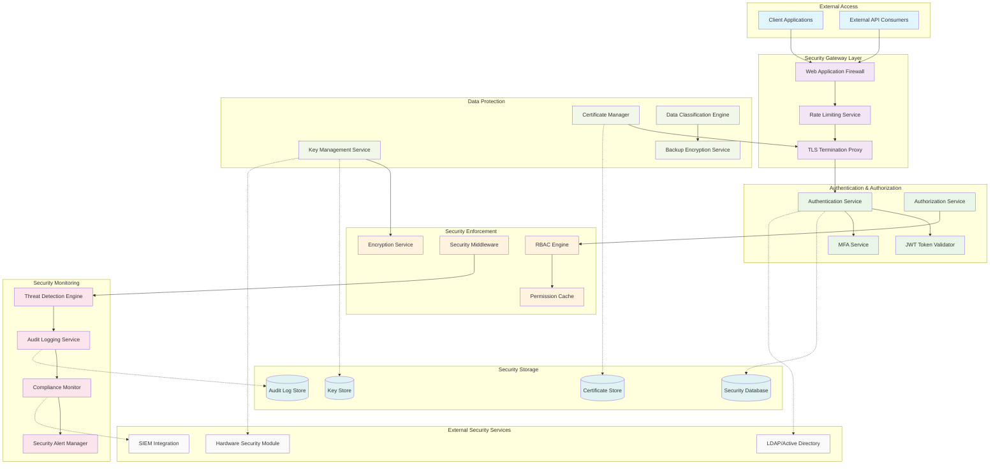
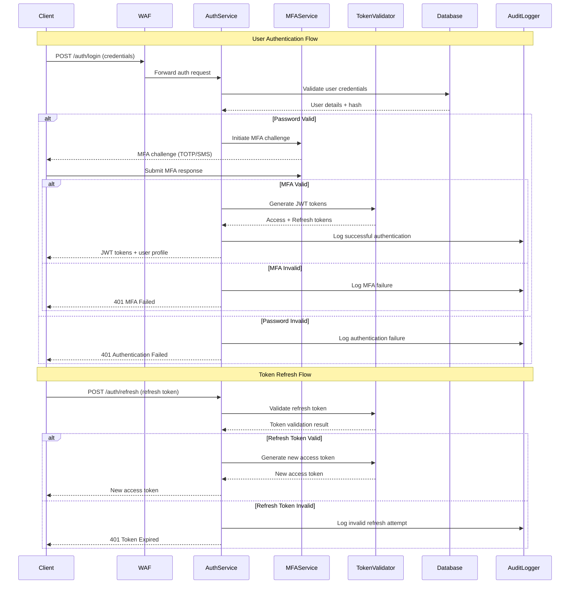
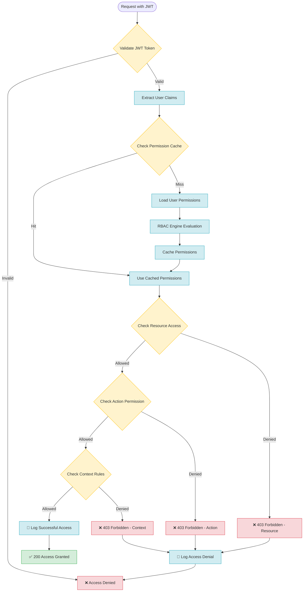

# Security Module - Phase 1 Architecture
## Comprehensive Authentication, Authorization, and Security Framework

---

## 🎯 Module Overview

### **Security Module Purpose**
The Security Module serves as the foundational security layer for the Video Analytics Platform, providing comprehensive authentication, authorization, encryption, and security monitoring capabilities. This module ensures platform-wide security compliance and protects against unauthorized access and data breaches.

### **Core Security Responsibilities**
- **Authentication Management**: JWT-based user authentication with secure token lifecycle
- **Authorization Framework**: Role-Based Access Control (RBAC) with granular permissions
- **Data Encryption**: End-to-end encryption for data at rest and in transit
- **Security Monitoring**: Real-time threat detection and security event logging
- **Compliance Framework**: GDPR, SOC2, and industry standard compliance support

### **Key Security Capabilities**
```yaml
SECURITY_CAPABILITIES:
  Authentication:
    - JWT token generation and validation (RS256)
    - Multi-factor authentication (MFA) support
    - Session management with secure refresh tokens
    - Password policy enforcement with complexity requirements

  Authorization:
    - Role-Based Access Control (RBAC) matrix
    - Resource-level permission granularity
    - Dynamic permission evaluation
    - Privilege escalation prevention

  Encryption:
    - TLS 1.3 for data in transit
    - AES-256-GCM for data at rest
    - Key management with rotation policies
    - Certificate lifecycle management

  Security_Monitoring:
    - Real-time threat detection algorithms
    - Security event correlation and alerting
    - Audit trail generation and retention
    - Compliance reporting automation
```

---

## 🏗️ Security Architecture

### **High-Level Security Architecture**


### **Authentication Flow Sequence**


### **Authorization Decision Flow**


---

## 🔐 Authentication Implementation

### **JWT Token Management**
```go
// JWT Token Service Implementation
package security

import (
    "crypto/rsa"
    "time"
    "github.com/golang-jwt/jwt/v5"
    "github.com/google/uuid"
)

type TokenService struct {
    privateKey    *rsa.PrivateKey
    publicKey     *rsa.PublicKey
    issuer        string
    accessTTL     time.Duration
    refreshTTL    time.Duration
    redis         *redis.Client
}

type TokenClaims struct {
    UserID      uuid.UUID `json:"user_id"`
    Username    string    `json:"username"`
    Email       string    `json:"email"`
    Roles       []string  `json:"roles"`
    Permissions []string  `json:"permissions"`
    SessionID   string    `json:"session_id"`
    jwt.RegisteredClaims
}

type TokenPair struct {
    AccessToken  string    `json:"access_token"`
    RefreshToken string    `json:"refresh_token"`
    ExpiresAt    time.Time `json:"expires_at"`
    TokenType    string    `json:"token_type"`
}

// GenerateTokenPair creates access and refresh token pair
func (ts *TokenService) GenerateTokenPair(user *User) (*TokenPair, error) {
    sessionID := uuid.New().String()
    now := time.Now()

    // Access Token Claims
    accessClaims := &TokenClaims{
        UserID:      user.ID,
        Username:    user.Username,
        Email:       user.Email,
        Roles:       user.GetRoles(),
        Permissions: user.GetPermissions(),
        SessionID:   sessionID,
        RegisteredClaims: jwt.RegisteredClaims{
            Issuer:    ts.issuer,
            Subject:   user.ID.String(),
            Audience:  jwt.ClaimStrings{"video-analytics-platform"},
            ExpiresAt: jwt.NewNumericDate(now.Add(ts.accessTTL)),
            IssuedAt:  jwt.NewNumericDate(now),
            NotBefore: jwt.NewNumericDate(now),
            ID:        uuid.New().String(),
        },
    }

    // Generate Access Token
    accessToken := jwt.NewWithClaims(jwt.SigningMethodRS256, accessClaims)
    accessTokenString, err := accessToken.SignedString(ts.privateKey)
    if err != nil {
        return nil, fmt.Errorf("failed to sign access token: %w", err)
    }

    // Refresh Token Claims (minimal payload)
    refreshClaims := &jwt.RegisteredClaims{
        Issuer:    ts.issuer,
        Subject:   user.ID.String(),
        Audience:  jwt.ClaimStrings{"video-analytics-platform"},
        ExpiresAt: jwt.NewNumericDate(now.Add(ts.refreshTTL)),
        IssuedAt:  jwt.NewNumericDate(now),
        NotBefore: jwt.NewNumericDate(now),
        ID:        sessionID,
    }

    // Generate Refresh Token
    refreshToken := jwt.NewWithClaims(jwt.SigningMethodRS256, refreshClaims)
    refreshTokenString, err := refreshToken.SignedString(ts.privateKey)
    if err != nil {
        return nil, fmt.Errorf("failed to sign refresh token: %w", err)
    }

    // Store session in Redis
    sessionData := map[string]interface{}{
        "user_id":    user.ID.String(),
        "username":   user.Username,
        "created_at": now.Unix(),
        "last_used":  now.Unix(),
        "user_agent": "", // Set from request context
        "ip_address": "", // Set from request context
    }

    err = ts.redis.HMSet(ctx, fmt.Sprintf("session:%s", sessionID), sessionData).Err()
    if err != nil {
        return nil, fmt.Errorf("failed to store session: %w", err)
    }

    // Set session expiration
    ts.redis.Expire(ctx, fmt.Sprintf("session:%s", sessionID), ts.refreshTTL)

    return &TokenPair{
        AccessToken:  accessTokenString,
        RefreshToken: refreshTokenString,
        ExpiresAt:    now.Add(ts.accessTTL),
        TokenType:    "Bearer",
    }, nil
}

// ValidateToken validates and parses JWT token
func (ts *TokenService) ValidateToken(tokenString string) (*TokenClaims, error) {
    token, err := jwt.ParseWithClaims(tokenString, &TokenClaims{}, func(token *jwt.Token) (interface{}, error) {
        if _, ok := token.Method.(*jwt.SigningMethodRSA); !ok {
            return nil, fmt.Errorf("unexpected signing method: %v", token.Header["alg"])
        }
        return ts.publicKey, nil
    })

    if err != nil {
        return nil, fmt.Errorf("failed to parse token: %w", err)
    }

    if claims, ok := token.Claims.(*TokenClaims); ok && token.Valid {
        // Verify session exists in Redis
        exists := ts.redis.Exists(ctx, fmt.Sprintf("session:%s", claims.SessionID)).Val()
        if exists == 0 {
            return nil, fmt.Errorf("session not found or expired")
        }

        // Update last used timestamp
        ts.redis.HSet(ctx, fmt.Sprintf("session:%s", claims.SessionID), "last_used", time.Now().Unix())

        return claims, nil
    }

    return nil, fmt.Errorf("invalid token claims")
}

// RefreshToken generates new access token from refresh token
func (ts *TokenService) RefreshToken(refreshTokenString string) (*TokenPair, error) {
    token, err := jwt.ParseWithClaims(refreshTokenString, &jwt.RegisteredClaims{}, func(token *jwt.Token) (interface{}, error) {
        return ts.publicKey, nil
    })

    if err != nil || !token.Valid {
        return nil, fmt.Errorf("invalid refresh token")
    }

    claims := token.Claims.(*jwt.RegisteredClaims)

    // Verify session exists
    sessionData := ts.redis.HGetAll(ctx, fmt.Sprintf("session:%s", claims.ID)).Val()
    if len(sessionData) == 0 {
        return nil, fmt.Errorf("session not found")
    }

    // Load user and generate new token pair
    userID, _ := uuid.Parse(claims.Subject)
    user, err := ts.userService.GetUserByID(userID)
    if err != nil {
        return nil, fmt.Errorf("user not found: %w", err)
    }

    return ts.GenerateTokenPair(user)
}

// RevokeSession invalidates user session
func (ts *TokenService) RevokeSession(sessionID string) error {
    return ts.redis.Del(ctx, fmt.Sprintf("session:%s", sessionID)).Err()
}
```

### **Multi-Factor Authentication Service**
```go
// MFA Service Implementation
package security

import (
    "crypto/rand"
    "encoding/base32"
    "fmt"
    "time"
    "github.com/pquerna/otp/totp"
    "github.com/twilio/twilio-go"
)

type MFAService struct {
    totpIssuer    string
    smsService    *twilio.RestClient
    redis         *redis.Client
    codeExpiry    time.Duration
}

type MFASetupResponse struct {
    Secret    string `json:"secret"`
    QRCodeURL string `json:"qr_code_url"`
    BackupCodes []string `json:"backup_codes"`
}

type MFAMethod string

const (
    MFAMethodTOTP   MFAMethod = "totp"
    MFAMethodSMS    MFAMethod = "sms"
    MFAMethodEmail  MFAMethod = "email"
    MFAMethodBackup MFAMethod = "backup"
)

// SetupTOTP generates TOTP secret and QR code for user
func (mfa *MFAService) SetupTOTP(userID uuid.UUID, email string) (*MFASetupResponse, error) {
    key, err := totp.Generate(totp.GenerateOpts{
        Issuer:      mfa.totpIssuer,
        AccountName: email,
        SecretSize:  32,
    })
    if err != nil {
        return nil, fmt.Errorf("failed to generate TOTP key: %w", err)
    }

    // Generate backup codes
    backupCodes := make([]string, 10)
    for i := range backupCodes {
        code := make([]byte, 5)
        rand.Read(code)
        backupCodes[i] = base32.StdEncoding.EncodeToString(code)[:8]
    }

    return &MFASetupResponse{
        Secret:      key.Secret(),
        QRCodeURL:   key.URL(),
        BackupCodes: backupCodes,
    }, nil
}

// SendSMSCode sends MFA code via SMS
func (mfa *MFAService) SendSMSCode(userID uuid.UUID, phoneNumber string) error {
    // Generate 6-digit code
    code := fmt.Sprintf("%06d", rand.Intn(1000000))

    // Store code in Redis with expiration
    codeKey := fmt.Sprintf("mfa:sms:%s", userID.String())
    err := mfa.redis.Set(ctx, codeKey, code, mfa.codeExpiry).Err()
    if err != nil {
        return fmt.Errorf("failed to store SMS code: %w", err)
    }

    // Send SMS via Twilio
    message := fmt.Sprintf("Your Video Analytics Platform verification code is: %s", code)
    _, err = mfa.smsService.Api.CreateMessage(&api.CreateMessageParams{
        From: &mfa.twilioPhoneNumber,
        To:   &phoneNumber,
        Body: &message,
    })

    if err != nil {
        return fmt.Errorf("failed to send SMS: %w", err)
    }

    return nil
}

// VerifyMFA validates MFA code based on method
func (mfa *MFAService) VerifyMFA(userID uuid.UUID, method MFAMethod, code string, secret string) error {
    switch method {
    case MFAMethodTOTP:
        return mfa.verifyTOTP(secret, code)
    case MFAMethodSMS:
        return mfa.verifySMS(userID, code)
    case MFAMethodBackup:
        return mfa.verifyBackupCode(userID, code)
    default:
        return fmt.Errorf("unsupported MFA method: %s", method)
    }
}

// verifyTOTP validates TOTP code
func (mfa *MFAService) verifyTOTP(secret, code string) error {
    valid := totp.Validate(code, secret)
    if !valid {
        return fmt.Errorf("invalid TOTP code")
    }
    return nil
}

// verifySMS validates SMS code
func (mfa *MFAService) verifySMS(userID uuid.UUID, code string) error {
    codeKey := fmt.Sprintf("mfa:sms:%s", userID.String())
    storedCode := mfa.redis.Get(ctx, codeKey).Val()

    if storedCode == "" {
        return fmt.Errorf("SMS code expired or not found")
    }

    if storedCode != code {
        return fmt.Errorf("invalid SMS code")
    }

    // Delete used code
    mfa.redis.Del(ctx, codeKey)
    return nil
}

// verifyBackupCode validates backup recovery code
func (mfa *MFAService) verifyBackupCode(userID uuid.UUID, code string) error {
    // Check if backup code exists and mark as used
    backupKey := fmt.Sprintf("mfa:backup:%s:%s", userID.String(), code)
    exists := mfa.redis.Exists(ctx, backupKey).Val()

    if exists == 0 {
        return fmt.Errorf("invalid or already used backup code")
    }

    // Mark backup code as used
    mfa.redis.Del(ctx, backupKey)
    return nil
}
```

---

## 🛡️ Authorization Framework

### **RBAC Permission Matrix**
```go
// RBAC Implementation
package security

type Permission string
type Role string
type Resource string
type Action string

const (
    // System Roles
    RoleAdmin       Role = "admin"
    RoleOperator    Role = "operator"
    RoleAnalyst     Role = "analyst"
    RoleViewer      Role = "viewer"
    RoleAPIClient   Role = "api_client"

    // System Resources
    ResourceStreams     Resource = "streams"
    ResourceCameras     Resource = "cameras"
    ResourceAlerts      Resource = "alerts"
    ResourceUsers       Resource = "users"
    ResourceSettings    Resource = "settings"
    ResourceDashboard   Resource = "dashboard"
    ResourceReports     Resource = "reports"
    ResourceSystem      Resource = "system"

    // System Actions
    ActionCreate Action = "create"
    ActionRead   Action = "read"
    ActionUpdate Action = "update"
    ActionDelete Action = "delete"
    ActionExecute Action = "execute"
    ActionManage Action = "manage"
)

type RBACEngine struct {
    permissions map[Role]map[Resource][]Action
    redis       *redis.Client
    cacheTTL    time.Duration
}

// InitializeRBAC sets up default permission matrix
func (rbac *RBACEngine) InitializeRBAC() {
    rbac.permissions = map[Role]map[Resource][]Action{
        RoleAdmin: {
            ResourceStreams:   {ActionCreate, ActionRead, ActionUpdate, ActionDelete, ActionManage},
            ResourceCameras:   {ActionCreate, ActionRead, ActionUpdate, ActionDelete, ActionManage},
            ResourceAlerts:    {ActionCreate, ActionRead, ActionUpdate, ActionDelete, ActionManage},
            ResourceUsers:     {ActionCreate, ActionRead, ActionUpdate, ActionDelete, ActionManage},
            ResourceSettings:  {ActionCreate, ActionRead, ActionUpdate, ActionDelete, ActionManage},
            ResourceDashboard: {ActionRead, ActionManage},
            ResourceReports:   {ActionCreate, ActionRead, ActionUpdate, ActionDelete},
            ResourceSystem:    {ActionRead, ActionUpdate, ActionExecute, ActionManage},
        },
        RoleOperator: {
            ResourceStreams:   {ActionCreate, ActionRead, ActionUpdate, ActionDelete},
            ResourceCameras:   {ActionCreate, ActionRead, ActionUpdate, ActionDelete},
            ResourceAlerts:    {ActionRead, ActionUpdate, ActionDelete},
            ResourceUsers:     {ActionRead},
            ResourceSettings:  {ActionRead, ActionUpdate},
            ResourceDashboard: {ActionRead},
            ResourceReports:   {ActionCreate, ActionRead},
            ResourceSystem:    {ActionRead},
        },
        RoleAnalyst: {
            ResourceStreams:   {ActionRead},
            ResourceCameras:   {ActionRead},
            ResourceAlerts:    {ActionRead, ActionUpdate},
            ResourceUsers:     {ActionRead},
            ResourceSettings:  {ActionRead},
            ResourceDashboard: {ActionRead},
            ResourceReports:   {ActionCreate, ActionRead, ActionUpdate, ActionDelete},
            ResourceSystem:    {ActionRead},
        },
        RoleViewer: {
            ResourceStreams:   {ActionRead},
            ResourceCameras:   {ActionRead},
            ResourceAlerts:    {ActionRead},
            ResourceUsers:     {},
            ResourceSettings:  {},
            ResourceDashboard: {ActionRead},
            ResourceReports:   {ActionRead},
            ResourceSystem:    {},
        },
        RoleAPIClient: {
            ResourceStreams:   {ActionRead},
            ResourceCameras:   {ActionRead},
            ResourceAlerts:    {ActionCreate, ActionRead},
            ResourceUsers:     {},
            ResourceSettings:  {},
            ResourceDashboard: {},
            ResourceReports:   {ActionRead},
            ResourceSystem:    {},
        },
    }
}

// CheckPermission validates user permission for resource and action
func (rbac *RBACEngine) CheckPermission(userRoles []Role, resource Resource, action Action, context map[string]interface{}) (bool, error) {
    // Check cache first
    cacheKey := fmt.Sprintf("perm:%s:%s:%s", strings.Join(roleStrings(userRoles), ","), resource, action)
    cached := rbac.redis.Get(ctx, cacheKey).Val()
    if cached != "" {
        return cached == "allowed", nil
    }

    // Evaluate permissions
    allowed := false
    for _, role := range userRoles {
        if resourceActions, exists := rbac.permissions[role]; exists {
            if actions, resourceExists := resourceActions[resource]; resourceExists {
                for _, allowedAction := range actions {
                    if allowedAction == action {
                        allowed = true
                        break
                    }
                }
            }
        }
        if allowed {
            break
        }
    }

    // Apply context-based rules
    if allowed && context != nil {
        allowed = rbac.evaluateContextRules(userRoles, resource, action, context)
    }

    // Cache result
    cacheValue := "denied"
    if allowed {
        cacheValue = "allowed"
    }
    rbac.redis.Set(ctx, cacheKey, cacheValue, rbac.cacheTTL)

    return allowed, nil
}

// evaluateContextRules applies context-specific permission rules
func (rbac *RBACEngine) evaluateContextRules(roles []Role, resource Resource, action Action, context map[string]interface{}) bool {
    switch resource {
    case ResourceStreams:
        return rbac.evaluateStreamPermission(roles, action, context)
    case ResourceUsers:
        return rbac.evaluateUserPermission(roles, action, context)
    case ResourceAlerts:
        return rbac.evaluateAlertPermission(roles, action, context)
    default:
        return true // No additional context rules
    }
}

// evaluateStreamPermission applies stream-specific context rules
func (rbac *RBACEngine) evaluateStreamPermission(roles []Role, action Action, context map[string]interface{}) bool {
    // Check if user owns the stream or has elevated privileges
    if streamOwnerID, exists := context["owner_id"]; exists {
        if userID, userExists := context["user_id"]; userExists {
            if streamOwnerID == userID {
                return true // Owner can perform any action
            }
        }
    }

    // Check organization-level permissions
    if streamOrgID, exists := context["organization_id"]; exists {
        if userOrgID, userExists := context["user_organization_id"]; userExists {
            if streamOrgID != userOrgID {
                return false // Cross-organization access denied
            }
        }
    }

    return true
}

// Security Middleware for HTTP requests
func (rbac *RBACEngine) SecurityMiddleware() gin.HandlerFunc {
    return gin.HandlerFunc(func(c *gin.Context) {
        // Extract JWT token
        authHeader := c.GetHeader("Authorization")
        if authHeader == "" {
            c.JSON(401, gin.H{"error": "Authorization header required"})
            c.Abort()
            return
        }

        tokenString := strings.TrimPrefix(authHeader, "Bearer ")
        claims, err := rbac.tokenService.ValidateToken(tokenString)
        if err != nil {
            c.JSON(401, gin.H{"error": "Invalid token"})
            c.Abort()
            return
        }

        // Store user claims in context
        c.Set("user_id", claims.UserID)
        c.Set("username", claims.Username)
        c.Set("roles", claims.Roles)
        c.Set("permissions", claims.Permissions)
        c.Set("session_id", claims.SessionID)

        c.Next()
    })
}

// Permission enforcement decorator
func (rbac *RBACEngine) RequirePermission(resource Resource, action Action) gin.HandlerFunc {
    return gin.HandlerFunc(func(c *gin.Context) {
        userRoles, exists := c.Get("roles")
        if !exists {
            c.JSON(403, gin.H{"error": "User roles not found"})
            c.Abort()
            return
        }

        roles := convertToRoles(userRoles.([]string))

        // Build context from request
        context := map[string]interface{}{
            "user_id":    c.GetString("user_id"),
            "request_ip": c.ClientIP(),
            "user_agent": c.GetHeader("User-Agent"),
        }

        // Add resource-specific context
        if resourceID := c.Param("id"); resourceID != "" {
            context["resource_id"] = resourceID
        }

        allowed, err := rbac.CheckPermission(roles, resource, action, context)
        if err != nil {
            c.JSON(500, gin.H{"error": "Permission check failed"})
            c.Abort()
            return
        }

        if !allowed {
            c.JSON(403, gin.H{"error": "Insufficient permissions"})
            c.Abort()
            return
        }

        c.Next()
    })
}
```

---

## 🔒 Encryption & Data Protection

### **Encryption Service Implementation**
```go
// Encryption Service
package security

import (
    "crypto/aes"
    "crypto/cipher"
    "crypto/rand"
    "crypto/rsa"
    "crypto/sha256"
    "encoding/base64"
    "fmt"
)

type EncryptionService struct {
    aesKey      []byte
    rsaKeyPair  *rsa.PrivateKey
    gcm         cipher.AEAD
    keyRotation *KeyRotationService
}

type EncryptedData struct {
    Data      string `json:"data"`
    Nonce     string `json:"nonce"`
    KeyID     string `json:"key_id"`
    Algorithm string `json:"algorithm"`
}

// NewEncryptionService creates encryption service with AES-256-GCM
func NewEncryptionService(masterKey []byte) (*EncryptionService, error) {
    // Derive 32-byte key for AES-256
    hash := sha256.Sum256(masterKey)
    aesKey := hash[:]

    block, err := aes.NewCipher(aesKey)
    if err != nil {
        return nil, fmt.Errorf("failed to create AES cipher: %w", err)
    }

    gcm, err := cipher.NewGCM(block)
    if err != nil {
        return nil, fmt.Errorf("failed to create GCM: %w", err)
    }

    // Generate RSA key pair for hybrid encryption
    rsaKey, err := rsa.GenerateKey(rand.Reader, 2048)
    if err != nil {
        return nil, fmt.Errorf("failed to generate RSA key: %w", err)
    }

    return &EncryptionService{
        aesKey:     aesKey,
        rsaKeyPair: rsaKey,
        gcm:        gcm,
    }, nil
}

// EncryptAES encrypts data using AES-256-GCM
func (es *EncryptionService) EncryptAES(plaintext []byte) (*EncryptedData, error) {
    // Generate random nonce
    nonce := make([]byte, es.gcm.NonceSize())
    if _, err := rand.Read(nonce); err != nil {
        return nil, fmt.Errorf("failed to generate nonce: %w", err)
    }

    // Encrypt data
    ciphertext := es.gcm.Seal(nil, nonce, plaintext, nil)

    return &EncryptedData{
        Data:      base64.StdEncoding.EncodeToString(ciphertext),
        Nonce:     base64.StdEncoding.EncodeToString(nonce),
        KeyID:     es.getCurrentKeyID(),
        Algorithm: "AES-256-GCM",
    }, nil
}

// DecryptAES decrypts AES-256-GCM encrypted data
func (es *EncryptionService) DecryptAES(encrypted *EncryptedData) ([]byte, error) {
    ciphertext, err := base64.StdEncoding.DecodeString(encrypted.Data)
    if err != nil {
        return nil, fmt.Errorf("failed to decode ciphertext: %w", err)
    }

    nonce, err := base64.StdEncoding.DecodeString(encrypted.Nonce)
    if err != nil {
        return nil, fmt.Errorf("failed to decode nonce: %w", err)
    }

    // Use appropriate key based on KeyID
    gcm := es.getGCMForKey(encrypted.KeyID)

    plaintext, err := gcm.Open(nil, nonce, ciphertext, nil)
    if err != nil {
        return nil, fmt.Errorf("failed to decrypt data: %w", err)
    }

    return plaintext, nil
}

// EncryptHybrid uses RSA + AES for large data encryption
func (es *EncryptionService) EncryptHybrid(plaintext []byte) (*HybridEncryptedData, error) {
    // Generate random AES key for this encryption
    sessionKey := make([]byte, 32)
    if _, err := rand.Read(sessionKey); err != nil {
        return nil, fmt.Errorf("failed to generate session key: %w", err)
    }

    // Encrypt data with AES session key
    encryptedData, err := es.encryptWithSessionKey(plaintext, sessionKey)
    if err != nil {
        return nil, fmt.Errorf("AES encryption failed: %w", err)
    }

    // Encrypt session key with RSA public key
    encryptedKey, err := rsa.EncryptOAEP(sha256.New(), rand.Reader, &es.rsaKeyPair.PublicKey, sessionKey, nil)
    if err != nil {
        return nil, fmt.Errorf("RSA encryption failed: %w", err)
    }

    return &HybridEncryptedData{
        EncryptedData: *encryptedData,
        EncryptedKey:  base64.StdEncoding.EncodeToString(encryptedKey),
        Algorithm:     "RSA-OAEP + AES-256-GCM",
    }, nil
}

// Database Field Encryption for sensitive data
func (es *EncryptionService) EncryptField(fieldValue string) (string, error) {
    if fieldValue == "" {
        return "", nil
    }

    encrypted, err := es.EncryptAES([]byte(fieldValue))
    if err != nil {
        return "", err
    }

    // Store as JSON for database
    jsonData, _ := json.Marshal(encrypted)
    return string(jsonData), nil
}

// DecryptField decrypts database field
func (es *EncryptionService) DecryptField(encryptedField string) (string, error) {
    if encryptedField == "" {
        return "", nil
    }

    var encrypted EncryptedData
    if err := json.Unmarshal([]byte(encryptedField), &encrypted); err != nil {
        return "", fmt.Errorf("failed to parse encrypted field: %w", err)
    }

    decrypted, err := es.DecryptAES(&encrypted)
    if err != nil {
        return "", err
    }

    return string(decrypted), nil
}
```

### **Key Management Service**
```go
// Key Management Service
package security

import (
    "crypto/rand"
    "crypto/x509"
    "encoding/pem"
    "time"
)

type KeyManagementService struct {
    hsm           HSMClient
    keyStore      KeyStore
    rotationTimer *time.Timer
    rotationPolicy *KeyRotationPolicy
}

type KeyRotationPolicy struct {
    RotationInterval  time.Duration
    MaxKeyAge         time.Duration
    GracePeriod       time.Duration
    BackupRetention   time.Duration
}

type ManagedKey struct {
    ID          string    `json:"id"`
    Type        string    `json:"type"`
    Algorithm   string    `json:"algorithm"`
    Purpose     string    `json:"purpose"`
    CreatedAt   time.Time `json:"created_at"`
    ExpiresAt   time.Time `json:"expires_at"`
    Status      string    `json:"status"`
    Version     int       `json:"version"`
}

// InitializeKeyManagement sets up key rotation and management
func (kms *KeyManagementService) InitializeKeyManagement() error {
    // Load existing keys
    if err := kms.loadExistingKeys(); err != nil {
        return fmt.Errorf("failed to load existing keys: %w", err)
    }

    // Start key rotation timer
    kms.startKeyRotation()

    // Initialize master keys if not exists
    if err := kms.ensureMasterKeysExist(); err != nil {
        return fmt.Errorf("failed to ensure master keys: %w", err)
    }

    return nil
}

// GenerateEncryptionKey creates new encryption key
func (kms *KeyManagementService) GenerateEncryptionKey(purpose string) (*ManagedKey, error) {
    keyID := uuid.New().String()

    // Generate 256-bit key
    keyData := make([]byte, 32)
    if _, err := rand.Read(keyData); err != nil {
        return nil, fmt.Errorf("failed to generate key data: %w", err)
    }

    key := &ManagedKey{
        ID:        keyID,
        Type:      "symmetric",
        Algorithm: "AES-256",
        Purpose:   purpose,
        CreatedAt: time.Now(),
        ExpiresAt: time.Now().Add(kms.rotationPolicy.MaxKeyAge),
        Status:    "active",
        Version:   1,
    }

    // Store in HSM if available, otherwise in secure key store
    if kms.hsm != nil {
        err := kms.hsm.StoreKey(keyID, keyData, key)
        if err != nil {
            return nil, fmt.Errorf("failed to store key in HSM: %w", err)
        }
    } else {
        err := kms.keyStore.StoreKey(keyID, keyData, key)
        if err != nil {
            return nil, fmt.Errorf("failed to store key: %w", err)
        }
    }

    return key, nil
}

// RotateKey creates new version of existing key
func (kms *KeyManagementService) RotateKey(keyID string) (*ManagedKey, error) {
    // Get current key
    currentKey, err := kms.keyStore.GetKey(keyID)
    if err != nil {
        return nil, fmt.Errorf("failed to get current key: %w", err)
    }

    // Mark current key as deprecated
    currentKey.Status = "deprecated"
    kms.keyStore.UpdateKey(currentKey)

    // Generate new key version
    newKey := &ManagedKey{
        ID:        keyID,
        Type:      currentKey.Type,
        Algorithm: currentKey.Algorithm,
        Purpose:   currentKey.Purpose,
        CreatedAt: time.Now(),
        ExpiresAt: time.Now().Add(kms.rotationPolicy.MaxKeyAge),
        Status:    "active",
        Version:   currentKey.Version + 1,
    }

    // Generate new key data
    keyData := make([]byte, 32)
    rand.Read(keyData)

    // Store new key version
    err = kms.keyStore.StoreKey(fmt.Sprintf("%s_v%d", keyID, newKey.Version), keyData, newKey)
    if err != nil {
        return nil, fmt.Errorf("failed to store rotated key: %w", err)
    }

    // Schedule old key deletion after grace period
    go kms.scheduleKeyDeletion(currentKey, kms.rotationPolicy.GracePeriod)

    return newKey, nil
}

// startKeyRotation initiates automatic key rotation
func (kms *KeyManagementService) startKeyRotation() {
    kms.rotationTimer = time.NewTimer(kms.rotationPolicy.RotationInterval)

    go func() {
        for {
            select {
            case <-kms.rotationTimer.C:
                kms.performScheduledRotation()
                kms.rotationTimer.Reset(kms.rotationPolicy.RotationInterval)
            }
        }
    }()
}

// performScheduledRotation rotates keys due for rotation
func (kms *KeyManagementService) performScheduledRotation() {
    keys, err := kms.keyStore.GetKeysNeedingRotation(time.Now())
    if err != nil {
        log.Printf("Failed to get keys needing rotation: %v", err)
        return
    }

    for _, key := range keys {
        newKey, err := kms.RotateKey(key.ID)
        if err != nil {
            log.Printf("Failed to rotate key %s: %v", key.ID, err)
            continue
        }

        log.Printf("Successfully rotated key %s to version %d", key.ID, newKey.Version)
    }
}
```

---

## 🚨 Security Monitoring

### **Threat Detection Engine**
```go
// Threat Detection Service
package security

import (
    "context"
    "regexp"
    "time"
)

type ThreatDetectionEngine struct {
    rules         []DetectionRule
    alertManager  *AlertManager
    redis         *redis.Client
    rateLimiter   *RateLimiter
}

type ThreatLevel string

const (
    ThreatLevelLow      ThreatLevel = "low"
    ThreatLevelMedium   ThreatLevel = "medium"
    ThreatLevelHigh     ThreatLevel = "high"
    ThreatLevelCritical ThreatLevel = "critical"
)

type SecurityEvent struct {
    ID          string                 `json:"id"`
    Type        string                 `json:"type"`
    Timestamp   time.Time              `json:"timestamp"`
    UserID      string                 `json:"user_id,omitempty"`
    IPAddress   string                 `json:"ip_address"`
    UserAgent   string                 `json:"user_agent"`
    Endpoint    string                 `json:"endpoint,omitempty"`
    Method      string                 `json:"method,omitempty"`
    StatusCode  int                    `json:"status_code,omitempty"`
    ThreatLevel ThreatLevel           `json:"threat_level"`
    Metadata    map[string]interface{} `json:"metadata"`
}

type DetectionRule struct {
    ID          string      `json:"id"`
    Name        string      `json:"name"`
    Type        string      `json:"type"`
    Pattern     *regexp.Regexp `json:"-"`
    Threshold   int         `json:"threshold"`
    TimeWindow  time.Duration `json:"time_window"`
    ThreatLevel ThreatLevel `json:"threat_level"`
    Enabled     bool        `json:"enabled"`
    Actions     []string    `json:"actions"`
}

// InitializeThreatDetection sets up detection rules
func (tde *ThreatDetectionEngine) InitializeThreatDetection() error {
    tde.rules = []DetectionRule{
        {
            ID:          "brute_force_login",
            Name:        "Brute Force Login Attempts",
            Type:        "authentication",
            Threshold:   5,
            TimeWindow:  5 * time.Minute,
            ThreatLevel: ThreatLevelHigh,
            Enabled:     true,
            Actions:     []string{"block_ip", "alert", "log"},
        },
        {
            ID:          "sql_injection",
            Name:        "SQL Injection Attempt",
            Type:        "injection",
            Pattern:     regexp.MustCompile(`(?i)(union|select|insert|delete|update|drop|alter|exec|script).*[;\'"\\]`),
            ThreatLevel: ThreatLevelCritical,
            Enabled:     true,
            Actions:     []string{"block_request", "alert", "log"},
        },
        {
            ID:          "privilege_escalation",
            Name:        "Privilege Escalation Attempt",
            Type:        "authorization",
            Threshold:   3,
            TimeWindow:  1 * time.Minute,
            ThreatLevel: ThreatLevelHigh,
            Enabled:     true,
            Actions:     []string{"alert", "log", "review_required"},
        },
        {
            ID:          "unusual_api_usage",
            Name:        "Unusual API Usage Pattern",
            Type:        "behavioral",
            Threshold:   100,
            TimeWindow:  1 * time.Minute,
            ThreatLevel: ThreatLevelMedium,
            Enabled:     true,
            Actions:     []string{"rate_limit", "alert", "log"},
        },
        {
            ID:          "data_exfiltration",
            Name:        "Potential Data Exfiltration",
            Type:        "data_access",
            Threshold:   1000,
            TimeWindow:  5 * time.Minute,
            ThreatLevel: ThreatLevelCritical,
            Enabled:     true,
            Actions:     []string{"block_user", "alert", "log", "admin_notify"},
        },
    }

    return nil
}

// AnalyzeSecurityEvent processes security events for threats
func (tde *ThreatDetectionEngine) AnalyzeSecurityEvent(event *SecurityEvent) error {
    for _, rule := range tde.rules {
        if !rule.Enabled {
            continue
        }

        if tde.matchesRule(event, &rule) {
            threat := &DetectedThreat{
                ID:          uuid.New().String(),
                RuleID:      rule.ID,
                RuleName:    rule.Name,
                Event:       event,
                ThreatLevel: rule.ThreatLevel,
                DetectedAt:  time.Now(),
                Status:      "active",
            }

            err := tde.processThreat(threat, &rule)
            if err != nil {
                log.Printf("Failed to process threat %s: %v", threat.ID, err)
            }
        }
    }

    return nil
}

// matchesRule checks if event matches detection rule
func (tde *ThreatDetectionEngine) matchesRule(event *SecurityEvent, rule *DetectionRule) bool {
    switch rule.Type {
    case "authentication":
        return tde.checkAuthenticationRule(event, rule)
    case "injection":
        return tde.checkInjectionRule(event, rule)
    case "authorization":
        return tde.checkAuthorizationRule(event, rule)
    case "behavioral":
        return tde.checkBehavioralRule(event, rule)
    case "data_access":
        return tde.checkDataAccessRule(event, rule)
    default:
        return false
    }
}

// checkAuthenticationRule validates authentication-related threats
func (tde *ThreatDetectionEngine) checkAuthenticationRule(event *SecurityEvent, rule *DetectionRule) bool {
    if event.Type != "auth_failure" {
        return false
    }

    // Count failed attempts from IP in time window
    key := fmt.Sprintf("auth_failures:%s", event.IPAddress)
    count := tde.redis.Incr(context.Background(), key).Val()
    tde.redis.Expire(context.Background(), key, rule.TimeWindow)

    return int(count) >= rule.Threshold
}

// checkInjectionRule detects injection attacks
func (tde *ThreatDetectionEngine) checkInjectionRule(event *SecurityEvent, rule *DetectionRule) bool {
    if rule.Pattern == nil {
        return false
    }

    // Check various event fields for injection patterns
    checkFields := []string{
        event.Endpoint,
        event.UserAgent,
    }

    if metadata, ok := event.Metadata["request_body"].(string); ok {
        checkFields = append(checkFields, metadata)
    }

    if params, ok := event.Metadata["query_params"].(string); ok {
        checkFields = append(checkFields, params)
    }

    for _, field := range checkFields {
        if rule.Pattern.MatchString(field) {
            return true
        }
    }

    return false
}

// checkBehavioralRule analyzes behavioral patterns
func (tde *ThreatDetectionEngine) checkBehavioralRule(event *SecurityEvent, rule *DetectionRule) bool {
    if event.UserID == "" {
        return false
    }

    // Count API requests from user in time window
    key := fmt.Sprintf("api_requests:%s", event.UserID)
    count := tde.redis.Incr(context.Background(), key).Val()
    tde.redis.Expire(context.Background(), key, rule.TimeWindow)

    return int(count) >= rule.Threshold
}

// processThreat executes actions for detected threat
func (tde *ThreatDetectionEngine) processThreat(threat *DetectedThreat, rule *DetectionRule) error {
    for _, action := range rule.Actions {
        switch action {
        case "block_ip":
            err := tde.blockIPAddress(threat.Event.IPAddress, rule.TimeWindow)
            if err != nil {
                log.Printf("Failed to block IP %s: %v", threat.Event.IPAddress, err)
            }

        case "block_user":
            if threat.Event.UserID != "" {
                err := tde.blockUser(threat.Event.UserID, rule.TimeWindow)
                if err != nil {
                    log.Printf("Failed to block user %s: %v", threat.Event.UserID, err)
                }
            }

        case "rate_limit":
            err := tde.rateLimiter.ApplyRateLimit(threat.Event.IPAddress, rule.TimeWindow)
            if err != nil {
                log.Printf("Failed to apply rate limit: %v", err)
            }

        case "alert":
            alert := &SecurityAlert{
                ThreatID:    threat.ID,
                Level:       threat.ThreatLevel,
                Message:     fmt.Sprintf("Security threat detected: %s", rule.Name),
                Event:       threat.Event,
                CreatedAt:   time.Now(),
            }
            err := tde.alertManager.SendSecurityAlert(alert)
            if err != nil {
                log.Printf("Failed to send security alert: %v", err)
            }

        case "log":
            err := tde.logThreat(threat)
            if err != nil {
                log.Printf("Failed to log threat: %v", err)
            }
        }
    }

    return nil
}

// Security Event Middleware for HTTP requests
func (tde *ThreatDetectionEngine) SecurityEventMiddleware() gin.HandlerFunc {
    return gin.HandlerFunc(func(c *gin.Context) {
        startTime := time.Now()

        // Process request
        c.Next()

        // Create security event
        event := &SecurityEvent{
            ID:         uuid.New().String(),
            Type:       tde.determineEventType(c),
            Timestamp:  startTime,
            IPAddress:  c.ClientIP(),
            UserAgent:  c.GetHeader("User-Agent"),
            Endpoint:   c.Request.URL.Path,
            Method:     c.Request.Method,
            StatusCode: c.Writer.Status(),
            Metadata:   make(map[string]interface{}),
        }

        // Add user context if available
        if userID, exists := c.Get("user_id"); exists {
            event.UserID = userID.(string)
        }

        // Add request metadata
        if c.Request.Method == "POST" || c.Request.Method == "PUT" {
            if body, exists := c.Get("request_body"); exists {
                event.Metadata["request_body"] = body
            }
        }

        if c.Request.URL.RawQuery != "" {
            event.Metadata["query_params"] = c.Request.URL.RawQuery
        }

        // Analyze for threats
        go tde.AnalyzeSecurityEvent(event)
    })
}
```

---

## 📊 Security Configuration

### **Docker Security Configuration**
```yaml
# docker-compose.security.yml
version: '3.8'

services:
  security-service:
    build:
      context: ./security
      dockerfile: Dockerfile
      args:
        - GO_VERSION=1.21
    container_name: security-service
    restart: unless-stopped

    environment:
      # JWT Configuration
      - JWT_PRIVATE_KEY_PATH=/etc/security/jwt-private.pem
      - JWT_PUBLIC_KEY_PATH=/etc/security/jwt-public.pem
      - JWT_ISSUER=video-analytics-platform
      - JWT_ACCESS_TTL=15m
      - JWT_REFRESH_TTL=7d

      # Encryption Configuration
      - ENCRYPTION_MASTER_KEY_PATH=/etc/security/master.key
      - KEY_ROTATION_INTERVAL=30d
      - KEY_GRACE_PERIOD=7d

      # MFA Configuration
      - MFA_TOTP_ISSUER=Video Analytics Platform
      - MFA_SMS_PROVIDER=twilio
      - MFA_CODE_EXPIRY=5m

      # Security Monitoring
      - THREAT_DETECTION_ENABLED=true
      - AUDIT_LOG_RETENTION=90d
      - SECURITY_ALERT_WEBHOOK=${SECURITY_WEBHOOK_URL}

      # Database Configuration
      - DB_HOST=postgres
      - DB_PORT=5432
      - DB_NAME=video_analytics
      - DB_USER=security_user
      - DB_PASSWORD=${SECURITY_DB_PASSWORD}
      - DB_SSL_MODE=require

      # Redis Configuration
      - REDIS_HOST=redis
      - REDIS_PORT=6379
      - REDIS_PASSWORD=${REDIS_PASSWORD}
      - REDIS_DB=1

      # External Integrations
      - LDAP_URL=${LDAP_URL}
      - LDAP_BIND_DN=${LDAP_BIND_DN}
      - LDAP_BIND_PASSWORD=${LDAP_BIND_PASSWORD}
      - HSM_ENDPOINT=${HSM_ENDPOINT}
      - SIEM_ENDPOINT=${SIEM_ENDPOINT}

    volumes:
      - ./security/keys:/etc/security:ro
      - security-logs:/var/log/security
      - ./security/config:/etc/security-config:ro

    ports:
      - "8443:8443"  # HTTPS Security API

    networks:
      - security-network
      - app-network

    depends_on:
      - postgres
      - redis

    healthcheck:
      test: ["CMD", "curl", "-f", "https://localhost:8443/health"]
      interval: 30s
      timeout: 10s
      retries: 3
      start_period: 40s

    security_opt:
      - no-new-privileges:true

    read_only: true

    tmpfs:
      - /tmp:noexec,nosuid,size=100m

    ulimits:
      nproc: 65535
      nofile:
        soft: 65535
        hard: 65535

  # WAF Service (Web Application Firewall)
  waf:
    image: nginx:1.24-alpine
    container_name: security-waf
    restart: unless-stopped

    volumes:
      - ./security/nginx/nginx.conf:/etc/nginx/nginx.conf:ro
      - ./security/nginx/modsec:/etc/nginx/modsec:ro
      - ./security/ssl:/etc/ssl/certs:ro
      - waf-logs:/var/log/nginx

    ports:
      - "443:443"
      - "80:80"

    networks:
      - security-network

    depends_on:
      - security-service

    environment:
      - NGINX_WORKER_PROCESSES=auto
      - NGINX_WORKER_CONNECTIONS=1024

    healthcheck:
      test: ["CMD", "curl", "-f", "http://localhost/health"]
      interval: 30s
      timeout: 5s
      retries: 3

volumes:
  security-logs:
    driver: local
  waf-logs:
    driver: local

networks:
  security-network:
    driver: bridge
    ipam:
      config:
        - subnet: 172.20.0.0/16
  app-network:
    external: true
```

### **Nginx WAF Configuration**
```nginx
# security/nginx/nginx.conf
user nginx;
worker_processes auto;
error_log /var/log/nginx/error.log warn;
pid /var/run/nginx.pid;

# Load ModSecurity module
load_module modules/ngx_http_modsecurity_module.so;

events {
    worker_connections 1024;
    use epoll;
    multi_accept on;
}

http {
    include /etc/nginx/mime.types;
    default_type application/octet-stream;

    # Security Headers
    add_header X-Frame-Options "SAMEORIGIN" always;
    add_header X-Content-Type-Options "nosniff" always;
    add_header X-XSS-Protection "1; mode=block" always;
    add_header Referrer-Policy "strict-origin-when-cross-origin" always;
    add_header Content-Security-Policy "default-src 'self'; script-src 'self' 'unsafe-inline'; style-src 'self' 'unsafe-inline'; img-src 'self' data: https:; font-src 'self'; connect-src 'self' wss:; frame-ancestors 'none';" always;
    add_header Strict-Transport-Security "max-age=31536000; includeSubDomains; preload" always;

    # Hide server information
    server_tokens off;

    # Rate limiting zones
    limit_req_zone $binary_remote_addr zone=login:10m rate=5r/m;
    limit_req_zone $binary_remote_addr zone=api:10m rate=100r/m;
    limit_req_zone $binary_remote_addr zone=general:10m rate=10r/s;

    # Connection limiting
    limit_conn_zone $binary_remote_addr zone=perip:10m;
    limit_conn_zone $server_name zone=perserver:10m;

    # ModSecurity Configuration
    modsecurity on;
    modsecurity_rules_file /etc/nginx/modsec/main.conf;

    # Logging
    log_format security_log '$remote_addr - $remote_user [$time_local] '
                           '"$request" $status $body_bytes_sent '
                           '"$http_referer" "$http_user_agent" '
                           '$request_time $upstream_response_time '
                           '$modsec_transaction_id';

    access_log /var/log/nginx/access.log security_log;

    # SSL Configuration
    ssl_protocols TLSv1.2 TLSv1.3;
    ssl_ciphers ECDHE-RSA-AES256-GCM-SHA512:DHE-RSA-AES256-GCM-SHA512:ECDHE-RSA-AES256-GCM-SHA384:DHE-RSA-AES256-GCM-SHA384;
    ssl_prefer_server_ciphers off;
    ssl_session_cache shared:SSL:10m;
    ssl_session_timeout 1d;
    ssl_session_tickets off;

    # OCSP stapling
    ssl_stapling on;
    ssl_stapling_verify on;

    upstream security_backend {
        server security-service:8443;
        keepalive 32;
    }

    upstream api_backend {
        server api-gateway:8080;
        keepalive 32;
    }

    # HTTP to HTTPS redirect
    server {
        listen 80;
        server_name _;
        return 301 https://$host$request_uri;
    }

    # Main HTTPS server
    server {
        listen 443 ssl http2;
        server_name video-analytics.local;

        ssl_certificate /etc/ssl/certs/server.crt;
        ssl_certificate_key /etc/ssl/certs/server.key;

        # Connection limits
        limit_conn perip 10;
        limit_conn perserver 100;

        # Health check endpoint (no rate limiting)
        location /health {
            access_log off;
            return 200 "healthy\n";
            add_header Content-Type text/plain;
        }

        # Authentication endpoints
        location /auth/ {
            limit_req zone=login burst=10 nodelay;

            proxy_pass https://security_backend;
            proxy_ssl_verify off;
            proxy_set_header Host $host;
            proxy_set_header X-Real-IP $remote_addr;
            proxy_set_header X-Forwarded-For $proxy_add_x_forwarded_for;
            proxy_set_header X-Forwarded-Proto $scheme;

            # Additional security for auth endpoints
            client_max_body_size 1m;
            proxy_connect_timeout 5s;
            proxy_send_timeout 5s;
            proxy_read_timeout 5s;
        }

        # API endpoints
        location /api/ {
            limit_req zone=api burst=200 nodelay;

            proxy_pass http://api_backend;
            proxy_set_header Host $host;
            proxy_set_header X-Real-IP $remote_addr;
            proxy_set_header X-Forwarded-For $proxy_add_x_forwarded_for;
            proxy_set_header X-Forwarded-Proto $scheme;

            # WebSocket support
            proxy_http_version 1.1;
            proxy_set_header Upgrade $http_upgrade;
            proxy_set_header Connection "upgrade";

            client_max_body_size 10m;
            proxy_connect_timeout 10s;
            proxy_send_timeout 10s;
            proxy_read_timeout 30s;
        }

        # Static files and dashboard
        location / {
            limit_req zone=general burst=20 nodelay;

            proxy_pass http://api_backend;
            proxy_set_header Host $host;
            proxy_set_header X-Real-IP $remote_addr;
            proxy_set_header X-Forwarded-For $proxy_add_x_forwarded_for;
            proxy_set_header X-Forwarded-Proto $scheme;

            # Cache static files
            location ~* \.(js|css|png|jpg|jpeg|gif|ico|svg|woff|woff2|ttf|eot)$ {
                expires 1y;
                add_header Cache-Control "public, immutable";
            }
        }

        # Block access to sensitive files
        location ~ /\. {
            deny all;
            access_log off;
            log_not_found off;
        }

        location ~ \.(env|config|key|pem|p12)$ {
            deny all;
            access_log off;
            log_not_found off;
        }
    }
}
```

---

## 📈 Performance & Monitoring

### **Security Performance Targets**
```yaml
SECURITY_PERFORMANCE_TARGETS:
  Authentication:
    jwt_generation: "< 10ms"
    jwt_validation: "< 5ms"
    mfa_verification: "< 100ms"
    session_lookup: "< 2ms"

  Authorization:
    permission_check: "< 5ms"
    rbac_evaluation: "< 10ms"
    cache_hit_ratio: "> 95%"
    cache_response: "< 1ms"

  Encryption:
    aes_encryption: "< 1ms per KB"
    aes_decryption: "< 1ms per KB"
    rsa_encryption: "< 10ms per operation"
    key_derivation: "< 50ms"

  Threat_Detection:
    event_processing: "< 5ms"
    rule_evaluation: "< 10ms per rule"
    alert_generation: "< 100ms"
    false_positive_rate: "< 5%"

  Scalability:
    concurrent_authentications: "1000/second"
    concurrent_authorizations: "5000/second"
    active_sessions: "10000+"
    threat_events_processed: "10000/second"
```

### **Security Monitoring Configuration**
```yaml
# monitoring/security-monitoring.yml
version: '3.8'

services:
  security-exporter:
    build: ./monitoring/security-exporter
    container_name: security-exporter
    restart: unless-stopped

    environment:
      - SECURITY_SERVICE_URL=https://security-service:8443
      - METRICS_PORT=9090
      - SCRAPE_INTERVAL=15s

    ports:
      - "9090:9090"

    networks:
      - monitoring-network
      - security-network

  prometheus:
    image: prom/prometheus:v2.45.0
    container_name: security-prometheus
    restart: unless-stopped

    volumes:
      - ./monitoring/prometheus/prometheus.yml:/etc/prometheus/prometheus.yml:ro
      - ./monitoring/prometheus/rules:/etc/prometheus/rules:ro
      - prometheus-data:/prometheus

    command:
      - '--config.file=/etc/prometheus/prometheus.yml'
      - '--storage.tsdb.path=/prometheus'
      - '--web.console.libraries=/etc/prometheus/console_libraries'
      - '--web.console.templates=/etc/prometheus/consoles'
      - '--storage.tsdb.retention.time=30d'
      - '--web.enable-lifecycle'

    ports:
      - "9091:9090"

    networks:
      - monitoring-network

  grafana:
    image: grafana/grafana:10.0.0
    container_name: security-grafana
    restart: unless-stopped

    environment:
      - GF_SECURITY_ADMIN_PASSWORD=${GRAFANA_ADMIN_PASSWORD}
      - GF_SECURITY_SECRET_KEY=${GRAFANA_SECRET_KEY}
      - GF_USERS_ALLOW_SIGN_UP=false
      - GF_SECURITY_COOKIE_SECURE=true
      - GF_SECURITY_STRICT_TRANSPORT_SECURITY=true

    volumes:
      - ./monitoring/grafana/provisioning:/etc/grafana/provisioning:ro
      - ./monitoring/grafana/dashboards:/var/lib/grafana/dashboards:ro
      - grafana-data:/var/lib/grafana

    ports:
      - "3001:3000"

    networks:
      - monitoring-network

    depends_on:
      - prometheus

volumes:
  prometheus-data:
  grafana-data:

networks:
  monitoring-network:
    driver: bridge
  security-network:
    external: true
```

---

## 🚀 Deployment Instructions

### **Security Service Deployment**
```bash
#!/bin/bash
# deploy-security.sh

set -e

echo "🔐 Deploying Security Module..."

# Create directories
mkdir -p security/keys security/config security/logs

# Generate JWT key pair
echo "📝 Generating JWT key pair..."
openssl genrsa -out security/keys/jwt-private.pem 2048
openssl rsa -in security/keys/jwt-private.pem -pubout -out security/keys/jwt-public.pem

# Generate encryption master key
echo "🔑 Generating encryption master key..."
openssl rand -hex 32 > security/keys/master.key

# Set proper permissions
chmod 600 security/keys/*
chmod 700 security/keys

# Generate SSL certificates for internal communication
echo "🔒 Generating SSL certificates..."
openssl req -x509 -newkey rsa:2048 -keyout security/keys/server.key \
    -out security/keys/server.crt -days 365 -nodes \
    -subj "/C=US/ST=State/L=City/O=Organization/CN=security-service"

# Create security configuration
cat > security/config/security.yml << EOF
security:
  jwt:
    private_key_path: "/etc/security/jwt-private.pem"
    public_key_path: "/etc/security/jwt-public.pem"
    issuer: "video-analytics-platform"
    access_ttl: "15m"
    refresh_ttl: "7d"

  encryption:
    master_key_path: "/etc/security/master.key"
    algorithm: "AES-256-GCM"
    key_rotation_interval: "30d"

  mfa:
    totp_issuer: "Video Analytics Platform"
    sms_provider: "twilio"
    code_expiry: "5m"

  monitoring:
    threat_detection: true
    audit_retention: "90d"
    metrics_enabled: true

  rate_limiting:
    login_attempts: "5/5m"
    api_requests: "100/1m"
    general_requests: "10/1s"
EOF

# Build and deploy security service
echo "🏗️ Building security service..."
docker-compose -f docker-compose.security.yml build security-service

echo "🚀 Starting security services..."
docker-compose -f docker-compose.security.yml up -d

# Wait for services to be ready
echo "⏳ Waiting for security services to be ready..."
sleep 30

# Run health checks
echo "🏥 Running health checks..."
for service in security-service waf; do
    if docker-compose -f docker-compose.security.yml ps | grep -q "$service.*Up"; then
        echo "✅ $service is running"
    else
        echo "❌ $service failed to start"
        exit 1
    fi
done

# Initialize default security settings
echo "⚙️ Initializing security settings..."
curl -X POST https://localhost:8443/admin/init \
    -H "Content-Type: application/json" \
    -d '{
        "admin_username": "admin",
        "admin_email": "admin@example.com",
        "admin_password": "'${ADMIN_PASSWORD}'",
        "organization": "Default Organization"
    }' \
    --insecure

echo "🔐 Security Module deployment completed successfully!"
echo ""
echo "📊 Security Dashboard: https://localhost:3001"
echo "🔑 Admin Username: admin"
echo "📧 Admin Email: admin@example.com"
echo ""
echo "⚠️  Important: Change default admin password after first login"
echo "📝 Security logs: ./security/logs/"
echo "🔧 Configuration: ./security/config/"
```

### **Security Testing Suite**
```bash
#!/bin/bash
# test-security.sh

set -e

echo "🧪 Running Security Module tests..."

# Test authentication
echo "🔐 Testing authentication..."
response=$(curl -X POST https://localhost:8443/auth/login \
    -H "Content-Type: application/json" \
    -d '{
        "username": "admin",
        "password": "'${ADMIN_PASSWORD}'"
    }' \
    --insecure -s)

if echo "$response" | grep -q "access_token"; then
    echo "✅ Authentication test passed"
    access_token=$(echo "$response" | jq -r '.access_token')
else
    echo "❌ Authentication test failed"
    exit 1
fi

# Test authorization
echo "🛡️ Testing authorization..."
auth_response=$(curl -X GET https://localhost:8443/api/users \
    -H "Authorization: Bearer $access_token" \
    --insecure -s -w "%{http_code}")

if [[ "${auth_response: -3}" == "200" ]]; then
    echo "✅ Authorization test passed"
else
    echo "❌ Authorization test failed"
    exit 1
fi

# Test rate limiting
echo "⏱️ Testing rate limiting..."
for i in {1..10}; do
    curl -X POST https://localhost:8443/auth/login \
        -H "Content-Type: application/json" \
        -d '{"username": "invalid", "password": "invalid"}' \
        --insecure -s -o /dev/null &
done
wait

rate_limit_response=$(curl -X POST https://localhost:8443/auth/login \
    -H "Content-Type: application/json" \
    -d '{"username": "invalid", "password": "invalid"}' \
    --insecure -s -w "%{http_code}")

if [[ "${rate_limit_response: -3}" == "429" ]]; then
    echo "✅ Rate limiting test passed"
else
    echo "❌ Rate limiting test failed"
    exit 1
fi

# Test SQL injection protection
echo "🛡️ Testing SQL injection protection..."
injection_response=$(curl -X GET "https://localhost:8443/api/users?id=1'; DROP TABLE users; --" \
    -H "Authorization: Bearer $access_token" \
    --insecure -s -w "%{http_code}")

if [[ "${injection_response: -3}" == "403" ]]; then
    echo "✅ SQL injection protection test passed"
else
    echo "❌ SQL injection protection test failed"
    exit 1
fi

echo "🎉 All security tests passed!"
```

---

## 🔧 Troubleshooting Guide

### **Common Security Issues**
```bash
# Security Diagnostic Commands

# Check JWT key permissions
ls -la security/keys/
# Expected: -rw------- (600) for all key files

# Verify JWT token generation
curl -X POST https://localhost:8443/auth/test-token \
    -H "Content-Type: application/json" \
    --insecure

# Check RBAC permissions
curl -X GET https://localhost:8443/admin/permissions \
    -H "Authorization: Bearer $TOKEN" \
    --insecure

# Monitor threat detection
tail -f security/logs/threats.log

# Check rate limiting status
redis-cli -h localhost -p 6379 keys "rate_limit:*"

# View authentication failures
grep "auth_failure" security/logs/security.log | tail -20

# Check encryption service health
curl -X GET https://localhost:8443/health/encryption \
    --insecure

# Monitor session activity
redis-cli -h localhost -p 6379 keys "session:*" | wc -l

# Check WAF logs
tail -f security/logs/waf.log

# Test MFA functionality
curl -X POST https://localhost:8443/auth/mfa/setup \
    -H "Authorization: Bearer $TOKEN" \
    -H "Content-Type: application/json" \
    --insecure

# Verify SSL/TLS configuration
openssl s_client -connect localhost:8443 -verify_return_error
```

### **Security Performance Optimization**
```bash
# Optimize Redis for session storage
redis-cli CONFIG SET maxmemory 1gb
redis-cli CONFIG SET maxmemory-policy allkeys-lru

# Monitor security service performance
docker stats security-service

# Check JWT validation performance
curl -X GET https://localhost:8443/metrics/auth \
    --insecure | grep jwt_validation_duration

# Optimize encryption cache
curl -X POST https://localhost:8443/admin/cache/optimize \
    -H "Authorization: Bearer $TOKEN" \
    --insecure

# Monitor threat detection performance
curl -X GET https://localhost:8443/metrics/threats \
    --insecure
```

---

## 📋 Phase 2 Migration Readiness

### **Enterprise Security Enhancements**
```yaml
PHASE_2_SECURITY_ROADMAP:
  Advanced_Authentication:
    - SAML 2.0 SSO integration
    - OAuth 2.0/OpenID Connect provider
    - Certificate-based authentication
    - Biometric authentication support

  Enhanced_Authorization:
    - Attribute-Based Access Control (ABAC)
    - Policy-as-Code implementation
    - Dynamic permission evaluation
    - Conditional access policies

  Advanced_Encryption:
    - Hardware Security Module (HSM) integration
    - Field-level encryption with searchable encryption
    - Homomorphic encryption for privacy-preserving analytics
    - Quantum-resistant algorithms preparation

  Security_Intelligence:
    - Machine learning-based threat detection
    - User behavior analytics (UBA)
    - Security orchestration and automated response (SOAR)
    - Integration with external threat intelligence feeds

  Compliance_Framework:
    - SOC 2 Type II compliance
    - ISO 27001 certification support
    - GDPR data protection compliance
    - Industry-specific compliance (HIPAA, PCI-DSS)
```

---

**Document Status**: Production Ready
**Security Level**: Critical Infrastructure
**Next Phase**: Advanced Enterprise Security (Phase 2)
**Review Schedule**: Weekly security architecture reviews