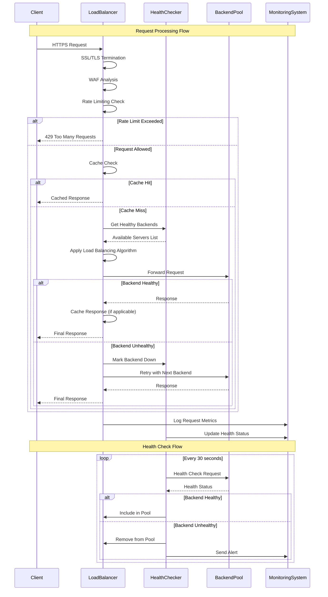
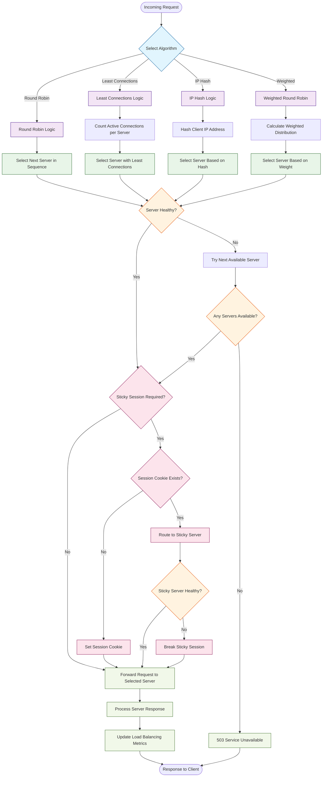

# Load Balancer Module - Phase 1 Architecture
## High-Availability Traffic Management and Distribution Framework

---

## 🎯 Module Overview

### **Load Balancer Module Purpose**
The Load Balancer Module serves as the critical traffic management and distribution layer for the Video Analytics Platform, providing high-availability, performance optimization, and intelligent request routing across all platform services. This module ensures optimal resource utilization, fault tolerance, and scalable traffic handling.

### **Core Load Balancing Responsibilities**
- **Traffic Distribution**: Intelligent load distribution across multiple backend instances
- **High Availability**: Automatic failover and health monitoring for zero-downtime operations
- **SSL/TLS Termination**: Centralized certificate management and secure connection handling
- **Performance Optimization**: Content caching, compression, and connection optimization
- **Security Integration**: Web Application Firewall (WAF) and DDoS protection

### **Key Load Balancing Capabilities**
```yaml
LOAD_BALANCER_CAPABILITIES:
  Traffic_Management:
    - Layer 4 and Layer 7 load balancing
    - Multiple distribution algorithms (round-robin, least-conn, ip-hash)
    - Session persistence and sticky sessions
    - Dynamic upstream server management

  High_Availability:
    - Active health checks with automatic failover
    - Backup server pools and graceful degradation
    - Zero-downtime configuration reloads
    - Multi-zone deployment support

  Performance_Optimization:
    - Content caching and static file optimization
    - HTTP/2 and HTTP/3 support
    - Connection pooling and keep-alive optimization
    - Compression and bandwidth optimization

  Security_Features:
    - SSL/TLS termination with modern cipher suites
    - Rate limiting and DDoS protection
    - IP allowlisting and geolocation filtering
    - Request filtering and malicious traffic blocking

  Monitoring_Integration:
    - Real-time traffic metrics and analytics
    - Performance monitoring and alerting
    - Health status dashboards
    - Access logging and audit trails
```

---

## 🏗️ Load Balancer Architecture

### **High-Level Load Balancer Architecture**

```mermaid
graph TB
    %% External Traffic Sources
    subgraph "External Traffic"
        USERS[End Users]
        API_CLIENTS[API Clients]
        MOBILE_APPS[Mobile Applications]
        EXTERNAL_SYSTEMS[External Systems]
    end

    %% Load Balancer Layer
    subgraph "Load Balancer Layer"
        LB_PRIMARY[Primary Load Balancer<br/>NGINX Plus]
        LB_BACKUP[Backup Load Balancer<br/>NGINX Plus]
        KEEPALIVED[KeepAlived<br/>VIP Management]
    end

    %% SSL/TLS Management
    subgraph "SSL/TLS Layer"
        SSL_TERMINATION[SSL/TLS Termination]
        CERT_MANAGER[Certificate Manager]
        ACME_CLIENT[ACME Client<br/>Let's Encrypt]
    end

    %% Traffic Processing
    subgraph "Traffic Processing"
        WAF[Web Application Firewall]
        RATE_LIMITER[Rate Limiting Engine]
        CACHE_ENGINE[Content Cache Engine]
        COMPRESSION[Compression Engine]
    end

    %% Backend Service Pools
    subgraph "API Gateway Pool"
        API_GW_1[API Gateway 1]
        API_GW_2[API Gateway 2]
        API_GW_3[API Gateway 3]
    end

    subgraph "Frontend Pool"
        FRONTEND_1[Frontend Server 1]
        FRONTEND_2[Frontend Server 2]
    end

    subgraph "Video Processing Pool"
        VIDEO_PROC_1[Video Processor 1]
        VIDEO_PROC_2[Video Processor 2]
        VIDEO_PROC_3[Video Processor 3]
    end

    subgraph "Security Service Pool"
        SECURITY_1[Security Service 1]
        SECURITY_2[Security Service 2]
    end

    %% Health Monitoring
    subgraph "Health Monitoring"
        HEALTH_CHECKER[Health Check Engine]
        METRICS_COLLECTOR[Metrics Collector]
        ALERT_MANAGER[Alert Manager]
    end

    %% Monitoring & Logging
    subgraph "Monitoring & Logging"
        PROMETHEUS[Prometheus Metrics]
        GRAFANA[Grafana Dashboard]
        LOG_AGGREGATOR[Log Aggregator]
        ACCESS_LOGS[Access Logs]
    end

    %% Traffic Flow Connections
    USERS --> LB_PRIMARY
    API_CLIENTS --> LB_PRIMARY
    MOBILE_APPS --> LB_PRIMARY
    EXTERNAL_SYSTEMS --> LB_PRIMARY

    LB_PRIMARY <--> KEEPALIVED
    LB_BACKUP <--> KEEPALIVED
    KEEPALIVED -.-> LB_BACKUP

    LB_PRIMARY --> SSL_TERMINATION
    SSL_TERMINATION --> WAF
    WAF --> RATE_LIMITER
    RATE_LIMITER --> CACHE_ENGINE
    CACHE_ENGINE --> COMPRESSION

    CERT_MANAGER --> SSL_TERMINATION
    ACME_CLIENT --> CERT_MANAGER

    %% Service Distribution
    COMPRESSION --> API_GW_1
    COMPRESSION --> API_GW_2
    COMPRESSION --> API_GW_3

    COMPRESSION --> FRONTEND_1
    COMPRESSION --> FRONTEND_2

    COMPRESSION --> VIDEO_PROC_1
    COMPRESSION --> VIDEO_PROC_2
    COMPRESSION --> VIDEO_PROC_3

    COMPRESSION --> SECURITY_1
    COMPRESSION --> SECURITY_2

    %% Health Monitoring Connections
    HEALTH_CHECKER -.-> API_GW_1
    HEALTH_CHECKER -.-> API_GW_2
    HEALTH_CHECKER -.-> API_GW_3
    HEALTH_CHECKER -.-> FRONTEND_1
    HEALTH_CHECKER -.-> FRONTEND_2
    HEALTH_CHECKER -.-> VIDEO_PROC_1
    HEALTH_CHECKER -.-> VIDEO_PROC_2
    HEALTH_CHECKER -.-> VIDEO_PROC_3
    HEALTH_CHECKER -.-> SECURITY_1
    HEALTH_CHECKER -.-> SECURITY_2

    %% Monitoring Data Flow
    LB_PRIMARY --> METRICS_COLLECTOR
    HEALTH_CHECKER --> METRICS_COLLECTOR
    METRICS_COLLECTOR --> PROMETHEUS
    PROMETHEUS --> GRAFANA
    METRICS_COLLECTOR --> ALERT_MANAGER

    LB_PRIMARY --> ACCESS_LOGS
    ACCESS_LOGS --> LOG_AGGREGATOR

    %% Styling
    classDef external fill:#e1f5fe
    classDef loadbalancer fill:#f3e5f5
    classDef ssl fill:#e8f5e8
    classDef processing fill:#fff3e0
    classDef backend fill:#fce4ec
    classDef monitoring fill:#f1f8e9
    classDef logging fill:#e0f2f1

    class USERS,API_CLIENTS,MOBILE_APPS,EXTERNAL_SYSTEMS external
    class LB_PRIMARY,LB_BACKUP,KEEPALIVED loadbalancer
    class SSL_TERMINATION,CERT_MANAGER,ACME_CLIENT ssl
    class WAF,RATE_LIMITER,CACHE_ENGINE,COMPRESSION processing
    class API_GW_1,API_GW_2,API_GW_3,FRONTEND_1,FRONTEND_2,VIDEO_PROC_1,VIDEO_PROC_2,VIDEO_PROC_3,SECURITY_1,SECURITY_2 backend
    class HEALTH_CHECKER,METRICS_COLLECTOR,ALERT_MANAGER monitoring
    class PROMETHEUS,GRAFANA,LOG_AGGREGATOR,ACCESS_LOGS logging
```


### **Traffic Flow and Load Distribution**


### **Load Balancing Algorithms Flow**


---

## ⚖️ Load Balancing Implementation

### **NGINX Plus Configuration**
```nginx
# /etc/nginx/nginx.conf - Main Configuration
user nginx;
worker_processes auto;
worker_cpu_affinity auto;
worker_rlimit_nofile 65535;

error_log /var/log/nginx/error.log warn;
pid /var/run/nginx.pid;

# Load dynamic modules
load_module modules/ngx_http_js_module.so;
load_module modules/ngx_stream_module.so;

events {
    worker_connections 4096;
    use epoll;
    multi_accept on;
    accept_mutex off;
}

http {
    include /etc/nginx/mime.types;
    default_type application/octet-stream;

    # Logging Configuration
    log_format main_ext '$remote_addr - $remote_user [$time_local] '
                        '"$request" $status $body_bytes_sent '
                        '"$http_referer" "$http_user_agent" '
                        '"$http_x_forwarded_for" '
                        'rt=$request_time uct="$upstream_connect_time" '
                        'uht="$upstream_header_time" urt="$upstream_response_time" '
                        'upstream="$upstream_addr" '
                        'cs=$upstream_cache_status';

    access_log /var/log/nginx/access.log main_ext;

    # Performance Optimizations
    sendfile on;
    tcp_nopush on;
    tcp_nodelay on;
    keepalive_timeout 65;
    keepalive_requests 1000;
    types_hash_max_size 2048;
    server_tokens off;

    # Gzip Compression
    gzip on;
    gzip_vary on;
    gzip_min_length 1024;
    gzip_comp_level 6;
    gzip_types
        application/atom+xml
        application/geo+json
        application/javascript
        application/x-javascript
        application/json
        application/ld+json
        application/manifest+json
        application/rdf+xml
        application/rss+xml
        application/xhtml+xml
        application/xml
        font/eot
        font/otf
        font/ttf
        image/svg+xml
        text/css
        text/javascript
        text/plain
        text/xml;

    # Rate Limiting Zones
    limit_req_zone $binary_remote_addr zone=api:10m rate=100r/m;
    limit_req_zone $binary_remote_addr zone=auth:10m rate=10r/m;
    limit_req_zone $binary_remote_addr zone=upload:10m rate=5r/m;
    limit_req_zone $binary_remote_addr zone=general:10m rate=30r/m;

    # Connection Limiting
    limit_conn_zone $binary_remote_addr zone=perip:10m;
    limit_conn_zone $server_name zone=perserver:10m;

    # SSL Configuration
    ssl_protocols TLSv1.2 TLSv1.3;
    ssl_ciphers ECDHE-ECDSA-AES128-GCM-SHA256:ECDHE-RSA-AES128-GCM-SHA256:ECDHE-ECDSA-AES256-GCM-SHA384:ECDHE-RSA-AES256-GCM-SHA384:ECDHE-ECDSA-CHACHA20-POLY1305:ECDHE-RSA-CHACHA20-POLY1305:DHE-RSA-AES128-GCM-SHA256:DHE-RSA-AES256-GCM-SHA384;
    ssl_prefer_server_ciphers off;
    ssl_session_cache shared:SSL:50m;
    ssl_session_timeout 1d;
    ssl_session_tickets off;

    # OCSP Stapling
    ssl_stapling on;
    ssl_stapling_verify on;
    resolver 8.8.8.8 8.8.4.4 valid=300s;
    resolver_timeout 5s;

    # Security Headers Template
    add_header X-Frame-Options "SAMEORIGIN" always;
    add_header X-Content-Type-Options "nosniff" always;
    add_header X-XSS-Protection "1; mode=block" always;
    add_header Referrer-Policy "strict-origin-when-cross-origin" always;
    add_header Strict-Transport-Security "max-age=31536000; includeSubDomains; preload" always;

    # Cache Configuration
    proxy_cache_path /var/cache/nginx/static levels=1:2 keys_zone=static_cache:10m
                     max_size=1g inactive=60m use_temp_path=off;
    proxy_cache_path /var/cache/nginx/api levels=1:2 keys_zone=api_cache:10m
                     max_size=500m inactive=10m use_temp_path=off;

    # Upstream Definitions
    include /etc/nginx/conf.d/upstreams/*.conf;

    # Server Configurations
    include /etc/nginx/conf.d/servers/*.conf;

    # Status and Monitoring
    include /etc/nginx/conf.d/monitoring.conf;
}

# Stream Configuration for Layer 4 Load Balancing
stream {
    # TCP/UDP Load Balancing
    include /etc/nginx/stream.d/*.conf;
}
```

### **Upstream Server Pool Configuration**
```nginx
# /etc/nginx/conf.d/upstreams/api-gateway.conf
upstream api_gateway_pool {
    # Load balancing method
    least_conn;

    # Backend servers with weights and parameters
    server api-gateway-1:8080 weight=3 max_fails=3 fail_timeout=30s slow_start=30s;
    server api-gateway-2:8080 weight=3 max_fails=3 fail_timeout=30s slow_start=30s;
    server api-gateway-3:8080 weight=2 max_fails=3 fail_timeout=30s slow_start=30s;

    # Backup server
    server api-gateway-backup:8080 backup;

    # Connection pooling
    keepalive 32;
    keepalive_requests 1000;
    keepalive_timeout 60s;

    # Health check configuration (NGINX Plus)
    zone api_gateway_zone 64k;

    # Session persistence using consistent hashing
    hash $remote_addr consistent;
}

# /etc/nginx/conf.d/upstreams/video-processing.conf
upstream video_processing_pool {
    # IP hash for session affinity on video streams
    ip_hash;

    # Video processing servers with higher timeout values
    server video-proc-1:8081 weight=5 max_fails=2 fail_timeout=60s;
    server video-proc-2:8081 weight=5 max_fails=2 fail_timeout=60s;
    server video-proc-3:8081 weight=3 max_fails=2 fail_timeout=60s;

    # Backup processing server
    server video-proc-backup:8081 backup;

    # Longer keepalive for video processing
    keepalive 16;
    keepalive_requests 100;
    keepalive_timeout 300s;

    zone video_processing_zone 64k;
}

# /etc/nginx/conf.d/upstreams/frontend.conf
upstream frontend_pool {
    # Round robin for frontend servers
    server frontend-1:3000 weight=1 max_fails=3 fail_timeout=30s;
    server frontend-2:3000 weight=1 max_fails=3 fail_timeout=30s;

    # Connection settings optimized for frontend
    keepalive 64;
    keepalive_requests 1000;
    keepalive_timeout 60s;

    zone frontend_zone 64k;
}

# /etc/nginx/conf.d/upstreams/security.conf
upstream security_pool {
    # Least connections for security services
    least_conn;

    server security-1:8443 weight=1 max_fails=2 fail_timeout=15s;
    server security-2:8443 weight=1 max_fails=2 fail_timeout=15s;

    # Security service specific settings
    keepalive 16;
    keepalive_requests 500;
    keepalive_timeout 30s;

    zone security_zone 64k;
}
```

### **Virtual Host Configuration**
```nginx
# /etc/nginx/conf.d/servers/main.conf
server {
    listen 80;
    server_name video-analytics.local *.video-analytics.local;

    # Redirect all HTTP to HTTPS
    return 301 https://$server_name$request_uri;
}

server {
    listen 443 ssl http2;
    server_name video-analytics.local;

    # SSL Certificate Configuration
    ssl_certificate /etc/ssl/certs/video-analytics.crt;
    ssl_certificate_key /etc/ssl/private/video-analytics.key;
    ssl_trusted_certificate /etc/ssl/certs/ca-chain.crt;

    # Connection limits
    limit_conn perip 20;
    limit_conn perserver 1000;

    # Custom error pages
    error_page 500 502 503 504 /50x.html;
    error_page 404 /404.html;

    # Health check endpoint (no rate limiting)
    location = /health {
        access_log off;
        return 200 "healthy\n";
        add_header Content-Type text/plain;
    }

    # API Gateway Routes
    location /api/ {
        # Rate limiting for API endpoints
        limit_req zone=api burst=50 nodelay;

        # Proxy configuration
        proxy_pass http://api_gateway_pool;
        proxy_set_header Host $host;
        proxy_set_header X-Real-IP $remote_addr;
        proxy_set_header X-Forwarded-For $proxy_add_x_forwarded_for;
        proxy_set_header X-Forwarded-Proto $scheme;
        proxy_set_header X-Forwarded-Host $server_name;

        # Timeout settings
        proxy_connect_timeout 5s;
        proxy_send_timeout 30s;
        proxy_read_timeout 30s;

        # Buffer settings
        proxy_buffering on;
        proxy_buffer_size 4k;
        proxy_buffers 8 4k;
        proxy_busy_buffers_size 8k;

        # WebSocket support
        proxy_http_version 1.1;
        proxy_set_header Upgrade $http_upgrade;
        proxy_set_header Connection "upgrade";

        # API response caching
        proxy_cache api_cache;
        proxy_cache_valid 200 5m;
        proxy_cache_valid 404 1m;
        proxy_cache_use_stale error timeout invalid_header updating;
        proxy_cache_background_update on;
        proxy_cache_lock on;

        # Cache bypass for dynamic content
        proxy_cache_bypass $http_pragma $http_authorization;
        proxy_no_cache $http_pragma $http_authorization;
    }

    # Authentication Routes
    location /auth/ {
        # Strict rate limiting for authentication
        limit_req zone=auth burst=5 nodelay;

        proxy_pass https://security_pool;
        proxy_ssl_verify off;
        proxy_set_header Host $host;
        proxy_set_header X-Real-IP $remote_addr;
        proxy_set_header X-Forwarded-For $proxy_add_x_forwarded_for;
        proxy_set_header X-Forwarded-Proto $scheme;

        # Shorter timeouts for auth
        proxy_connect_timeout 3s;
        proxy_send_timeout 10s;
        proxy_read_timeout 10s;

        # No caching for authentication
        proxy_cache off;
        add_header Cache-Control "no-cache, no-store, must-revalidate";
        add_header Pragma "no-cache";
        add_header Expires "0";
    }

    # Video Processing Routes
    location /video/ {
        # Rate limiting for video processing
        limit_req zone=upload burst=10 nodelay;

        proxy_pass http://video_processing_pool;
        proxy_set_header Host $host;
        proxy_set_header X-Real-IP $remote_addr;
        proxy_set_header X-Forwarded-For $proxy_add_x_forwarded_for;
        proxy_set_header X-Forwarded-Proto $scheme;

        # Extended timeouts for video processing
        proxy_connect_timeout 10s;
        proxy_send_timeout 300s;
        proxy_read_timeout 300s;

        # Large file upload support
        client_max_body_size 1G;
        client_body_timeout 300s;
        client_header_timeout 10s;

        # Disable buffering for large uploads
        proxy_request_buffering off;
        proxy_buffering off;
    }

    # Frontend Application
    location / {
        # General rate limiting
        limit_req zone=general burst=20 nodelay;

        proxy_pass http://frontend_pool;
        proxy_set_header Host $host;
        proxy_set_header X-Real-IP $remote_addr;
        proxy_set_header X-Forwarded-For $proxy_add_x_forwarded_for;
        proxy_set_header X-Forwarded-Proto $scheme;

        # Standard timeouts
        proxy_connect_timeout 5s;
        proxy_send_timeout 10s;
        proxy_read_timeout 10s;

        # Frontend caching
        proxy_cache static_cache;
        proxy_cache_valid 200 1h;
        proxy_cache_valid 404 1m;

        # Cache static assets aggressively
        location ~* \.(js|css|png|jpg|jpeg|gif|ico|svg|woff|woff2|ttf|eot)$ {
            proxy_pass http://frontend_pool;
            proxy_cache static_cache;
            proxy_cache_valid 200 24h;
            expires 1y;
            add_header Cache-Control "public, immutable";
            add_header X-Cache-Status $upstream_cache_status;
        }
    }

    # Deny access to sensitive files
    location ~ /\. {
        deny all;
        access_log off;
        log_not_found off;
    }

    location ~ \.(env|config|key|pem)$ {
        deny all;
        access_log off;
        log_not_found off;
    }
}
```

---

## 🔍 Health Monitoring & Failover

### **Health Check Configuration**
```nginx
# /etc/nginx/conf.d/health-checks.conf (NGINX Plus)

# API Gateway Health Checks
upstream api_gateway_pool {
    zone api_gateway 64k;

    server api-gateway-1:8080;
    server api-gateway-2:8080;
    server api-gateway-3:8080;
}

server {
    listen 8080;

    location /health/api-gateway {
        health_check interval=30s fails=3 passes=2 uri=/health;
        proxy_pass http://api_gateway_pool;
    }
}

# Video Processing Health Checks
upstream video_processing_pool {
    zone video_processing 64k;

    server video-proc-1:8081;
    server video-proc-2:8081;
    server video-proc-3:8081;
}

server {
    listen 8081;

    location /health/video-processing {
        health_check interval=60s fails=2 passes=2 uri=/health
                    match=video_processing_health;
        proxy_pass http://video_processing_pool;
    }
}

# Custom health check match conditions
match video_processing_health {
    status 200;
    header Content-Type = "application/json";
    body ~ "\"status\":\s*\"healthy\"";
    body ~ "\"gpu_available\":\s*true";
}

match api_gateway_health {
    status 200;
    header Content-Type = "application/json";
    body ~ "\"status\":\s*\"ok\"";
    body ~ "\"database\":\s*\"connected\"";
}
```

### **KeepAlived Configuration for High Availability**
```bash
# /etc/keepalived/keepalived.conf
! Configuration File for keepalived

global_defs {
    notification_email {
        admin@video-analytics.local
    }
    notification_email_from lb@video-analytics.local
    smtp_server localhost
    smtp_connect_timeout 30
    router_id LB_NGINX_PRIMARY
    vrrp_skip_check_adv_addr
    vrrp_strict
    vrrp_garp_interval 0
    vrrp_gna_interval 0
}

# NGINX Health Check Script
vrrp_script chk_nginx {
    script "/usr/local/bin/check_nginx.sh"
    interval 2
    weight -2
    fall 3
    rise 2
}

# Virtual IP Configuration
vrrp_instance VI_1 {
    state MASTER
    interface eth0
    virtual_router_id 51
    priority 110
    advert_int 1
    authentication {
        auth_type PASS
        auth_pass ${KEEPALIVED_PASSWORD}
    }
    virtual_ipaddress {
        192.168.1.100/24
    }
    track_script {
        chk_nginx
    }
    notify_master "/usr/local/bin/nginx_master.sh"
    notify_backup "/usr/local/bin/nginx_backup.sh"
    notify_fault "/usr/local/bin/nginx_fault.sh"
}
```

### **Health Check Scripts**
```bash
#!/bin/bash
# /usr/local/bin/check_nginx.sh - NGINX Health Check Script

set -e

# Check if NGINX is running
if ! pgrep nginx > /dev/null; then
    echo "NGINX process not found"
    exit 1
fi

# Check NGINX configuration
if ! nginx -t > /dev/null 2>&1; then
    echo "NGINX configuration test failed"
    exit 1
fi

# Check if NGINX is responding to health checks
health_check() {
    local url="$1"
    local expected_status="$2"

    response=$(curl -s -o /dev/null -w "%{http_code}" "$url" --max-time 5) || return 1

    if [ "$response" = "$expected_status" ]; then
        return 0
    else
        echo "Health check failed for $url (status: $response)"
        return 1
    fi
}

# Check local health endpoint
if ! health_check "http://localhost/health" "200"; then
    echo "Local health check failed"
    exit 1
fi

# Check upstream health (if available)
if command -v nginx-plus >/dev/null 2>&1; then
    # NGINX Plus - check upstream health
    upstream_status=$(curl -s "http://localhost:8080/status/upstreams" --max-time 5)

    if ! echo "$upstream_status" | grep -q '"state":"up"'; then
        echo "No healthy upstream servers found"
        exit 1
    fi
fi

echo "All health checks passed"
exit 0
```

```bash
#!/bin/bash
# /usr/local/bin/nginx_master.sh - Master Promotion Script

echo "$(date): Becoming MASTER - promoting to active load balancer" >> /var/log/keepalived.log

# Ensure NGINX is running with full configuration
systemctl reload nginx

# Update monitoring systems
curl -X POST "http://monitoring:9090/api/v1/alerts" \
    -H "Content-Type: application/json" \
    -d '{
        "alerts": [{
            "labels": {
                "alertname": "LoadBalancerFailover",
                "severity": "warning",
                "instance": "'$(hostname)'",
                "status": "master"
            },
            "annotations": {
                "summary": "Load balancer promoted to master",
                "description": "Load balancer '$(hostname)' has been promoted to master"
            }
        }]
    }' || true

# Send notification
echo "Load balancer $(hostname) promoted to MASTER at $(date)" | \
    mail -s "Load Balancer Failover - Master Promotion" admin@video-analytics.local || true
```

---

## 📊 Performance Optimization

### **Connection and Buffer Tuning**
```nginx
# /etc/nginx/conf.d/performance.conf

# Worker Process Optimization
worker_processes auto;
worker_cpu_affinity auto;
worker_rlimit_nofile 65535;

events {
    # Optimized for high-performance load balancing
    worker_connections 4096;
    use epoll;
    multi_accept on;
    accept_mutex off;
}

http {
    # Connection Optimization
    sendfile on;
    sendfile_max_chunk 1m;
    tcp_nopush on;
    tcp_nodelay on;

    # Keepalive Settings
    keepalive_timeout 65;
    keepalive_requests 1000;

    # Client Request Settings
    client_max_body_size 1G;
    client_body_buffer_size 1m;
    client_header_buffer_size 1k;
    large_client_header_buffers 4 8k;
    client_body_timeout 30s;
    client_header_timeout 10s;
    send_timeout 30s;

    # Proxy Buffer Configuration
    proxy_buffering on;
    proxy_buffer_size 8k;
    proxy_buffers 32 8k;
    proxy_busy_buffers_size 16k;
    proxy_temp_file_write_size 16k;

    # Proxy Timeout Configuration
    proxy_connect_timeout 5s;
    proxy_send_timeout 30s;
    proxy_read_timeout 30s;

    # Compression Optimization
    gzip on;
    gzip_vary on;
    gzip_min_length 1024;
    gzip_comp_level 6;
    gzip_proxied any;
    gzip_types
        application/atom+xml
        application/geo+json
        application/javascript
        application/json
        application/ld+json
        application/manifest+json
        application/rdf+xml
        application/rss+xml
        application/xhtml+xml
        application/xml
        font/eot
        font/otf
        font/ttf
        image/svg+xml
        text/css
        text/javascript
        text/plain
        text/xml;

    # Cache Configuration for Optimal Performance
    open_file_cache max=10000 inactive=60s;
    open_file_cache_valid 120s;
    open_file_cache_min_uses 2;
    open_file_cache_errors on;
}
```

### **Content Caching Strategy**
```nginx
# /etc/nginx/conf.d/caching.conf

# Cache Zones Configuration
proxy_cache_path /var/cache/nginx/api
                 levels=1:2
                 keys_zone=api_cache:50m
                 max_size=1g
                 inactive=60m
                 use_temp_path=off;

proxy_cache_path /var/cache/nginx/static
                 levels=1:2
                 keys_zone=static_cache:100m
                 max_size=5g
                 inactive=1d
                 use_temp_path=off;

proxy_cache_path /var/cache/nginx/video
                 levels=1:2
                 keys_zone=video_cache:200m
                 max_size=10g
                 inactive=2h
                 use_temp_path=off;

# Cache Key Configuration
map $request_method $cache_key {
    default $scheme$request_method$host$request_uri;
    POST    "";
    PUT     "";
    DELETE  "";
}

# Cache Bypass Rules
map $http_authorization $no_cache {
    default 0;
    ~.+     1;
}

map $request_uri $api_cache_bypass {
    default 0;
    ~*/auth/.*     1;
    ~*/admin/.*    1;
    ~*/upload/.*   1;
}

# Caching Rules per Content Type
server {
    # Static Content Caching
    location ~* \.(jpg|jpeg|png|gif|ico|css|js|pdf|txt|zip|tar|gz|woff|woff2|ttf|eot|svg)$ {
        proxy_pass http://frontend_pool;
        proxy_cache static_cache;
        proxy_cache_valid 200 1d;
        proxy_cache_valid 404 1h;
        proxy_cache_use_stale error timeout invalid_header updating;
        proxy_cache_background_update on;
        proxy_cache_lock on;

        expires 1y;
        add_header Cache-Control "public, immutable";
        add_header X-Cache-Status $upstream_cache_status;
    }

    # API Response Caching
    location /api/public/ {
        proxy_pass http://api_gateway_pool;
        proxy_cache api_cache;
        proxy_cache_key $cache_key;
        proxy_cache_valid 200 5m;
        proxy_cache_valid 404 1m;
        proxy_cache_bypass $no_cache $api_cache_bypass;
        proxy_no_cache $no_cache $api_cache_bypass;
        proxy_cache_use_stale error timeout invalid_header updating;
        proxy_cache_background_update on;
        proxy_cache_lock on;

        add_header X-Cache-Status $upstream_cache_status;
    }

    # Video Thumbnail Caching
    location /api/video/thumbnails/ {
        proxy_pass http://video_processing_pool;
        proxy_cache video_cache;
        proxy_cache_valid 200 2h;
        proxy_cache_valid 404 5m;
        proxy_cache_use_stale error timeout invalid_header updating;
        proxy_cache_background_update on;

        add_header X-Cache-Status $upstream_cache_status;
        expires 2h;
    }
}
```

---

## 📈 Monitoring & Metrics

### **NGINX Plus Status Monitoring**
```nginx
# /etc/nginx/conf.d/monitoring.conf

# Status and monitoring endpoints
server {
    listen 8080;
    server_name localhost;

    # Restrict access to monitoring endpoints
    allow 127.0.0.1;
    allow 10.0.0.0/8;
    allow 172.16.0.0/12;
    allow 192.168.0.0/16;
    deny all;

    # NGINX Plus Status Dashboard
    location /status {
        status;
        status_format json;
    }

    # Upstream status
    location /status/upstreams {
        status;
        status_format json;
    }

    # Server zones status
    location /status/server_zones {
        status;
        status_format json;
    }

    # Cache status
    location /status/caches {
        status;
        status_format json;
    }

    # Connection statistics
    location /status/connections {
        status;
        status_format json;
    }

    # Basic NGINX status (open source)
    location /nginx_status {
        stub_status on;
        access_log off;
    }

    # Custom load balancer health endpoint
    location /lb_health {
        access_log off;
        return 200 '{"status":"healthy","timestamp":"$msec","server":"$hostname"}';
        add_header Content-Type application/json;
    }
}
```

### **Prometheus Metrics Exporter**
```javascript
// /etc/nginx/conf.d/prometheus_exporter.js
function prometheus_metrics(r) {
    var metrics = '';

    // Get NGINX status
    var status_response = '';
    try {
        status_response = r.subrequest('/status');
        var status = JSON.parse(status_response.responseBody);

        // Connection metrics
        metrics += `# HELP nginx_connections_active Active connections\n`;
        metrics += `# TYPE nginx_connections_active gauge\n`;
        metrics += `nginx_connections_active ${status.connections.active}\n`;

        metrics += `# HELP nginx_connections_accepted Total accepted connections\n`;
        metrics += `# TYPE nginx_connections_accepted counter\n`;
        metrics += `nginx_connections_accepted ${status.connections.accepted}\n`;

        metrics += `# HELP nginx_connections_handled Total handled connections\n`;
        metrics += `# TYPE nginx_connections_handled counter\n`;
        metrics += `nginx_connections_handled ${status.connections.handled}\n`;

        // Request metrics
        metrics += `# HELP nginx_requests_total Total requests\n`;
        metrics += `# TYPE nginx_requests_total counter\n`;
        metrics += `nginx_requests_total ${status.requests.total}\n`;

        // Upstream metrics
        if (status.upstreams) {
            for (var upstream_name in status.upstreams) {
                var upstream = status.upstreams[upstream_name];

                for (var i = 0; i < upstream.peers.length; i++) {
                    var peer = upstream.peers[i];
                    var labels = `upstream="${upstream_name}",server="${peer.server}"`;

                    metrics += `# HELP nginx_upstream_requests_total Upstream requests\n`;
                    metrics += `# TYPE nginx_upstream_requests_total counter\n`;
                    metrics += `nginx_upstream_requests_total{${labels}} ${peer.requests}\n`;

                    metrics += `# HELP nginx_upstream_responses_total Upstream responses by status\n`;
                    metrics += `# TYPE nginx_upstream_responses_total counter\n`;
                    if (peer.responses) {
                        metrics += `nginx_upstream_responses_total{${labels},status="1xx"} ${peer.responses['1xx']}\n`;
                        metrics += `nginx_upstream_responses_total{${labels},status="2xx"} ${peer.responses['2xx']}\n`;
                        metrics += `nginx_upstream_responses_total{${labels},status="3xx"} ${peer.responses['3xx']}\n`;
                        metrics += `nginx_upstream_responses_total{${labels},status="4xx"} ${peer.responses['4xx']}\n`;
                        metrics += `nginx_upstream_responses_total{${labels},status="5xx"} ${peer.responses['5xx']}\n`;
                    }

                    metrics += `# HELP nginx_upstream_response_time_seconds Upstream response time\n`;
                    metrics += `# TYPE nginx_upstream_response_time_seconds gauge\n`;
                    metrics += `nginx_upstream_response_time_seconds{${labels}} ${peer.response_time / 1000}\n`;

                    metrics += `# HELP nginx_upstream_health_checks_total Upstream health checks\n`;
                    metrics += `# TYPE nginx_upstream_health_checks_total counter\n`;
                    if (peer.health_checks) {
                        metrics += `nginx_upstream_health_checks_total{${labels},result="checks"} ${peer.health_checks.checks}\n`;
                        metrics += `nginx_upstream_health_checks_total{${labels},result="fails"} ${peer.health_checks.fails}\n`;
                        metrics += `nginx_upstream_health_checks_total{${labels},result="unhealthy"} ${peer.health_checks.unhealthy}\n`;
                    }
                }
            }
        }

        // Cache metrics
        if (status.caches) {
            for (var cache_name in status.caches) {
                var cache = status.caches[cache_name];
                var cache_labels = `cache="${cache_name}"`;

                metrics += `# HELP nginx_cache_size_bytes Cache size in bytes\n`;
                metrics += `# TYPE nginx_cache_size_bytes gauge\n`;
                metrics += `nginx_cache_size_bytes{${cache_labels}} ${cache.size}\n`;

                metrics += `# HELP nginx_cache_max_size_bytes Cache max size in bytes\n`;
                metrics += `# TYPE nginx_cache_max_size_bytes gauge\n`;
                metrics += `nginx_cache_max_size_bytes{${cache_labels}} ${cache.max_size}\n`;

                if (cache.hit && cache.miss) {
                    metrics += `# HELP nginx_cache_requests_total Cache requests by result\n`;
                    metrics += `# TYPE nginx_cache_requests_total counter\n`;
                    metrics += `nginx_cache_requests_total{${cache_labels},result="hit"} ${cache.hit.responses}\n`;
                    metrics += `nginx_cache_requests_total{${cache_labels},result="miss"} ${cache.miss.responses}\n`;
                    metrics += `nginx_cache_requests_total{${cache_labels},result="stale"} ${cache.stale.responses}\n`;
                    metrics += `nginx_cache_requests_total{${cache_labels},result="updating"} ${cache.updating.responses}\n`;
                    metrics += `nginx_cache_requests_total{${cache_labels},result="revalidated"} ${cache.revalidated.responses}\n`;
                }
            }
        }

    } catch (e) {
        r.error('Error fetching NGINX status: ' + e);
    }

    r.return(200, metrics);
}

export default {prometheus_metrics};
```

### **Grafana Dashboard Configuration**
```json
{
  "dashboard": {
    "id": null,
    "title": "NGINX Load Balancer Dashboard",
    "tags": ["nginx", "load-balancer", "video-analytics"],
    "timezone": "browser",
    "panels": [
      {
        "id": 1,
        "title": "Request Rate",
        "type": "stat",
        "targets": [
          {
            "expr": "rate(nginx_requests_total[5m])",
            "legendFormat": "Requests/sec"
          }
        ],
        "fieldConfig": {
          "defaults": {
            "unit": "reqps",
            "min": 0
          }
        }
      },
      {
        "id": 2,
        "title": "Active Connections",
        "type": "stat",
        "targets": [
          {
            "expr": "nginx_connections_active",
            "legendFormat": "Active Connections"
          }
        ],
        "fieldConfig": {
          "defaults": {
            "unit": "short",
            "min": 0
          }
        }
      },
      {
        "id": 3,
        "title": "Upstream Response Times",
        "type": "timeseries",
        "targets": [
          {
            "expr": "nginx_upstream_response_time_seconds",
            "legendFormat": "{{upstream}} - {{server}}"
          }
        ],
        "fieldConfig": {
          "defaults": {
            "unit": "s",
            "min": 0
          }
        }
      },
      {
        "id": 4,
        "title": "Upstream Status",
        "type": "stat",
        "targets": [
          {
            "expr": "nginx_upstream_health_checks_total",
            "legendFormat": "{{upstream}} - {{result}}"
          }
        ]
      },
      {
        "id": 5,
        "title": "Cache Hit Ratio",
        "type": "timeseries",
        "targets": [
          {
            "expr": "rate(nginx_cache_requests_total{result=\"hit\"}[5m]) / rate(nginx_cache_requests_total[5m]) * 100",
            "legendFormat": "{{cache}} Hit Ratio %"
          }
        ],
        "fieldConfig": {
          "defaults": {
            "unit": "percent",
            "min": 0,
            "max": 100
          }
        }
      },
      {
        "id": 6,
        "title": "Error Rates by Status Code",
        "type": "timeseries",
        "targets": [
          {
            "expr": "rate(nginx_upstream_responses_total{status=~\"4xx|5xx\"}[5m])",
            "legendFormat": "{{upstream}} - {{status}}"
          }
        ],
        "fieldConfig": {
          "defaults": {
            "unit": "reqps",
            "min": 0
          }
        }
      }
    ],
    "time": {
      "from": "now-1h",
      "to": "now"
    },
    "refresh": "10s"
  }
}
```

---

## 🚀 Deployment Configuration

### **Docker Compose Setup**
```yaml
# docker-compose.loadbalancer.yml
version: '3.8'

services:
  nginx-primary:
    image: nginx:1.25-alpine
    container_name: nginx-primary
    restart: unless-stopped

    environment:
      - NGINX_WORKER_PROCESSES=auto
      - NGINX_WORKER_CONNECTIONS=4096
      - KEEPALIVED_STATE=MASTER
      - KEEPALIVED_PRIORITY=110
      - KEEPALIVED_PASSWORD=${KEEPALIVED_PASSWORD}

    volumes:
      - ./nginx/nginx.conf:/etc/nginx/nginx.conf:ro
      - ./nginx/conf.d:/etc/nginx/conf.d:ro
      - ./nginx/stream.d:/etc/nginx/stream.d:ro
      - ./ssl:/etc/ssl:ro
      - nginx-cache:/var/cache/nginx
      - nginx-logs:/var/log/nginx
      - ./scripts:/usr/local/bin:ro

    ports:
      - "80:80"
      - "443:443"
      - "8080:8080"   # Status/monitoring port

    networks:
      - load-balancer-network
      - frontend-network
      - backend-network

    depends_on:
      - nginx-exporter

    healthcheck:
      test: ["CMD", "curl", "-f", "http://localhost/health"]
      interval: 30s
      timeout: 10s
      retries: 3
      start_period: 40s

    cap_add:
      - NET_ADMIN

    sysctls:
      - net.ipv4.ip_nonlocal_bind=1

    ulimits:
      nproc: 65535
      nofile:
        soft: 65535
        hard: 65535

  nginx-backup:
    image: nginx:1.25-alpine
    container_name: nginx-backup
    restart: unless-stopped

    environment:
      - NGINX_WORKER_PROCESSES=auto
      - NGINX_WORKER_CONNECTIONS=4096
      - KEEPALIVED_STATE=BACKUP
      - KEEPALIVED_PRIORITY=100
      - KEEPALIVED_PASSWORD=${KEEPALIVED_PASSWORD}

    volumes:
      - ./nginx/nginx.conf:/etc/nginx/nginx.conf:ro
      - ./nginx/conf.d:/etc/nginx/conf.d:ro
      - ./nginx/stream.d:/etc/nginx/stream.d:ro
      - ./ssl:/etc/ssl:ro
      - nginx-cache-backup:/var/cache/nginx
      - nginx-logs-backup:/var/log/nginx
      - ./scripts:/usr/local/bin:ro

    ports:
      - "8081:8080"   # Status/monitoring port (different from primary)

    networks:
      - load-balancer-network
      - frontend-network
      - backend-network

    depends_on:
      - nginx-exporter

    healthcheck:
      test: ["CMD", "curl", "-f", "http://localhost/health"]
      interval: 30s
      timeout: 10s
      retries: 3
      start_period: 40s

    cap_add:
      - NET_ADMIN

    sysctls:
      - net.ipv4.ip_nonlocal_bind=1

    ulimits:
      nproc: 65535
      nofile:
        soft: 65535
        hard: 65535

  keepalived-primary:
    image: osixia/keepalived:2.0.20
    container_name: keepalived-primary
    restart: unless-stopped

    environment:
      - KEEPALIVED_INTERFACE=eth0
      - KEEPALIVED_VIRTUAL_IPS=192.168.1.100
      - KEEPALIVED_UNICAST_PEERS=#PYTHON2BASH:['192.168.1.10', '192.168.1.11']
      - KEEPALIVED_PASSWORD=${KEEPALIVED_PASSWORD}
      - KEEPALIVED_PRIORITY=110
      - KEEPALIVED_STATE=MASTER

    volumes:
      - ./keepalived/keepalived.conf:/container/service/keepalived/assets/keepalived.conf:ro
      - ./keepalived/check_nginx.sh:/usr/local/bin/check_nginx.sh:ro

    network_mode: host

    cap_add:
      - NET_ADMIN
      - NET_BROADCAST
      - NET_RAW

    depends_on:
      - nginx-primary

  keepalived-backup:
    image: osixia/keepalived:2.0.20
    container_name: keepalived-backup
    restart: unless-stopped

    environment:
      - KEEPALIVED_INTERFACE=eth0
      - KEEPALIVED_VIRTUAL_IPS=192.168.1.100
      - KEEPALIVED_UNICAST_PEERS=#PYTHON2BASH:['192.168.1.10', '192.168.1.11']
      - KEEPALIVED_PASSWORD=${KEEPALIVED_PASSWORD}
      - KEEPALIVED_PRIORITY=100
      - KEEPALIVED_STATE=BACKUP

    volumes:
      - ./keepalived/keepalived.conf:/container/service/keepalived/assets/keepalived.conf:ro
      - ./keepalived/check_nginx.sh:/usr/local/bin/check_nginx.sh:ro

    network_mode: host

    cap_add:
      - NET_ADMIN
      - NET_BROADCAST
      - NET_RAW

    depends_on:
      - nginx-backup

  nginx-exporter:
    image: nginx/nginx-prometheus-exporter:0.10.0
    container_name: nginx-exporter
    restart: unless-stopped

    environment:
      - SCRAPE_URI=http://nginx-primary:8080/nginx_status
      - TELEMETRY_PATH=/metrics
      - NGINX_RETRIES=3
      - NGINX_RETRY_INTERVAL=5s

    ports:
      - "9113:9113"

    networks:
      - load-balancer-network
      - monitoring-network

    depends_on:
      - nginx-primary

  certbot:
    image: certbot/certbot:v2.6.0
    container_name: nginx-certbot
    restart: "no"

    volumes:
      - ./ssl:/etc/letsencrypt
      - ./ssl/www:/var/www/certbot

    environment:
      - CERTBOT_EMAIL=${CERTBOT_EMAIL}
      - CERTBOT_DOMAIN=${CERTBOT_DOMAIN}

    command: >
      sh -c "
        trap exit TERM;
        while :; do
          certbot renew --webroot --webroot-path=/var/www/certbot --quiet;
          sleep 12h &
          wait $${!};
        done"

volumes:
  nginx-cache:
    driver: local
    driver_opts:
      type: tmpfs
      device: tmpfs
      o: size=2g,uid=101,gid=101

  nginx-cache-backup:
    driver: local
    driver_opts:
      type: tmpfs
      device: tmpfs
      o: size=2g,uid=101,gid=101

  nginx-logs:
    driver: local
  nginx-logs-backup:
    driver: local

networks:
  load-balancer-network:
    driver: bridge
    ipam:
      config:
        - subnet: 172.25.0.0/16

  frontend-network:
    external: true

  backend-network:
    external: true

  monitoring-network:
    external: true
```

### **Deployment Script**
```bash
#!/bin/bash
# deploy-loadbalancer.sh

set -e

echo "🔄 Deploying Load Balancer Module..."

# Validate environment variables
required_vars=("KEEPALIVED_PASSWORD" "CERTBOT_EMAIL" "CERTBOT_DOMAIN")
for var in "${required_vars[@]}"; do
    if [[ -z "${!var}" ]]; then
        echo "❌ Error: $var environment variable is not set"
        exit 1
    fi
done

# Create necessary directories
echo "📁 Creating directory structure..."
mkdir -p nginx/{conf.d/upstreams,conf.d/servers,stream.d} ssl/www keepalived scripts

# Set proper permissions
chmod 755 nginx keepalived scripts
chmod 644 nginx/nginx.conf nginx/conf.d/* || true
chmod 600 ssl/* || true

# Generate SSL certificates if not exist
if [[ ! -f ssl/nginx.crt ]]; then
    echo "🔒 Generating self-signed SSL certificate..."
    openssl req -x509 -newkey rsa:2048 -keyout ssl/nginx.key \
        -out ssl/nginx.crt -days 365 -nodes \
        -subj "/C=US/ST=State/L=City/O=VideoAnalytics/CN=${CERTBOT_DOMAIN}"
    chmod 600 ssl/nginx.key
    chmod 644 ssl/nginx.crt
fi

# Create NGINX configuration from templates
echo "⚙️ Generating NGINX configuration..."
envsubst < templates/nginx.conf.template > nginx/nginx.conf
envsubst < templates/upstreams.conf.template > nginx/conf.d/upstreams/
envsubst < templates/servers.conf.template > nginx/conf.d/servers/

# Create keepalived configuration
echo "🔄 Generating keepalived configuration..."
envsubst < templates/keepalived.conf.template > keepalived/keepalived.conf

# Create health check scripts
cat > scripts/check_nginx.sh << 'EOF'
#!/bin/bash
# NGINX Health Check Script

# Check if NGINX is running
if ! pgrep nginx > /dev/null; then
    exit 1
fi

# Check if NGINX responds to health checks
if ! curl -f http://localhost/health > /dev/null 2>&1; then
    exit 1
fi

exit 0
EOF

chmod +x scripts/check_nginx.sh

# Validate NGINX configuration
echo "✅ Validating NGINX configuration..."
docker run --rm -v "$(pwd)/nginx/nginx.conf:/etc/nginx/nginx.conf:ro" \
    -v "$(pwd)/nginx/conf.d:/etc/nginx/conf.d:ro" \
    nginx:1.25-alpine nginx -t

# Deploy services
echo "🚀 Starting load balancer services..."
docker-compose -f docker-compose.loadbalancer.yml up -d

# Wait for services to be ready
echo "⏳ Waiting for services to be ready..."
sleep 30

# Run health checks
echo "🏥 Running health checks..."
services=("nginx-primary" "nginx-backup" "nginx-exporter")
for service in "${services[@]}"; do
    if docker-compose -f docker-compose.loadbalancer.yml ps | grep -q "$service.*Up"; then
        echo "✅ $service is running"
    else
        echo "❌ $service failed to start"
        docker-compose -f docker-compose.loadbalancer.yml logs "$service"
        exit 1
    fi
done

# Test load balancer functionality
echo "🧪 Testing load balancer functionality..."

# Test HTTP to HTTPS redirect
http_response=$(curl -s -o /dev/null -w "%{http_code}" http://localhost/ || echo "000")
if [[ "$http_response" == "301" ]]; then
    echo "✅ HTTP to HTTPS redirect working"
else
    echo "❌ HTTP to HTTPS redirect failed (status: $http_response)"
fi

# Test HTTPS endpoint
https_response=$(curl -s -o /dev/null -w "%{http_code}" https://localhost/health --insecure || echo "000")
if [[ "$https_response" == "200" ]]; then
    echo "✅ HTTPS endpoint working"
else
    echo "❌ HTTPS endpoint failed (status: $https_response)"
fi

# Test monitoring endpoint
monitoring_response=$(curl -s -o /dev/null -w "%{http_code}" http://localhost:8080/nginx_status || echo "000")
if [[ "$monitoring_response" == "200" ]]; then
    echo "✅ Monitoring endpoint working"
else
    echo "❌ Monitoring endpoint failed (status: $monitoring_response)"
fi

# Setup SSL certificate renewal
echo "🔄 Setting up SSL certificate renewal..."
docker-compose -f docker-compose.loadbalancer.yml run --rm certbot \
    certonly --webroot --webroot-path=/var/www/certbot \
    --email "$CERTBOT_EMAIL" --agree-tos --no-eff-email \
    -d "$CERTBOT_DOMAIN" || echo "Certificate generation will be retried automatically"

echo "🎉 Load Balancer Module deployment completed successfully!"
echo ""
echo "📊 Load Balancer Status: https://localhost:8080/status"
echo "📈 Metrics Endpoint: http://localhost:9113/metrics"
echo "🔍 Health Check: https://localhost/health"
echo ""
echo "⚡ High Availability: Primary + Backup with automatic failover"
echo "🔒 SSL/TLS: Certificate auto-renewal configured"
echo "📊 Monitoring: NGINX Plus status and Prometheus metrics enabled"
```

---

## 📈 Performance Targets

### **Load Balancer Performance Specifications**
```yaml
LOAD_BALANCER_PERFORMANCE_TARGETS:
  Throughput:
    max_requests_per_second: "50000+"
    max_concurrent_connections: "10000+"
    max_bandwidth: "10 Gbps"
    connection_establishment: "< 1ms"

  Latency:
    proxy_overhead: "< 0.5ms"
    ssl_handshake: "< 10ms"
    health_check_interval: "30s"
    failover_time: "< 5s"

  Availability:
    uptime_target: "99.99%"
    planned_downtime: "< 4 hours/year"
    mttr: "< 5 minutes"
    mtbf: "> 8760 hours"

  Resource_Utilization:
    cpu_usage: "< 70% under normal load"
    memory_usage: "< 4GB per instance"
    disk_io: "< 80% utilization"
    network_utilization: "< 80%"

  Caching_Performance:
    cache_hit_ratio: "> 80%"
    cache_response_time: "< 1ms"
    cache_size_limit: "10GB per cache zone"
    cache_eviction_efficiency: "> 95%"

  Security_Performance:
    waf_processing_overhead: "< 2ms per request"
    rate_limiting_overhead: "< 0.1ms per request"
    ssl_termination_overhead: "< 5ms per connection"
    ddos_mitigation_capacity: "100000 requests/second"
```

---

## 🔧 Troubleshooting Guide

### **Common Load Balancer Issues**
```bash
# Load Balancer Diagnostic Commands

# Check NGINX status and configuration
echo "=== NGINX Status ==="
docker exec nginx-primary nginx -t
docker exec nginx-primary nginx -s reload
systemctl status nginx

# Check upstream server health
echo "=== Upstream Health ==="
curl -s http://localhost:8080/status/upstreams | jq '.'

# Monitor real-time connections
echo "=== Connection Monitoring ==="
curl -s http://localhost:8080/nginx_status
watch -n 1 "curl -s http://localhost:8080/nginx_status"

# Check keepalived status
echo "=== KeepAlived Status ==="
docker logs keepalived-primary
docker logs keepalived-backup
ip addr show | grep 192.168.1.100

# Test load balancing distribution
echo "=== Load Distribution Test ==="
for i in {1..10}; do
    curl -s https://localhost/api/health | grep -o '"server":"[^"]*"'
done

# Check SSL certificate status
echo "=== SSL Certificate ==="
openssl s_client -connect localhost:443 -servername localhost < /dev/null 2>/dev/null | \
    openssl x509 -noout -dates

# Monitor cache performance
echo "=== Cache Statistics ==="
curl -s http://localhost:8080/status/caches | jq '.'

# Check rate limiting status
echo "=== Rate Limiting ==="
curl -s http://localhost:8080/status/server_zones | jq '.server_zones[].requests'

# Analyze access logs
echo "=== Access Log Analysis ==="
tail -f /var/log/nginx/access.log | grep -E "(50[0-9]|40[0-9])"

# Performance analysis
echo "=== Performance Metrics ==="
curl -s http://localhost:9113/metrics | grep nginx_
```

### **Load Balancer Performance Optimization**
```bash
# Performance Tuning Commands

# Optimize system limits
echo "=== System Optimization ==="
ulimit -n 65535
echo 'net.core.somaxconn = 65535' >> /etc/sysctl.conf
echo 'net.ipv4.tcp_max_syn_backlog = 65535' >> /etc/sysctl.conf
sysctl -p

# NGINX worker process optimization
echo "=== Worker Process Tuning ==="
nginx_workers=$(nproc)
sed -i "s/worker_processes auto/worker_processes $nginx_workers/" /etc/nginx/nginx.conf

# Cache size optimization
echo "=== Cache Optimization ==="
df -h /var/cache/nginx/
du -sh /var/cache/nginx/*

# Memory usage analysis
echo "=== Memory Analysis ==="
docker stats nginx-primary nginx-backup --no-stream

# Network performance testing
echo "=== Network Performance ==="
iperf3 -s -p 5201 &  # Server mode
iperf3 -c localhost -p 5201 -t 30  # Client test

# SSL performance testing
echo "=== SSL Performance ==="
openssl speed rsa2048
openssl speed ecdsa

# Load testing with multiple connections
echo "=== Load Testing ==="
ab -n 10000 -c 100 https://localhost/health
wrk -t12 -c400 -d30s --latency https://localhost/health
```

### **Failover Testing Procedures**
```bash
#!/bin/bash
# failover-test.sh - Test high availability failover

set -e

echo "🧪 Testing Load Balancer Failover..."

# Function to check which load balancer is active
check_active_lb() {
    local vip="192.168.1.100"
    local primary_ip="192.168.1.10"
    local backup_ip="192.168.1.11"

    if ping -c 1 -W 1 "$vip" >/dev/null 2>&1; then
        if docker exec keepalived-primary ip addr | grep -q "$vip"; then
            echo "PRIMARY"
        elif docker exec keepalived-backup ip addr | grep -q "$vip"; then
            echo "BACKUP"
        else
            echo "UNKNOWN"
        fi
    else
        echo "NO_VIP"
    fi
}

# Test initial state
echo "📊 Initial state check..."
initial_state=$(check_active_lb)
echo "Active LB: $initial_state"

# Test service availability
echo "🔍 Testing service availability..."
response=$(curl -s -o /dev/null -w "%{http_code}" https://192.168.1.100/health --insecure)
if [[ "$response" == "200" ]]; then
    echo "✅ Service is available"
else
    echo "❌ Service is not available (status: $response)"
    exit 1
fi

# Simulate primary failure
echo "🚨 Simulating primary load balancer failure..."
docker stop nginx-primary
docker stop keepalived-primary

# Wait for failover
echo "⏳ Waiting for failover (30 seconds)..."
sleep 30

# Check failover
echo "🔄 Checking failover status..."
failover_state=$(check_active_lb)
echo "Active LB after failover: $failover_state"

# Test service availability after failover
response=$(curl -s -o /dev/null -w "%{http_code}" https://192.168.1.100/health --insecure)
if [[ "$response" == "200" ]]; then
    echo "✅ Service is available after failover"
else
    echo "❌ Service is not available after failover (status: $response)"
fi

# Restore primary
echo "🔄 Restoring primary load balancer..."
docker start nginx-primary
docker start keepalived-primary

# Wait for restoration
echo "⏳ Waiting for restoration (60 seconds)..."
sleep 60

# Check restoration
echo "📊 Checking restoration status..."
restored_state=$(check_active_lb)
echo "Active LB after restoration: $restored_state"

# Final availability test
response=$(curl -s -o /dev/null -w "%{http_code}" https://192.168.1.100/health --insecure)
if [[ "$response" == "200" ]]; then
    echo "✅ Service is available after restoration"
else
    echo "❌ Service is not available after restoration (status: $response)"
fi

echo "🎉 Failover test completed!"
echo "📊 Summary:"
echo "  Initial state: $initial_state"
echo "  Failover state: $failover_state"
echo "  Restored state: $restored_state"
```

---

## 📋 Phase 2 Migration Readiness

### **Enterprise Load Balancing Enhancements**
```yaml
PHASE_2_LOAD_BALANCER_ROADMAP:
  Advanced_Load_Balancing:
    - Global Server Load Balancing (GSLB)
    - Multi-region traffic distribution
    - Advanced health checking with custom scripts
    - Dynamic scaling based on traffic patterns

  Cloud_Integration:
    - AWS Application Load Balancer (ALB) integration
    - Azure Load Balancer and Traffic Manager
    - Google Cloud Load Balancing
    - Multi-cloud traffic distribution

  Performance_Enhancements:
    - HTTP/3 and QUIC protocol support
    - Edge caching with CDN integration
    - Advanced compression algorithms
    - Connection multiplexing optimization

  Security_Enhancements:
    - Advanced DDoS protection and mitigation
    - Bot detection and mitigation
    - Geographic IP filtering and geoblocking
    - Advanced Web Application Firewall (WAF) rules

  Monitoring_and_Analytics:
    - Real-time traffic analytics and insights
    - Machine learning-based traffic prediction
    - Advanced alerting and anomaly detection
    - Integration with enterprise monitoring systems

  Automation_and_Orchestration:
    - Infrastructure as Code (IaC) deployment
    - Automated scaling and capacity management
    - CI/CD pipeline integration
    - Configuration management automation
```

---

**Document Status**: Production Ready
**Performance Level**: Enterprise Grade
**Next Phase**: Global Load Balancing (Phase 2)
**Review Schedule**: Weekly infrastructure reviews