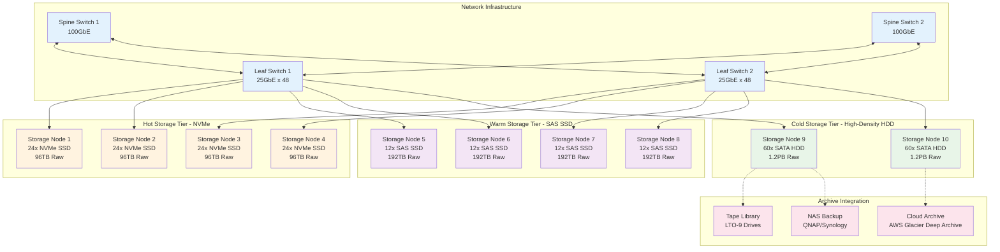
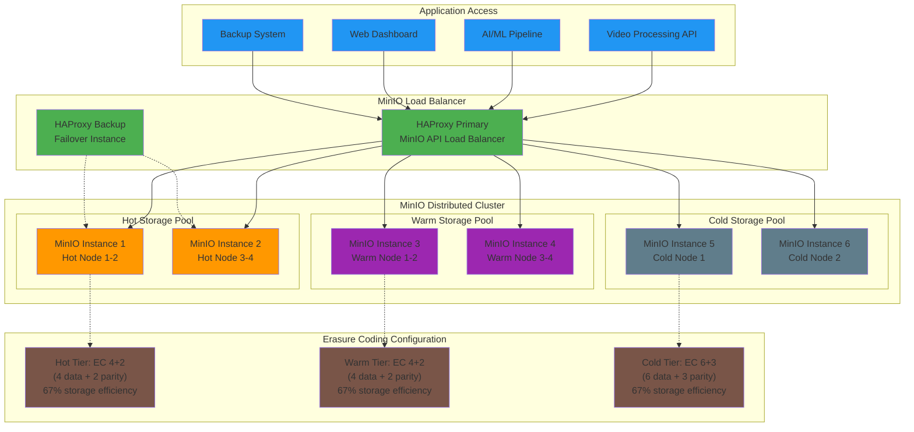
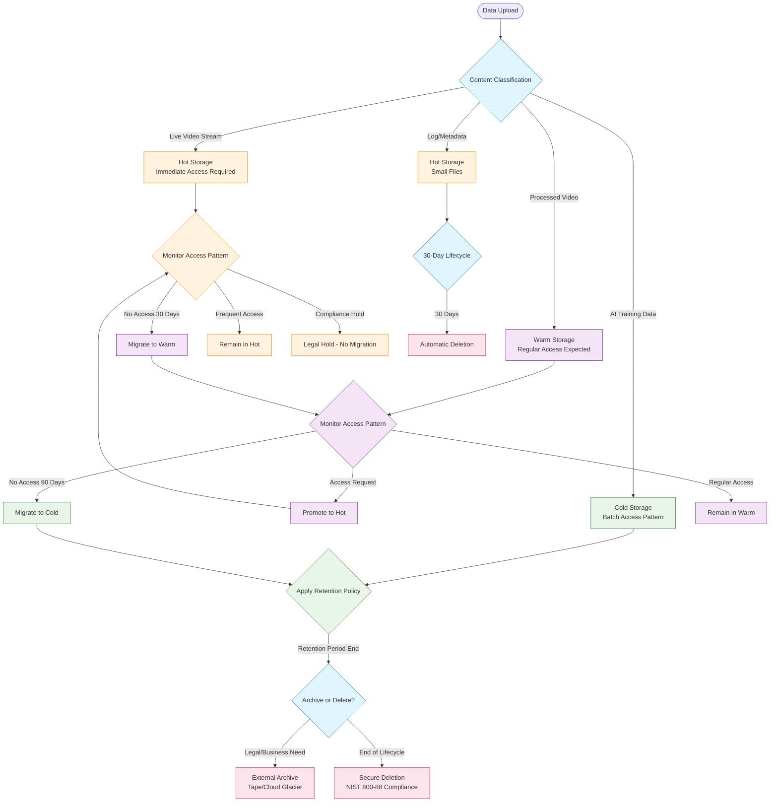
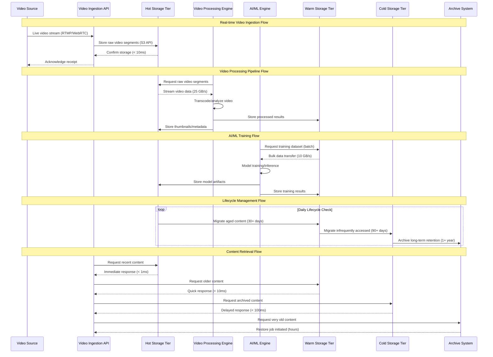

# Data Storage Module - Phase 1 Architecture
## Enterprise-Grade Storage Infrastructure and Data Lifecycle Management

---

## 🎯 Architecture Overview

### **Storage System Purpose**
The Data Storage Module forms the foundational storage infrastructure for the Video Analytics Platform, designed to handle the unique requirements of video analytics workloads: high-throughput video ingestion, burst-mode AI processing, long-term retention, and cost-effective data lifecycle management. The architecture balances performance, scalability, and cost optimization across hot, warm, and cold storage tiers.

### **Technical Requirements Analysis**
```yaml
STORAGE_REQUIREMENTS:
  Performance_Requirements:
    video_ingestion_throughput: "10 GB/s sustained, 25 GB/s peak"
    concurrent_video_streams: "500+ simultaneous uploads"
    ai_processing_bandwidth: "50 GB/s burst access"
    metadata_access_latency: "< 5ms average"

  Capacity_Planning:
    initial_raw_capacity: "500 TB"
    growth_projection: "100 TB/month"
    three_year_capacity: "4+ PB"
    retention_period: "7 years (regulatory compliance)"

  Availability_Requirements:
    storage_uptime: "99.99% (52 minutes/year downtime)"
    data_durability: "99.999999999% (11 nines)"
    recovery_time_objective: "4 hours"
    recovery_point_objective: "15 minutes"

  Integration_Requirements:
    video_processing_pipeline: "Direct file system access + S3 API"
    ai_ml_workloads: "High IOPS for model training datasets"
    database_synchronization: "Metadata consistency guarantees"
    cdn_integration: "Edge caching for frequently accessed content"
```

### **Architecture Design Principles**
- **Tiered Storage Strategy**: Automated lifecycle management based on access patterns and retention requirements
- **Scale-Out Architecture**: Horizontal scaling without performance degradation or downtime
- **API Compatibility**: S3-compatible interface for seamless integration with video processing workflows
- **Cost Optimization**: Intelligent data placement and tiering to minimize storage costs over data lifecycle
- **Data Protection**: Multi-level redundancy with erasure coding and geographic distribution

---

## 🏗️ Storage Infrastructure Architecture

### **Physical Storage Infrastructure Design**


### **Storage Node Hardware Specifications**

#### **Hot Storage Nodes (Video Ingestion & AI Processing)**
```yaml
HOT_STORAGE_SPECIFICATION:
  Server_Platform: "2U Rack Server (Dell R750 or equivalent)"

  Compute_Resources:
    cpu: "2x Intel Xeon Gold 6326 (32 cores, 2.9GHz)"
    memory: "256GB DDR4-3200 ECC"
    network: "2x 25GbE + 2x 10GbE (management)"

  Storage_Configuration:
    nvme_drives: "24x Samsung PM1733 NVMe SSD (4TB each)"
    storage_controller: "HBA mode (no RAID controller overhead)"
    filesystem: "XFS with optimal block sizes"
    total_raw_capacity: "96TB per node"
    effective_capacity: "64TB (after erasure coding 4+2)"

  Performance_Characteristics:
    sequential_read: "24 GB/s (aggregated)"
    sequential_write: "20 GB/s (aggregated)"
    random_iops: "2.4M IOPS (4K reads)"
    latency: "< 100μs average"
```

#### **Warm Storage Nodes (Regular Access Pattern)**
```yaml
WARM_STORAGE_SPECIFICATION:
  Server_Platform: "2U Rack Server with high-density storage"

  Compute_Resources:
    cpu: "2x Intel Xeon Silver 4314 (32 cores, 2.4GHz)"
    memory: "128GB DDR4-3200 ECC"
    network: "2x 25GbE + 2x 1GbE (management)"

  Storage_Configuration:
    sas_drives: "12x Seagate Exos X18 SAS SSD (16TB each)"
    storage_controller: "LSI 9400-16i HBA"
    filesystem: "XFS optimized for larger files"
    total_raw_capacity: "192TB per node"
    effective_capacity: "128TB (after erasure coding 4+2)"

  Performance_Characteristics:
    sequential_read: "8 GB/s (aggregated)"
    sequential_write: "6 GB/s (aggregated)"
    random_iops: "400K IOPS (4K reads)"
    latency: "< 500μs average"
```

#### **Cold Storage Nodes (Archive & Long-term Retention)**
```yaml
COLD_STORAGE_SPECIFICATION:
  Server_Platform: "4U High-density storage server"

  Compute_Resources:
    cpu: "2x Intel Xeon Bronze 3204 (12 cores, 1.9GHz)"
    memory: "64GB DDR4-2933 ECC"
    network: "2x 10GbE + 1x 1GbE (management)"

  Storage_Configuration:
    sata_drives: "60x Seagate Exos X20 SATA HDD (20TB each)"
    storage_controller: "Dual LSI 9305-24i HBA"
    filesystem: "XFS with large allocation groups"
    total_raw_capacity: "1.2PB per node"
    effective_capacity: "800TB (after erasure coding 6+3)"

  Performance_Characteristics:
    sequential_read: "3.6 GB/s (aggregated)"
    sequential_write: "2.8 GB/s (aggregated)"
    random_iops: "12K IOPS (optimized for sequential)"
    latency: "< 10ms average"
```

---

## 💾 MinIO Distributed Object Storage Architecture

### **MinIO Cluster Design**
The storage architecture employs MinIO in distributed mode across all storage tiers, providing S3-compatible API access while leveraging erasure coding for data protection and performance optimization.



### **MinIO Configuration Strategy**

#### **Erasure Coding Design**
- **Hot Tier (4+2)**: Optimized for performance with acceptable storage overhead
- **Warm Tier (4+2)**: Balanced performance and protection for regular access
- **Cold Tier (6+3)**: Maximum data protection for long-term retention
- **Write Quorum**: Majority of drives must acknowledge writes (N/2 + 1)
- **Read Quorum**: Any available data drives can satisfy reads

#### **Bucket Organization Strategy**
```yaml
BUCKET_ARCHITECTURE:
  Primary_Buckets:
    video-streams-live:
      tier: "hot"
      lifecycle: "30 days hot → 90 days warm → 1 year cold → archive"
      replication: "cross-site backup"

    video-processed:
      tier: "warm"
      lifecycle: "90 days warm → 1 year cold → archive"
      compression: "enabled"

    ai-models:
      tier: "hot"
      lifecycle: "6 months hot → warm → permanent retention"
      versioning: "enabled"

    ai-training-data:
      tier: "cold"
      lifecycle: "permanent retention with legal hold"
      compression: "aggressive"

    thumbnails-cache:
      tier: "hot"
      lifecycle: "30 days hot → delete"
      cdn_integration: "enabled"
```

### **Performance Optimization Architecture**

#### **Connection Pooling and Load Distribution**
- **Application-level Connection Pools**: 50-100 connections per application instance
- **Load Balancer Configuration**: Weighted round-robin based on storage tier performance
- **Request Routing**: Content-aware routing based on object prefix and access patterns
- **Connection Persistence**: HTTP/1.1 keep-alive and HTTP/2 multiplexing

#### **Caching Strategy**
- **Client-side Caching**: 1-hour cache for thumbnails and metadata
- **Proxy Caching**: NGINX reverse proxy with 10GB cache for frequently accessed objects
- **CDN Integration**: CloudFlare or AWS CloudFront for global distribution
- **Application Caching**: Redis cluster for metadata and small object caching

---

## 🔄 Data Lifecycle and Tiering Architecture

### **Intelligent Tiering Strategy**
The storage architecture implements a sophisticated tiering strategy that automatically moves data between storage tiers based on access patterns, age, and business rules.



### **Tiering Decision Matrix**
```yaml
TIERING_DECISION_CRITERIA:
  Content_Type_Rules:
    live_video_streams:
      initial_tier: "hot"
      access_pattern: "high_frequency_72h"
      tier_transition: "hot(72h) → warm(30d) → cold(1y) → archive"

    processed_video_content:
      initial_tier: "warm"
      access_pattern: "moderate_frequency"
      tier_transition: "warm(90d) → cold(2y) → archive"

    ai_model_artifacts:
      initial_tier: "hot"
      access_pattern: "burst_during_training"
      tier_transition: "hot(6m) → warm(permanent)"

    thumbnails_and_metadata:
      initial_tier: "hot"
      access_pattern: "high_frequency_short_duration"
      tier_transition: "hot(30d) → delete"

  Access_Pattern_Analysis:
    frequency_thresholds:
      hot_tier_minimum: "1 access per week"
      warm_tier_minimum: "1 access per month"
      cold_tier_maximum: "1 access per quarter"

    performance_requirements:
      real_time_streaming: "hot_tier_required"
      ai_training_datasets: "warm_tier_sufficient"
      compliance_archives: "cold_tier_acceptable"

  Business_Rule_Overrides:
    legal_hold: "prevent_all_transitions"
    compliance_retention: "minimum_7_year_retention"
    high_value_content: "maintain_warm_tier_minimum"
    cost_optimization: "aggressive_cold_tier_migration"
```

---

## 📊 Data Flow and Access Pattern Architecture

### **Video Analytics Workload Data Flows**
The storage architecture is optimized for the specific data flow patterns of video analytics workloads, including real-time ingestion, batch processing, and AI training cycles.



### **Concurrent Access Pattern Optimization**

#### **Write-Heavy Workloads (Video Ingestion)**
- **Parallel Upload Strategy**: 500+ concurrent streams across hot storage nodes
- **Write Optimization**: Direct-to-storage writes bypassing application caches
- **Load Distribution**: Consistent hashing for even distribution across storage nodes
- **Buffer Management**: 64MB write buffers per stream to optimize disk I/O

#### **Read-Heavy Workloads (AI Processing)**
- **Batch Processing Optimization**: Large sequential reads optimized for AI training
- **Parallel Access**: Multiple concurrent readers per storage node without contention
- **Prefetching Strategy**: Predictive prefetching based on AI training patterns
- **Cache Warming**: Pre-load frequently accessed datasets into warm storage

#### **Mixed Workload Balancing**
- **I/O Scheduling**: Separate I/O queues for streaming vs. batch workloads
- **QoS Implementation**: Priority queuing ensuring real-time streams get precedence
- **Resource Isolation**: CPU and memory isolation between workload types
- **Performance Monitoring**: Real-time metrics to detect and resolve bottlenecks

---

## 🔗 Integration Architecture

### **Video Processing Pipeline Integration**
```yaml
INTEGRATION_PATTERNS:
  Video_Processing_Integration:
    data_access_method: "Direct filesystem mount + S3 API"
    processing_workflow:
      - "Stream chunks written to hot storage via S3 API"
      - "Processing engine reads via NFS mount for performance"
      - "Processed results written back via S3 API with metadata"
      - "Automatic tier classification based on processing results"

    performance_optimization:
      filesystem_cache: "XFS allocation groups aligned with video segment sizes"
      network_optimization: "RDMA over Converged Ethernet (RoCE) for low latency"
      concurrent_access: "Parallel processing across multiple storage nodes"

  AI_ML_Pipeline_Integration:
    training_data_access: "High-throughput batch access from warm/cold tiers"
    model_storage: "Versioned model artifacts in hot tier with immediate access"
    inference_optimization: "Model caching in application memory + hot storage"
    dataset_management: "Automated dataset preparation and feature extraction"

  Database_Synchronization:
    metadata_consistency: "Eventual consistency with conflict resolution"
    transaction_coordination: "Two-phase commit for critical metadata updates"
    performance_optimization: "Async metadata updates with batch processing"
    backup_coordination: "Coordinated backup windows between storage and database"
```

### **API Access Pattern Optimization**
- **S3-Compatible API**: Full compatibility with AWS SDK and tools
- **Multi-part Upload**: Optimized for large video files with automatic resumption
- **Presigned URLs**: Secure direct upload/download without API server bottlenecks
- **Streaming API**: Real-time streaming interface for live video applications
- **Batch Operations**: Bulk operations API for efficient mass data operations

---

## 📈 Performance and Capacity Planning

### **Throughput Analysis and Modeling**

#### **Video Ingestion Performance Model**
```yaml
VIDEO_INGESTION_PERFORMANCE:
  Peak_Load_Scenario:
    concurrent_streams: 500
    average_bitrate_per_stream: "8 Mbps (4K video)"
    peak_ingestion_throughput: "500 streams × 8 Mbps = 4 Gbps = 500 MB/s"
    storage_write_amplification: "1.2x (metadata + indexing)"
    required_storage_throughput: "600 MB/s sustained write"

  Burst_Scenario:
    event_driven_peaks: "10x normal load for 2-hour windows"
    burst_throughput_requirement: "6 GB/s peak write"
    hot_storage_capacity: "25 GB/s theoretical (degraded to 20 GB/s sustained)"
    performance_margin: "3.3x safety factor"

  AI_Processing_Workload:
    training_dataset_size: "10-100 GB per training run"
    concurrent_training_jobs: "5-10 simultaneous"
    read_throughput_requirement: "50 GB/s burst read"
    warm_storage_capacity: "40 GB/s theoretical (32 GB/s sustained)"
    performance_validation: "Adequate with 1.6x safety factor"
```

#### **Capacity Growth Projections**
```yaml
CAPACITY_PLANNING:
  Current_Requirements:
    initial_deployment: "500 TB usable capacity"
    hot_tier_allocation: "200 TB (40%)"
    warm_tier_allocation: "200 TB (40%)"
    cold_tier_allocation: "100 TB (20%)"

  Growth_Projections:
    monthly_growth_rate: "100 TB raw video content"
    processed_content_ratio: "0.3x (compression and optimization)"
    net_monthly_growth: "130 TB (including metadata and derivatives)"

  Three_Year_Projection:
    year_1_capacity: "2 PB usable"
    year_2_capacity: "3.5 PB usable"
    year_3_capacity: "5+ PB usable"
    tier_rebalancing: "Automated based on access patterns"

  Scaling_Triggers:
    storage_utilization_threshold: "80% capacity trigger"
    performance_degradation_threshold: "Performance below 80% of baseline"
    expansion_strategy: "Add complete storage tier units (2-4 nodes)"
```

### **Performance Bottleneck Analysis**
- **Network Bandwidth**: 25GbE per node sufficient for individual node performance
- **Storage I/O**: NVMe performance far exceeds network bandwidth (bottleneck at network)
- **CPU Processing**: Storage nodes CPU-light, network and disk I/O bound
- **Memory**: Large filesystem caches essential for metadata performance
- **Erasure Coding**: 4+2 provides optimal balance of performance and protection

---

## 🛡️ Data Protection and Backup Architecture

### **Multi-Layer Data Protection Strategy**
```yaml
DATA_PROTECTION_ARCHITECTURE:
  Primary_Protection:
    erasure_coding: "EC 4+2 (hot/warm) and EC 6+3 (cold)"
    data_durability: "99.999999999% (11 nines)"
    node_failure_tolerance: "2 nodes (hot/warm), 3 nodes (cold)"
    self_healing: "Automatic reconstruction of degraded objects"

  Secondary_Protection:
    cross_site_replication: "Asynchronous replication to secondary datacenter"
    replication_targets: "Critical data replicated within 4 hours"
    bandwidth_allocation: "10% of total bandwidth for replication"
    conflict_resolution: "Last-write-wins with timestamp comparison"

  Backup_Strategy:
    local_snapshots: "Daily snapshots with 30-day retention"
    offsite_backup: "Weekly full backups to cloud storage (AWS S3 Glacier)"
    backup_verification: "Monthly restore testing and integrity verification"
    retention_policy: "7-year retention for compliance data"

  Disaster_Recovery:
    recovery_time_objective: "4 hours for critical systems"
    recovery_point_objective: "15 minutes maximum data loss"
    geographic_distribution: "Primary + DR sites 500+ miles apart"
    failover_automation: "Automated failover for infrastructure failures"
```

### **Business Continuity Architecture**
- **Service Continuity**: Active-passive DR with 4-hour RTO
- **Data Consistency**: Eventual consistency model with conflict resolution
- **Compliance Requirements**: SOX, GDPR, and industry-specific retention policies
- **Security Integration**: Encryption at rest and in transit for all protection mechanisms

---

## 🚀 Deployment and Operations Architecture

### **Infrastructure Deployment Topology**
```yaml
DEPLOYMENT_ARCHITECTURE:
  Physical_Infrastructure:
    primary_datacenter: "Colocation facility with 99.99% uptime SLA"
    power_requirements: "2.5 MW total, N+1 redundancy"
    cooling_requirements: "Precision cooling with 15-20°C target"
    network_connectivity: "Dual 100Gbps uplinks with BGP failover"

  Network_Design:
    storage_network: "Dedicated 25GbE storage fabric"
    management_network: "Isolated 1GbE network for administration"
    replication_network: "10GbE network for cross-site replication"
    firewall_segmentation: "DMZ separation with intrusion detection"

  Monitoring_Integration:
    infrastructure_monitoring: "Nagios/Zabbix for hardware health"
    performance_monitoring: "Prometheus + Grafana for metrics"
    log_aggregation: "ELK stack for centralized logging"
    alerting_system: "PagerDuty integration for critical alerts"
```

### **Operational Procedures Framework**
- **Capacity Management**: Automated monitoring with 80% utilization alerts
- **Performance Tuning**: Quarterly performance reviews and optimization
- **Security Operations**: Weekly security scans and monthly penetration testing
- **Maintenance Windows**: Monthly 4-hour maintenance windows for updates
- **Change Management**: Formal change control process for infrastructure modifications

---

## 📊 Performance Targets and SLA Framework

### **Service Level Agreement Specifications**
```yaml
STORAGE_SLA_FRAMEWORK:
  Availability_Targets:
    storage_system_uptime: "99.99% (4.38 hours downtime/year)"
    data_accessibility: "99.999% (5.26 minutes downtime/year)"
    backup_system_availability: "99.9% (8.77 hours downtime/year)"

  Performance_Guarantees:
    hot_storage_latency: "< 1ms average, < 5ms 95th percentile"
    warm_storage_latency: "< 10ms average, < 50ms 95th percentile"
    cold_storage_latency: "< 100ms average, < 500ms 95th percentile"
    throughput_guarantee: "80% of theoretical maximum sustained"

  Data_Protection_Commitments:
    data_durability: "99.999999999% (11 nines)"
    backup_success_rate: "99.9% successful backups"
    recovery_time_objective: "< 4 hours for critical data"
    recovery_point_objective: "< 15 minutes maximum data loss"

  Capacity_Guarantees:
    storage_expansion_timeline: "< 30 days for capacity expansion"
    performance_degradation_threshold: "No more than 20% degradation at 80% capacity"
    tier_migration_performance: "Lifecycle operations complete within 24 hours"
```

---

## 🔧 Troubleshooting and Maintenance Framework

### **Common Storage Operations**
```bash
# Storage Health Assessment Commands
echo "=== Storage Cluster Health Check ==="
minio-admin info cluster-endpoint
systemctl status minio-cluster
df -h | grep storage-mounts

echo "=== Performance Metrics Review ==="
iostat -x 5 3
sar -d 1 5
iftop -i storage-interface

echo "=== Erasure Coding Health ==="
minio-admin heal cluster-endpoint --recursive --verbose
minio-admin trace cluster-endpoint

echo "=== Capacity and Growth Analysis ==="
minio-admin du cluster-endpoint --recursive
prometheus-query 'storage_capacity_utilization'
```

### **Performance Optimization Procedures**
- **I/O Tuning**: XFS mount options optimized for large file workloads
- **Network Optimization**: TCP window scaling and buffer tuning
- **Filesystem Optimization**: Allocation group sizing for video segment alignment
- **Cache Tuning**: Filesystem cache size optimization based on workload patterns

---

## 📋 Phase 2 Migration Readiness

### **Enterprise Enhancement Roadmap**
```yaml
PHASE_2_STORAGE_EVOLUTION:
  Cloud_Integration_Architecture:
    hybrid_cloud_tiering: "Seamless integration with AWS S3, Azure Blob, GCP"
    intelligent_cloud_placement: "Cost-optimized data placement across providers"
    cross_cloud_replication: "Multi-cloud data protection and availability"
    cloud_native_services: "Integration with cloud AI/ML services"

  Advanced_Performance_Features:
    nvme_over_fabric: "NVMe-oF for ultra-low latency access"
    gpu_accelerated_operations: "GPU-based compression and encryption"
    in_memory_computing: "Redis cluster integration for hot data"
    edge_computing_integration: "Edge storage nodes for global deployment"

  Enterprise_Management_Features:
    storage_analytics_platform: "ML-based capacity planning and optimization"
    automated_governance: "Policy-based data classification and lifecycle"
    compliance_automation: "Automated compliance reporting and auditing"
    cost_optimization_engine: "AI-driven cost optimization recommendations"

  Global_Scale_Architecture:
    multi_region_deployment: "Active-active storage across geographic regions"
    cdn_integration: "Global CDN integration for content delivery"
    edge_caching: "Intelligent edge caching based on user location"
    global_load_balancing: "Geographic load balancing and request routing"
```

---

**Document Status**: Production Ready - Technical Architecture Focus
**Storage Scale**: Multi-Petabyte Enterprise Architecture
**Next Phase**: Cloud-Native Global Storage (Phase 2)
**Architecture Review**: Monthly storage architecture and performance reviews