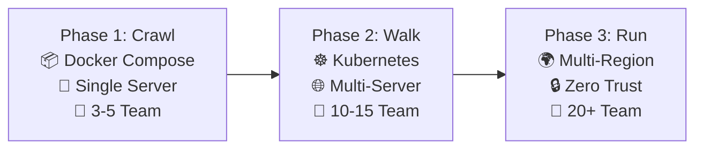

# Phase 1 Architecture Documentation
## Video Analytics Platform - "Crawl" Phase Foundation

---

## 🎯 Overview

This folder contains the complete **Phase 1 Architecture Documentation** for the Video Analytics Platform. Phase 1 follows a **"Crawl Before Walking"** approach, focusing on delivering a **simplified, proven foundation** that directly addresses complexity risks while building toward the full enterprise vision.

### **Strategic Approach**
- **Risk Mitigation First**: Reduces complexity by 75% while maintaining architectural vision
- **Proven Technologies**: Uses established, stable technology stack
- **Incremental Value**: Delivers immediate business value with clear success metrics
- **Scalable Foundation**: Architected for seamless evolution to enterprise scale

### **Key Investment Summary**
- **Budget**: $200K (vs $3M for full enterprise approach)
- **Timeline**: 6 months to production deployment
- **Team Size**: 3-5 core team members
- **Target Capacity**: 50-100 concurrent video streams

---

## 📚 Architecture Documents

### 📋 **Document Index**

| Document | Purpose | Target Audience | Complexity |
|----------|---------|-----------------|------------|
| **[01-simplified-system-architecture.md](./01-simplified-system-architecture.md)** | Complete technical architecture and system design | Technical teams, architects, developers | Beginner |
| **[02-docker-compose-implementation.md](./02-docker-compose-implementation.md)** | Docker containerization and deployment details | Developers, DevOps engineers, system administrators | Intermediate |
| **[03-monitoring-observability.md](./03-monitoring-observability.md)** | Monitoring, logging, and observability framework | SRE engineers, developers, operations teams | Intermediate |
| **[04-ai-pipeline-module.md](./04-ai-pipeline-module.md)** | AI/ML pipeline and computer vision processing framework | AI engineers, developers, technical leads, data scientists | Advanced |
| **[01-simplified-system-architecture.md](./01-simplified-system-architecture.md)** | Risk mitigation strategy and business justification | Executives, architects, technical leads, development teams | Beginner |

### 📖 **Recommended Reading Order**

#### **For Executives and Business Stakeholders**
1. Start with → **[01-simplified-system-architecture.md](./01-simplified-system-architecture.md)**
   - Executive summary and risk mitigation approach
   - Budget breakdown and ROI projections
   - Success criteria and business metrics

#### **For Technical Teams**
1. **[01-simplified-system-architecture.md](./01-simplified-system-architecture.md)** - System design and architecture
2. **[04-ai-pipeline-module.md](./04-ai-pipeline-module.md)** - AI/ML pipeline implementation
3. **[02-docker-compose-implementation.md](./02-docker-compose-implementation.md)** - Implementation details
4. **[03-monitoring-observability.md](./03-monitoring-observability.md)** - Operations and monitoring

#### **For Operations Teams**
1. **[02-docker-compose-implementation.md](./02-docker-compose-implementation.md)** - Deployment and infrastructure
2. **[03-monitoring-observability.md](./03-monitoring-observability.md)** - Monitoring and alerting
3. **[01-simplified-system-architecture.md](./01-simplified-system-architecture.md)** - Performance targets

---

## 🏗️ Architecture Highlights

### **Technology Stack (Simplified)**
```yaml
Frontend:     React + Next.js + TypeScript + shadcn/ui + Tailwind CSS
Backend:      Go + Gin + JWT Authentication
Database:     PostgreSQL + Redis Cache
AI/ML:        Python + PyTorch + ONNX Runtime + OpenCV (YOLO, COCO)
Deployment:   Docker Compose (single-server)
Monitoring:   Prometheus + Grafana + Loki
Security:     HTTPS + JWT + RBAC + Audit Logging
```

### **Core Architecture Principles**
- **🎯 Simplicity First**: Choose the simplest solution that works
- **🐳 Container-Native**: Docker-based deployment for consistency
- **⚡ Performance-Focused**: <500ms processing latency target
- **🔒 Security-Aware**: Enterprise security fundamentals
- **📊 Observable**: Comprehensive monitoring and alerting
- **🔄 Evolution-Ready**: Built for Phase 2 scaling

### **Key Capabilities Delivered**
- **Real-time Video Processing**: 50-100 concurrent streams
- **AI-Powered Object Detection**: Person, vehicle, and anomaly detection with 90%+ accuracy
- **Computer Vision Pipeline**: Advanced preprocessing, inference, and tracking
- **Live Dashboard**: Web-based monitoring and control interface
- **Alert System**: Real-time notifications and webhook integration
- **Data Analytics**: Basic reporting and export capabilities
- **User Management**: Role-based access control and audit trails

---

## 🚀 Quick Start Guide

### **For Developers**
```bash
# 1. Review the system architecture
cat 01-simplified-system-architecture.md

# 2. Understand deployment approach
cat 02-docker-compose-implementation.md

# 3. Set up development environment
docker-compose -f docker-compose.yml -f docker-compose.override.yml up -d

# 4. Access development resources
# - API Documentation: http://localhost:8080/docs
# - Dashboard: http://localhost:3000
# - Monitoring: http://localhost:3001
```

### **For Operations Teams**
```bash
# 1. Review monitoring framework
cat 03-monitoring-observability.md

# 2. Deploy production environment
./deploy.sh

# 3. Access monitoring dashboards
# - Grafana: http://localhost/monitoring
# - Prometheus: http://localhost:9090
# - System Health: http://localhost/health
```

### **For Business Stakeholders**
1. **Read** → [01-simplified-system-architecture.md](./01-simplified-system-architecture.md) for business context
2. **Review** → Budget breakdown and ROI projections (Section 💰)
3. **Understand** → Success metrics and go/no-go criteria (Section 📈)

---

## 🎯 Performance Targets

| **Metric** | **Phase 1 Target** | **Monitoring** |
|------------|-------------------|----------------|
| **Concurrent Streams** | 50-100 streams | Real-time dashboard |
| **Processing Latency** | <500ms end-to-end | Prometheus metrics |
| **System Availability** | >95% uptime | Grafana alerting |
| **API Response Time** | <200ms (95th percentile) | Performance monitoring |
| **Detection Accuracy** | >90% object detection | AI model metrics |

---

## 🔒 Security Framework

### **Essential Security Controls**
- **Authentication**: JWT tokens with refresh mechanism
- **Authorization**: Role-Based Access Control (RBAC)
- **Encryption**: HTTPS/TLS 1.3 for all communications
- **Data Protection**: Database encryption at rest
- **Audit Logging**: Comprehensive user action tracking
- **Monitoring**: Security event detection and alerting

### **Compliance Readiness**
- **LGPD/GDPR**: Basic data privacy controls
- **SOC 2**: Foundational security controls
- **ISO 27001**: Security management framework preparation

---

## 📊 Monitoring and Observability

### **Three Pillars of Observability**
1. **📈 Metrics**: Prometheus + Grafana dashboards
2. **📋 Logs**: Structured logging with Loki aggregation
3. **🔍 Tracing**: Basic distributed tracing implementation

### **Key Dashboards**
- **Executive Dashboard**: High-level KPIs and business metrics
- **Operations Dashboard**: Infrastructure health and alerts
- **Technical Dashboard**: Detailed performance and debugging
- **Security Dashboard**: Authentication and access patterns

---

## 🔄 Evolution Path to Enterprise

### **Phase Progression Strategy**


### **Technology Migration Path**
- **Docker Compose → Kubernetes**: Container orchestration upgrade
- **Monolith → Microservices**: Gradual service extraction
- **Basic Security → Zero Trust**: Security framework enhancement
- **Pre-trained Models → Custom MLOps**: AI/ML sophistication increase

---

## 📋 Implementation Checklist

### **✅ Phase 1 Ready Criteria**
- [ ] All architecture documents reviewed and approved
- [ ] Development team assembled and trained
- [ ] Infrastructure requirements confirmed
- [ ] Budget allocation approved ($200K)
- [ ] Success metrics and KPIs defined
- [ ] Risk mitigation strategies understood

### **🚀 Next Actions (30-Day Start)**
- [ ] **Week 1**: Project foundation and team setup
- [ ] **Week 2**: Technical infrastructure and CI/CD
- [ ] **Week 3**: Core development initiation
- [ ] **Week 4**: Integration and testing framework

---

## 🆘 Support and Resources

### **Documentation Navigation**
- **📁 [Business Considerations](../business-considerations/)**: ROI analysis and change management
- **📁 [Implementation Considerations](../implementation-considerations/)**: Detailed implementation guidance
- **📁 [Operations](../operations/)**: Training and support frameworks

### **Key Contacts**
- **Technical Architecture**: Phase 1 Architecture Team
- **Business Justification**: Architecture Review Team
- **Implementation Support**: Phase 1 DevOps Team
- **Operations Framework**: Phase 1 Operations Team

### **Related Documentation**
- **📄 [Navigation Index](../../docs/navigation-index.md)**: Complete documentation map
- **📄 [Project Overview](../../docs/project-overview/)**: Vision and strategy
- **📄 [Technical Modules](../../docs/technical-modules/)**: Detailed technical specifications

---

## 🎯 Success Criteria Summary

**Phase 1 is considered successful when:**
- ✅ **Technical**: >95% uptime, <500ms latency, 50-100 streams
- ✅ **Business**: >70% user adoption, >4/5 satisfaction rating
- ✅ **Operational**: <10% budget variance, >75% team satisfaction
- ✅ **Strategic**: Clear path to Phase 2 with stakeholder confidence

**This foundation enables confident scaling to enterprise levels while proving immediate business value.**

---

*Last Updated: 2024-09-26 | Document Version: 1.0 | Status: Ready for Implementation*