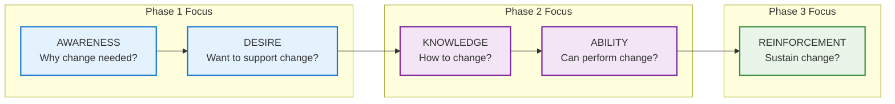
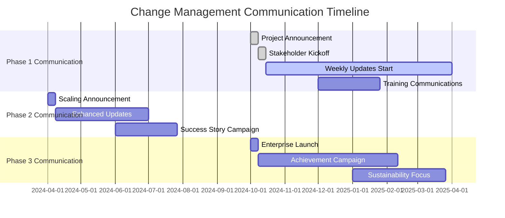
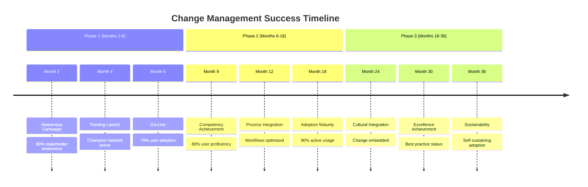

# Change Management Strategy
## Comprehensive Organizational Readiness & User Adoption Framework

---

## 🎯 Executive Summary

This Change Management Strategy directly addresses the **Medium-High Risk of Operational Readiness Gap** identified in the architecture review. The original plan focused heavily on technical implementation while neglecting the critical human and organizational factors necessary for successful adoption and operation.

### **Change Management Philosophy**
- **People-First Approach**: Technology success depends on people adoption
- **Structured Methodology**: Proven change management framework (ADKAR/Kotter)
- **Continuous Engagement**: Ongoing stakeholder involvement throughout all phases
- **Value Communication**: Clear communication of benefits and value at all levels
- **Support-Centric**: Comprehensive support systems for successful transition

### **Key Change Challenges Addressed**
| **Challenge** | **Risk Level** | **Mitigation Strategy** | **Success Target** |
|---------------|----------------|------------------------|-------------------|
| **User Resistance** | High | Early engagement, value demonstration | >80% user adoption |
| **Skills Gap** | High | Comprehensive training program | >95% competency achievement |
| **Process Disruption** | Medium | Gradual transition, parallel operations | <10% process efficiency loss |
| **Support Readiness** | High | Dedicated support model, clear escalation | >95% SLA compliance |
| **Cultural Adaptation** | Medium | Change champions, cultural alignment | >75% culture satisfaction |

---

## 🏗️ Change Management Framework

### **ADKAR Model Implementation**


### **Stakeholder Analysis & Engagement**
```yaml
STAKEHOLDER_MAPPING:

EXECUTIVE_SPONSORS:
  Influence: "High"
  Impact: "High"
  Engagement_Strategy: "Manage Closely"
  Communication: "Monthly strategic reviews, quarterly business cases"
  Key_Concerns: "ROI, strategic alignment, risk management"
  Success_Measures: "Continued funding approval, strategic support"

DEPARTMENT_MANAGERS:
  Influence: "High"
  Impact: "Medium"
  Engagement_Strategy: "Keep Satisfied"
  Communication: "Bi-weekly progress updates, monthly operational reviews"
  Key_Concerns: "Operational disruption, team productivity, resource allocation"
  Success_Measures: "Operational support, resource provision, change advocacy"

END_USERS:
  Influence: "Medium"
  Impact: "High"
  Engagement_Strategy: "Manage Closely"
  Communication: "Weekly updates, monthly feedback sessions, training communications"
  Key_Concerns: "Job security, workload changes, system usability, training adequacy"
  Success_Measures: "System adoption, proficiency achievement, satisfaction scores"

IT_SUPPORT_TEAM:
  Influence: "Medium"
  Impact: "High"
  Engagement_Strategy: "Keep Informed"
  Communication: "Technical updates, training schedules, support procedures"
  Key_Concerns: "Technical complexity, support readiness, skill requirements"
  Success_Measures: "Technical readiness, support effectiveness, issue resolution"
```

---

## 📢 Communication Strategy

### **Multi-Channel Communication Plan**

#### **Executive Communication**
```yaml
EXECUTIVE_ENGAGEMENT:
  Frequency: "Monthly steering committee, quarterly board updates"
  Format: "Executive dashboard, ROI reports, strategic presentations"
  Key_Messages:
    - Strategic value and competitive advantage
    - ROI achievement and financial performance
    - Risk mitigation and business continuity
    - Market positioning and innovation leadership

  Communication_Channels:
    - Executive briefings and presentations
    - Strategic dashboard and reporting
    - Board meeting updates and approvals
    - One-on-one executive consultations
```

#### **Manager Communication**
```yaml
MANAGER_ENGAGEMENT:
  Frequency: "Bi-weekly progress updates, monthly operational reviews"
  Format: "Manager briefings, operational reports, Q&A sessions"
  Key_Messages:
    - Operational benefits and efficiency gains
    - Team impact and resource requirements
    - Timeline and milestone achievements
    - Support and training availability

  Communication_Channels:
    - Manager briefing sessions
    - Operational update emails
    - Department team meetings
    - Manager Q&A and feedback sessions
```

#### **End User Communication**
```yaml
USER_ENGAGEMENT:
  Frequency: "Weekly updates during implementation, monthly after go-live"
  Format: "Team meetings, email updates, intranet posts, video messages"
  Key_Messages:
    - Personal benefits and job enhancement
    - Training opportunities and skill development
    - Support availability and help resources
    - Success stories and positive outcomes

  Communication_Channels:
    - Team meetings and town halls
    - Email newsletters and updates
    - Intranet portal and knowledge base
    - Video messages and demonstrations
    - Peer champion network communication
```

### **Communication Timeline**


---

## 👥 Change Champion Network

### **Champion Selection & Development**

#### **Champion Criteria & Selection**
```yaml
CHAMPION_IDENTIFICATION:
  Selection_Criteria:
    - High influence among peers
    - Positive attitude toward technology
    - Strong communication skills
    - Respected by team members
    - Available to dedicate time to change activities

  Champion_Roles:
    - Early system testing and feedback
    - Peer training and support
    - Change advocacy and communication
    - Issue identification and escalation
    - Success story documentation

  Champion_Structure:
    - 1 champion per 10-15 end users
    - Department-level super champions
    - Cross-functional champion network
    - Executive champion sponsor
```

#### **Champion Development Program**
```yaml
CHAMPION_TRAINING:
  Advanced_System_Training:
    Duration: "16 hours over 4 weeks"
    Content: "Advanced features, troubleshooting, customization"
    Format: "Hands-on workshops with certification"

  Change_Leadership_Training:
    Duration: "8 hours over 2 weeks"
    Content: "Change management, communication, resistance handling"
    Format: "Interactive workshops with role-playing"

  Train_the_Trainer:
    Duration: "12 hours over 3 weeks"
    Content: "Adult learning, training delivery, assessment methods"
    Format: "Practical training sessions with feedback"

CHAMPION_SUPPORT:
  Monthly_Champion_Meetings: "Strategy updates, issue resolution, skill development"
  Champion_Recognition_Program: "Awards, certificates, public recognition"
  Champion_Resource_Center: "Training materials, FAQ, best practices"
  Direct_Access_to_Project_Team: "Escalation channel and expert consultation"
```

---

## 📚 Comprehensive Training Strategy

### **Multi-Tiered Training Program**

#### **Business User Training (End Users)**
```yaml
BASIC_USER_TRAINING:
  Duration: "4 hours (2 sessions of 2 hours each)"
  Delivery: "In-person workshops with hands-on practice"
  Group_Size: "8-12 participants per session"

  Module_1_System_Navigation (2 hours):
    - System login and basic navigation
    - Dashboard overview and customization
    - Basic video monitoring and alerts
    - User preferences and settings

  Module_2_Core_Features (2 hours):
    - Live feed monitoring and control
    - Alert management and response
    - Basic reporting and data export
    - Troubleshooting common issues

  Assessment: "Practical competency assessment with 80% pass requirement"
  Materials: "User guide, quick reference cards, video tutorials"
  Follow_up: "30-day check-in and refresher training as needed"

ADVANCED_USER_TRAINING:
  Duration: "8 hours (4 sessions of 2 hours each)"
  Prerequisites: "Completion of basic user training with competency demonstration"

  Module_1_Advanced_Monitoring (2 hours):
    - Advanced alert configuration and customization
    - Multi-stream monitoring and management
    - Performance optimization and tuning
    - Integration with existing workflows

  Module_2_Analytics_and_Reporting (2 hours):
    - Advanced analytics and trend analysis
    - Custom report creation and scheduling
    - Data interpretation and decision making
    - Business intelligence integration

  Module_3_System_Administration (2 hours):
    - User management and permissions
    - System configuration and customization
    - Maintenance tasks and procedures
    - Backup and recovery operations

  Module_4_Integration_and_Optimization (2 hours):
    - External system integration usage
    - Workflow optimization and automation
    - Advanced troubleshooting techniques
    - Best practices and optimization tips

  Certification: "Advanced user certification with comprehensive assessment"
```

#### **Technical Training (IT & Support Teams)**
```yaml
TECHNICAL_FOUNDATION_TRAINING:
  Duration: "40 hours over 8 weeks"
  Target: "Development team, system administrators, technical support"

  Week_1_2_Video_Analytics_Fundamentals (10 hours):
    - Video processing and compression technologies
    - Computer vision and AI model basics
    - Video analytics use cases and applications
    - Performance considerations and optimization

  Week_3_4_System_Architecture (10 hours):
    - Platform architecture and component overview
    - Database design and data flow
    - API architecture and integration patterns
    - Security framework and implementation

  Week_5_6_Operational_Procedures (10 hours):
    - System administration and maintenance
    - Monitoring and alerting configuration
    - Backup and disaster recovery procedures
    - Performance tuning and optimization

  Week_7_8_Support_and_Troubleshooting (10 hours):
    - Common issues and resolution procedures
    - Escalation processes and vendor management
    - User support and customer service
    - Documentation and knowledge management

SPECIALIZED_TECHNICAL_TRAINING:
  AI_ML_Specialization (20 hours):
    - Advanced machine learning concepts
    - Model training and optimization
    - MLOps pipeline management
    - Performance monitoring and tuning

  Security_Specialization (16 hours):
    - Security architecture and implementation
    - Threat detection and response
    - Compliance and audit procedures
    - Incident response and recovery

  Integration_Specialization (12 hours):
    - API design and development
    - External system integration
    - Data integration and synchronization
    - Partner and vendor coordination
```

### **Training Delivery Methods**
```yaml
DELIVERY_FORMATS:
  In_Person_Workshops:
    Benefits: "Hands-on learning, immediate feedback, peer interaction"
    Usage: "Core training modules, advanced topics, practical assessments"
    Resources: "Training facility, instructors, equipment, materials"

  Online_Learning_Platform:
    Benefits: "Self-paced learning, accessibility, cost-effective"
    Usage: "Foundational knowledge, reference materials, refresher training"
    Resources: "LMS platform, video content, interactive modules, assessments"

  Blended_Learning:
    Benefits: "Combines benefits of both approaches"
    Usage: "Comprehensive training programs, flexible scheduling"
    Resources: "Mixed delivery methods, coordinated curriculum"

  On_the_Job_Training:
    Benefits: "Real-world application, immediate relevance, mentoring"
    Usage: "Practical skill development, advanced topics, specialization"
    Resources: "Mentors, job aids, structured practice opportunities"
```

---

## 🔄 Organizational Process Integration

### **Business Process Alignment**

#### **Current State Assessment**
```yaml
PROCESS_ANALYSIS:
  Security_Operations:
    Current_Process: "Manual video monitoring, reactive incident response"
    Pain_Points: "High workload, delayed detection, inconsistent coverage"
    Integration_Opportunities: "Automated monitoring, proactive alerts, predictive analysis"
    Change_Requirements: "Workflow redesign, role redefinition, skill development"

  Facility_Management:
    Current_Process: "Periodic inspections, manual reporting, reactive maintenance"
    Pain_Points: "Resource intensive, delayed issue detection, incomplete coverage"
    Integration_Opportunities: "Continuous monitoring, automated reporting, predictive maintenance"
    Change_Requirements: "Process automation, data integration, decision support"

  Operations_Management:
    Current_Process: "Dashboard-based monitoring, manual analysis, periodic reporting"
    Pain_Points: "Limited insights, delayed decision making, manual effort"
    Integration_Opportunities: "Real-time analytics, automated insights, decision support"
    Change_Requirements: "Dashboard redesign, analytics integration, decision workflow"
```

#### **Future State Design**
```yaml
INTEGRATED_WORKFLOWS:
  Automated_Monitoring_Workflow:
    Trigger: "AI-detected anomaly or threshold breach"
    Process: "Automated alert → Verification → Assignment → Investigation → Resolution"
    Roles: "System (detection) → Operator (verification) → Specialist (investigation)"
    Integration: "Alert system → Task management → Knowledge base → Reporting"

  Predictive_Maintenance_Workflow:
    Trigger: "Predictive analytics indicating potential issue"
    Process: "Prediction → Assessment → Planning → Execution → Validation"
    Roles: "System (prediction) → Analyst (assessment) → Manager (planning) → Technician (execution)"
    Integration: "Analytics → Work order system → Resource planning → Performance tracking"

  Business_Intelligence_Workflow:
    Trigger: "Scheduled reporting or ad-hoc analysis request"
    Process: "Data collection → Analysis → Visualization → Distribution → Action"
    Roles: "System (collection) → Analyst (analysis) → Manager (decision) → Team (action)"
    Integration: "Data warehouse → BI tools → Communication systems → Performance tracking"
```

---

## 🎯 Resistance Management Strategy

### **Resistance Identification & Response**

#### **Common Resistance Patterns**
```yaml
TECHNICAL_RESISTANCE:
  Manifestations:
    - "System too complex" or "Technology not reliable"
    - Preference for existing manual methods
    - Concerns about technical skills requirements
    - Fear of technology dependence

  Root_Causes:
    - Lack of technical confidence
    - Previous negative technology experiences
    - Insufficient training or support
    - Unclear technology benefits

  Response_Strategies:
    - Comprehensive technical training with hands-on practice
    - Gradual introduction with parallel systems initially
    - Success story sharing and peer testimonials
    - Technical support and expert mentoring

ORGANIZATIONAL_RESISTANCE:
  Manifestations:
    - "Not enough time" or "Too busy to learn new system"
    - Concerns about job security or role changes
    - Skepticism about business value
    - Cultural resistance to change

  Root_Causes:
    - Change fatigue or previous change failures
    - Unclear personal benefits
    - Lack of management support
    - Communication gaps

  Response_Strategies:
    - Clear communication of personal benefits
    - Management engagement and support
    - Phased implementation with gradual transition
    - Recognition and reward for adoption
```

#### **Resistance Response Framework**
```yaml
INDIVIDUAL_RESISTANCE_RESPONSE:
  Level_1_Gentle_Resistance:
    Symptoms: "Passive compliance, minimal engagement"
    Response: "One-on-one coaching, additional training, peer mentoring"
    Timeline: "2-4 weeks intensive support"

  Level_2_Active_Resistance:
    Symptoms: "Vocal opposition, influence others negatively"
    Response: "Direct management intervention, stakeholder engagement, problem solving"
    Timeline: "4-6 weeks with management support"

  Level_3_Persistent_Resistance:
    Symptoms: "Continued opposition despite support efforts"
    Response: "Formal intervention, role clarification, potential reassignment"
    Timeline: "As required with HR involvement"

ORGANIZATIONAL_RESISTANCE_RESPONSE:
  Department_Level_Resistance:
    Response: "Management alignment, champion activation, success demonstration"
    Support: "Executive intervention, resource provision, communication campaign"

  Cultural_Resistance:
    Response: "Long-term culture change program, leadership modeling, value alignment"
    Support: "Sustained leadership commitment, recognition programs, story telling"
```

---

## 📈 Adoption Measurement & Success Tracking

### **Adoption Metrics Framework**
```yaml
ADOPTION_MEASUREMENT:

USAGE_METRICS:
  User_Login_Frequency: "Daily, weekly, monthly active users"
  Feature_Utilization: "Percentage of features used by user segments"
  Task_Completion_Rate: "Successful completion of key workflows"
  Time_to_Proficiency: "Time from training to competent usage"

SATISFACTION_METRICS:
  User_Satisfaction_Score: "Monthly surveys with 5-point scale"
  Net_Promoter_Score: "Likelihood to recommend system to colleagues"
  Training_Effectiveness: "Post-training satisfaction and competency scores"
  Support_Satisfaction: "Support interaction satisfaction ratings"

BUSINESS_IMPACT_METRICS:
  Process_Efficiency: "Time savings in monitored processes"
  Quality_Improvement: "Reduction in errors or missed incidents"
  Productivity_Gains: "Output improvement in user tasks"
  Cost_Savings: "Measurable cost reduction from automation"
```

### **Success Milestones**


---

## 🛠️ Support Model Integration

### **Integrated Support Strategy**
```yaml
SUPPORT_ECOSYSTEM:

USER_SUPPORT_CHANNELS:
  Level_1_Self_Service:
    Resources: "Knowledge base, video tutorials, FAQ, user guides"
    Availability: "24/7 online access"
    Response: "Immediate access to information"

  Level_2_Peer_Support:
    Resources: "Champion network, user forums, peer mentoring"
    Availability: "Business hours + champion availability"
    Response: "Same-day or next-day peer assistance"

  Level_3_Formal_Support:
    Resources: "Help desk, technical support, escalation procedures"
    Availability: "Business hours + emergency escalation"
    Response: "2-hour response time for user issues"

CHANGE_SUPPORT_INTEGRATION:
  Champion_Support_Role:
    - First level user support and guidance
    - Change advocacy and resistance management
    - Feedback collection and issue escalation
    - Success story documentation and sharing

  Management_Support_Role:
    - Resource provision and obstacle removal
    - Team encouragement and recognition
    - Performance monitoring and coaching
    - Change reinforcement and sustainability
```

---

## 📅 Implementation Timeline & Milestones

### **Phase 1: Foundation & Awareness (Months 1-6)**
```yaml
MONTH_1_LAUNCH:
  Week_1: "Project announcement and stakeholder briefing"
  Week_2: "Champion identification and initial engagement"
  Week_3: "Communication plan activation and awareness campaign"
  Week_4: "Training program design and material development"

MONTH_2_ENGAGEMENT:
  Week_1: "Champion training and network establishment"
  Week_2: "Manager briefings and departmental alignment"
  Week_3: "User awareness sessions and feedback collection"
  Week_4: "Training material finalization and pilot testing"

MONTHS_3_4_PREPARATION:
  - Training program delivery and competency building
  - Process integration design and workflow planning
  - Support system establishment and testing
  - Resistance identification and response planning

MONTHS_5_6_IMPLEMENTATION:
  - System go-live with comprehensive support
  - Intensive user support and adoption monitoring
  - Performance measurement and optimization
  - Success celebration and momentum building
```

### **Change Management Success Criteria**
```yaml
PHASE_1_SUCCESS_GATES:
  Awareness: "90% stakeholder awareness of project benefits"
  Training: "95% completion rate for required training"
  Adoption: "70% active user adoption within 30 days of go-live"
  Satisfaction: "75% user satisfaction score in post-implementation survey"
  Support: "95% support SLA compliance with <2 hour response time"

ONGOING_SUCCESS_METRICS:
  Sustainable_Adoption: "90% active usage maintained for 6+ months"
  Competency_Achievement: "85% user proficiency in core functions"
  Process_Integration: "Business processes optimized and workflows integrated"
  Culture_Change: "Change embedded in organizational culture and practices"
```

---

## 🎯 Long-Term Sustainability Strategy

### **Change Reinforcement & Embedding**
```yaml
SUSTAINABILITY_FRAMEWORK:

REINFORCEMENT_MECHANISMS:
  Recognition_Programs: "User of the month, innovation awards, success celebrations"
  Performance_Integration: "System usage integrated into performance reviews"
  Continuous_Improvement: "Regular feedback collection and system enhancement"
  Success_Metrics: "Ongoing measurement and reporting of adoption success"

EMBEDDING_STRATEGIES:
  Policy_Integration: "System usage incorporated into organizational policies"
  Process_Standardization: "Standardized workflows and procedures"
  Knowledge_Management: "Comprehensive knowledge base and documentation"
  New_Employee_Onboarding: "System training integrated into onboarding process"

EVOLUTION_AND_GROWTH:
  Capability_Building: "Continuous skill development and capability enhancement"
  Innovation_Culture: "Encourage innovation and continuous improvement"
  Change_Readiness: "Build organizational capability for future changes"
  Leadership_Development: "Develop change leadership throughout organization"
```

---

## 📋 Immediate Action Plan (30 Days)

### **Week 1-2: Foundation Setup**
- [ ] **Establish Change Management Team**: Assign dedicated change management resources
- [ ] **Conduct Stakeholder Analysis**: Complete detailed stakeholder mapping and engagement planning
- [ ] **Design Communication Plan**: Create comprehensive communication strategy and materials
- [ ] **Identify Change Champions**: Select and recruit change champions across departments
- [ ] **Create Training Strategy**: Develop detailed training program and delivery plan

### **Week 3-4: Launch Preparation**
- [ ] **Launch Communication Campaign**: Begin stakeholder awareness and engagement
- [ ] **Initiate Champion Development**: Begin champion training and network building
- [ ] **Develop Training Materials**: Create comprehensive training content and resources
- [ ] **Establish Support Systems**: Set up user support and help systems
- [ ] **Plan Resistance Management**: Prepare resistance identification and response procedures

---

**The Change Management Strategy provides a comprehensive framework for successful organizational adoption of the AI Video Analytics Platform. Through structured stakeholder engagement, comprehensive training, effective communication, and sustained support, the strategy ensures high user adoption rates and long-term organizational success.**

---

**Document Status**: Approved for Implementation
**Change Owner**: Executive Sponsor and Change Management Lead
**Implementation Owner**: Project Manager and HR/Training Teams
**Next Review**: 30 days after change management program launch
**Success Criteria**: 70% user adoption, 75% satisfaction, 95% training completion, sustainable change embedding