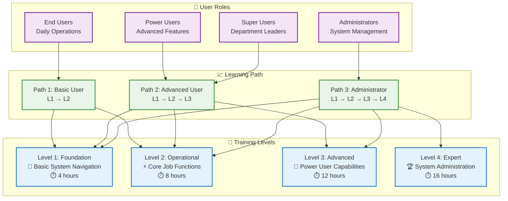

# Business User Training Program Framework
## Comprehensive User Competency & Skill Development Program

---

## 🎯 Executive Summary

This Training Program Framework provides a **comprehensive, structured approach** to user education and competency development that directly supports the operational readiness objectives identified in the critical analysis. The program addresses the gap between technical system delivery and actual business user capability to operate the AI Video Analytics Platform effectively.

### **Training Philosophy**
- **Competency-Based**: Focus on demonstrable skills and practical application
- **Progressive Learning**: Build from basic to advanced capabilities systematically
- **Business-Centric**: Emphasize business value and practical application
- **Multi-Modal Delivery**: Blend of formats to accommodate different learning styles
- **Continuous Support**: Ongoing reinforcement and skill development

### **Training Program Goals**
| **Objective** | **Success Metric** | **Business Impact** |
|---------------|-------------------|-------------------|
| **User Competency** | 95% pass rate on practical assessments | Effective system utilization |
| **Adoption Rate** | 80% active usage within 30 days | Maximized ROI and value realization |
| **Productivity** | <10% productivity loss during transition | Minimal business disruption |
| **Satisfaction** | 4.5/5 training effectiveness rating | High user confidence and engagement |
| **Retention** | 90% skill retention after 6 months | Sustainable operational capability |

---

## 📚 Training Program Architecture

### **Multi-Tier Learning Framework**


### **Competency Mapping by Role**
```yaml
ROLE_COMPETENCY_MATRIX:

END_USER_COMPETENCIES:
  Essential_Skills:
    - System login and basic navigation
    - Live video feed monitoring
    - Alert acknowledgment and basic response
    - Basic reporting and data export
    - Escalation procedures and help-seeking

  Performance_Standards:
    - Complete daily monitoring tasks independently
    - Respond to alerts within defined timeframes
    - Generate required reports accurately
    - Follow security and compliance procedures
    - Demonstrate 80% accuracy in job tasks

POWER_USER_COMPETENCIES:
  Advanced_Skills:
    - Complex alert configuration and management
    - Advanced analytics and trend analysis
    - Custom report creation and scheduling
    - Multi-stream coordination and management
    - Basic troubleshooting and problem resolution

  Performance_Standards:
    - Configure advanced system features
    - Analyze data trends and provide insights
    - Create custom reports for management
    - Support other users with guidance
    - Achieve 90% accuracy in complex tasks

ADMINISTRATOR_COMPETENCIES:
  Expert_Skills:
    - User account management and permissions
    - System configuration and customization
    - Performance monitoring and optimization
    - Integration management and troubleshooting
    - Training delivery and user support

  Performance_Standards:
    - Manage system configurations independently
    - Resolve 85% of technical issues without escalation
    - Deliver effective training to other users
    - Maintain system performance and availability
    - Ensure compliance with security policies
```

---

## 📖 Level 1: Foundation Training (4 Hours)

### **Module Overview: System Navigation Basics**
```yaml
TARGET_AUDIENCE: "All system users (mandatory for everyone)"
DELIVERY_FORMAT: "In-person workshop with hands-on practice"
CLASS_SIZE: "8-12 participants maximum for effective interaction"
PREREQUISITES: "Basic computer literacy, job role orientation"

SESSION_1_SYSTEM_INTRODUCTION (2 hours):
  Learning_Objectives:
    - Navigate the main system interface confidently
    - Access and interpret the primary dashboard
    - Understand basic security and login procedures
    - Identify key system components and their purposes

  Content_Outline:
    Hour_1_System_Overview:
      - Platform introduction and business value (15 min)
      - Login process and security requirements (15 min)
      - Main dashboard tour and customization (15 min)
      - Navigation menu and key sections (15 min)

    Hour_2_Basic_Operations:
      - Live video feed access and controls (20 min)
      - Basic alert system overview (20 min)
      - System preferences and user settings (20 min)

  Hands_On_Activities:
    - Guided system login and navigation exercise
    - Dashboard customization practice
    - Basic video feed interaction
    - Personal settings configuration

SESSION_2_CORE_FUNCTIONS (2 hours):
  Learning_Objectives:
    - Monitor live video feeds effectively
    - Recognize and respond to basic alerts
    - Access help resources and support
    - Follow basic security procedures

  Content_Outline:
    Hour_1_Monitoring_Basics:
      - Live feed monitoring techniques (20 min)
      - Basic alert recognition and acknowledgment (20 min)
      - Recording and playback basics (20 min)

    Hour_2_Support_and_Safety:
      - Help system and documentation access (15 min)
      - Escalation procedures and contacts (15 min)
      - Basic troubleshooting steps (15 min)
      - Security and compliance requirements (15 min)

  Practical_Assessment:
    - Demonstrate successful system login and navigation
    - Complete basic monitoring task simulation
    - Acknowledge and respond to test alerts
    - Access help resources and escalate appropriately
```

### **Learning Materials & Resources**
```yaml
TRAINING_MATERIALS:

PRINTED_MATERIALS:
  Quick_Reference_Guide: "Laminated 2-page reference for desk use"
  User_Handbook: "Comprehensive 20-page guide with screenshots"
  Workflow_Checklists: "Step-by-step task completion guides"
  Emergency_Procedures: "Emergency contact and escalation procedures"

DIGITAL_RESOURCES:
  Video_Tutorials: "5-minute micro-learning videos for key tasks"
  Interactive_Demos: "Self-paced software simulations"
  Knowledge_Base: "Searchable online help system"
  FAQ_Database: "Common questions and answers"

ASSESSMENT_TOOLS:
  Practical_Checklist: "Hands-on task completion verification"
  Knowledge_Quiz: "10-question comprehension assessment"
  Competency_Rubric: "Skill demonstration evaluation criteria"
  Confidence_Survey: "Self-assessment of readiness and confidence"
```

---

## ⚡ Level 2: Operational Training (8 Hours)

### **Module Overview: Core Job Functions**
```yaml
TARGET_AUDIENCE: "Regular system users performing daily operations"
DELIVERY_FORMAT: "Mixed format - 2 classroom sessions + 1 practical workshop"
CLASS_SIZE: "6-10 participants for intensive skill development"
PREREQUISITES: "Level 1 completion with passing assessment"

SESSION_1_ADVANCED_MONITORING (3 hours):
  Learning_Objectives:
    - Configure and manage multiple video streams
    - Set up and manage advanced alert systems
    - Perform efficient incident response procedures
    - Coordinate with team members on system activities

  Content_Outline:
    Hour_1_Multi_Stream_Management:
      - Multiple feed layout and organization (20 min)
      - Stream prioritization and focus techniques (20 min)
      - Performance optimization for multiple streams (20 min)

    Hour_2_Advanced_Alerting:
      - Alert customization and threshold setting (20 min)
      - Alert prioritization and escalation rules (20 min)
      - Team coordination and communication protocols (20 min)

    Hour_3_Incident_Response:
      - Systematic incident assessment procedures (20 min)
      - Evidence collection and documentation (20 min)
      - Communication and escalation protocols (20 min)

SESSION_2_DATA_AND_REPORTING (3 hours):
  Learning_Objectives:
    - Generate standard reports efficiently
    - Interpret data and identify trends
    - Export data for external use
    - Maintain accurate records and documentation

  Content_Outline:
    Hour_1_Standard_Reporting:
      - Pre-built report access and generation (20 min)
      - Report customization and filtering (20 min)
      - Scheduling and automated reporting (20 min)

    Hour_2_Data_Analysis:
      - Basic data interpretation and trends (20 min)
      - Performance metrics and KPIs (20 min)
      - Comparative analysis techniques (20 min)

    Hour_3_Documentation:
      - Incident documentation standards (20 min)
      - Record keeping and audit requirements (20 min)
      - Data export and sharing procedures (20 min)

SESSION_3_PRACTICAL_WORKSHOP (2 hours):
  Learning_Objectives:
    - Apply all learned skills in realistic scenarios
    - Demonstrate proficiency under time pressure
    - Collaborate effectively with team members
    - Handle complex multi-task situations

  Workshop_Activities:
    Scenario_1_Normal_Operations (30 min):
      - Multi-stream monitoring simulation
      - Routine reporting and documentation
      - Standard alert handling and response

    Scenario_2_Incident_Management (30 min):
      - High-priority incident simulation
      - Evidence collection and documentation
      - Team coordination and escalation

    Scenario_3_System_Issues (30 min):
      - Technical problem identification
      - Troubleshooting and problem resolution
      - Help-seeking and escalation procedures

    Final_Assessment (30 min):
      - Comprehensive practical evaluation
      - Individual competency demonstration
      - Performance feedback and improvement planning
```

### **Competency Assessment Framework**
```yaml
ASSESSMENT_METHODOLOGY:

PRACTICAL_ASSESSMENT (70% of grade):
  Task_Simulation: "Complete realistic job tasks under observation"
  Time_Performance: "Complete tasks within specified timeframes"
  Quality_Standards: "Meet accuracy and completeness requirements"
  Problem_Solving: "Handle unexpected situations appropriately"

KNOWLEDGE_ASSESSMENT (20% of grade):
  Written_Test: "25-question exam covering key concepts"
  Scenario_Analysis: "Analyze and respond to written scenarios"
  Policy_Understanding: "Demonstrate understanding of procedures"
  Safety_Compliance: "Show knowledge of security requirements"

BEHAVIORAL_ASSESSMENT (10% of grade):
  Communication: "Effective communication during exercises"
  Collaboration: "Work effectively with team members"
  Professional_Conduct: "Follow professional standards"
  Learning_Attitude: "Demonstrate engagement and improvement"

PASSING_CRITERIA:
  Minimum_Score: "80% overall with no section below 70%"
  Practical_Requirement: "Must demonstrate all core competencies"
  Remediation: "Additional training for scores 70-79%"
  Certification: "Certificate awarded for scores 80%+"
```

---

## 🚀 Level 3: Advanced Training (12 Hours)

### **Module Overview: Power User Capabilities**
```yaml
TARGET_AUDIENCE: "Power users, team leaders, department champions"
DELIVERY_FORMAT: "3-day intensive workshop with project-based learning"
CLASS_SIZE: "4-8 participants for personalized attention"
PREREQUISITES: "Level 2 completion with score >85%"

DAY_1_ADVANCED_CONFIGURATION (4 hours):
  Morning_Session_System_Customization (2 hours):
    - Advanced dashboard design and layout
    - Custom alert configuration and automation
    - Integration with external systems and workflows
    - Performance optimization and tuning

  Afternoon_Session_Analytics_Configuration (2 hours):
    - Advanced reporting configuration
    - Custom analytics and KPI development
    - Data visualization and dashboard creation
    - Automated analysis and scheduling

DAY_2_BUSINESS_INTELLIGENCE (4 hours):
  Morning_Session_Data_Analysis (2 hours):
    - Advanced trend analysis and forecasting
    - Comparative analysis and benchmarking
    - Statistical analysis and interpretation
    - Business insight development and communication

  Afternoon_Session_Strategic_Reporting (2 hours):
    - Executive dashboard creation
    - Strategic report development
    - Business case analysis and ROI calculation
    - Presentation and communication skills

DAY_3_LEADERSHIP_AND_TRAINING (4 hours):
  Morning_Session_User_Support (2 hours):
    - Peer training and mentoring techniques
    - Troubleshooting and problem resolution
    - Change management and adoption support
    - Knowledge transfer and documentation

  Afternoon_Session_Project_Capstone (2 hours):
    - Individual capstone project presentation
    - Peer review and feedback
    - Best practice sharing and discussion
    - Advanced certification assessment
```

### **Project-Based Learning Component**
```yaml
CAPSTONE_PROJECT_REQUIREMENTS:

PROJECT_SCOPE:
  Duration: "2-week project between Day 2 and Day 3"
  Objective: "Solve real business problem using advanced system capabilities"
  Deliverables: "Analysis, recommendations, presentation, implementation plan"
  Evaluation: "Technical competency, business value, presentation quality"

PROJECT_OPTIONS:
  Process_Improvement:
    - Identify operational inefficiency
    - Design system-based solution
    - Implement and measure improvement
    - Present business case and ROI

  Advanced_Analytics:
    - Develop custom analytics framework
    - Create executive dashboard
    - Analyze historical data for insights
    - Present strategic recommendations

  Training_Program:
    - Design training module for specific need
    - Create materials and assessment tools
    - Pilot training with user group
    - Present training effectiveness results

  Integration_Project:
    - Design integration with external system
    - Develop workflow automation
    - Test and validate integration
    - Present efficiency and value gains
```

---

## 🏆 Level 4: Expert/Administrator Training (16 Hours)

### **Module Overview: System Administration & Leadership**
```yaml
TARGET_AUDIENCE: "System administrators, technical leads, training coordinators"
DELIVERY_FORMAT: "4-day intensive program with mentoring component"
CLASS_SIZE: "2-6 participants for expert-level development"
PREREQUISITES: "Level 3 completion + technical background assessment"

DAY_1_SYSTEM_ADMINISTRATION (4 hours):
  Advanced_Configuration_Management:
    - User account and permission management
    - System security configuration and maintenance
    - Performance monitoring and optimization
    - Backup and disaster recovery procedures

DAY_2_TECHNICAL_SUPPORT (4 hours):
  Support_and_Troubleshooting:
    - Advanced troubleshooting methodologies
    - Technical problem diagnosis and resolution
    - Vendor coordination and escalation management
    - Documentation and knowledge management

DAY_3_TRAINING_DELIVERY (4 hours):
  Train_the_Trainer_Certification:
    - Adult learning principles and methodologies
    - Training design and curriculum development
    - Delivery techniques and engagement strategies
    - Assessment and feedback methodologies

DAY_4_PROGRAM_MANAGEMENT (4 hours):
  Change_Leadership:
    - Change management and adoption strategies
    - Performance measurement and improvement
    - Program coordination and resource management
    - Strategic planning and roadmap development
```

---

## 📊 Training Delivery Methods & Modalities

### **Blended Learning Approach**
```yaml
DELIVERY_MODALITIES:

IN_PERSON_WORKSHOPS:
  Advantages: "Hands-on practice, immediate feedback, peer interaction"
  Best_For: "Core competency building, practical assessments, team building"
  Resource_Requirements: "Training facility, equipment, instructors, materials"
  Scheduling: "Full-day or half-day intensive sessions"

ONLINE_LEARNING_PLATFORM:
  Advantages: "Self-paced, accessible 24/7, cost-effective, scalable"
  Best_For: "Knowledge transfer, reference materials, refresher training"
  Resource_Requirements: "LMS platform, content development, technical support"
  Features: "Video content, interactive modules, progress tracking, assessments"

VIRTUAL_CLASSROOMS:
  Advantages: "Real-time interaction, geographic flexibility, cost savings"
  Best_For: "Follow-up sessions, Q&A, group discussions, expert presentations"
  Resource_Requirements: "Video conferencing platform, interactive tools"
  Scheduling: "Shorter sessions (1-2 hours) with high interactivity"

ON_THE_JOB_MENTORING:
  Advantages: "Real-world application, personalized guidance, immediate relevance"
  Best_For: "Skill reinforcement, advanced techniques, problem-solving"
  Resource_Requirements: "Trained mentors, structured programs, time allocation"
  Structure: "Formal mentoring relationships with defined objectives"
```

### **Learning Technology Stack**
```yaml
TECHNOLOGY_INFRASTRUCTURE:

LEARNING_MANAGEMENT_SYSTEM:
  Platform: "Moodle, Canvas, or equivalent enterprise LMS"
  Features: "Course delivery, progress tracking, assessment tools, reporting"
  Integration: "SSO integration, user data synchronization, mobile access"
  Analytics: "Learning analytics, completion tracking, performance measurement"

CONTENT_AUTHORING_TOOLS:
  Video_Production: "Professional video recording and editing capabilities"
  Interactive_Content: "Articulate, Captivate for interactive modules"
  Simulation_Software: "Screen recording and software simulation tools"
  Assessment_Tools: "Quiz and assessment creation with automated scoring"

VIRTUAL_TRAINING_PLATFORM:
  Video_Conferencing: "Zoom, Teams, or equivalent with breakout rooms"
  Interactive_Features: "Polling, whiteboard, screen sharing, recording"
  Collaboration_Tools: "Group work, document sharing, project collaboration"
  Mobile_Support: "Mobile app access for flexible learning"
```

---

## 📈 Training Program Management

### **Program Administration Framework**
```yaml
PROGRAM_MANAGEMENT_STRUCTURE:

TRAINING_TEAM_ROLES:
  Training_Manager:
    Responsibilities: "Program strategy, resource allocation, vendor management"
    Qualifications: "Training management experience, project management skills"
    Time_Commitment: "1.0 FTE during implementation, 0.5 FTE ongoing"

  Lead_Trainer:
    Responsibilities: "Curriculum development, instructor training, quality assurance"
    Qualifications: "Subject matter expertise, instructional design experience"
    Time_Commitment: "1.0 FTE during development, 0.8 FTE during delivery"

  Subject_Matter_Experts:
    Responsibilities: "Content development, technical expertise, specialized training"
    Qualifications: "Deep system knowledge, training aptitude"
    Time_Commitment: "0.3 FTE each, 2-3 experts needed"

  Training_Coordinators:
    Responsibilities: "Scheduling, logistics, participant management, reporting"
    Qualifications: "Organizational skills, customer service orientation"
    Time_Commitment: "0.5 FTE each, 1-2 coordinators needed"

QUALITY_ASSURANCE_PROCESS:
  Content_Review: "SME review of all training materials for accuracy"
  Instructional_Design_Review: "Learning design expert review for effectiveness"
  Pilot_Testing: "Pilot delivery with feedback and refinement"
  Continuous_Improvement: "Regular review and update based on feedback"
```

### **Training Scheduling Strategy**
```yaml
SCHEDULING_FRAMEWORK:

PHASE_1_TRAINING_ROLLOUT:
  Month_1_Preparation: "Training team setup, material finalization"
  Month_2_Pilot: "Pilot training with champions and early adopters"
  Month_3_4_Core_Rollout: "Level 1 and 2 training for all users"
  Month_5_6_Advanced: "Level 3 and 4 training for power users"

ONGOING_TRAINING_SCHEDULE:
  New_Employee_Onboarding: "Level 1 training within first month"
  Refresher_Training: "Annual refresher for all users"
  Advanced_Skills: "Quarterly advanced training opportunities"
  Just_in_Time: "On-demand training for new features and updates"

SCHEDULING_CONSIDERATIONS:
  Business_Impact: "Schedule around peak business periods"
  Department_Coordination: "Coordinate with department managers"
  Resource_Availability: "Balance training resources across periods"
  User_Preferences: "Accommodate user scheduling preferences where possible"
```

---

## 📊 Assessment & Certification Program

### **Competency-Based Certification**
```yaml
CERTIFICATION_FRAMEWORK:

CERTIFICATION_LEVELS:
  Basic_User_Certification:
    Requirements: "Level 1 completion + 80% assessment score"
    Validity: "2 years with annual refresher requirement"
    Benefits: "System access authorization, job role qualification"

  Operational_User_Certification:
    Requirements: "Level 2 completion + 85% assessment score + practical demonstration"
    Validity: "3 years with skills validation requirement"
    Benefits: "Advanced system access, peer support role qualification"

  Power_User_Certification:
    Requirements: "Level 3 completion + 90% assessment + successful capstone project"
    Validity: "3 years with continuing education requirement"
    Benefits: "Advanced features access, training assistant qualification"

  Expert_Administrator_Certification:
    Requirements: "Level 4 completion + comprehensive assessment + mentoring practicum"
    Validity: "5 years with professional development requirement"
    Benefits: "Full system access, trainer qualification, leadership recognition"

ASSESSMENT_STANDARDS:
  Reliability: "Consistent assessment standards across all sessions"
  Validity: "Assessments accurately measure job-relevant competencies"
  Fairness: "Equal opportunity for success regardless of background"
  Transparency: "Clear expectations and grading criteria"
```

### **Continuous Learning & Development**
```yaml
ONGOING_DEVELOPMENT:

SKILL_MAINTENANCE:
  Annual_Refresher: "1-day refresher training for all certified users"
  Skills_Validation: "Practical skills check every 2 years"
  New_Feature_Training: "Training on system updates and new capabilities"
  Best_Practice_Sharing: "Quarterly sessions for experience sharing"

ADVANCEMENT_OPPORTUNITIES:
  Career_Path_Development: "Clear progression path through certification levels"
  Leadership_Development: "Management and leadership training for advanced users"
  Specialization_Training: "Deep expertise in specific system areas"
  Train_the_Trainer: "Development of internal training capabilities"

RECOGNITION_PROGRAM:
  Excellence_Awards: "Recognition for outstanding training performance"
  Champion_Recognition: "Special recognition for peer support and mentoring"
  Innovation_Awards: "Recognition for creative use of system capabilities"
  Professional_Development: "Conference attendance and external training opportunities"
```

---

## 📈 Training Effectiveness Measurement

### **Kirkpatrick Model Implementation**
```yaml
FOUR_LEVEL_EVALUATION:

LEVEL_1_REACTION:
  Measurement: "Post-training satisfaction surveys"
  Metrics: "Training effectiveness, instructor quality, material relevance"
  Target: "4.5/5 average satisfaction score"
  Collection: "Immediately after each training session"

LEVEL_2_LEARNING:
  Measurement: "Knowledge and skill assessments"
  Metrics: "Test scores, practical demonstration competency"
  Target: "90% pass rate on assessments"
  Collection: "During and immediately after training"

LEVEL_3_BEHAVIOR:
  Measurement: "On-job performance observation and metrics"
  Metrics: "System usage, task completion, error rates"
  Target: "80% of trained users actively using system within 30 days"
  Collection: "30, 60, 90 days post-training"

LEVEL_4_RESULTS:
  Measurement: "Business impact and ROI measurement"
  Metrics: "Productivity gains, error reduction, process improvement"
  Target: "20% improvement in operational efficiency"
  Collection: "6 months and 1 year post-training"
```

### **Training Analytics Dashboard**
```yaml
KEY_PERFORMANCE_INDICATORS:

PARTICIPATION_METRICS:
  Training_Completion_Rate: "Percentage of intended users completing training"
  Attendance_Rate: "Average attendance across all training sessions"
  No_Show_Rate: "Percentage of registered participants not attending"
  Cancellation_Rate: "Training session cancellations due to low enrollment"

PERFORMANCE_METRICS:
  Assessment_Pass_Rate: "Percentage of participants passing assessments"
  First_Attempt_Success: "Percentage passing on first attempt"
  Skill_Demonstration: "Percentage successfully demonstrating competencies"
  Certification_Achievement: "Percentage achieving certification"

BUSINESS_IMPACT_METRICS:
  User_Adoption_Rate: "Percentage of trained users actively using system"
  Productivity_Impact: "Measured productivity change post-training"
  Support_Ticket_Reduction: "Reduction in training-related support requests"
  User_Satisfaction: "System usage satisfaction scores"
```

---

## 💰 Training Program Budget & Resources

### **Comprehensive Budget Breakdown**
```yaml
TOTAL_TRAINING_INVESTMENT: "$75,000 (Phase 1-3)"

PHASE_1_TRAINING_COSTS: "$25,000"
  Training_Team_Setup: "$10,000"
    - Training manager (2 months @ $8,000/month): "$4,000"
    - Lead trainer (2 months @ $6,000/month): "$3,000"
    - Content development contractors: "$3,000"

  Training_Materials_Development: "$8,000"
    - Instructional design and content creation: "$5,000"
    - Video production and multimedia: "$2,000"
    - Printed materials and resources: "$1,000"

  Training_Delivery: "$5,000"
    - Facility rental and equipment: "$2,000"
    - Trainer fees and expenses: "$2,000"
    - Participant materials and supplies: "$1,000"

  Technology_Platform: "$2,000"
    - LMS setup and configuration: "$1,000"
    - Assessment tools and platforms: "$500"
    - Video conferencing and virtual tools: "$500"

ONGOING_TRAINING_COSTS: "$25,000/year"
  Staff_Costs: "$18,000/year"
    - Training coordinator (0.5 FTE): "$15,000"
    - Subject matter expert time: "$3,000"

  Material_Updates: "$3,000/year"
    - Content updates and refreshers: "$2,000"
    - New feature training development: "$1,000"

  Platform_Maintenance: "$2,000/year"
    - LMS licensing and maintenance: "$1,500"
    - Technology platform subscriptions: "$500"

  Assessment_and_Certification: "$2,000/year"
    - Assessment administration: "$1,000"
    - Certification management: "$1,000"
```

### **Resource Requirements**
```yaml
HUMAN_RESOURCES:

INTERNAL_RESOURCES:
  Training_Manager: "Program management, strategy, vendor management"
  Subject_Matter_Experts: "Content development, specialized training delivery"
  Department_Champions: "Peer support, reinforcement, feedback collection"
  IT_Support: "Technical support, platform management, integration"

EXTERNAL_RESOURCES:
  Instructional_Designers: "Curriculum development, learning design expertise"
  Content_Developers: "Video production, interactive content creation"
  Professional_Trainers: "Specialized training delivery, assessment development"
  Technology_Vendors: "LMS platform, assessment tools, virtual training platforms"

INFRASTRUCTURE_RESOURCES:
  Training_Facilities: "Classroom space with technology and equipment"
  Technology_Infrastructure: "Computers, projectors, internet, software access"
  Learning_Management_System: "Platform for content delivery and tracking"
  Assessment_Tools: "Online testing, certification management, analytics"
```

---

## 📅 Implementation Timeline & Milestones

### **Training Program Rollout Schedule**
```yaml
PRE_IMPLEMENTATION_PHASE (Month -2 to 0):
  Month_-2: "Training team recruitment and setup"
  Month_-1: "Content development and material creation"
  Month_0: "Pilot testing and program finalization"

PHASE_1_ROLLOUT (Months 1-6):
  Month_1: "Champion training and trainer certification"
  Month_2: "Department manager briefings and scheduling"
  Month_3-4: "Level 1 and 2 training for all users"
  Month_5-6: "Level 3 training for power users, assessment completion"

PHASE_2_EXPANSION (Months 6-18):
  Month_6-9: "Advanced training delivery, expert development"
  Month_10-12: "Train-the-trainer programs, internal capability building"
  Month_13-18: "Ongoing support, refresher training, new hire onboarding"

PHASE_3_SUSTAINABILITY (Months 18-36):
  Month_18-24: "Full internal training capability, continuous improvement"
  Month_25-36: "Advanced specialization, leadership development, excellence"
```

### **Critical Success Milestones**
```yaml
MONTH_3_MILESTONE:
  - 90% of intended users enrolled in training
  - Level 1 training completion rate >95%
  - Average satisfaction score >4.2/5
  - Champion network fully activated

MONTH_6_MILESTONE:
  - 85% completion rate for all required training
  - 80% pass rate on practical assessments
  - User adoption rate >70%
  - Support ticket reduction >30%

MONTH_12_MILESTONE:
  - 90% of users achieving required certifications
  - Internal training capability fully operational
  - Business impact measurements positive
  - Sustainable training program established
```

---

## 🎯 Success Factors & Best Practices

### **Critical Success Enablers**
```yaml
ORGANIZATIONAL_SUPPORT:
  Executive_Sponsorship: "Visible leadership support and resource commitment"
  Manager_Engagement: "Active manager participation and reinforcement"
  Dedicated_Resources: "Sufficient time, budget, and personnel allocation"
  Integration_with_Performance: "Training tied to job performance and advancement"

PROGRAM_DESIGN_EXCELLENCE:
  Competency_Based: "Focus on job-relevant skills and practical application"
  Progressive_Learning: "Systematic skill building from basic to advanced"
  Multiple_Modalities: "Blend of learning formats for different preferences"
  Continuous_Improvement: "Regular feedback and program enhancement"

QUALITY_DELIVERY:
  Expert_Instructors: "Knowledgeable, engaging, and effective trainers"
  Relevant_Content: "Job-specific, practical, and immediately applicable"
  Interactive_Learning: "Hands-on practice and active participation"
  Timely_Delivery: "Training available when and where needed"
```

### **Risk Mitigation Strategies**
```yaml
COMMON_TRAINING_RISKS:

LOW_PARTICIPATION:
  Risk: "Poor attendance and engagement"
  Mitigation: "Management reinforcement, convenient scheduling, incentives"
  Monitoring: "Attendance tracking and proactive outreach"

POOR_RETENTION:
  Risk: "Skills not retained over time"
  Mitigation: "Refresher training, job aids, ongoing reinforcement"
  Monitoring: "Skills assessment and performance measurement"

INADEQUATE_TRANSFER:
  Risk: "Learning not applied on the job"
  Mitigation: "Manager support, practice opportunities, performance integration"
  Monitoring: "Behavior observation and performance metrics"
```

---

**The Business User Training Program Framework provides a comprehensive, structured approach to developing user competency and ensuring successful adoption of the AI Video Analytics Platform. Through progressive skill building, multiple learning modalities, and continuous support, the program maximizes user capability and business value realization.**

---

**Document Status**: Approved for Implementation
**Training Owner**: HR Director and Training Manager
**Implementation Owner**: Training Team and Department Managers
**Next Review**: 30 days after training program launch
**Success Criteria**: 95% completion rate, 80% user adoption, 4.5/5 satisfaction, measurable business impact