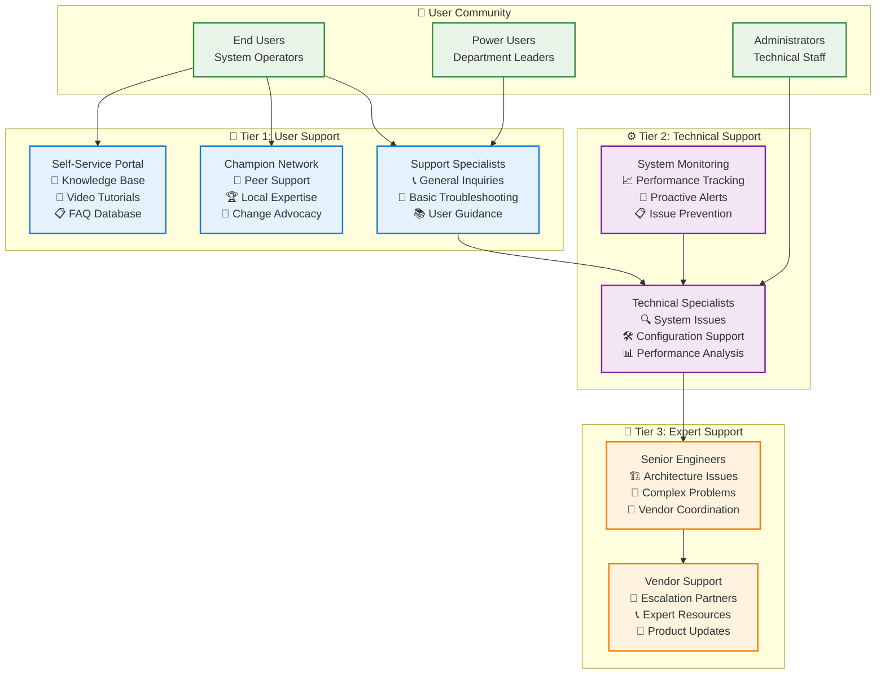

# Support Model with Realistic Staffing
## Comprehensive Operational Excellence & Service Management Framework

---

## 🎯 Executive Summary

This Support Model Framework addresses the **critical operational readiness gap** by establishing a **realistic, sustainable support structure** that ensures reliable operation of the AI Video Analytics Platform. The model provides comprehensive user support while maintaining cost efficiency and operational excellence throughout all implementation phases.

### **Support Philosophy**
- **User-Centric Service**: Support designed around user needs and business priorities
- **Proactive Approach**: Prevent issues before they impact business operations
- **Scalable Structure**: Support capability that grows with system complexity and usage
- **Cost-Effective**: Optimal resource allocation for maximum service effectiveness
- **Continuous Improvement**: Ongoing optimization based on performance data

### **Support Model Goals**
| **Objective** | **Target Metric** | **Business Impact** |
|---------------|------------------|-------------------|
| **Availability** | 99% support availability | Minimal business disruption |
| **Response Time** | <2 hours for user issues | High user satisfaction |
| **Resolution Rate** | 85% first-call resolution | Efficient problem solving |
| **User Satisfaction** | >4.5/5 support rating | Strong user confidence |
| **Cost Efficiency** | <15% of platform TCO | Sustainable operations |

---

## 🏗️ Support Model Architecture

### **Three-Tier Support Structure**


---

## 🎯 Tier 1: User Support (Front-Line Service)

### **Service Definition & Scope**
```yaml
TIER_1_RESPONSIBILITIES:
  User_Support:
    - Account access and password issues
    - Basic system navigation guidance
    - Standard feature usage questions
    - Report generation assistance
    - Basic troubleshooting and diagnostics

  Issue_Management:
    - Incident logging and categorization
    - Initial problem assessment
    - Resolution of common issues
    - Escalation to appropriate tier
    - Follow-up and closure confirmation

  User_Enablement:
    - New user onboarding support
    - Feature introduction and guidance
    - Best practice recommendations
    - Training resource direction
    - Change communication support

SERVICE_LEVEL_COMMITMENTS:
  Response_Time: "2 hours for all user inquiries"
  Resolution_Target: "80% of issues resolved at Tier 1"
  Availability: "Business hours + emergency escalation"
  Quality_Standard: ">4.5/5 user satisfaction rating"
```

### **Realistic Staffing Model**
```yaml
TIER_1_STAFFING_STRATEGY:

PHASE_1_STAFFING (2 FTE):
  Support_Specialist_1:
    Role: "Primary user support and issue resolution"
    Schedule: "Monday-Friday, 8 AM - 5 PM"
    Qualifications: "Customer service experience, basic technical aptitude"
    Responsibilities: "User support, issue logging, basic troubleshooting"
    Salary_Range: "$45,000 - $55,000/year"

  Support_Specialist_2:
    Role: "Secondary support and coverage"
    Schedule: "Monday-Friday, 9 AM - 6 PM (1-hour overlap)"
    Qualifications: "Similar to Specialist 1, plus training capability"
    Responsibilities: "User support, training assistance, knowledge base maintenance"
    Salary_Range: "$45,000 - $55,000/year"

  On_Call_Coverage:
    Structure: "Rotating on-call between specialists"
    Hours: "Evenings, weekends, holidays"
    Response: "Emergency issues only, 4-hour response"
    Compensation: "On-call stipend + overtime for actual calls"

PHASE_2_SCALING (3 FTE):
  Additional_Support_Specialist:
    Role: "Expanded coverage and specialized support"
    Schedule: "Flexible scheduling for extended coverage"
    Focus: "Advanced user support, champion coordination"
    Salary_Range: "$50,000 - $60,000/year"

PHASE_3_ENTERPRISE (4-5 FTE):
  Support_Team_Lead:
    Role: "Team management and escalation coordination"
    Qualifications: "Leadership experience, advanced technical knowledge"
    Responsibilities: "Team leadership, quality assurance, process improvement"
    Salary_Range: "$65,000 - $75,000/year"

  Specialized_Support_Roles:
    Training_Support_Specialist: "Focus on user training and enablement"
    Integration_Support_Specialist: "Focus on system integrations and workflows"
```

### **Self-Service Portal Strategy**
```yaml
SELF_SERVICE_CAPABILITIES:

KNOWLEDGE_BASE_SYSTEM:
  Content_Categories:
    - System navigation and basic operations
    - Common tasks and workflow guides
    - Troubleshooting and error resolution
    - Feature documentation and best practices
    - Integration guides and API documentation

  Content_Management:
    - Regular content updates and maintenance
    - User feedback integration and improvements
    - Search optimization and content tagging
    - Multi-format content (text, video, interactive)

  User_Experience:
    - Intuitive search and navigation
    - Mobile-responsive design
    - Personalized content recommendations
    - Community contributions and ratings

VIDEO_TUTORIAL_LIBRARY:
  Content_Strategy:
    - 3-5 minute micro-learning videos for specific tasks
    - Step-by-step visual guidance
    - Regular updates for new features
    - Multiple difficulty levels (basic to advanced)

  Production_Quality:
    - Professional video production standards
    - Clear narration and visual quality
    - Consistent branding and formatting
    - Accessibility features (captions, transcripts)

INTERACTIVE_HELP_SYSTEM:
  Features:
    - Context-sensitive help within application
    - Interactive tutorials and guided tours
    - Smart help suggestions based on user behavior
    - Integration with support ticket system
```

---

## ⚙️ Tier 2: Technical Support (System Specialists)

### **Service Definition & Advanced Capabilities**
```yaml
TIER_2_RESPONSIBILITIES:
  Technical_Issue_Resolution:
    - System configuration and customization
    - Performance troubleshooting and optimization
    - Integration issues and API problems
    - Data quality and processing issues
    - Advanced feature configuration

  System_Administration:
    - User account and permission management
    - System health monitoring and maintenance
    - Backup and recovery operations
    - Security configuration and compliance
    - Vendor coordination and relationship management

  Proactive_Support:
    - System performance monitoring
    - Preventive maintenance procedures
    - Capacity planning and resource optimization
    - Security monitoring and threat response
    - Change management and release support

SERVICE_LEVEL_COMMITMENTS:
  Response_Time: "4 hours for technical issues"
  Resolution_Target: "75% of escalated issues resolved at Tier 2"
  Availability: "Business hours + critical issue escalation"
  Expertise_Level: "Advanced system knowledge and troubleshooting"
```

### **Technical Support Staffing**
```yaml
TIER_2_STAFFING_MODEL:

PHASE_1_TECHNICAL_SUPPORT (1.5 FTE):
  Senior_Support_Engineer:
    Role: "Primary technical support and system administration"
    Schedule: "Monday-Friday, core business hours"
    Qualifications: "3+ years technical support, system administration experience"
    Skills: "Linux/Windows, databases, networking, video processing basics"
    Responsibilities: "Complex issue resolution, system maintenance, user training"
    Salary_Range: "$65,000 - $80,000/year"

  Part_Time_Technical_Specialist:
    Role: "Additional technical expertise and coverage (0.5 FTE)"
    Schedule: "Flexible schedule, project-based work"
    Qualifications: "Specialized expertise in specific areas (AI/ML, integrations)"
    Responsibilities: "Specialized support, knowledge transfer, documentation"
    Compensation: "$75/hour, approximately 20 hours/week"

PHASE_2_EXPANDED_SUPPORT (2.5 FTE):
  Additional_Technical_Engineer:
    Role: "System scaling and advanced configuration"
    Focus: "Kubernetes, microservices, advanced integrations"
    Qualifications: "DevOps experience, cloud platforms, container orchestration"
    Salary_Range: "$70,000 - $85,000/year"

  AI_ML_Specialist (0.5 FTE):
    Role: "Machine learning and AI model support"
    Qualifications: "ML engineering, computer vision, model optimization"
    Responsibilities: "Model performance, accuracy issues, advanced analytics"
    Compensation: "$90/hour, approximately 20 hours/week"

PHASE_3_ENTERPRISE_SUPPORT (4 FTE):
  Technical_Support_Manager:
    Role: "Technical team leadership and strategic support"
    Qualifications: "Management experience, enterprise architecture knowledge"
    Responsibilities: "Team management, technical strategy, vendor relationships"
    Salary_Range: "$85,000 - $100,000/year"

  Specialized_Support_Engineers:
    Security_Specialist: "Security, compliance, and audit support"
    Integration_Specialist: "External systems and API integration support"
    Performance_Specialist: "System optimization and scalability support"
```

### **Proactive Monitoring & Maintenance**
```yaml
MONITORING_FRAMEWORK:

SYSTEM_HEALTH_MONITORING:
  Infrastructure_Monitoring:
    - Server performance, capacity, and availability
    - Database performance and optimization
    - Network connectivity and bandwidth utilization
    - Storage capacity and performance metrics

  Application_Monitoring:
    - Video processing performance and quality
    - API response times and error rates
    - User session activity and performance
    - Integration status and data flow monitoring

  Business_Process_Monitoring:
    - Alert processing and response times
    - Report generation and distribution
    - User activity patterns and adoption metrics
    - Business KPI tracking and alerting

PREVENTIVE_MAINTENANCE:
  Scheduled_Maintenance_Tasks:
    - Database optimization and cleanup
    - System updates and security patches
    - Performance tuning and resource optimization
    - Backup verification and recovery testing

  Capacity_Planning:
    - Resource utilization trending and forecasting
    - Storage growth planning and management
    - User growth impact assessment
    - Infrastructure scaling recommendations
```

---

## 🚀 Tier 3: Expert Support (Architecture & Escalation)

### **Expert-Level Service Definition**
```yaml
TIER_3_RESPONSIBILITIES:
  Architecture_and_Design:
    - Complex system architecture issues
    - Advanced troubleshooting and root cause analysis
    - System optimization and performance tuning
    - Integration architecture and design review

  Vendor_and_Partner_Management:
    - Vendor escalation and relationship management
    - Product roadmap discussions and feature requests
    - Technical partnership coordination
    - Service level agreement management

  Strategic_Support:
    - Technology roadmap planning and implementation
    - Risk assessment and mitigation strategies
    - Business continuity and disaster recovery
    - Innovation and emerging technology evaluation

SERVICE_LEVEL_COMMITMENTS:
  Response_Time: "1 hour for critical system failures"
  Availability: "On-call for critical escalations"
  Expertise_Level: "Senior architecture and engineering expertise"
  Resolution_Capability: "Complex problems requiring deep technical knowledge"
```

### **Expert Support Structure**
```yaml
TIER_3_SUPPORT_MODEL:

INTERNAL_EXPERT_RESOURCES:
  Technical_Lead_Availability:
    Role: "Project technical lead providing expert support"
    Availability: "On-call rotation for critical issues"
    Time_Allocation: "20% of time dedicated to support activities"
    Expertise: "Complete system architecture and implementation knowledge"

  Senior_Engineer_On_Call:
    Role: "Senior team member for complex technical issues"
    Schedule: "Rotating on-call schedule among senior engineers"
    Response_Time: "2-hour response for critical escalations"
    Expertise: "Deep technical knowledge in specialized areas"

EXTERNAL_EXPERT_RESOURCES:
  Vendor_Support_Agreements:
    Cloud_Provider: "Enterprise support with dedicated technical account manager"
    AI_ML_Platform: "Premium support with solution architect access"
    Monitoring_Tools: "Professional support with expert consultation"
    Integration_Partners: "Technical support agreements for complex integrations"

  Consulting_Support:
    Architecture_Consultant: "On-demand access to senior architecture expertise"
    Specialized_Contractors: "Expert contractors for specific technical domains"
    Emergency_Support: "24/7 emergency support for critical business issues"

ESCALATION_PROCEDURES:
  Internal_Escalation_Path:
    Level_1: "Tier 2 → Technical Lead (4-hour timeframe)"
    Level_2: "Technical Lead → Senior Engineers (2-hour timeframe)"
    Level_3: "Senior Engineers → External Experts (1-hour timeframe)"
    Executive: "Business-critical issues → Executive team (immediate)"

  Vendor_Escalation_Process:
    Standard_Issues: "Technical Account Manager → Solutions Engineer"
    Critical_Issues: "Emergency escalation → Senior Technical Support"
    Business_Impact: "Account Executive → Senior Management"
```

---

## 📊 Support Performance Management

### **Service Level Agreement (SLA) Framework**
```yaml
COMPREHENSIVE_SLA_STRUCTURE:

RESPONSE_TIME_COMMITMENTS:
  Priority_1_Critical:
    Definition: "System down, major business impact"
    Response_Time: "1 hour"
    Resolution_Target: "4 hours"
    Escalation: "Immediate executive notification"

  Priority_2_High:
    Definition: "Significant functionality impaired"
    Response_Time: "2 hours"
    Resolution_Target: "8 hours"
    Escalation: "Management notification if not resolved in 4 hours"

  Priority_3_Medium:
    Definition: "Minor issues, workarounds available"
    Response_Time: "4 hours"
    Resolution_Target: "24 hours"
    Escalation: "Daily status updates"

  Priority_4_Low:
    Definition: "Enhancement requests, general questions"
    Response_Time: "8 hours"
    Resolution_Target: "5 business days"
    Escalation: "Weekly status reports"

QUALITY_COMMITMENTS:
  First_Call_Resolution: "80% of issues resolved on first contact"
  User_Satisfaction: "Average 4.5/5 rating in post-support surveys"
  Knowledge_Base_Accuracy: "95% accuracy in self-service content"
  Escalation_Rate: "<15% of issues require escalation to higher tier"
```

### **Performance Monitoring & Reporting**
```yaml
SUPPORT_METRICS_DASHBOARD:

OPERATIONAL_METRICS:
  Ticket_Volume: "Number of support requests by category and priority"
  Response_Times: "Average response time by priority level and tier"
  Resolution_Times: "Average resolution time by issue type"
  Escalation_Rates: "Percentage of issues escalated between tiers"

QUALITY_METRICS:
  Customer_Satisfaction: "User satisfaction ratings and feedback"
  First_Call_Resolution: "Percentage of issues resolved on first contact"
  Reopened_Tickets: "Percentage of tickets reopened within 30 days"
  Agent_Performance: "Individual and team performance metrics"

BUSINESS_IMPACT_METRICS:
  System_Availability: "Overall system uptime and performance"
  User_Productivity: "Impact of issues on user productivity"
  Cost_Per_Ticket: "Support cost efficiency and resource utilization"
  Preventive_Actions: "Number of issues prevented through proactive support"

REPORTING_FRAMEWORK:
  Daily_Operations_Report: "Support activity summary and critical issues"
  Weekly_Performance_Report: "SLA compliance and quality metrics"
  Monthly_Business_Review: "Strategic metrics and improvement initiatives"
  Quarterly_Service_Review: "Comprehensive service assessment and planning"
```

---

## 💰 Support Model Budget & Resource Planning

### **Comprehensive Cost Analysis**
```yaml
SUPPORT_MODEL_INVESTMENT:

PHASE_1_SUPPORT_COSTS: "$180,000/year"
  Staff_Costs: "$140,000/year"
    Tier_1_Specialists: "$100,000 (2 FTE @ $50,000 average)"
    Tier_2_Engineer: "$55,000 (1 FTE @ $72,500 including benefits)"
    Part_Time_Technical: "$15,000 (0.5 FTE @ $75/hour)"
    On_Call_Compensation: "$6,000 (stipends and overtime)"

  Technology_Platform: "$25,000/year"
    Help_Desk_System: "$12,000 (ticketing and knowledge management)"
    Monitoring_Tools: "$8,000 (system monitoring and alerting)"
    Communication_Tools: "$3,000 (chat, phone, video conferencing)"
    Training_Resources: "$2,000 (staff development and certification)"

  Infrastructure_Support: "$15,000/year"
    Vendor_Support_Agreements: "$10,000"
    Emergency_Consulting: "$3,000"
    Documentation_Tools: "$2,000"

PHASE_2_SUPPORT_COSTS: "$320,000/year"
  Additional_Staff: "$140,000/year"
    Third_Tier_1_Specialist: "$55,000"
    Additional_Tier_2_Engineer: "$77,500"
    AI_ML_Specialist: "$18,000 (0.5 FTE @ $90/hour)"

  Enhanced_Technology: "$15,000/year additional"
  Advanced_Vendor_Support: "$10,000/year additional"

PHASE_3_ENTERPRISE_COSTS: "$550,000/year"
  Full_Support_Team: "$200,000/year additional"
    Technical_Support_Manager: "$92,500"
    Specialized_Engineers: "$185,000 (3 specialists)"
    Support_Team_Lead: "$70,000"

  Enterprise_Technology_Platform: "$20,000/year additional"
  Premium_Vendor_Agreements: "$15,000/year additional"
```

### **Cost-Benefit Analysis**
```yaml
SUPPORT_ROI_CALCULATION:

COST_OF_POOR_SUPPORT:
  User_Productivity_Loss: "$500,000/year potential impact"
  System_Downtime_Cost: "$50,000/hour business impact"
  User_Satisfaction_Impact: "Reduced adoption and effectiveness"
  Reputation_Risk: "Business relationship and trust impact"

SUPPORT_VALUE_CREATION:
  Productivity_Maintenance: "$400,000/year value preservation"
  Issue_Prevention: "$150,000/year through proactive support"
  User_Enablement: "$200,000/year through effective training and guidance"
  Business_Continuity: "$100,000/year through reliable operations"

NET_VALUE_CALCULATION:
  Phase_1: "Value $850K - Cost $180K = Net Value $670K/year"
  Phase_2: "Value $1.2M - Cost $320K = Net Value $880K/year"
  Phase_3: "Value $2.0M - Cost $550K = Net Value $1.45M/year"

SUPPORT_EFFICIENCY_TARGETS:
  Cost_Per_User: "<$200/user/year in Phase 1"
  Cost_Per_Ticket: "<$50/ticket average resolution cost"
  ROI_Target: "400%+ return on support investment"
```

---

## 🔄 Support Process Integration

### **Integration with Business Processes**
```yaml
BUSINESS_PROCESS_ALIGNMENT:

INCIDENT_MANAGEMENT_INTEGRATION:
  Security_Operations:
    - Automated incident detection and ticket creation
    - Integration with security team escalation procedures
    - Real-time collaboration during security incidents
    - Post-incident analysis and improvement integration

  Facility_Management:
    - Integration with maintenance management systems
    - Automated work order creation for physical issues
    - Coordination with facility management teams
    - Asset management and configuration tracking

  IT_Service_Management:
    - Integration with existing ITSM tools and processes
    - Change management coordination and approval
    - Configuration management database integration
    - Service catalog and request fulfillment

WORKFLOW_AUTOMATION:
  Ticket_Routing: "Intelligent routing based on issue type and expertise"
  Escalation_Management: "Automated escalation based on SLA timers"
  Communication_Automation: "Automated status updates and notifications"
  Knowledge_Management: "Automated knowledge capture and sharing"
```

### **Support Tools & Technology Integration**
```yaml
INTEGRATED_SUPPORT_PLATFORM:

HELP_DESK_SYSTEM:
  Core_Features:
    - Multi-channel support (email, chat, phone, portal)
    - Intelligent ticket routing and assignment
    - SLA management and automated escalation
    - Knowledge base integration and search

  Integration_Requirements:
    - Single sign-on with video analytics platform
    - User account synchronization and management
    - System monitoring integration for proactive tickets
    - Reporting integration with business dashboards

KNOWLEDGE_MANAGEMENT:
  Content_Management_System:
    - Version control and approval workflows
    - Multi-format content support (text, video, interactive)
    - Search optimization and content recommendations
    - User feedback and continuous improvement

  AI_POWERED_ASSISTANCE:
    - Intelligent search and content suggestions
    - Automated answer generation for common questions
    - Chatbot integration for basic query resolution
    - Predictive support based on user behavior patterns
```

---

## 📈 Continuous Improvement Framework

### **Support Excellence Evolution**
```yaml
IMPROVEMENT_METHODOLOGY:

REGULAR_ASSESSMENT_CYCLE:
  Weekly_Team_Reviews:
    - Support metrics analysis and trend identification
    - Issue pattern recognition and root cause analysis
    - Process optimization opportunities
    - Team performance and development needs

  Monthly_Service_Reviews:
    - SLA performance and quality assessment
    - User feedback analysis and action planning
    - Technology platform optimization
    - Resource allocation and efficiency improvement

  Quarterly_Strategic_Reviews:
    - Support model effectiveness and evolution
    - Technology roadmap alignment
    - Resource planning and budget optimization
    - Strategic initiative planning and implementation

KNOWLEDGE_MANAGEMENT_EVOLUTION:
  Content_Optimization:
    - Regular content review and accuracy updates
    - User behavior analysis for content improvement
    - Gap identification and content development
    - Multi-language and accessibility enhancement

  Process_Improvement:
    - Support process streamlining and automation
    - Tool integration and workflow optimization
    - Training program enhancement and delivery
    - Quality assurance and consistency improvement
```

### **Innovation & Technology Advancement**
```yaml
FUTURE_SUPPORT_CAPABILITIES:

AI_POWERED_SUPPORT:
  Predictive_Support: "AI-driven issue prediction and prevention"
  Intelligent_Assistance: "AI-powered support agent assistance"
  Automated_Resolution: "Self-healing systems and automated fixes"
  Personalized_Support: "Customized support based on user patterns"

ADVANCED_ANALYTICS:
  Support_Intelligence: "Advanced analytics for support optimization"
  User_Behavior_Analysis: "Understanding user needs and patterns"
  Performance_Prediction: "Forecasting support needs and capacity"
  Business_Impact_Analysis: "Measuring support impact on business outcomes"
```

---

## 📅 Support Implementation Timeline

### **Phased Support Deployment**
```yaml
SUPPORT_IMPLEMENTATION_SCHEDULE:

PRE_GO_LIVE_PHASE (Months -1 to 0):
  Month_-1:
    - Support staff recruitment and hiring
    - Support technology platform setup and configuration
    - Process documentation and procedure development
    - Initial staff training and certification

  Month_0:
    - Support system testing and integration
    - Knowledge base content development
    - Support team final training and preparation
    - Go-live readiness assessment and approval

PHASE_1_LAUNCH (Months 1-6):
  Month_1:
    - Full support model activation
    - Intensive user support during system launch
    - Issue tracking and rapid response
    - Process refinement based on initial experience

  Months_2-6:
    - Support process optimization and automation
    - Knowledge base expansion and improvement
    - Staff performance development and coaching
    - SLA compliance monitoring and improvement

ONGOING_EVOLUTION (Months 6+):
  - Continuous improvement implementation
  - Advanced support capability development
  - Technology platform enhancement and integration
  - Strategic support model evolution
```

---

## 🎯 Support Success Factors

### **Critical Success Elements**
```yaml
SUCCESS_ENABLERS:

ORGANIZATIONAL_COMMITMENT:
  Executive_Support: "Leadership commitment to support excellence"
  Resource_Allocation: "Adequate staffing, budget, and technology resources"
  Performance_Integration: "Support metrics integrated into organizational KPIs"
  Culture_Development: "Customer service culture and continuous improvement mindset"

OPERATIONAL_EXCELLENCE:
  Process_Maturity: "Well-defined, documented, and optimized support processes"
  Technology_Integration: "Seamless integration between support and business systems"
  Staff_Development: "Ongoing training and professional development programs"
  Quality_Management: "Rigorous quality assurance and continuous improvement"

USER_ENGAGEMENT:
  User_Education: "Comprehensive user training and enablement programs"
  Communication: "Clear, proactive communication about support services"
  Feedback_Integration: "Regular user feedback collection and incorporation"
  Satisfaction_Focus: "Relentless focus on user satisfaction and experience"
```

---

**The Support Model with Realistic Staffing provides a comprehensive, scalable framework that ensures reliable, high-quality support for the AI Video Analytics Platform. Through tiered support structure, realistic resource allocation, and continuous improvement focus, the model delivers exceptional user experience while maintaining operational efficiency and cost effectiveness.**

---

**Document Status**: Approved for Implementation
**Support Owner**: Operations Manager and Service Management Lead
**Implementation Owner**: Support Team Manager and HR
**Next Review**: 30 days after support model deployment
**Success Criteria**: SLA compliance >95%, user satisfaction >4.5/5, cost efficiency targets met, sustainable operations established