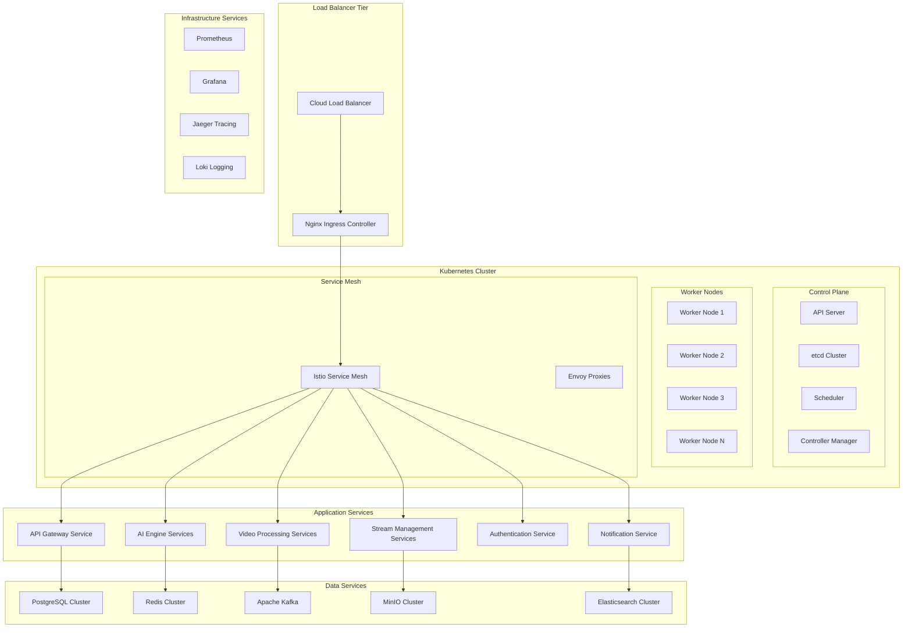
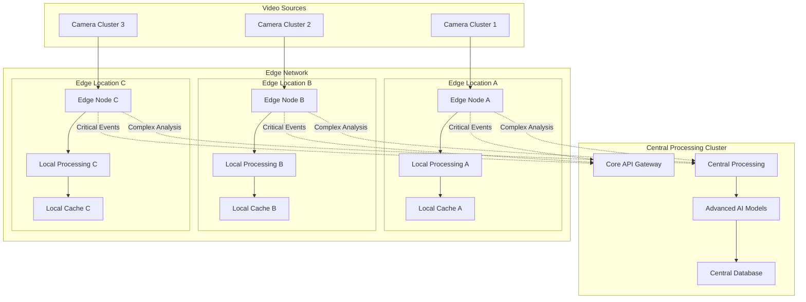

# Phase 2 Scalable Kubernetes Architecture
## Enhanced Technology Platform - WALK Phase

---

## 🎯 Architecture Evolution Overview

Phase 2 transforms the Docker Compose foundation into a **enterprise-grade Kubernetes platform** supporting 500-1,000 concurrent video streams. The architecture emphasizes **microservices decomposition**, **horizontal scalability**, and **advanced orchestration** while maintaining **operational simplicity**.

### **Architecture Transformation Principles**
- **Microservices Evolution**: Systematic decomposition from monolithic services
- **Kubernetes Native**: Full utilization of Kubernetes orchestration capabilities
- **Horizontal Scaling**: Linear scaling across multiple nodes and regions
- **Service Mesh Integration**: Advanced service communication and security
- **Cloud Native Patterns**: Implementation of cloud-native architectural patterns

---

## 🏗️ Kubernetes Platform Architecture

### **Cluster Architecture Overview**


---

## 🏗️ Kubernetes Cluster Configuration Details

### **Node Specifications and Namespace Strategy**
```yaml
KUBERNETES_SETUP:
  Cluster_Type: "Production-grade multi-node cluster"
  Node_Configuration:
    Master_Nodes: 3
    Worker_Nodes: "6-12 (auto-scaling)"
    Edge_Nodes: "3-6 (geographic distribution)"

  Node_Specifications:
    Master_Nodes:
      CPU: "4 cores"
      Memory: "16GB RAM"
      Storage: "100GB SSD"
      Role: "Control plane, etcd, API server"

    Worker_Nodes:
      CPU: "8-16 cores"
      Memory: "32-64GB RAM"
      Storage: "500GB SSD + 2TB HDD"
      GPU: "Optional NVIDIA RTX 4090 for AI workloads"
      Role: "Application workloads, video processing"

    Edge_Nodes:
      CPU: "4-8 cores"
      Memory: "16-32GB RAM"
      Storage: "250GB SSD"
      Role: "Local video processing, caching"

NAMESPACE_ORGANIZATION:
  Production_Namespaces:
    - video-analytics-frontend     # Web applications and UI services
    - video-analytics-api         # REST API and GraphQL services
    - video-analytics-processing  # Video processing and AI services
    - video-analytics-data        # Database and storage services
    - video-analytics-monitoring  # Observability and logging
    - video-analytics-security    # Security tools and secrets

  Environment_Namespaces:
    - development                 # Development environment
    - staging                     # Pre-production testing
    - production                  # Live production system

  Infrastructure_Namespaces:
    - kube-system                 # Kubernetes system components
    - istio-system               # Service mesh (optional)
    - cert-manager               # Certificate management
    - ingress-nginx              # Ingress controller
```

---

## 🔧 Microservices Architecture

### **Service Decomposition Strategy**
```yaml
MICROSERVICES_ARCHITECTURE:
  Core_Platform_Services:
    api_gateway:
      purpose: "Central API gateway and request routing"
      technology: "Go with high-performance HTTP handling"
      scaling: "Horizontal scaling based on request volume"
      dependencies: "Authentication service, rate limiting"

    authentication_service:
      purpose: "Centralized authentication and authorization"
      technology: "Go with JWT and OAuth 2.0 integration"
      scaling: "Stateless horizontal scaling"
      dependencies: "User database, external identity providers"

    user_management_service:
      purpose: "User profile and preference management"
      technology: "Go with PostgreSQL integration"
      scaling: "Database-backed horizontal scaling"
      dependencies: "PostgreSQL cluster, authentication service"

  Video_Processing_Services:
    stream_ingestion_service:
      purpose: "Video stream ingestion and protocol handling"
      technology: "Go with FFmpeg integration"
      scaling: "Per-stream horizontal scaling"
      dependencies: "Stream metadata service, video storage"

    video_processing_service:
      purpose: "Video frame processing and preparation"
      technology: "Go with optimized video processing"
      scaling: "CPU-intensive workload scaling"
      dependencies: "AI processing service, storage services"

    stream_metadata_service:
      purpose: "Stream configuration and metadata management"
      technology: "Go with PostgreSQL and Redis"
      scaling: "Database-backed with caching"
      dependencies: "PostgreSQL, Redis cluster"

  AI_Processing_Services:
    ai_inference_service:
      purpose: "Real-time AI model inference"
      technology: "Python with PyTorch and ONNX"
      scaling: "GPU-based horizontal scaling"
      dependencies: "Model storage, result processing service"

    model_management_service:
      purpose: "AI model lifecycle and deployment management"
      technology: "Python with MLOps integration"
      scaling: "Stateless horizontal scaling"
      dependencies: "Model storage, configuration service"

    result_processing_service:
      purpose: "AI result aggregation and correlation"
      technology: "Go with time-series processing"
      scaling: "High-throughput horizontal scaling"
      dependencies: "Database cluster, notification service"

  Data_and_Storage_Services:
    configuration_service:
      purpose: "Centralized configuration management"
      technology: "Go with etcd integration"
      scaling: "Consistent state management"
      dependencies: "etcd cluster, validation services"

    notification_service:
      purpose: "Multi-channel notification and alerting"
      technology: "Go with multiple provider integration"
      scaling: "Queue-based horizontal scaling"
      dependencies: "Message queue, external notification providers"

    analytics_service:
      purpose: "Real-time analytics and reporting"
      technology: "Go with time-series databases"
      scaling: "Analytics workload optimization"
      dependencies: "InfluxDB, Elasticsearch cluster"
```

### **Core Business Service API Contracts**
```yaml
USER_MANAGEMENT_SERVICE:
  Responsibilities:
    - User authentication and authorization
    - Role-based access control (RBAC)
    - Session management and tokens
    - User profile and preferences
  API_Endpoints:
    - POST /auth/login
    - POST /auth/refresh
    - GET /users/{id}
    - PUT /users/{id}/permissions
  Database: "PostgreSQL (dedicated schema)"

VIDEO_STREAM_SERVICE:
  Responsibilities:
    - Video stream ingestion and management
    - Stream quality and format conversion
    - Real-time stream routing and load balancing
    - Stream health monitoring
  API_Endpoints:
    - POST /streams
    - GET /streams/{id}
    - PUT /streams/{id}/quality
    - DELETE /streams/{id}
  Database: "PostgreSQL + Redis (stream metadata + caching)"

AI_ANALYTICS_SERVICE:
  Responsibilities:
    - AI model management and versioning
    - Real-time video analysis and processing
    - Object detection and classification
    - Anomaly detection and alerting
  API_Endpoints:
    - POST /analysis/detect
    - GET /analysis/results/{id}
    - POST /models/deploy
    - GET /models/performance
  Database: "PostgreSQL + InfluxDB (results + metrics)"

NOTIFICATION_SERVICE:
  Responsibilities:
    - Real-time alert generation and routing
    - Multi-channel notification delivery
    - Notification preferences and rules
    - Alert escalation and acknowledgment
  API_Endpoints:
    - POST /notifications/send
    - GET /notifications/history
    - PUT /notifications/preferences
    - POST /notifications/acknowledge
  Database: "PostgreSQL + Redis (rules + queuing)"

REPORTING_SERVICE:
  Responsibilities:
    - Report generation and scheduling
    - Data aggregation and analytics
    - Export capabilities (PDF, CSV, API)
    - Dashboard data preparation
  API_Endpoints:
    - POST /reports/generate
    - GET /reports/{id}
    - POST /reports/schedule
    - GET /analytics/dashboard
  Database: "ClickHouse + PostgreSQL (analytics + metadata)"
```

### **Service Communication Patterns**
```yaml
COMMUNICATION_PATTERNS:
  Synchronous_Communication:
    http_apis: "REST APIs for request-response patterns"
    grpc: "gRPC for high-performance inter-service communication"
    service_mesh: "Istio for secure service-to-service communication"
    load_balancing: "Kubernetes service load balancing"

  Asynchronous_Communication:
    message_queues: "Apache Kafka for event streaming"
    pub_sub: "Redis pub/sub for real-time notifications"
    event_sourcing: "Event-driven architecture patterns"
    webhook_delivery: "Reliable webhook delivery mechanisms"

  Data_Communication:
    database_per_service: "Service-owned database pattern"
    shared_cache: "Redis cluster for shared caching"
    event_store: "Kafka as distributed event store"
    data_synchronization: "Event-driven data synchronization"
```

---

## 🌐 Kubernetes Infrastructure Components

### **Cluster Configuration**
```yaml
KUBERNETES_INFRASTRUCTURE:
  Cluster_Setup:
    control_plane: "High-availability control plane with 3 master nodes"
    worker_nodes: "Auto-scaling worker node groups (3-10 nodes)"
    networking: "Calico CNI for network policy and security"
    storage: "Dynamic persistent volume provisioning"

  Core_Components:
    ingress_controller: "Nginx Ingress Controller with SSL termination"
    dns: "CoreDNS for service discovery and resolution"
    metrics_server: "Resource metrics collection for HPA"
    cluster_autoscaler: "Automatic node scaling based on demand"

  Security_Components:
    rbac: "Role-based access control for all cluster resources"
    pod_security: "Pod Security Standards enforcement"
    network_policies: "Calico network policies for microsegmentation"
    secrets_management: "Kubernetes secrets with encryption at rest"

  Storage_Infrastructure:
    persistent_volumes: "SSD-backed persistent volumes for databases"
    object_storage: "S3-compatible object storage integration"
    backup_solutions: "Automated backup and disaster recovery"
    data_encryption: "Encryption at rest and in transit"
```

### **Service Mesh Integration**
```yaml
SERVICE_MESH_ARCHITECTURE:
  Istio_Components:
    control_plane: "Istio control plane for service mesh management"
    data_plane: "Envoy proxies for all service communication"
    gateway: "Istio Gateway for ingress traffic management"
    virtual_services: "Traffic routing and load balancing"

  Traffic_Management:
    load_balancing: "Advanced load balancing algorithms"
    circuit_breaking: "Circuit breaker patterns for resilience"
    retry_policies: "Intelligent retry and timeout policies"
    traffic_shifting: "Canary and blue-green deployments"

  Security_Features:
    mtls: "Mutual TLS for all service-to-service communication"
    authorization_policies: "Fine-grained access control"
    security_scanning: "Automatic security policy enforcement"
    audit_logging: "Comprehensive security audit trails"

  Observability_Integration:
    distributed_tracing: "Jaeger integration for request tracing"
    metrics_collection: "Prometheus metrics from Envoy proxies"
    service_topology: "Kiali for service mesh visualization"
    performance_monitoring: "Real-time performance metrics"
```

---

## 📊 Scaling and Performance Architecture

### **Horizontal Scaling Strategy**
```yaml
SCALING_ARCHITECTURE:
  Auto_Scaling_Framework:
    horizontal_pod_autoscaler: "CPU/memory-based pod scaling"
    vertical_pod_autoscaler: "Automatic resource right-sizing"
    cluster_autoscaler: "Node-level scaling based on resource demand"
    custom_metrics_scaling: "Application-specific metric scaling"

  Performance_Optimization:
    resource_quotas: "Namespace-level resource management"
    quality_of_service: "Pod QoS classes for priority scheduling"
    node_affinity: "Workload placement optimization"
    pod_disruption_budgets: "High availability during updates"

  Capacity_Planning:
    resource_monitoring: "Continuous resource utilization monitoring"
    capacity_forecasting: "Predictive scaling based on usage patterns"
    cost_optimization: "Resource efficiency and cost management"
    performance_testing: "Regular load testing and capacity validation"

  Geographic_Scaling:
    multi_region_deployment: "Region-aware workload distribution"
    data_locality: "Data processing near source locations"
    edge_integration: "Edge computing integration preparation"
    latency_optimization: "Geographic latency optimization"
```

### **Performance Targets and SLAs**
```yaml
PERFORMANCE_SPECIFICATIONS:
  Processing_Performance:
    concurrent_streams: "500-1,000 simultaneous video streams"
    processing_latency: "<300ms end-to-end processing"
    throughput: "Linear scaling with cluster resources"
    gpu_utilization: "80%+ GPU utilization efficiency"

  System_Performance:
    api_response_time: "<100ms for 95th percentile"
    service_availability: "99.5% availability per service"
    cluster_availability: "99.9% overall cluster availability"
    data_consistency: "Strong consistency for critical operations"

  Scalability_Performance:
    horizontal_scaling: "Linear performance scaling with nodes"
    auto_scaling_response: "<2 minutes for scaling events"
    resource_efficiency: "70%+ average resource utilization"
    cost_per_stream: "Optimized cost per processed stream"
```

---

## 🌐 Edge Computing Architecture

### **Edge Node Deployment Strategy**
```yaml
EDGE_COMPUTING_DESIGN:
  Node_Placement_Strategy:
    Geographic_Distribution: "2-3 locations covering primary user regions"
    Network_Topology: "Minimize latency to video sources"
    Redundancy: "N+1 redundancy for high availability"

  Edge_Node_Specifications:
    Hardware_Requirements:
      CPU: "4-8 cores (Intel/AMD)"
      Memory: "16-32GB RAM"
      Storage: "250GB SSD (local caching)"
      Network: "1 Gbps minimum bandwidth"
      GPU: "Optional for local AI processing"

    Software_Stack:
      Container_Runtime: "Docker + Kubernetes (K3s for lightweight)"
      Processing_Engine: "Lightweight video processing"
      Cache_Layer: "Redis for local data caching"
      Monitoring: "Prometheus node exporter"

  Edge_Processing_Capabilities:
    Local_Video_Processing:
      - Basic object detection (reduced model complexity)
      - Stream quality optimization
      - Local caching of frequently accessed data
      - Bandwidth optimization and compression

    Data_Synchronization:
      - Periodic sync with central cluster
      - Critical event immediate forwarding
      - Local buffering during network outages
      - Conflict resolution for data consistency
```

### **Edge-to-Core Communication**


---

## 💾 Data Architecture

### **Database Scaling Strategy**
```yaml
POSTGRESQL_SCALING:
  Master_Slave_Configuration:
    Master_Node:
      Role: "Write operations, critical reads"
      Specifications: "16 cores, 64GB RAM, NVMe SSD"
      Backup_Strategy: "Continuous WAL archiving + daily snapshots"

    Read_Replicas:
      Count: "2-3 replicas"
      Role: "Read-only queries, reporting, analytics"
      Specifications: "8 cores, 32GB RAM, SSD"
      Lag_Tolerance: "<5 seconds"

  Connection_Pooling:
    Technology: "PgBouncer"
    Pool_Size: "500-1000 connections"
    Distribution: "Read queries to replicas, writes to master"

  Partitioning_Strategy:
    Video_Metadata: "Time-based partitioning (monthly)"
    Analytics_Data: "Horizontal partitioning by source"
    User_Data: "Minimal partitioning (size-based)"

REDIS_CLUSTER_DESIGN:
  Cluster_Configuration:
    Nodes: "6 nodes (3 masters + 3 replicas)"
    Memory_Per_Node: "16-32GB"
    Persistence: "RDB + AOF for durability"

  Data_Distribution:
    Session_Data: "User sessions and authentication tokens"
    Cache_Data: "Frequently accessed video metadata"
    Real_Time_Data: "Live stream status and metrics"
    Pub_Sub: "Real-time notifications and events"

ANALYTICS_DATABASE:
  Technology: "ClickHouse or InfluxDB"
  Purpose: "Time-series analytics and reporting"
  Configuration:
    Nodes: "3-node cluster"
    Storage: "Columnar storage for analytical queries"
    Retention: "5 years with automatic archiving"
```

### **Object Storage Strategy**
```yaml
OBJECT_STORAGE_DESIGN:
  Technology: "MinIO (self-hosted) or AWS S3 (cloud)"
  Storage_Tiers:
    Hot_Storage:
      Purpose: "Recent video files (last 30 days)"
      Access_Pattern: "Frequent access, low latency"
      Replication: "3x replication for high availability"

    Warm_Storage:
      Purpose: "Archive video files (30 days - 1 year)"
      Access_Pattern: "Occasional access, moderate latency"
      Replication: "2x replication with erasure coding"

    Cold_Storage:
      Purpose: "Long-term archive (1+ years)"
      Access_Pattern: "Rare access, high latency acceptable"
      Storage: "Glacier-class storage or tape backup"

  Lifecycle_Management:
    Automated_Tiering: "Based on access patterns and age"
    Compression: "Video-optimized compression algorithms"
    Deduplication: "Content-based deduplication"
```

---

## 🔐 Security and Compliance Architecture

### **Kubernetes Security Framework**
```yaml
SECURITY_ARCHITECTURE:
  Cluster_Security:
    rbac_implementation: "Comprehensive RBAC with least privilege"
    pod_security_standards: "Restricted pod security policies"
    network_segmentation: "Calico network policies for microsegmentation"
    secrets_encryption: "etcd encryption at rest with key rotation"

  Workload_Security:
    container_security: "Container image scanning and vulnerability management"
    runtime_security: "Runtime protection and anomaly detection"
    secure_defaults: "Security-first default configurations"
    compliance_scanning: "Automated compliance and security scanning"

  Service_Mesh_Security:
    zero_trust_networking: "Default deny with explicit allow policies"
    mutual_tls: "Automatic mTLS for all service communications"
    identity_management: "Workload identity and certificate management"
    traffic_encryption: "End-to-end encryption for all communications"

  Data_Security:
    encryption_at_rest: "Database and storage encryption"
    encryption_in_transit: "TLS 1.3 for all external communications"
    key_management: "Centralized key management and rotation"
    data_classification: "Data classification and protection policies"
```

### **Compliance and Governance**
```yaml
COMPLIANCE_FRAMEWORK:
  Regulatory_Compliance:
    data_protection: "GDPR/CCPA compliance capabilities"
    industry_standards: "SOC 2, ISO 27001 compliance preparation"
    audit_requirements: "Comprehensive audit trail and reporting"
    data_residency: "Geographic data control and residency"

  Governance_Controls:
    policy_enforcement: "OPA (Open Policy Agent) for policy automation"
    configuration_management: "GitOps-based configuration control"
    change_management: "Controlled change deployment processes"
    access_control: "Identity-based access control with audit"

  Monitoring_and_Alerting:
    security_monitoring: "Real-time security event monitoring"
    compliance_monitoring: "Automated compliance checking"
    anomaly_detection: "Behavioral anomaly detection and alerting"
    incident_response: "Automated incident response procedures"
```

---

## 📈 Monitoring and Observability

### **Comprehensive Observability Stack**
```yaml
OBSERVABILITY_ARCHITECTURE:
  Metrics_Collection:
    prometheus_operator: "Kubernetes-native metrics collection"
    custom_metrics: "Application-specific metrics collection"
    infrastructure_metrics: "Cluster and node-level metrics"
    business_metrics: "KPI and business logic metrics"

  Logging_Infrastructure:
    centralized_logging: "Loki for centralized log aggregation"
    structured_logging: "JSON-based structured logging"
    log_correlation: "Request correlation across services"
    log_retention: "Tiered log retention and archival"

  Distributed_Tracing:
    jaeger_integration: "Complete request flow tracing"
    performance_profiling: "Service performance analysis"
    bottleneck_identification: "Performance bottleneck detection"
    trace_sampling: "Intelligent trace sampling strategies"

  Dashboarding_and_Alerting:
    grafana_dashboards: "Comprehensive operational dashboards"
    alertmanager: "Intelligent alerting and escalation"
    sli_slo_monitoring: "Service level indicator/objective tracking"
    capacity_planning: "Resource usage trending and planning"
```

---

## 🚀 Deployment and Scaling Strategy

### **Blue-Green and Canary Deployment Patterns**
```yaml
DEPLOYMENT_STRATEGY:
  Blue_Green_Setup:
    Blue_Environment: "Current production traffic"
    Green_Environment: "New version deployment and testing"
    Traffic_Switching: "Instantaneous cutover with rollback capability"
    Health_Checks: "Comprehensive health validation before traffic switch"

  Canary_Deployments:
    Traffic_Split: "5% -> 25% -> 50% -> 100%"
    Monitoring_Period: "30 minutes per stage"
    Rollback_Triggers: "Error rate >2%, latency >500ms"
    Automation: "GitOps with ArgoCD or Flux"

  Database_Migrations:
    Strategy: "Backward-compatible migrations"
    Validation: "Migration testing in staging environment"
    Rollback_Plan: "Automated rollback procedures"
    Monitoring: "Performance impact assessment"
```

### **Auto-Scaling Configuration**
```yaml
HORIZONTAL_POD_AUTOSCALING:
  Frontend_Services:
    Min_Replicas: 3
    Max_Replicas: 10
    CPU_Target: "70%"
    Memory_Target: "80%"
    Scale_Up_Period: "2 minutes"
    Scale_Down_Period: "5 minutes"

  API_Services:
    Min_Replicas: 3
    Max_Replicas: 15
    Custom_Metrics:
      - Request rate per second
      - Response time percentiles
      - Queue depth
    Scale_Based_On: "Request rate and response time"

  Processing_Services:
    Min_Replicas: 2
    Max_Replicas: 8
    GPU_Aware_Scheduling: "NVIDIA GPU sharing"
    Custom_Metrics:
      - Video processing queue length
      - AI model inference time
      - Memory usage patterns

CLUSTER_AUTOSCALING:
  Node_Scaling:
    Min_Nodes: 6
    Max_Nodes: 20
    Scale_Up_Threshold: "Resource requests cannot be scheduled"
    Scale_Down_Threshold: "Node utilization <30% for 10 minutes"
    Instance_Types: "Multiple instance types for cost optimization"
```

---

## 🔄 Migration Strategy from Phase 1

### **Gradual Migration Approach**
```yaml
MIGRATION_PHASES:
  Phase_1_to_2_Transition:
    Week_1_2: "Kubernetes cluster setup and testing"
    Week_3_4: "Database replication setup and data migration"
    Week_5_6: "Microservices extraction and deployment"
    Week_7_8: "Load balancer setup and traffic migration"
    Week_9_10: "Edge node deployment and testing"
    Week_11_12: "Full production cutover and monitoring"

  Service_Migration_Order:
    Priority_1: "User management and authentication services"
    Priority_2: "Video stream management services"
    Priority_3: "AI/ML processing services"
    Priority_4: "Reporting and analytics services"
    Priority_5: "Advanced features and integrations"

  Data_Migration_Strategy:
    Approach: "Dual-write pattern with gradual read migration"
    Validation: "Data consistency checks and reconciliation"
    Rollback: "Ability to rollback to Phase 1 architecture"
    Testing: "Comprehensive end-to-end testing"
```

### **Risk Mitigation During Migration**
```yaml
MIGRATION_RISK_MITIGATION:
  Technical_Risks:
    Data_Loss_Prevention: "Comprehensive backup and restore procedures"
    Service_Availability: "Zero-downtime migration techniques"
    Performance_Degradation: "Performance benchmarking and optimization"
    Integration_Issues: "Staged integration testing"

  Business_Continuity:
    User_Communication: "Advance notice and migration status updates"
    Support_Readiness: "Enhanced support during migration period"
    Rollback_Planning: "Detailed rollback procedures and testing"
    Monitoring_Enhancement: "Increased monitoring during transition"
```

---

## 📈 Phase 2 Business Success Metrics

### **Technical and Business Targets**
```yaml
TECHNICAL_TARGETS:
  Performance_Metrics:
    Concurrent_Streams: "500-1,000 streams processed successfully"
    Processing_Latency: "<300ms average with advanced AI models"
    System_Availability: "99% uptime (43.8 minutes downtime/month)"
    Response_Time: "<2 seconds for API endpoints"
    Throughput: "10,000+ API requests per minute"

  Scalability_Metrics:
    Auto_Scaling: "Successful scaling events during load peaks"
    Resource_Utilization: "70-80% average CPU/memory utilization"
    Edge_Performance: "50% reduction in latency for edge-processed streams"
    Database_Performance: "Read queries <100ms, write queries <500ms"

  Quality_Metrics:
    Error_Rate: "<1% for all API endpoints"
    AI_Accuracy: ">95% for object detection tasks"
    Security_Incidents: "Zero critical security vulnerabilities"
    Data_Integrity: "100% data consistency across replicas"

BUSINESS_TARGETS:
  Operational_Excellence:
    System_Integration: "15 external systems successfully integrated"
    Deployment_Frequency: "Weekly deployments with <1% rollback rate"
    Incident_Response: "<2 hours mean time to resolution"
    Compliance_Readiness: "SOC2 and ISO27001 compliance preparation complete"

  Financial_Performance:
    ROI_Achievement: "50% return on cumulative investment by end of Phase 2"
    Operational_Cost_Reduction: "25% reduction in manual operational tasks"
    Processing_Efficiency: "40% improvement in streams processed per dollar"
    Vendor_Cost_Optimization: "20% reduction in third-party service costs"
```

### **Phase 2 → Phase 3 Transition Readiness Gates**
```yaml
PHASE_3_READINESS:
  Technical_Prerequisites:
    - Kubernetes cluster stable for 90+ days with 99% availability
    - All microservices deployed and performing within SLA
    - Edge computing network operational across 3+ locations
    - Advanced monitoring and alerting systems fully functional
    - Security framework ready for Zero Trust enhancement

  Operational_Prerequisites:
    - DevOps team proficient in Kubernetes and cloud-native technologies
    - Incident response procedures tested and documented
    - Disaster recovery procedures validated through testing
    - Compliance framework established and audited
    - Integration platform ready for marketplace expansion

  Business_Prerequisites:
    - 50% ROI demonstrated and validated by business stakeholders
    - User satisfaction >4.5/5 with enterprise feature adoption >80%
    - Market validation for global expansion requirements
    - Executive commitment for Phase 3 enterprise investment
    - Partner ecosystem ready for advanced integration scenarios
```

---

## 🎯 Phase 2 Architecture Success Criteria

The **Phase 2 Kubernetes Architecture** delivers enterprise-scale capabilities:

- ✅ **Microservices Excellence**: Complete service decomposition with clear boundaries
- ✅ **Kubernetes Mastery**: Full utilization of Kubernetes orchestration capabilities
- ✅ **Horizontal Scaling**: Linear scaling from 500 to 1,000+ concurrent streams
- ✅ **Service Mesh Integration**: Advanced service communication and security
- ✅ **Enterprise Readiness**: Production-ready platform with enterprise features

**This architecture provides the scalable foundation needed for Phase 3 global deployment.**

---

**Document Status**: Ready for Implementation
**Next Document**: [Advanced AI/ML Pipeline](./02-advanced-ai-ml-pipeline.md)
**Related**: [Business Considerations](../business-considerations/) | [Implementation Considerations](../implementation-considerations/)