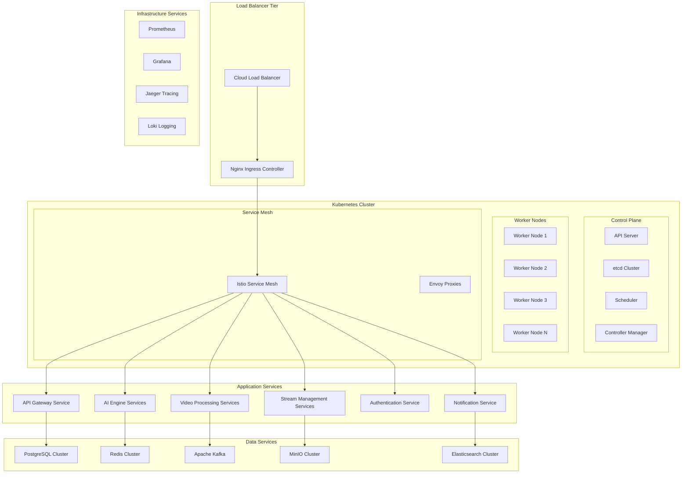

# Phase 2 Scalable Kubernetes Architecture
## Enhanced Technology Platform - WALK Phase

---

## 🎯 Architecture Evolution Overview

Phase 2 transforms the Docker Compose foundation into a **enterprise-grade Kubernetes platform** supporting 500-1,000 concurrent video streams. The architecture emphasizes **microservices decomposition**, **horizontal scalability**, and **advanced orchestration** while maintaining **operational simplicity**.

### **Architecture Transformation Principles**
- **Microservices Evolution**: Systematic decomposition from monolithic services
- **Kubernetes Native**: Full utilization of Kubernetes orchestration capabilities
- **Horizontal Scaling**: Linear scaling across multiple nodes and regions
- **Service Mesh Integration**: Advanced service communication and security
- **Cloud Native Patterns**: Implementation of cloud-native architectural patterns

---

## 🏗️ Kubernetes Platform Architecture

### **Cluster Architecture Overview**


---

## 🔧 Microservices Architecture

### **Service Decomposition Strategy**
```yaml
MICROSERVICES_ARCHITECTURE:
  Core_Platform_Services:
    api_gateway:
      purpose: "Central API gateway and request routing"
      technology: "Go with high-performance HTTP handling"
      scaling: "Horizontal scaling based on request volume"
      dependencies: "Authentication service, rate limiting"

    authentication_service:
      purpose: "Centralized authentication and authorization"
      technology: "Go with JWT and OAuth 2.0 integration"
      scaling: "Stateless horizontal scaling"
      dependencies: "User database, external identity providers"

    user_management_service:
      purpose: "User profile and preference management"
      technology: "Go with PostgreSQL integration"
      scaling: "Database-backed horizontal scaling"
      dependencies: "PostgreSQL cluster, authentication service"

  Video_Processing_Services:
    stream_ingestion_service:
      purpose: "Video stream ingestion and protocol handling"
      technology: "Go with FFmpeg integration"
      scaling: "Per-stream horizontal scaling"
      dependencies: "Stream metadata service, video storage"

    video_processing_service:
      purpose: "Video frame processing and preparation"
      technology: "Go with optimized video processing"
      scaling: "CPU-intensive workload scaling"
      dependencies: "AI processing service, storage services"

    stream_metadata_service:
      purpose: "Stream configuration and metadata management"
      technology: "Go with PostgreSQL and Redis"
      scaling: "Database-backed with caching"
      dependencies: "PostgreSQL, Redis cluster"

  AI_Processing_Services:
    ai_inference_service:
      purpose: "Real-time AI model inference"
      technology: "Python with PyTorch and ONNX"
      scaling: "GPU-based horizontal scaling"
      dependencies: "Model storage, result processing service"

    model_management_service:
      purpose: "AI model lifecycle and deployment management"
      technology: "Python with MLOps integration"
      scaling: "Stateless horizontal scaling"
      dependencies: "Model storage, configuration service"

    result_processing_service:
      purpose: "AI result aggregation and correlation"
      technology: "Go with time-series processing"
      scaling: "High-throughput horizontal scaling"
      dependencies: "Database cluster, notification service"

  Data_and_Storage_Services:
    configuration_service:
      purpose: "Centralized configuration management"
      technology: "Go with etcd integration"
      scaling: "Consistent state management"
      dependencies: "etcd cluster, validation services"

    notification_service:
      purpose: "Multi-channel notification and alerting"
      technology: "Go with multiple provider integration"
      scaling: "Queue-based horizontal scaling"
      dependencies: "Message queue, external notification providers"

    analytics_service:
      purpose: "Real-time analytics and reporting"
      technology: "Go with time-series databases"
      scaling: "Analytics workload optimization"
      dependencies: "InfluxDB, Elasticsearch cluster"
```

### **Service Communication Patterns**
```yaml
COMMUNICATION_PATTERNS:
  Synchronous_Communication:
    http_apis: "REST APIs for request-response patterns"
    grpc: "gRPC for high-performance inter-service communication"
    service_mesh: "Istio for secure service-to-service communication"
    load_balancing: "Kubernetes service load balancing"

  Asynchronous_Communication:
    message_queues: "Apache Kafka for event streaming"
    pub_sub: "Redis pub/sub for real-time notifications"
    event_sourcing: "Event-driven architecture patterns"
    webhook_delivery: "Reliable webhook delivery mechanisms"

  Data_Communication:
    database_per_service: "Service-owned database pattern"
    shared_cache: "Redis cluster for shared caching"
    event_store: "Kafka as distributed event store"
    data_synchronization: "Event-driven data synchronization"
```

---

## 🌐 Kubernetes Infrastructure Components

### **Cluster Configuration**
```yaml
KUBERNETES_INFRASTRUCTURE:
  Cluster_Setup:
    control_plane: "High-availability control plane with 3 master nodes"
    worker_nodes: "Auto-scaling worker node groups (3-10 nodes)"
    networking: "Calico CNI for network policy and security"
    storage: "Dynamic persistent volume provisioning"

  Core_Components:
    ingress_controller: "Nginx Ingress Controller with SSL termination"
    dns: "CoreDNS for service discovery and resolution"
    metrics_server: "Resource metrics collection for HPA"
    cluster_autoscaler: "Automatic node scaling based on demand"

  Security_Components:
    rbac: "Role-based access control for all cluster resources"
    pod_security: "Pod Security Standards enforcement"
    network_policies: "Calico network policies for microsegmentation"
    secrets_management: "Kubernetes secrets with encryption at rest"

  Storage_Infrastructure:
    persistent_volumes: "SSD-backed persistent volumes for databases"
    object_storage: "S3-compatible object storage integration"
    backup_solutions: "Automated backup and disaster recovery"
    data_encryption: "Encryption at rest and in transit"
```

### **Service Mesh Integration**
```yaml
SERVICE_MESH_ARCHITECTURE:
  Istio_Components:
    control_plane: "Istio control plane for service mesh management"
    data_plane: "Envoy proxies for all service communication"
    gateway: "Istio Gateway for ingress traffic management"
    virtual_services: "Traffic routing and load balancing"

  Traffic_Management:
    load_balancing: "Advanced load balancing algorithms"
    circuit_breaking: "Circuit breaker patterns for resilience"
    retry_policies: "Intelligent retry and timeout policies"
    traffic_shifting: "Canary and blue-green deployments"

  Security_Features:
    mtls: "Mutual TLS for all service-to-service communication"
    authorization_policies: "Fine-grained access control"
    security_scanning: "Automatic security policy enforcement"
    audit_logging: "Comprehensive security audit trails"

  Observability_Integration:
    distributed_tracing: "Jaeger integration for request tracing"
    metrics_collection: "Prometheus metrics from Envoy proxies"
    service_topology: "Kiali for service mesh visualization"
    performance_monitoring: "Real-time performance metrics"
```

---

## 📊 Scaling and Performance Architecture

### **Horizontal Scaling Strategy**
```yaml
SCALING_ARCHITECTURE:
  Auto_Scaling_Framework:
    horizontal_pod_autoscaler: "CPU/memory-based pod scaling"
    vertical_pod_autoscaler: "Automatic resource right-sizing"
    cluster_autoscaler: "Node-level scaling based on resource demand"
    custom_metrics_scaling: "Application-specific metric scaling"

  Performance_Optimization:
    resource_quotas: "Namespace-level resource management"
    quality_of_service: "Pod QoS classes for priority scheduling"
    node_affinity: "Workload placement optimization"
    pod_disruption_budgets: "High availability during updates"

  Capacity_Planning:
    resource_monitoring: "Continuous resource utilization monitoring"
    capacity_forecasting: "Predictive scaling based on usage patterns"
    cost_optimization: "Resource efficiency and cost management"
    performance_testing: "Regular load testing and capacity validation"

  Geographic_Scaling:
    multi_region_deployment: "Region-aware workload distribution"
    data_locality: "Data processing near source locations"
    edge_integration: "Edge computing integration preparation"
    latency_optimization: "Geographic latency optimization"
```

### **Performance Targets and SLAs**
```yaml
PERFORMANCE_SPECIFICATIONS:
  Processing_Performance:
    concurrent_streams: "500-1,000 simultaneous video streams"
    processing_latency: "<300ms end-to-end processing"
    throughput: "Linear scaling with cluster resources"
    gpu_utilization: "80%+ GPU utilization efficiency"

  System_Performance:
    api_response_time: "<100ms for 95th percentile"
    service_availability: "99.5% availability per service"
    cluster_availability: "99.9% overall cluster availability"
    data_consistency: "Strong consistency for critical operations"

  Scalability_Performance:
    horizontal_scaling: "Linear performance scaling with nodes"
    auto_scaling_response: "<2 minutes for scaling events"
    resource_efficiency: "70%+ average resource utilization"
    cost_per_stream: "Optimized cost per processed stream"
```

---

## 🔐 Security and Compliance Architecture

### **Kubernetes Security Framework**
```yaml
SECURITY_ARCHITECTURE:
  Cluster_Security:
    rbac_implementation: "Comprehensive RBAC with least privilege"
    pod_security_standards: "Restricted pod security policies"
    network_segmentation: "Calico network policies for microsegmentation"
    secrets_encryption: "etcd encryption at rest with key rotation"

  Workload_Security:
    container_security: "Container image scanning and vulnerability management"
    runtime_security: "Runtime protection and anomaly detection"
    secure_defaults: "Security-first default configurations"
    compliance_scanning: "Automated compliance and security scanning"

  Service_Mesh_Security:
    zero_trust_networking: "Default deny with explicit allow policies"
    mutual_tls: "Automatic mTLS for all service communications"
    identity_management: "Workload identity and certificate management"
    traffic_encryption: "End-to-end encryption for all communications"

  Data_Security:
    encryption_at_rest: "Database and storage encryption"
    encryption_in_transit: "TLS 1.3 for all external communications"
    key_management: "Centralized key management and rotation"
    data_classification: "Data classification and protection policies"
```

### **Compliance and Governance**
```yaml
COMPLIANCE_FRAMEWORK:
  Regulatory_Compliance:
    data_protection: "GDPR/CCPA compliance capabilities"
    industry_standards: "SOC 2, ISO 27001 compliance preparation"
    audit_requirements: "Comprehensive audit trail and reporting"
    data_residency: "Geographic data control and residency"

  Governance_Controls:
    policy_enforcement: "OPA (Open Policy Agent) for policy automation"
    configuration_management: "GitOps-based configuration control"
    change_management: "Controlled change deployment processes"
    access_control: "Identity-based access control with audit"

  Monitoring_and_Alerting:
    security_monitoring: "Real-time security event monitoring"
    compliance_monitoring: "Automated compliance checking"
    anomaly_detection: "Behavioral anomaly detection and alerting"
    incident_response: "Automated incident response procedures"
```

---

## 📈 Monitoring and Observability

### **Comprehensive Observability Stack**
```yaml
OBSERVABILITY_ARCHITECTURE:
  Metrics_Collection:
    prometheus_operator: "Kubernetes-native metrics collection"
    custom_metrics: "Application-specific metrics collection"
    infrastructure_metrics: "Cluster and node-level metrics"
    business_metrics: "KPI and business logic metrics"

  Logging_Infrastructure:
    centralized_logging: "Loki for centralized log aggregation"
    structured_logging: "JSON-based structured logging"
    log_correlation: "Request correlation across services"
    log_retention: "Tiered log retention and archival"

  Distributed_Tracing:
    jaeger_integration: "Complete request flow tracing"
    performance_profiling: "Service performance analysis"
    bottleneck_identification: "Performance bottleneck detection"
    trace_sampling: "Intelligent trace sampling strategies"

  Dashboarding_and_Alerting:
    grafana_dashboards: "Comprehensive operational dashboards"
    alertmanager: "Intelligent alerting and escalation"
    sli_slo_monitoring: "Service level indicator/objective tracking"
    capacity_planning: "Resource usage trending and planning"
```

---

## 🎯 Phase 2 Architecture Success Criteria

The **Phase 2 Kubernetes Architecture** delivers enterprise-scale capabilities:

- ✅ **Microservices Excellence**: Complete service decomposition with clear boundaries
- ✅ **Kubernetes Mastery**: Full utilization of Kubernetes orchestration capabilities
- ✅ **Horizontal Scaling**: Linear scaling from 500 to 1,000+ concurrent streams
- ✅ **Service Mesh Integration**: Advanced service communication and security
- ✅ **Enterprise Readiness**: Production-ready platform with enterprise features

**This architecture provides the scalable foundation needed for Phase 3 global deployment.**

---

**Document Status**: Ready for Implementation
**Next Document**: [Advanced AI/ML Pipeline](./02-advanced-ai-ml-pipeline.md)
**Related**: [Business Considerations](../business-considerations/) | [Implementation Considerations](../implementation-considerations/)