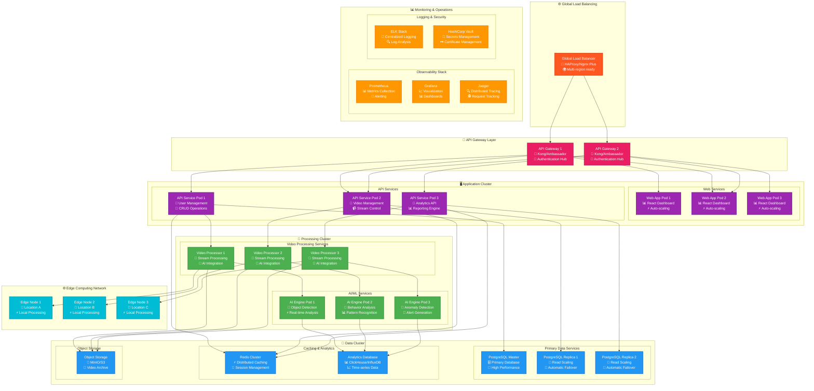
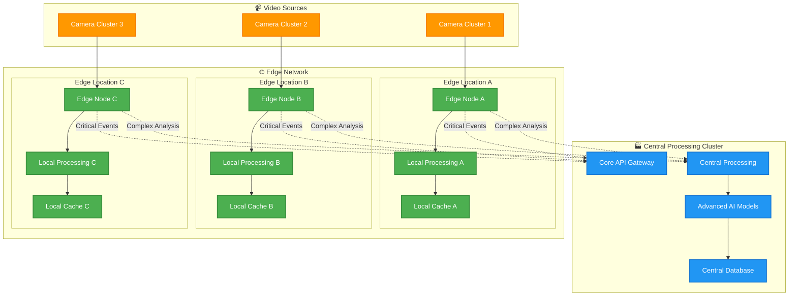
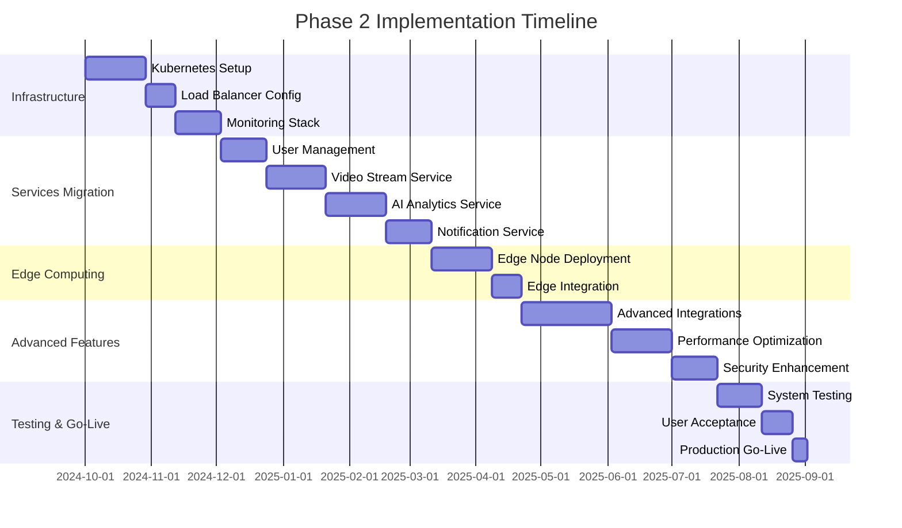

# Phase 2 Scalable Multi-Server Architecture
## Enterprise Scaling Strategy - WALK Phase

---

## 🎯 Executive Summary

This document presents the **Phase 2 WALK architecture** designed to scale from Phase 1's simplified single-server deployment to an enterprise-grade multi-server environment capable of processing **500-1,000 concurrent video streams** with **99% availability**. This phase represents the critical transition from proof-of-concept to enterprise-ready system.

### **Key Architectural Evolutions**
- **Container Orchestration**: Migration from Docker Compose to Kubernetes
- **Service Architecture**: Transition from monolith to microservices
- **High Availability**: Load balancing, redundancy, and failover capabilities
- **Edge Computing**: Distributed processing architecture introduction
- **Advanced Security**: Enhanced authentication and authorization patterns

### **Target Achievements (Phase 2)**
- ✅ 500-1,000 concurrent video streams with <300ms latency
- ✅ 99% system availability with automated failover
- ✅ Kubernetes-based container orchestration
- ✅ Microservices architecture with API gateway
- ✅ Edge computing nodes for distributed processing
- ✅ 15+ external system integrations

---

## 🏗️ Phase 2 System Architecture

### Enterprise Multi-Server Architecture Overview


### **Architectural Principles (Phase 2)**
1. **Cloud-Native Design**: Kubernetes-first architecture with cloud portability
2. **Microservices Decomposition**: Service boundaries based on business capabilities
3. **High Availability**: No single points of failure, automated recovery
4. **Horizontal Scalability**: Auto-scaling based on demand metrics
5. **Edge-First Processing**: Distributed processing to reduce latency
6. **Security by Design**: Zero-trust principles with comprehensive monitoring

---

## 🐳 Kubernetes Architecture Design

### **Cluster Configuration**
```yaml
KUBERNETES_SETUP:
  Cluster_Type: "Production-grade multi-node cluster"
  Node_Configuration:
    Master_Nodes: 3
    Worker_Nodes: "6-12 (auto-scaling)"
    Edge_Nodes: "3-6 (geographic distribution)"

  Node_Specifications:
    Master_Nodes:
      CPU: "4 cores"
      Memory: "16GB RAM"
      Storage: "100GB SSD"
      Role: "Control plane, etcd, API server"

    Worker_Nodes:
      CPU: "8-16 cores"
      Memory: "32-64GB RAM"
      Storage: "500GB SSD + 2TB HDD"
      GPU: "Optional NVIDIA RTX 4090 for AI workloads"
      Role: "Application workloads, video processing"

    Edge_Nodes:
      CPU: "4-8 cores"
      Memory: "16-32GB RAM"
      Storage: "250GB SSD"
      Role: "Local video processing, caching"
```

### **Namespace Strategy**
```yaml
NAMESPACE_ORGANIZATION:
  Production_Namespaces:
    - video-analytics-frontend     # Web applications and UI services
    - video-analytics-api         # REST API and GraphQL services
    - video-analytics-processing  # Video processing and AI services
    - video-analytics-data        # Database and storage services
    - video-analytics-monitoring  # Observability and logging
    - video-analytics-security    # Security tools and secrets

  Environment_Namespaces:
    - development                 # Development environment
    - staging                     # Pre-production testing
    - production                  # Live production system

  Infrastructure_Namespaces:
    - kube-system                 # Kubernetes system components
    - istio-system               # Service mesh (optional)
    - cert-manager               # Certificate management
    - ingress-nginx              # Ingress controller
```

### **Pod Deployment Strategy**
```yaml
DEPLOYMENT_PATTERNS:
  Frontend_Services:
    Replicas: "3-6 (auto-scaling)"
    Resource_Limits:
      CPU: "500m-1000m"
      Memory: "512Mi-1Gi"
    Scaling_Triggers:
      CPU_Threshold: "70%"
      Memory_Threshold: "80%"

  API_Services:
    Replicas: "3-9 (auto-scaling)"
    Resource_Limits:
      CPU: "1000m-2000m"
      Memory: "1Gi-4Gi"
    Scaling_Triggers:
      Request_Rate: "100 req/s per pod"
      Response_Time: ">500ms"

  Processing_Services:
    Replicas: "2-6 (auto-scaling)"
    Resource_Limits:
      CPU: "2000m-4000m"
      Memory: "4Gi-8Gi"
      GPU: "1 NVIDIA GPU (optional)"
    Scaling_Triggers:
      Queue_Length: ">50 pending jobs"
      Processing_Time: ">2s average"
```

---

## 🔄 Microservices Architecture

### **Service Decomposition Strategy**
Based on Phase 1 monolith, services are extracted along business capability boundaries:

#### **Core Business Services**
```yaml
USER_MANAGEMENT_SERVICE:
  Responsibilities:
    - User authentication and authorization
    - Role-based access control (RBAC)
    - Session management and tokens
    - User profile and preferences
  API_Endpoints:
    - POST /auth/login
    - POST /auth/refresh
    - GET /users/{id}
    - PUT /users/{id}/permissions
  Database: "PostgreSQL (dedicated schema)"

VIDEO_STREAM_SERVICE:
  Responsibilities:
    - Video stream ingestion and management
    - Stream quality and format conversion
    - Real-time stream routing and load balancing
    - Stream health monitoring
  API_Endpoints:
    - POST /streams
    - GET /streams/{id}
    - PUT /streams/{id}/quality
    - DELETE /streams/{id}
  Database: "PostgreSQL + Redis (stream metadata + caching)"

AI_ANALYTICS_SERVICE:
  Responsibilities:
    - AI model management and versioning
    - Real-time video analysis and processing
    - Object detection and classification
    - Anomaly detection and alerting
  API_Endpoints:
    - POST /analysis/detect
    - GET /analysis/results/{id}
    - POST /models/deploy
    - GET /models/performance
  Database: "PostgreSQL + InfluxDB (results + metrics)"

NOTIFICATION_SERVICE:
  Responsibilities:
    - Real-time alert generation and routing
    - Multi-channel notification delivery
    - Notification preferences and rules
    - Alert escalation and acknowledgment
  API_Endpoints:
    - POST /notifications/send
    - GET /notifications/history
    - PUT /notifications/preferences
    - POST /notifications/acknowledge
  Database: "PostgreSQL + Redis (rules + queuing)"

REPORTING_SERVICE:
  Responsibilities:
    - Report generation and scheduling
    - Data aggregation and analytics
    - Export capabilities (PDF, CSV, API)
    - Dashboard data preparation
  API_Endpoints:
    - POST /reports/generate
    - GET /reports/{id}
    - POST /reports/schedule
    - GET /analytics/dashboard
  Database: "ClickHouse + PostgreSQL (analytics + metadata)"
```

#### **Infrastructure Services**
```yaml
API_GATEWAY_SERVICE:
  Technology: "Kong or Ambassador"
  Responsibilities:
    - Request routing and load balancing
    - Authentication and authorization
    - Rate limiting and throttling
    - API versioning and documentation
  Features:
    - JWT token validation
    - Request/response logging
    - Circuit breaker patterns
    - Health check aggregation

SERVICE_MESH_OPTIONAL:
  Technology: "Istio (optional for advanced scenarios)"
  Responsibilities:
    - Service-to-service communication security
    - Traffic management and load balancing
    - Observability and monitoring
    - Policy enforcement
  Features:
    - mTLS for service communication
    - Traffic splitting for canary deployments
    - Distributed tracing integration
    - Advanced routing rules
```

### **Inter-Service Communication**
```yaml
COMMUNICATION_PATTERNS:
  Synchronous_Communication:
    Protocol: "HTTP/REST + gRPC (performance-critical paths)"
    Use_Cases: "Real-time queries, user interactions, data retrieval"
    Patterns: "Request-response, circuit breaker, retry logic"

  Asynchronous_Communication:
    Technology: "Redis Pub/Sub + Apache Kafka (optional)"
    Use_Cases: "Event-driven processing, notifications, analytics"
    Patterns: "Publish-subscribe, event sourcing, CQRS"

  Data_Consistency:
    Strategy: "Eventual consistency with compensation patterns"
    Implementation: "Saga pattern for distributed transactions"
    Monitoring: "Transaction tracing and health metrics"
```

---

## 🌐 Edge Computing Architecture

### **Edge Node Deployment Strategy**
```yaml
EDGE_COMPUTING_DESIGN:
  Node_Placement_Strategy:
    Geographic_Distribution: "2-3 locations covering primary user regions"
    Network_Topology: "Minimize latency to video sources"
    Redundancy: "N+1 redundancy for high availability"

  Edge_Node_Specifications:
    Hardware_Requirements:
      CPU: "4-8 cores (Intel/AMD)"
      Memory: "16-32GB RAM"
      Storage: "250GB SSD (local caching)"
      Network: "1 Gbps minimum bandwidth"
      GPU: "Optional for local AI processing"

    Software_Stack:
      Container_Runtime: "Docker + Kubernetes (K3s for lightweight)"
      Processing_Engine: "Lightweight video processing"
      Cache_Layer: "Redis for local data caching"
      Monitoring: "Prometheus node exporter"

  Edge_Processing_Capabilities:
    Local_Video_Processing:
      - Basic object detection (reduced model complexity)
      - Stream quality optimization
      - Local caching of frequently accessed data
      - Bandwidth optimization and compression

    Data_Synchronization:
      - Periodic sync with central cluster
      - Critical event immediate forwarding
      - Local buffering during network outages
      - Conflict resolution for data consistency
```

### **Edge-to-Core Communication**


---

## 💾 Data Architecture Evolution

### **Database Scaling Strategy**
```yaml
POSTGRESQL_SCALING:
  Master_Slave_Configuration:
    Master_Node:
      Role: "Write operations, critical reads"
      Specifications: "16 cores, 64GB RAM, NVMe SSD"
      Backup_Strategy: "Continuous WAL archiving + daily snapshots"

    Read_Replicas:
      Count: "2-3 replicas"
      Role: "Read-only queries, reporting, analytics"
      Specifications: "8 cores, 32GB RAM, SSD"
      Lag_Tolerance: "<5 seconds"

  Connection_Pooling:
    Technology: "PgBouncer"
    Pool_Size: "500-1000 connections"
    Distribution: "Read queries to replicas, writes to master"

  Partitioning_Strategy:
    Video_Metadata: "Time-based partitioning (monthly)"
    Analytics_Data: "Horizontal partitioning by source"
    User_Data: "Minimal partitioning (size-based)"

REDIS_CLUSTER_DESIGN:
  Cluster_Configuration:
    Nodes: "6 nodes (3 masters + 3 replicas)"
    Memory_Per_Node: "16-32GB"
    Persistence: "RDB + AOF for durability"

  Data_Distribution:
    Session_Data: "User sessions and authentication tokens"
    Cache_Data: "Frequently accessed video metadata"
    Real_Time_Data: "Live stream status and metrics"
    Pub_Sub: "Real-time notifications and events"

ANALYTICS_DATABASE:
  Technology: "ClickHouse or InfluxDB"
  Purpose: "Time-series analytics and reporting"
  Configuration:
    Nodes: "3-node cluster"
    Storage: "Columnar storage for analytical queries"
    Retention: "5 years with automatic archiving"
```

### **Object Storage Strategy**
```yaml
OBJECT_STORAGE_DESIGN:
  Technology: "MinIO (self-hosted) or AWS S3 (cloud)"
  Storage_Tiers:
    Hot_Storage:
      Purpose: "Recent video files (last 30 days)"
      Access_Pattern: "Frequent access, low latency"
      Replication: "3x replication for high availability"

    Warm_Storage:
      Purpose: "Archive video files (30 days - 1 year)"
      Access_Pattern: "Occasional access, moderate latency"
      Replication: "2x replication with erasure coding"

    Cold_Storage:
      Purpose: "Long-term archive (1+ years)"
      Access_Pattern: "Rare access, high latency acceptable"
      Storage: "Glacier-class storage or tape backup"

  Lifecycle_Management:
    Automated_Tiering: "Based on access patterns and age"
    Compression: "Video-optimized compression algorithms"
    Deduplication: "Content-based deduplication"
```

---

## 🔐 Enhanced Security Architecture

### **Zero Trust Security Foundation**
```yaml
SECURITY_ARCHITECTURE:
  Identity_Management:
    Technology: "OAuth2 + OIDC (OpenID Connect)"
    Integration: "LDAP/Active Directory support"
    MFA: "Multi-factor authentication (TOTP, WebAuthn)"
    Session_Management: "JWT with secure refresh tokens"

  Network_Security:
    Micro_Segmentation: "Kubernetes network policies"
    TLS_Everywhere: "TLS 1.3 for all communications"
    Certificate_Management: "Cert-Manager with Let's Encrypt"
    WAF: "Web Application Firewall (ModSecurity)"

  Secrets_Management:
    Technology: "HashiCorp Vault"
    Features:
      - Dynamic secrets generation
      - Secret rotation automation
      - Encryption key management
      - Audit logging and compliance

  Security_Monitoring:
    SIEM_Integration: "Security Information and Event Management"
    Threat_Detection: "AI-powered anomaly detection"
    Vulnerability_Scanning: "Container and infrastructure scanning"
    Compliance_Automation: "SOC2, ISO27001, GDPR automation"
```

### **API Security Framework**
```yaml
API_SECURITY:
  Authentication_Layers:
    L1_Gateway: "API key validation and rate limiting"
    L2_Service: "JWT token validation and claims verification"
    L3_Resource: "Fine-grained permission checking"

  Authorization_Model:
    RBAC: "Role-Based Access Control"
    ABAC: "Attribute-Based Access Control (advanced scenarios)"
    Resource_Policies: "Per-resource permission matrices"

  Protection_Mechanisms:
    Rate_Limiting: "Per-user and per-endpoint limits"
    Input_Validation: "Schema-based request validation"
    Output_Filtering: "Response data sanitization"
    Audit_Logging: "Comprehensive request/response logging"
```

---

## 📊 Monitoring and Observability

### **Comprehensive Observability Stack**
```yaml
MONITORING_ARCHITECTURE:
  Metrics_Collection:
    Technology: "Prometheus + Grafana"
    Metrics_Types:
      - Application metrics (custom business metrics)
      - Infrastructure metrics (CPU, memory, network)
      - Kubernetes metrics (pod, service, ingress)
      - Custom video analytics metrics

  Distributed_Tracing:
    Technology: "Jaeger"
    Trace_Coverage:
      - API request flows across microservices
      - Video processing pipelines
      - Database query performance
      - External integration calls

  Centralized_Logging:
    Technology: "ELK Stack (Elasticsearch, Logstash, Kibana)"
    Log_Sources:
      - Application logs (structured JSON)
      - Kubernetes system logs
      - Infrastructure logs (system, network)
      - Security and audit logs

  Alerting_Strategy:
    Alert_Manager: "Prometheus AlertManager"
    Notification_Channels:
      - Slack/Teams for non-critical alerts
      - PagerDuty for critical system issues
      - Email for reporting and summaries
      - SMS for emergency escalation

PERFORMANCE_MONITORING:
  SLA_Metrics:
    Availability: "99% target (43.8 minutes downtime/month)"
    Response_Time: "<300ms average API response"
    Throughput: "500-1000 concurrent video streams"
    Error_Rate: "<1% for all API endpoints"

  Business_Metrics:
    Video_Processing: "Streams processed per hour"
    AI_Accuracy: "Object detection accuracy rates"
    User_Experience: "Dashboard load times and interaction metrics"
    Cost_Efficiency: "Processing cost per stream"
```

---

## 🚀 Deployment and Scaling Strategy

### **Blue-Green Deployment Pattern**
```yaml
DEPLOYMENT_STRATEGY:
  Blue_Green_Setup:
    Blue_Environment: "Current production traffic"
    Green_Environment: "New version deployment and testing"
    Traffic_Switching: "Instantaneous cutover with rollback capability"
    Health_Checks: "Comprehensive health validation before traffic switch"

  Canary_Deployments:
    Traffic_Split: "5% -> 25% -> 50% -> 100%"
    Monitoring_Period: "30 minutes per stage"
    Rollback_Triggers: "Error rate >2%, latency >500ms"
    Automation: "GitOps with ArgoCD or Flux"

  Database_Migrations:
    Strategy: "Backward-compatible migrations"
    Validation: "Migration testing in staging environment"
    Rollback_Plan: "Automated rollback procedures"
    Monitoring: "Performance impact assessment"
```

### **Auto-Scaling Configuration**
```yaml
HORIZONTAL_POD_AUTOSCALING:
  Frontend_Services:
    Min_Replicas: 3
    Max_Replicas: 10
    CPU_Target: "70%"
    Memory_Target: "80%"
    Scale_Up_Period: "2 minutes"
    Scale_Down_Period: "5 minutes"

  API_Services:
    Min_Replicas: 3
    Max_Replicas: 15
    Custom_Metrics:
      - Request rate per second
      - Response time percentiles
      - Queue depth
    Scale_Based_On: "Request rate and response time"

  Processing_Services:
    Min_Replicas: 2
    Max_Replicas: 8
    GPU_Aware_Scheduling: "NVIDIA GPU sharing"
    Custom_Metrics:
      - Video processing queue length
      - AI model inference time
      - Memory usage patterns

CLUSTER_AUTOSCALING:
  Node_Scaling:
    Min_Nodes: 6
    Max_Nodes: 20
    Scale_Up_Threshold: "Resource requests cannot be scheduled"
    Scale_Down_Threshold: "Node utilization <30% for 10 minutes"
    Instance_Types: "Multiple instance types for cost optimization"
```

---

## 🔄 Migration Strategy from Phase 1

### **Gradual Migration Approach**
```yaml
MIGRATION_PHASES:
  Phase_1_to_2_Transition:
    Week_1_2: "Kubernetes cluster setup and testing"
    Week_3_4: "Database replication setup and data migration"
    Week_5_6: "Microservices extraction and deployment"
    Week_7_8: "Load balancer setup and traffic migration"
    Week_9_10: "Edge node deployment and testing"
    Week_11_12: "Full production cutover and monitoring"

  Service_Migration_Order:
    Priority_1: "User management and authentication services"
    Priority_2: "Video stream management services"
    Priority_3: "AI/ML processing services"
    Priority_4: "Reporting and analytics services"
    Priority_5: "Advanced features and integrations"

  Data_Migration_Strategy:
    Approach: "Dual-write pattern with gradual read migration"
    Validation: "Data consistency checks and reconciliation"
    Rollback: "Ability to rollback to Phase 1 architecture"
    Testing: "Comprehensive end-to-end testing"
```

### **Risk Mitigation During Migration**
```yaml
MIGRATION_RISK_MITIGATION:
  Technical_Risks:
    Data_Loss_Prevention: "Comprehensive backup and restore procedures"
    Service_Availability: "Zero-downtime migration techniques"
    Performance_Degradation: "Performance benchmarking and optimization"
    Integration_Issues: "Staged integration testing"

  Business_Continuity:
    User_Communication: "Advance notice and migration status updates"
    Support_Readiness: "Enhanced support during migration period"
    Rollback_Planning: "Detailed rollback procedures and testing"
    Monitoring_Enhancement: "Increased monitoring during transition"
```

---

## 📈 Phase 2 Success Metrics

### **Technical Success Criteria**
```yaml
TECHNICAL_TARGETS:
  Performance_Metrics:
    Concurrent_Streams: "500-1,000 streams processed successfully"
    Processing_Latency: "<300ms average with advanced AI models"
    System_Availability: "99% uptime (43.8 minutes downtime/month)"
    Response_Time: "<2 seconds for API endpoints"
    Throughput: "10,000+ API requests per minute"

  Scalability_Metrics:
    Auto_Scaling: "Successful scaling events during load peaks"
    Resource_Utilization: "70-80% average CPU/memory utilization"
    Edge_Performance: "50% reduction in latency for edge-processed streams"
    Database_Performance: "Read queries <100ms, write queries <500ms"

  Quality_Metrics:
    Error_Rate: "<1% for all API endpoints"
    AI_Accuracy: ">95% for object detection tasks"
    Security_Incidents: "Zero critical security vulnerabilities"
    Data_Integrity: "100% data consistency across replicas"
```

### **Business Success Criteria**
```yaml
BUSINESS_TARGETS:
  User_Experience:
    User_Satisfaction: ">4.5/5 in user surveys"
    Feature_Adoption: ">80% adoption of new Phase 2 features"
    Support_Tickets: "<50% reduction in performance-related tickets"
    Training_Effectiveness: ">90% of users completing advanced training"

  Operational_Excellence:
    System_Integration: "15 external systems successfully integrated"
    Deployment_Frequency: "Weekly deployments with <1% rollback rate"
    Incident_Response: "<2 hours mean time to resolution"
    Compliance_Readiness: "SOC2 and ISO27001 compliance preparation complete"

  Financial_Performance:
    ROI_Achievement: "50% return on cumulative investment by end of Phase 2"
    Operational_Cost_Reduction: "25% reduction in manual operational tasks"
    Processing_Efficiency: "40% improvement in streams processed per dollar"
    Vendor_Cost_Optimization: "20% reduction in third-party service costs"
```

---

## 🎯 Phase 2 → Phase 3 Transition Criteria

### **Readiness Gates for Phase 3**
```yaml
PHASE_3_READINESS:
  Technical_Prerequisites:
    - Kubernetes cluster stable for 90+ days with 99% availability
    - All microservices deployed and performing within SLA
    - Edge computing network operational across 3+ locations
    - Advanced monitoring and alerting systems fully functional
    - Security framework ready for Zero Trust enhancement

  Operational_Prerequisites:
    - DevOps team proficient in Kubernetes and cloud-native technologies
    - Incident response procedures tested and documented
    - Disaster recovery procedures validated through testing
    - Compliance framework established and audited
    - Integration platform ready for marketplace expansion

  Business_Prerequisites:
    - 50% ROI demonstrated and validated by business stakeholders
    - User satisfaction >4.5/5 with enterprise feature adoption >80%
    - Market validation for global expansion requirements
    - Executive commitment for Phase 3 enterprise investment
    - Partner ecosystem ready for advanced integration scenarios
```

---

## 📋 Implementation Roadmap

### **Phase 2 Implementation Timeline (12 months)**


---

## 🎯 Conclusion

The **Phase 2 Scalable Multi-Server Architecture** represents a critical evolution from the Phase 1 proof-of-concept to an enterprise-ready system. This architecture provides:

- ✅ **Enterprise Scalability**: Support for 500-1,000 concurrent streams
- ✅ **High Availability**: 99% uptime with automated failover
- ✅ **Modern Technology Stack**: Kubernetes-native, cloud-ready architecture
- ✅ **Edge Computing**: Distributed processing for reduced latency
- ✅ **Security Enhancement**: Advanced authentication and authorization
- ✅ **Operational Excellence**: Comprehensive monitoring and automation

**The Phase 2 architecture establishes the foundation for Phase 3 global enterprise deployment while delivering significant immediate value to the organization.**

---

**Document Status**: Ready for Implementation
**Next Review**: Monthly during Phase 2 implementation
**Approval Required**: Architecture review board and executive team
**Implementation Start**: Upon Phase 1 success criteria completion