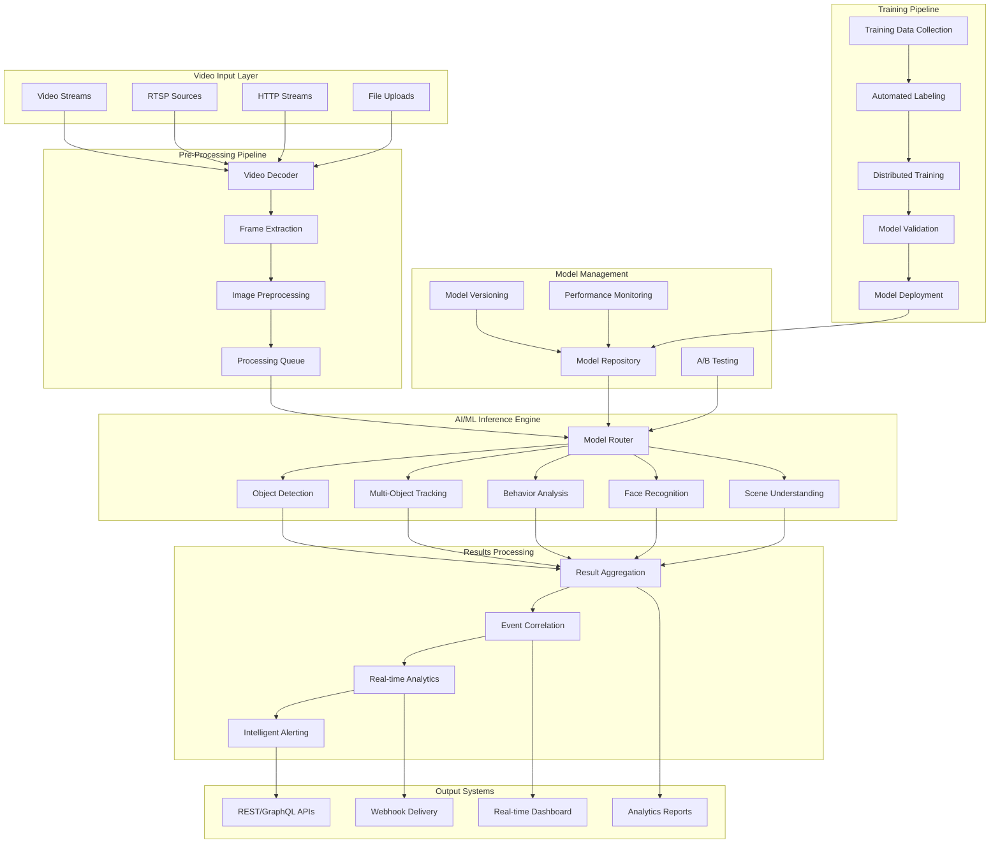

# Phase 2 Advanced AI/ML Pipeline
## Enhanced Intelligence Platform - WALK Phase

---

## 🎯 AI/ML Architecture Evolution

Phase 2 transforms the basic AI processing into a **sophisticated ML/AI pipeline** with advanced computer vision, custom model training, and intelligent analytics. The architecture supports **real-time inference**, **continuous learning**, and **model lifecycle management** at enterprise scale.

### **AI/ML Enhancement Objectives**
- **Advanced Computer Vision**: Sophisticated object detection, tracking, and analysis
- **Custom Model Training**: Training pipeline for organization-specific models
- **Real-Time Intelligence**: Sub-300ms inference with high accuracy
- **Model Operations**: Complete MLOps pipeline for model lifecycle
- **Scalable Processing**: GPU-accelerated processing for 500-1,000 streams

---

## 🧠 AI/ML Pipeline Architecture

### **Intelligent Processing Framework**


---

## 🔬 Advanced Computer Vision Capabilities

### **Multi-Modal AI Processing**
```yaml
COMPUTER_VISION_STACK:
  Object_Detection_Engine:
    primary_models: "YOLOv8, YOLOv9 for general object detection"
    specialized_models: "Custom models for industry-specific objects"
    performance: "Real-time processing at 30fps with 95%+ accuracy"
    scalability: "GPU-accelerated batch processing"

  Multi_Object_Tracking:
    tracking_algorithm: "DeepSORT with custom feature extraction"
    identity_management: "Persistent object ID across video sequences"
    trajectory_analysis: "Movement pattern analysis and prediction"
    performance: "Sub-50ms tracking latency per object"

  Behavior_Analysis:
    activity_recognition: "Human activity and gesture recognition"
    anomaly_detection: "Unusual behavior and event detection"
    crowd_analysis: "Crowd density and flow analysis"
    interaction_detection: "Object and person interaction analysis"

  Face_Recognition_System:
    face_detection: "RetinaFace for robust face detection"
    face_recognition: "ArcFace for high-accuracy recognition"
    liveness_detection: "Anti-spoofing and liveness verification"
    privacy_protection: "GDPR-compliant face processing options"

  Scene_Understanding:
    scene_classification: "Environment and context classification"
    depth_estimation: "Monocular depth estimation"
    semantic_segmentation: "Pixel-level object segmentation"
    temporal_analysis: "Scene change detection and analysis"

  Advanced_Analytics:
    vehicle_analytics: "License plate recognition and vehicle classification"
    people_counting: "Accurate crowd counting and demographics"
    dwell_time_analysis: "Object and person dwell time tracking"
    heat_mapping: "Activity heat map generation"
```

### **Real-Time Inference Architecture**
```yaml
INFERENCE_ARCHITECTURE:
  GPU_Processing_Framework:
    hardware_acceleration: "NVIDIA GPU with CUDA/TensorRT optimization"
    model_optimization: "TensorRT and ONNX Runtime optimization"
    batch_processing: "Dynamic batching for throughput optimization"
    memory_management: "GPU memory pooling and optimization"

  Model_Serving_Infrastructure:
    triton_inference_server: "NVIDIA Triton for multi-model serving"
    model_ensembles: "Model ensemble serving for improved accuracy"
    dynamic_batching: "Adaptive batch sizing for latency optimization"
    concurrent_execution: "Parallel model execution on multiple GPUs"

  Stream_Processing_Pipeline:
    frame_buffering: "Intelligent frame buffering and preprocessing"
    pipeline_parallelization: "Parallel processing across pipeline stages"
    load_balancing: "GPU workload balancing and scheduling"
    quality_adaptation: "Dynamic quality adjustment for performance"

  Result_Processing:
    post_processing: "Model output post-processing and filtering"
    confidence_scoring: "Multi-model confidence aggregation"
    temporal_smoothing: "Temporal consistency and noise reduction"
    result_validation: "Cross-model validation and verification"
```

---

## 🏗️ MLOps Pipeline Implementation

### **Model Lifecycle Management**
```yaml
MLOPS_ARCHITECTURE:
  Data_Management_Pipeline:
    data_ingestion: "Automated video data ingestion and cataloging"
    data_validation: "Data quality assessment and validation"
    data_preprocessing: "Automated preprocessing and augmentation"
    data_versioning: "Dataset versioning and lineage tracking"

  Training_Infrastructure:
    distributed_training: "Multi-GPU and multi-node training capability"
    experiment_tracking: "MLflow for experiment tracking and comparison"
    hyperparameter_optimization: "Automated hyperparameter tuning"
    training_automation: "Automated training pipeline orchestration"

  Model_Validation_Framework:
    automated_testing: "Automated model performance testing"
    benchmark_evaluation: "Standardized benchmark evaluation"
    bias_detection: "Model bias and fairness assessment"
    performance_regression: "Performance regression testing"

  Deployment_Pipeline:
    model_packaging: "Containerized model packaging and versioning"
    staging_deployment: "Automated staging environment deployment"
    canary_deployment: "Gradual production rollout with monitoring"
    rollback_capabilities: "Automated rollback for failed deployments"

  Monitoring_and_Observability:
    model_performance: "Real-time model performance monitoring"
    data_drift_detection: "Input data distribution drift detection"
    model_degradation: "Model accuracy degradation alerts"
    business_impact: "Business metric impact tracking"
```

### **Continuous Learning Framework**
```yaml
CONTINUOUS_LEARNING:
  Active_Learning_Pipeline:
    uncertainty_sampling: "Model uncertainty-based sample selection"
    diversity_sampling: "Dataset diversity optimization"
    human_in_the_loop: "Expert annotation and validation workflow"
    feedback_integration: "User feedback integration for improvement"

  Online_Learning_Capabilities:
    incremental_training: "Incremental model updates with new data"
    federated_learning: "Privacy-preserving distributed learning"
    transfer_learning: "Cross-domain knowledge transfer"
    few_shot_learning: "Rapid adaptation to new scenarios"

  Model_Improvement_Automation:
    performance_analysis: "Automated performance analysis and insights"
    architecture_optimization: "Neural architecture search and optimization"
    knowledge_distillation: "Model compression and efficiency improvement"
    ensemble_optimization: "Automated ensemble composition and weighting"

  Quality_Assurance:
    automated_validation: "Automated model validation and testing"
    regression_testing: "Automated regression testing for updates"
    compliance_checking: "Automated compliance and ethics checking"
    safety_validation: "Safety and robustness validation"
```

---

## 📊 Advanced Analytics and Intelligence

### **Real-Time Analytics Engine**
```yaml
ANALYTICS_ARCHITECTURE:
  Stream_Analytics:
    real_time_processing: "Apache Kafka Streams for real-time analytics"
    complex_event_processing: "CEP for pattern detection and correlation"
    time_series_analysis: "Time-series analytics for trend detection"
    predictive_analytics: "Predictive modeling for proactive insights"

  Business_Intelligence:
    kpi_monitoring: "Real-time KPI calculation and monitoring"
    dashboard_analytics: "Interactive dashboard with drill-down capabilities"
    report_generation: "Automated report generation and distribution"
    trend_analysis: "Long-term trend analysis and forecasting"

  Advanced_Correlation:
    multi_stream_correlation: "Cross-stream event correlation"
    temporal_correlation: "Time-based event correlation and causality"
    spatial_correlation: "Geographic and spatial correlation analysis"
    behavioral_correlation: "Behavioral pattern correlation and analysis"

  Alerting_Intelligence:
    smart_alerting: "ML-powered alert prioritization and filtering"
    escalation_management: "Intelligent alert escalation and routing"
    root_cause_analysis: "Automated root cause analysis and suggestions"
    preventive_alerts: "Predictive alerting for proactive intervention"
```

### **Custom Model Development**
```yaml
CUSTOM_MODEL_FRAMEWORK:
  Domain_Specific_Models:
    industry_customization: "Industry-specific model training and optimization"
    use_case_adaptation: "Custom models for specific use cases"
    environment_adaptation: "Environment-specific model optimization"
    regulatory_compliance: "Compliance-aware model development"

  Transfer_Learning_Platform:
    pre_trained_models: "Extensive library of pre-trained models"
    fine_tuning_pipeline: "Automated fine-tuning for specific domains"
    knowledge_transfer: "Cross-domain knowledge transfer capabilities"
    few_shot_adaptation: "Rapid adaptation with minimal training data"

  Model_Architecture_Innovation:
    neural_architecture_search: "Automated architecture optimization"
    efficient_architectures: "Mobile and edge-optimized architectures"
    multi_modal_fusion: "Multi-modal data fusion architectures"
    attention_mechanisms: "Advanced attention and transformer architectures"

  Specialized_Applications:
    security_applications: "Security-focused model development"
    safety_applications: "Safety-critical system models"
    privacy_preserving: "Privacy-preserving machine learning"
    explainable_ai: "Interpretable and explainable model development"
```

---

## 🔧 Infrastructure and Performance

### **GPU Computing Infrastructure**
```yaml
GPU_INFRASTRUCTURE:
  Hardware_Configuration:
    gpu_clusters: "NVIDIA A100/V100 GPU clusters for training"
    inference_gpus: "NVIDIA T4/RTX series for real-time inference"
    memory_optimization: "High-bandwidth memory for large model processing"
    interconnect: "High-speed GPU interconnect for distributed processing"

  Software_Stack:
    cuda_optimization: "CUDA 12.x with optimized kernels"
    tensorrt_acceleration: "TensorRT for production inference optimization"
    multi_gpu_training: "Distributed training across multiple GPUs"
    model_parallelism: "Model parallelism for large model training"

  Performance_Optimization:
    mixed_precision: "FP16/INT8 mixed precision for speed optimization"
    dynamic_batching: "Dynamic batch sizing for throughput optimization"
    kernel_fusion: "Custom kernel fusion for operation optimization"
    memory_pooling: "GPU memory pooling for efficiency"

  Scalability_Framework:
    horizontal_scaling: "Horizontal GPU scaling for increased capacity"
    load_balancing: "Intelligent GPU load balancing and scheduling"
    auto_scaling: "Automatic GPU resource scaling based on demand"
    cost_optimization: "GPU resource cost optimization and management"
```

### **Performance Specifications**
```yaml
PERFORMANCE_TARGETS:
  Inference_Performance:
    latency: "<300ms end-to-end processing latency"
    throughput: "500-1,000 concurrent video streams"
    accuracy: "95%+ accuracy for object detection tasks"
    gpu_utilization: "80%+ average GPU utilization"

  Training_Performance:
    training_speed: "10x faster training compared to Phase 1"
    experiment_iteration: "Daily model training and validation cycles"
    data_processing: "Real-time training data preprocessing"
    model_deployment: "Sub-hour model deployment pipeline"

  System_Performance:
    availability: "99.5% AI service availability"
    scalability: "Linear scaling with GPU resources"
    efficiency: "Optimized resource utilization and cost"
    reliability: "Robust error handling and recovery"
```

---

## 🎯 Phase 2 AI/ML Success Criteria

The **Phase 2 Advanced AI/ML Pipeline** delivers sophisticated intelligence capabilities:

- ✅ **Advanced Computer Vision**: Multi-modal AI with 95%+ accuracy
- ✅ **Custom Model Training**: Complete MLOps pipeline operational
- ✅ **Real-Time Intelligence**: Sub-300ms processing for 500-1,000 streams
- ✅ **Continuous Learning**: Automated model improvement and adaptation
- ✅ **Enterprise AI**: Production-ready AI platform with monitoring

**This AI/ML architecture provides the intelligent foundation needed for enterprise-scale video analytics.**

---

**Document Status**: Ready for Implementation
**Next Document**: [Service Mesh and Security](./03-service-mesh-security.md)
**Related**: [Kubernetes Architecture](./01-scalable-kubernetes-architecture.md) | [Business Considerations](../business-considerations/)