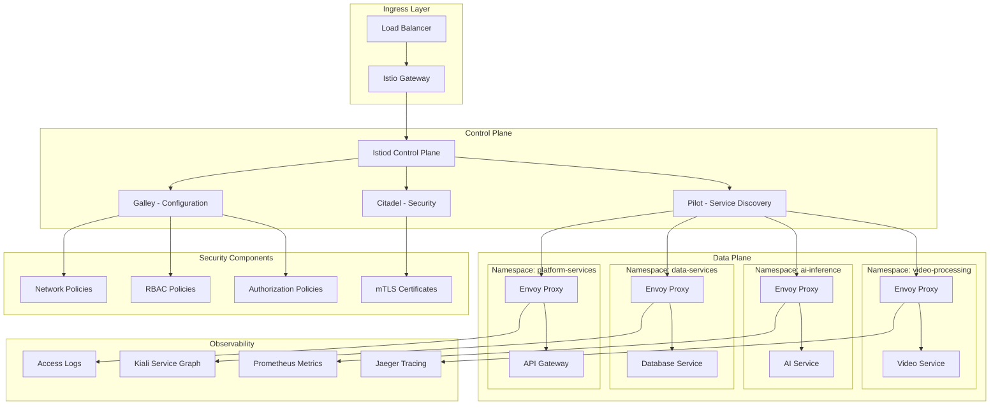

# Phase 2 Service Mesh and Security
## Zero Trust Architecture - WALK Phase

---

## 🎯 Security Architecture Evolution

Phase 2 implements a **comprehensive service mesh and zero trust security framework** that provides advanced security, observability, and traffic management for the microservices architecture. The implementation emphasizes **defense in depth**, **zero trust principles**, and **automated security enforcement**.

### **Security Enhancement Objectives**
- **Zero Trust Architecture**: Default deny with explicit allow policies
- **Service Mesh Integration**: Istio-based service communication and security
- **Advanced Authentication**: Multi-factor and certificate-based authentication
- **Automated Security**: Policy automation and security orchestration
- **Comprehensive Monitoring**: Security observability and threat detection

---

## 🕸️ Service Mesh Architecture

### **Istio Service Mesh Implementation**


---

## 🔒 Zero Trust Security Framework

### **Core Zero Trust Principles**
```yaml
ZERO_TRUST_ARCHITECTURE:
  Identity_Verification:
    workload_identity: "Kubernetes ServiceAccount-based workload identity"
    certificate_management: "Automatic mTLS certificate provisioning and rotation"
    identity_federation: "Integration with external identity providers"
    device_attestation: "Device certificate and attestation validation"

  Continuous_Authorization:
    policy_engine: "OPA (Open Policy Agent) for policy enforcement"
    dynamic_authorization: "Real-time authorization based on context"
    fine_grained_access: "Resource and operation-level access control"
    temporal_access: "Time-bound access grants and reviews"

  Least_Privilege_Access:
    minimal_permissions: "Default deny with explicit allow policies"
    role_segregation: "Clear separation of duties and responsibilities"
    privilege_escalation: "Controlled privilege escalation procedures"
    access_review: "Regular access review and certification"

  Comprehensive_Monitoring:
    security_telemetry: "Real-time security event collection and analysis"
    behavioral_analysis: "User and entity behavior analytics"
    threat_detection: "AI-powered threat detection and response"
    audit_compliance: "Comprehensive audit trails and compliance reporting"
```

### **Service-to-Service Security**
```yaml
SERVICE_SECURITY:
  Mutual_TLS_Framework:
    automatic_mtls: "Automatic mTLS for all service communications"
    certificate_lifecycle: "Automated certificate provisioning and rotation"
    root_ca_management: "Secure root CA management and distribution"
    certificate_validation: "Real-time certificate validation and revocation"

  Authorization_Policies:
    service_level_authz: "Service-level authorization policies"
    method_level_authz: "HTTP method and API endpoint authorization"
    conditional_access: "Context-aware conditional access policies"
    policy_testing: "Policy simulation and testing framework"

  Traffic_Security:
    traffic_encryption: "End-to-end traffic encryption"
    traffic_inspection: "Deep packet inspection and analysis"
    anomaly_detection: "Traffic pattern anomaly detection"
    rate_limiting: "Advanced rate limiting and DDoS protection"

  Network_Segmentation:
    micro_segmentation: "Network micro-segmentation with policies"
    namespace_isolation: "Kubernetes namespace-based isolation"
    workload_isolation: "Pod-level network isolation"
    ingress_egress_control: "Controlled ingress and egress traffic"
```

---

## 🛡️ Advanced Authentication and Authorization

### **Multi-Factor Authentication System**
```yaml
AUTHENTICATION_FRAMEWORK:
  Identity_Providers:
    enterprise_integration: "Active Directory, Azure AD, Okta integration"
    saml_federation: "SAML 2.0 federation for enterprise SSO"
    oauth2_oidc: "OAuth 2.0 and OpenID Connect support"
    certificate_auth: "X.509 certificate-based authentication"

  Multi_Factor_Authentication:
    totp_support: "Time-based OTP (Google Authenticator, Authy)"
    hardware_tokens: "FIDO2/WebAuthn hardware token support"
    biometric_auth: "Biometric authentication integration"
    risk_based_auth: "Risk-based adaptive authentication"

  Session_Management:
    jwt_tokens: "Secure JWT token implementation with short expiry"
    refresh_tokens: "Secure refresh token rotation"
    session_monitoring: "Real-time session monitoring and analytics"
    concurrent_sessions: "Concurrent session management and limits"

  API_Authentication:
    api_key_management: "Secure API key generation and management"
    client_certificates: "Client certificate authentication"
    oauth2_scopes: "Fine-grained OAuth 2.0 scope management"
    rate_limiting: "Authentication-aware rate limiting"
```

### **Fine-Grained Authorization**
```yaml
AUTHORIZATION_FRAMEWORK:
  Role_Based_Access_Control:
    hierarchical_roles: "Hierarchical role inheritance and composition"
    dynamic_roles: "Context-aware dynamic role assignment"
    temporal_roles: "Time-bound role assignments"
    role_mining: "Automated role discovery and optimization"

  Attribute_Based_Access_Control:
    context_attributes: "User, resource, environment, and action attributes"
    policy_languages: "XACML and OPA Rego policy languages"
    decision_caching: "Authorization decision caching for performance"
    policy_simulation: "Policy impact analysis and simulation"

  Resource_Level_Authorization:
    fine_grained_permissions: "Object and field-level permissions"
    data_filtering: "Automatic data filtering based on permissions"
    dynamic_masking: "Real-time data masking and anonymization"
    ownership_models: "Resource ownership and delegation models"

  Policy_Management:
    centralized_policies: "Centralized policy definition and management"
    policy_versioning: "Policy version control and rollback"
    policy_testing: "Automated policy testing and validation"
    compliance_mapping: "Policy to compliance requirement mapping"
```

---

## 🔍 Security Monitoring and Observability

### **Comprehensive Security Telemetry**
```yaml
SECURITY_OBSERVABILITY:
  Real_Time_Monitoring:
    security_events: "Real-time security event collection and processing"
    traffic_analysis: "Network traffic analysis and monitoring"
    authentication_monitoring: "Authentication attempt monitoring and analysis"
    authorization_auditing: "Authorization decision auditing and tracking"

  Threat_Detection:
    anomaly_detection: "ML-powered behavioral anomaly detection"
    signature_detection: "Known threat signature detection"
    threat_intelligence: "External threat intelligence integration"
    attack_simulation: "Continuous security testing and red teaming"

  Incident_Response:
    automated_response: "Automated incident response and containment"
    forensic_collection: "Security event forensic data collection"
    incident_correlation: "Multi-source incident correlation and analysis"
    response_orchestration: "Security orchestration and automated response"

  Compliance_Monitoring:
    policy_compliance: "Real-time policy compliance monitoring"
    regulatory_reporting: "Automated compliance reporting"
    audit_preparation: "Continuous audit readiness and evidence collection"
    risk_assessment: "Real-time security risk assessment and scoring"
```

### **Security Analytics Platform**
```yaml
SECURITY_ANALYTICS:
  Data_Collection:
    multi_source_ingestion: "Security data from multiple sources"
    real_time_streaming: "Real-time security event streaming"
    data_normalization: "Security event data normalization and enrichment"
    data_retention: "Tiered security data retention and archival"

  Analysis_Engine:
    correlation_rules: "Advanced security event correlation rules"
    machine_learning: "ML-based security analytics and prediction"
    behavioral_baselines: "Normal behavior baseline establishment"
    risk_scoring: "Dynamic security risk scoring and assessment"

  Visualization_Platform:
    security_dashboards: "Real-time security monitoring dashboards"
    threat_visualization: "Threat landscape visualization and mapping"
    incident_timelines: "Security incident timeline and relationship analysis"
    compliance_reporting: "Interactive compliance and audit reporting"

  Integration_Framework:
    siem_integration: "SIEM platform integration and data sharing"
    soar_integration: "Security orchestration platform integration"
    threat_feeds: "External threat intelligence feed integration"
    vulnerability_scanning: "Vulnerability assessment integration"
```

---

## 🌐 Network Security Architecture

### **Advanced Network Protection**
```yaml
NETWORK_SECURITY:
  Perimeter_Security:
    waf_protection: "Web Application Firewall with AI-powered rules"
    ddos_protection: "Multi-layer DDoS protection and mitigation"
    geographic_filtering: "Geographic access control and filtering"
    reputation_filtering: "IP and domain reputation-based filtering"

  Internal_Network_Security:
    network_policies: "Kubernetes NetworkPolicy enforcement"
    service_mesh_policies: "Istio authorization policy enforcement"
    traffic_encryption: "End-to-end traffic encryption"
    network_monitoring: "Real-time network traffic monitoring"

  Data_Protection:
    data_classification: "Automatic data classification and labeling"
    dlp_protection: "Data Loss Prevention (DLP) policies and controls"
    encryption_enforcement: "Mandatory encryption for sensitive data"
    key_management: "Centralized encryption key management"

  Compliance_Controls:
    regulatory_compliance: "GDPR, HIPAA, SOX compliance controls"
    industry_standards: "SOC 2, ISO 27001 compliance implementation"
    audit_trails: "Comprehensive audit trail collection and retention"
    evidence_collection: "Automated compliance evidence collection"
```

### **Security Automation Framework**
```yaml
SECURITY_AUTOMATION:
  Policy_Automation:
    policy_as_code: "Security policies defined as code"
    automated_deployment: "Automated policy deployment and updates"
    policy_testing: "Automated policy testing and validation"
    compliance_checking: "Automated compliance checking and reporting"

  Incident_Automation:
    threat_response: "Automated threat detection and response"
    containment_procedures: "Automated threat containment and isolation"
    evidence_preservation: "Automated forensic evidence preservation"
    stakeholder_notification: "Automated incident notification and escalation"

  Vulnerability_Management:
    automated_scanning: "Continuous vulnerability scanning and assessment"
    patch_management: "Automated security patch deployment"
    risk_prioritization: "Automated vulnerability risk prioritization"
    remediation_tracking: "Automated remediation tracking and verification"

  Compliance_Automation:
    control_testing: "Automated security control testing"
    evidence_collection: "Automated compliance evidence collection"
    report_generation: "Automated compliance report generation"
    certification_maintenance: "Automated certification maintenance and renewal"
```

---

## 📊 Security Performance Metrics

### **Security KPIs and Metrics**
```yaml
SECURITY_METRICS:
  Security_Effectiveness:
    threat_detection_rate: "Percentage of threats detected and blocked"
    false_positive_rate: "Security alert false positive rate"
    incident_response_time: "Mean time to detect and respond to incidents"
    vulnerability_remediation: "Time to remediate critical vulnerabilities"

  Compliance_Metrics:
    policy_compliance_rate: "Percentage compliance with security policies"
    audit_readiness: "Audit preparation time and evidence completeness"
    regulatory_compliance: "Compliance with regulatory requirements"
    certification_status: "Security certification maintenance status"

  Operational_Metrics:
    authentication_success_rate: "User authentication success and failure rates"
    authorization_decision_time: "Authorization decision latency"
    security_event_volume: "Security event processing volume and capacity"
    system_availability: "Security system availability and uptime"

  Risk_Metrics:
    security_risk_score: "Overall organizational security risk score"
    attack_surface_size: "Measured attack surface and exposure"
    security_debt: "Accumulated security technical debt"
    threat_landscape: "Current threat landscape and exposure assessment"
```

---

## 🎯 Phase 2 Security Success Criteria

The **Phase 2 Service Mesh and Security Architecture** delivers enterprise-grade security:

- ✅ **Zero Trust Implementation**: Comprehensive zero trust architecture operational
- ✅ **Service Mesh Security**: Istio-based service communication and protection
- ✅ **Advanced Authentication**: Multi-factor authentication and authorization
- ✅ **Automated Security**: Policy automation and orchestrated response
- ✅ **Security Observability**: Complete security monitoring and analytics

**This security architecture provides the enterprise-grade protection needed for production deployment.**

---

**Document Status**: Ready for Implementation
**Next Document**: [Business Considerations](../business-considerations/01-enterprise-value-realization.md)
**Related**: [Kubernetes Architecture](./01-scalable-kubernetes-architecture.md) | [AI/ML Pipeline](./02-advanced-ai-ml-pipeline.md)