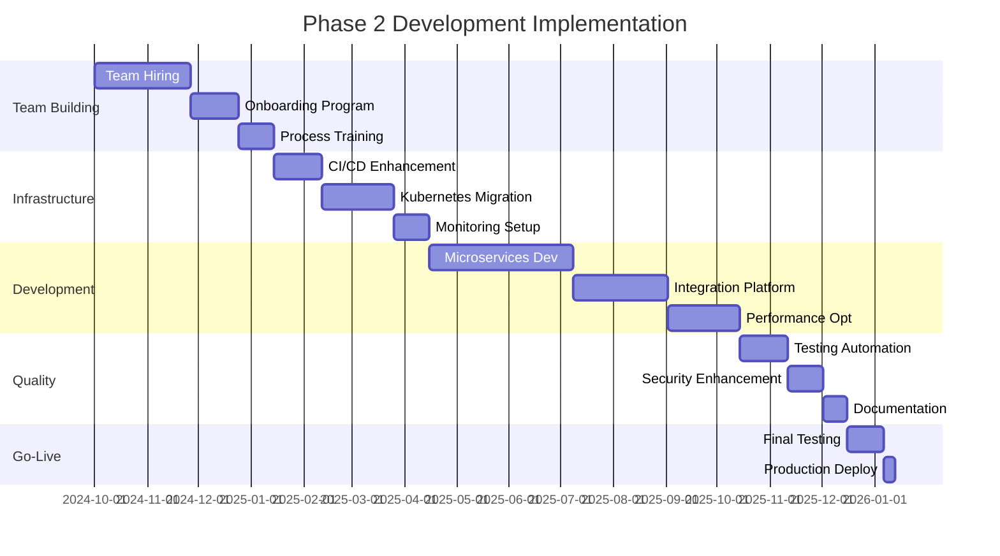

# Phase 2 Scaling Development Guide
## Enterprise Implementation Strategy - WALK Phase

---

## 🎯 Executive Summary

This guide provides comprehensive development strategies for scaling from Phase 1's simplified MVP to Phase 2's enterprise-grade multi-server system. The focus is on **systematic team expansion**, **advanced development practices**, and **mature DevOps processes** required to support 500-1,000 concurrent video streams with 99% availability.

### **Key Development Objectives**
- **Team Scaling**: Expand from 3-5 to 8-12 team members with specialized roles
- **DevOps Maturity**: Implement enterprise-grade CI/CD and infrastructure automation
- **Code Quality**: Establish comprehensive testing, code review, and quality gates
- **Performance Optimization**: Achieve <300ms latency with advanced AI capabilities
- **Integration Platform**: Support 15+ external system integrations

### **Development Philosophy: "Scale with Discipline"**
Phase 2 development emphasizes disciplined scaling - growing team capabilities and technical sophistication while maintaining code quality, system reliability, and delivery velocity.

---

## 👥 Team Expansion Strategy

### **From 5 to 12: Strategic Team Growth**
```yaml
TEAM_EVOLUTION:
  Phase_1_Team: "3-5 generalists"
  Phase_2_Team: "8-12 specialists"
  Growth_Strategy: "Gradual expansion with skill specialization"
  Timeline: "6-month ramp-up period"

SPECIALIZED_ROLES:
  Core_Team_Retention: "Retain and promote Phase 1 team members"
  New_Specialist_Roles: "Add specialized expertise areas"
  Knowledge_Transfer: "Structured mentoring and documentation"
  Cultural_Preservation: "Maintain startup agility with enterprise discipline"
```

### **Phase 2 Team Structure**
```yaml
ENGINEERING_LEADERSHIP:
  Engineering_Manager:
    Background: "Promote Tech Lead from Phase 1 or external hire"
    Responsibilities:
      - Team leadership and career development
      - Technical strategy and architecture decisions
      - Cross-team coordination and communication
      - Resource planning and allocation
    Skills: "Technical leadership, people management, system architecture"

  Senior_Technical_Lead:
    Background: "Phase 1 Tech Lead evolution or external senior hire"
    Responsibilities:
      - Technical architecture and design decisions
      - Code review and quality standards
      - Performance optimization and scaling
      - Mentoring and technical guidance
    Skills: "Advanced system design, performance optimization, mentoring"

BACKEND_TEAM:
  Senior_Backend_Engineer:
    Background: "Promote Phase 1 Backend Developer or external hire"
    Responsibilities:
      - Microservices architecture and implementation
      - Database scaling and optimization
      - API design and performance tuning
      - Integration platform development
    Skills: "Kubernetes, microservices, database scaling, API design"

  Backend_Engineer_2:
    Background: "New hire with cloud-native experience"
    Responsibilities:
      - Service implementation and maintenance
      - Integration development and testing
      - Performance monitoring and optimization
      - Documentation and knowledge sharing
    Skills: "Node.js, PostgreSQL, Redis, cloud platforms"

  ML_Engineer:
    Background: "New hire with video analytics experience"
    Responsibilities:
      - AI model optimization and deployment
      - Video processing pipeline enhancement
      - Performance tuning for real-time analysis
      - Model versioning and MLOps practices
    Skills: "Computer vision, TensorFlow/PyTorch, MLOps, video processing"

FRONTEND_TEAM:
  Senior_Frontend_Engineer:
    Background: "Promote Phase 1 Frontend Developer or external hire"
    Responsibilities:
      - Advanced UI/UX implementation
      - Real-time dashboard optimization
      - Mobile and responsive design
      - Frontend architecture and patterns
    Skills: "React mastery, real-time UI, performance optimization"

  Frontend_Engineer_2:
    Background: "New hire with enterprise dashboard experience"
    Responsibilities:
      - Component library development
      - Integration with backend services
      - Testing and quality assurance
      - User experience optimization
    Skills: "React, TypeScript, testing frameworks, UX design"

INFRASTRUCTURE_TEAM:
  DevOps_Engineer_Senior:
    Background: "Promote Phase 1 DevOps or external hire"
    Responsibilities:
      - Kubernetes cluster management
      - CI/CD pipeline optimization
      - Infrastructure as code implementation
      - Monitoring and alerting systems
    Skills: "Kubernetes, CI/CD, infrastructure automation, monitoring"

  Site_Reliability_Engineer:
    Background: "New hire with enterprise SRE experience"
    Responsibilities:
      - System reliability and availability
      - Performance monitoring and optimization
      - Incident response and post-mortems
      - Capacity planning and scaling
    Skills: "SRE practices, monitoring, incident response, automation"

QUALITY_ASSURANCE:
  QA_Engineer:
    Background: "New hire with enterprise testing experience"
    Responsibilities:
      - Test strategy and automation
      - Performance and load testing
      - Integration testing coordination
      - Quality gates and release validation
    Skills: "Test automation, performance testing, CI/CD integration"

BUSINESS_ANALYSIS:
  Senior_Business_Analyst:
    Background: "Promote Phase 1 BA or external hire"
    Responsibilities:
      - Requirements gathering and analysis
      - Stakeholder communication and management
      - User acceptance testing coordination
      - Business process optimization
    Skills: "Business analysis, stakeholder management, process optimization"
```

### **Hiring and Onboarding Strategy**
```yaml
RECRUITMENT_APPROACH:
  Technical_Assessment:
    Coding_Challenge: "Video processing or microservices challenge"
    System_Design: "Scalability and architecture discussion"
    Cultural_Fit: "Agile mindset and collaborative approach"
    Growth_Mindset: "Learning orientation and adaptability"

  Onboarding_Program:
    Week_1: "Codebase familiarization and development environment setup"
    Week_2: "Architecture overview and mentorship assignment"
    Week_3: "First feature implementation with code review"
    Week_4: "Integration with team processes and full autonomy"

  Knowledge_Transfer:
    Documentation: "Comprehensive technical and process documentation"
    Mentorship: "Pair programming and regular 1:1 sessions"
    Gradual_Responsibility: "Progressive increase in complexity and ownership"
    Feedback_Loops: "Regular feedback and adjustment sessions"
```

---

## 🔄 Advanced Development Processes

### **Agile at Scale: SAFe Implementation**
```yaml
SCALED_AGILE_FRAMEWORK:
  Program_Increment_Planning:
    Duration: "12-week PI with 6 x 2-week sprints"
    Participants: "All team members, stakeholders, product owners"
    Deliverables: "PI objectives, dependencies, risks, and timelines"
    Cadence: "Quarterly planning with continuous adjustment"

  Sprint_Structure:
    Sprint_Length: "2 weeks (optimal for feedback and delivery)"
    Ceremonies:
      - Daily Standups (15 minutes, focus on blockers)
      - Sprint Planning (4 hours, detailed planning)
      - Sprint Review (2 hours, demo and feedback)
      - Sprint Retrospective (1.5 hours, continuous improvement)

  Team_Coordination:
    Scrum_of_Scrums: "Weekly cross-team coordination"
    Architecture_Sync: "Bi-weekly technical alignment"
    Integration_Planning: "Monthly integration and testing coordination"
    Release_Planning: "Quarterly release planning and roadmap review"

CODE_REVIEW_PROCESS:
  Review_Requirements:
    Mandatory_Reviews: "All code changes require 2+ approvals"
    Review_Criteria:
      - Code quality and standards compliance
      - Test coverage and documentation
      - Security and performance considerations
      - Architecture and design patterns
    Review_Timeline: "24-48 hours maximum review time"

  Automated_Quality_Gates:
    Static_Analysis: "ESLint, SonarQube, security scanning"
    Test_Coverage: "Minimum 80% coverage for new code"
    Performance_Testing: "Automated performance regression detection"
    Security_Scanning: "Dependency vulnerability scanning"
```

### **Testing Strategy Enhancement**
```yaml
COMPREHENSIVE_TESTING_PYRAMID:
  Unit_Testing:
    Coverage_Target: "85%+ for new code, 70%+ overall"
    Frameworks: "Jest (Node.js), React Testing Library (Frontend)"
    Practices: "TDD for critical components, BDD for user stories"
    Automation: "Pre-commit hooks and CI pipeline integration"

  Integration_Testing:
    API_Testing: "Supertest for REST API endpoint testing"
    Database_Testing: "Test containers with PostgreSQL"
    Service_Integration: "Contract testing with Pact"
    Message_Queue_Testing: "Redis pub/sub integration testing"

  End_to_End_Testing:
    Framework: "Cypress for critical user journeys"
    Test_Environments: "Dedicated staging environment with production data"
    Test_Data_Management: "Automated test data generation and cleanup"
    Visual_Regression: "Automated screenshot comparison"

  Performance_Testing:
    Load_Testing: "Artillery.js for API load testing"
    Stress_Testing: "Kubernetes-based load generation"
    Video_Processing_Testing: "Custom video stream simulation"
    Database_Performance: "Database query optimization testing"

  Security_Testing:
    SAST: "Static Application Security Testing in CI pipeline"
    DAST: "Dynamic Application Security Testing"
    Dependency_Scanning: "Automated vulnerability scanning"
    Penetration_Testing: "Quarterly professional security assessment"
```

---

## 🚀 DevOps Maturity Evolution

### **CI/CD Pipeline Enhancement**
```yaml
CONTINUOUS_INTEGRATION:
  Pipeline_Triggers:
    Pull_Request: "Full test suite and security scanning"
    Main_Branch: "Full pipeline with deployment to staging"
    Release_Branch: "Production deployment pipeline"
    Hotfix: "Fast-track pipeline with reduced testing for critical fixes"

  Build_Process:
    Docker_Images:
      - Multi-stage builds for optimization
      - Security scanning with Trivy
      - Image signing and vulnerability database
      - Automated base image updates

    Artifact_Management:
      - Container registry with image lifecycle policies
      - Semantic versioning for all artifacts
      - Artifact promotion between environments
      - Rollback capability with artifact retention

  Quality_Gates:
    Code_Quality: "SonarQube quality gate with custom rules"
    Test_Coverage: "Coverage reports with trend analysis"
    Performance: "Automated performance regression detection"
    Security: "Zero critical vulnerabilities for production deployment"

CONTINUOUS_DEPLOYMENT:
  Environment_Promotion:
    Development: "Automatic deployment on main branch"
    Staging: "Automatic deployment with smoke tests"
    Production: "Manual approval with automated deployment"
    Canary: "Gradual traffic shift with monitoring"

  Deployment_Strategies:
    Blue_Green: "Zero-downtime deployment with instant rollback"
    Canary_Releases: "Progressive traffic shifting (5% -> 25% -> 50% -> 100%)"
    Feature_Flags: "LaunchDarkly or custom feature flag system"
    Database_Migrations: "Backward-compatible migrations with rollback support"

  Monitoring_Integration:
    Health_Checks: "Comprehensive application and infrastructure health checks"
    Performance_Monitoring: "Real-time performance metrics and alerting"
    Business_Metrics: "Custom business KPI tracking and alerting"
    Log_Aggregation: "Centralized logging with correlation IDs"
```

### **Infrastructure as Code Implementation**
```yaml
INFRASTRUCTURE_AUTOMATION:
  Kubernetes_Management:
    Cluster_Provisioning: "Terraform for cloud infrastructure"
    Application_Deployment: "Helm charts with GitOps (ArgoCD)"
    Configuration_Management: "Kubernetes ConfigMaps and Secrets"
    Resource_Management: "Resource quotas and limit ranges"

  GitOps_Workflow:
    Repository_Structure:
      - infrastructure/ (Terraform configurations)
      - kubernetes/ (Helm charts and manifests)
      - applications/ (Application configurations)
      - environments/ (Environment-specific configurations)

    Deployment_Process:
      - Git commit triggers pipeline
      - Terraform plan and apply for infrastructure
      - Helm deploy for applications
      - ArgoCD sync for GitOps compliance

  Environment_Management:
    Environment_Parity: "Production-like staging and development environments"
    Resource_Scaling: "Environment-appropriate resource allocation"
    Data_Management: "Automated test data refresh and anonymization"
    Cost_Optimization: "Automated environment shutdown for cost savings"

MONITORING_AS_CODE:
  Prometheus_Configuration:
    Service_Discovery: "Kubernetes service discovery"
    Custom_Metrics: "Application-specific business metrics"
    Alerting_Rules: "Comprehensive alerting rules as code"
    Recording_Rules: "Performance optimization through pre-aggregation"

  Grafana_Dashboard_Management:
    Dashboard_as_Code: "JSON dashboard configurations in Git"
    Template_Variables: "Environment-specific dashboard variables"
    Alerting_Integration: "Grafana alerting with multiple notification channels"
    Custom_Panels: "Business-specific visualization panels"
```

---

## 🏗️ Microservices Development Patterns

### **Service Decomposition Strategy**
```yaml
MICROSERVICES_PATTERNS:
  Domain_Driven_Design:
    Bounded_Contexts: "Clear service boundaries based on business domains"
    Event_Storming: "Collaborative domain modeling sessions"
    Service_APIs: "Contract-first API design with OpenAPI specifications"
    Data_Ownership: "Each service owns its data with no shared databases"

  Communication_Patterns:
    Synchronous:
      - HTTP/REST for request-response patterns
      - gRPC for high-performance internal communication
      - Circuit breaker pattern for fault tolerance
      - Retry logic with exponential backoff

    Asynchronous:
      - Event-driven architecture with Redis Pub/Sub
      - Message queuing for reliable processing
      - Event sourcing for audit trails
      - CQRS for read/write separation

  Data_Management:
    Database_Per_Service: "Each microservice has its own database"
    Data_Consistency: "Eventual consistency with compensation patterns"
    Distributed_Transactions: "Saga pattern for cross-service transactions"
    Data_Synchronization: "Event-driven data synchronization"

SERVICE_DEVELOPMENT_STANDARDS:
  API_Design:
    RESTful_Principles: "Resource-based URLs with proper HTTP methods"
    Versioning_Strategy: "URL versioning with backward compatibility"
    Error_Handling: "Consistent error response format across services"
    Documentation: "OpenAPI specifications with examples"

  Security_Implementation:
    Authentication: "JWT tokens with service-to-service authentication"
    Authorization: "Role-based access control (RBAC) at service level"
    API_Gateway: "Centralized authentication and rate limiting"
    Secrets_Management: "HashiCorp Vault for secret distribution"

  Observability:
    Distributed_Tracing: "Jaeger tracing across all service calls"
    Structured_Logging: "JSON logs with correlation IDs"
    Metrics_Collection: "Prometheus metrics for each service"
    Health_Checks: "Comprehensive health check endpoints"
```

### **Service Implementation Guidelines**
```yaml
SERVICE_STRUCTURE:
  Code_Organization:
    src/
      controllers/     # API endpoint handlers
      services/        # Business logic implementation
      repositories/    # Data access layer
      models/          # Data models and schemas
      middleware/      # Cross-cutting concerns
      config/          # Configuration management
      utils/           # Utility functions
    tests/             # Test files mirroring src structure
    docs/              # Service-specific documentation
    Dockerfile         # Container configuration
    helm/              # Kubernetes deployment charts

  Configuration_Management:
    Environment_Variables: "12-factor app configuration principles"
    Config_Validation: "Runtime configuration validation"
    Feature_Flags: "Runtime feature toggle capability"
    Secrets_Injection: "Vault-based secrets injection"

  Error_Handling:
    Global_Error_Handler: "Centralized error handling and logging"
    Custom_Exceptions: "Business-specific exception types"
    Error_Monitoring: "Automated error tracking and alerting"
    Graceful_Degradation: "Fallback mechanisms for service failures"
```

---

## 📊 Performance Optimization Strategy

### **System Performance Targets**
```yaml
PERFORMANCE_REQUIREMENTS:
  Latency_Targets:
    API_Response_Time: "<300ms for 95th percentile"
    Video_Processing_Latency: "<500ms for real-time streams"
    Database_Query_Time: "<100ms for read queries, <500ms for writes"
    Inter_Service_Communication: "<50ms for internal API calls"

  Throughput_Targets:
    Concurrent_Video_Streams: "500-1,000 streams"
    API_Requests_Per_Second: "10,000+ RPS across all services"
    Database_Transactions: "5,000+ TPS"
    Message_Processing: "50,000+ messages per second"

  Resource_Utilization:
    CPU_Utilization: "70-80% average, 90% peak"
    Memory_Utilization: "75-85% average, 90% peak"
    Network_Bandwidth: "60-70% of available capacity"
    Storage_Performance: "80% of IOPS capacity"
```

### **Optimization Techniques**
```yaml
APPLICATION_OPTIMIZATION:
  Code_Optimization:
    Profiling: "Regular performance profiling with tools like clinic.js"
    Memory_Management: "Memory leak detection and optimization"
    CPU_Optimization: "Algorithm optimization and parallel processing"
    I_O_Optimization: "Asynchronous I/O and connection pooling"

  Caching_Strategy:
    Application_Caching:
      - In-memory caching with Redis
      - HTTP caching with CDN integration
      - Database query result caching
      - Computed result caching

    Cache_Invalidation:
      - Time-based expiration
      - Event-driven cache invalidation
      - Cache warming strategies
      - Cache hit ratio monitoring

  Database_Optimization:
    Query_Optimization: "SQL query analysis and index optimization"
    Connection_Pooling: "PgBouncer configuration and tuning"
    Read_Replicas: "Load distribution across read replicas"
    Partitioning: "Table partitioning for large datasets"

INFRASTRUCTURE_OPTIMIZATION:
  Kubernetes_Tuning:
    Resource_Requests_Limits: "Optimized resource allocation"
    Node_Affinity: "Pod placement optimization"
    Horizontal_Pod_Autoscaling: "Dynamic scaling based on metrics"
    Vertical_Pod_Autoscaling: "Automatic resource right-sizing"

  Network_Optimization:
    Service_Mesh: "Istio for advanced traffic management (optional)"
    Load_Balancing: "Intelligent load balancing algorithms"
    Network_Policies: "Optimized network security and performance"
    Ingress_Optimization: "Nginx ingress tuning for high throughput"
```

---

## 🔗 Integration Platform Development

### **External Integration Architecture**
```yaml
INTEGRATION_STRATEGY:
  Integration_Patterns:
    API_First: "RESTful APIs with OpenAPI specifications"
    Event_Driven: "Webhook-based real-time integrations"
    Batch_Processing: "Scheduled data synchronization"
    Real_Time_Streaming: "WebSocket connections for live data"

  Integration_Platform_Components:
    API_Gateway: "Centralized integration point with authentication"
    Message_Broker: "Redis Pub/Sub for asynchronous communication"
    Data_Transformation: "ETL pipeline for data format conversion"
    Integration_Monitoring: "Comprehensive integration health monitoring"

TARGET_INTEGRATIONS:
  Security_Systems:
    - SIEM platforms (Splunk, QRadar, ArcSight)
    - Identity management systems (Active Directory, LDAP)
    - Security information sharing platforms
    - Incident management systems (ServiceNow, Jira Service Management)

  Business_Systems:
    - ERP systems (SAP, Oracle, Microsoft Dynamics)
    - Customer relationship management (Salesforce, HubSpot)
    - Business intelligence platforms (Tableau, Power BI)
    - Workflow automation (Zapier, Microsoft Power Automate)

  Communication_Platforms:
    - Notification systems (Slack, Microsoft Teams, Discord)
    - Email platforms (SendGrid, Amazon SES)
    - SMS services (Twilio, AWS SNS)
    - Mobile push notifications (Firebase, Apple Push Notification)

  Cloud_Services:
    - Cloud storage (AWS S3, Azure Blob, Google Cloud Storage)
    - Machine learning platforms (AWS SageMaker, Google AI Platform)
    - Analytics services (Google Analytics, Adobe Analytics)
    - Monitoring services (New Relic, Datadog, AppDynamics)

  IoT_Platforms:
    - IoT device management platforms
    - Sensor data ingestion systems
    - Edge computing platforms
    - Industrial automation systems
```

### **Integration Development Framework**
```yaml
INTEGRATION_DEVELOPMENT:
  SDK_Development:
    JavaScript_SDK: "NPM package for Node.js integrations"
    Python_SDK: "PyPI package for Python integrations"
    REST_Client_Libraries: "Auto-generated client libraries"
    GraphQL_Schema: "Comprehensive GraphQL API schema"

  Authentication_Strategies:
    API_Keys: "Simple API key authentication for basic integrations"
    OAuth2: "OAuth2 flow for secure third-party integrations"
    JWT_Tokens: "JSON Web Tokens for service-to-service authentication"
    mTLS: "Mutual TLS for high-security integrations"

  Data_Formats:
    JSON_API: "JSON:API specification compliance"
    XML_Support: "Legacy system XML format support"
    Protocol_Buffers: "High-performance binary format"
    Custom_Formats: "Industry-specific data formats"

  Integration_Testing:
    Contract_Testing: "Pact contracts for integration validation"
    Integration_Test_Suite: "Comprehensive integration test scenarios"
    Mock_Services: "Mock external services for development and testing"
    Performance_Testing: "Integration performance and load testing"
```

---

## 📈 Quality Assurance Enhancement

### **Comprehensive QA Strategy**
```yaml
QUALITY_FRAMEWORK:
  Test_Strategy:
    Shift_Left_Testing: "Early testing in development lifecycle"
    Risk_Based_Testing: "Prioritize testing based on business risk"
    Exploratory_Testing: "Manual exploratory testing for edge cases"
    User_Experience_Testing: "Usability and accessibility testing"

  Automation_Strategy:
    Test_Pyramid: "Unit tests (70%), Integration tests (20%), E2E tests (10%)"
    API_Testing: "Automated API testing with data validation"
    UI_Testing: "Critical user journey automation"
    Performance_Testing: "Automated performance regression testing"

  Quality_Metrics:
    Test_Coverage: "85%+ code coverage with branch coverage analysis"
    Bug_Escape_Rate: "<2% bugs found in production"
    Test_Execution_Time: "<30 minutes for full test suite"
    Flaky_Test_Rate: "<5% of automated tests are flaky"

TESTING_INFRASTRUCTURE:
  Test_Environments:
    Development: "Local testing with Docker Compose"
    Integration: "Kubernetes-based integration testing"
    Staging: "Production-like environment with real data"
    Performance: "Dedicated environment for load testing"

  Test_Data_Management:
    Data_Generation: "Automated test data generation"
    Data_Anonymization: "Production data anonymization for testing"
    Data_Cleanup: "Automated test data cleanup processes"
    Data_Versioning: "Version control for test datasets"
```

---

## 🔄 Migration from Phase 1

### **Systematic Migration Strategy**
```yaml
MIGRATION_APPROACH:
  Code_Migration:
    Monolith_Decomposition: "Gradual extraction of microservices"
    Database_Migration: "Data migration with zero downtime"
    API_Versioning: "Backward-compatible API evolution"
    Feature_Flag_Migration: "Gradual feature migration with toggles"

  Team_Transition:
    Knowledge_Transfer: "Comprehensive documentation and training"
    Mentorship_Program: "Experienced team members mentor new hires"
    Gradual_Responsibility: "Progressive increase in autonomy"
    Cultural_Integration: "Maintain Phase 1 culture while adding enterprise practices"

  Process_Evolution:
    Agile_Scaling: "Transition from basic Scrum to SAFe"
    DevOps_Maturation: "Advanced CI/CD and infrastructure automation"
    Quality_Enhancement: "Comprehensive testing and quality gates"
    Documentation_Improvement: "Enterprise-grade documentation standards"

RISK_MITIGATION:
  Technical_Risks:
    Rollback_Capability: "Ability to rollback to Phase 1 at any point"
    Parallel_Systems: "Run Phase 1 and Phase 2 systems in parallel during transition"
    Data_Integrity: "Comprehensive data validation and reconciliation"
    Performance_Monitoring: "Continuous performance comparison"

  Organizational_Risks:
    Change_Management: "Structured change management process"
    Communication_Plan: "Regular updates to all stakeholders"
    Training_Program: "Comprehensive training for new processes and tools"
    Support_Structure: "Enhanced support during transition period"
```

---

## 📊 Success Metrics and KPIs

### **Development Team KPIs**
```yaml
TEAM_PERFORMANCE:
  Velocity_Metrics:
    Story_Points_Per_Sprint: "Consistent velocity with 10-15% improvement"
    Lead_Time: "From feature request to production deployment"
    Cycle_Time: "From development start to production deployment"
    Deployment_Frequency: "Weekly deployments with <1% rollback rate"

  Quality_Metrics:
    Bug_Rate: "<2 bugs per story point delivered"
    Code_Review_Effectiveness: "95%+ of bugs caught in code review"
    Test_Coverage: "85%+ coverage with trend analysis"
    Technical_Debt_Ratio: "<20% of development time on technical debt"

  Team_Health:
    Team_Satisfaction: "4.5/5 average in team satisfaction surveys"
    Knowledge_Distribution: "No single points of failure in knowledge"
    Learning_Time: "New team members productive within 4 weeks"
    Retention_Rate: "95%+ team retention rate"

TECHNICAL_PERFORMANCE:
  System_Metrics:
    API_Performance: "<300ms response time for 95th percentile"
    System_Availability: "99%+ uptime"
    Error_Rate: "<1% for all critical user journeys"
    Scalability: "Linear scaling up to 1,000 concurrent streams"

  DevOps_Metrics:
    Deployment_Success_Rate: "99%+ successful deployments"
    Mean_Time_to_Recovery: "<2 hours for critical issues"
    Change_Failure_Rate: "<5% of deployments require rollback"
    Infrastructure_Automation: "95%+ of infrastructure provisioned via code"
```

---

## 🎯 Phase 2 Development Roadmap

### **12-Month Implementation Timeline**


---

## 🎯 Conclusion

The **Phase 2 Scaling Development Guide** provides a comprehensive roadmap for evolving from a Phase 1 MVP to an enterprise-grade system. Key achievements include:

- ✅ **Team Maturity**: Scale from 5 to 12 specialized team members
- ✅ **Development Excellence**: Implement enterprise-grade development practices
- ✅ **DevOps Maturity**: Advanced CI/CD and infrastructure automation
- ✅ **Quality Assurance**: Comprehensive testing and quality gates
- ✅ **Integration Platform**: Support for 15+ external system integrations
- ✅ **Performance Optimization**: <300ms latency with 99% availability

**This guide ensures systematic scaling while maintaining code quality, team productivity, and system reliability throughout the Phase 2 implementation.**

---

**Document Status**: Ready for Implementation
**Next Review**: Monthly during Phase 2 implementation
**Approval Required**: Engineering leadership and executive team
**Implementation Start**: Upon Phase 1 completion and team hiring