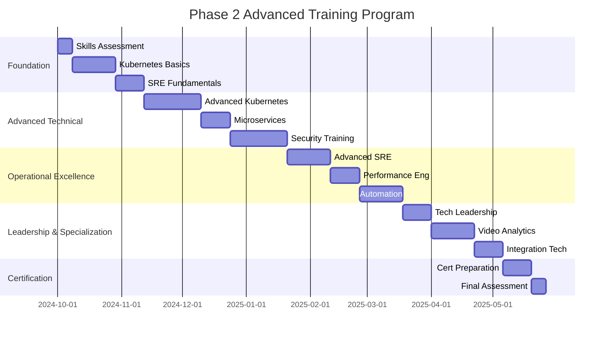

# Phase 2 Advanced Training Programs
## Enterprise Skills Development - WALK Phase

---

## 🎯 Executive Summary

This document outlines comprehensive training programs required to elevate team capabilities from Phase 1's basic skill set to Phase 2's enterprise-grade expertise. The focus is on **advanced technical skills**, **enterprise technologies**, and **operational excellence** needed to manage 500-1,000 concurrent video streams with 99% availability.

### **Key Training Objectives**
- **Technology Mastery**: Kubernetes, microservices, and enterprise-grade tools
- **Operational Excellence**: SRE practices, incident management, and automation
- **Security Enhancement**: Advanced security practices and compliance frameworks
- **Performance Optimization**: Enterprise-scale performance tuning and optimization
- **Leadership Development**: Technical leadership and team management skills

### **Training Philosophy: "Learn, Apply, Master"**
Phase 2 training emphasizes practical application of enterprise technologies through hands-on labs, real-world projects, and mentorship programs that ensure skills transfer to production environments.

---

## 📚 Training Program Overview

### **Training Program Structure**
```yaml
TRAINING_FRAMEWORK:
  Program_Duration: "6-month intensive training program"
  Training_Approach: "Blended learning with theory, labs, and real-world application"
  Certification_Focus: "Industry-recognized certifications and internal competency validation"
  Mentorship_Program: "Senior engineer mentorship and knowledge transfer"

TRAINING_TRACKS:
  Technical_Track: "Advanced technical skills and technologies"
  Operational_Track: "SRE practices and operational excellence"
  Security_Track: "Enterprise security and compliance"
  Leadership_Track: "Technical leadership and management skills"

SKILL_ASSESSMENT:
  Pre_Training_Assessment: "Baseline skill assessment and gap analysis"
  Progress_Tracking: "Monthly skill development progress reviews"
  Competency_Validation: "Hands-on practical competency validation"
  Post_Training_Certification: "Internal and external certification achievement"
```

### **Training Delivery Methods**
```yaml
DELIVERY_APPROACHES:
  Instructor_Led_Training:
    Format: "In-person and virtual classroom sessions"
    Duration: "40% of total training time"
    Focus: "Theoretical foundations and complex topics"
    Interactive_Elements: "Q&A, group discussions, case studies"

  Hands_On_Labs:
    Format: "Practical lab exercises with real environments"
    Duration: "35% of total training time"
    Focus: "Applied learning and skill practice"
    Environment: "Dedicated training Kubernetes clusters and environments"

  Project_Based_Learning:
    Format: "Real-world project implementation"
    Duration: "20% of total training time"
    Focus: "Application of learned skills to actual work"
    Outcome: "Deliverable improvements to production systems"

  Self_Paced_Learning:
    Format: "Online courses, documentation, and tutorials"
    Duration: "5% of total training time"
    Focus: "Individual learning and certification preparation"
    Resources: "Curated learning paths and resource libraries"
```

---

## 🚀 Technical Training Track

### **Kubernetes and Container Orchestration**
```yaml
KUBERNETES_TRAINING:
  Foundation_Level:
    Duration: "3 weeks (40 hours)"
    Prerequisites: "Basic Docker knowledge from Phase 1"
    Learning_Objectives:
      - Kubernetes architecture and components understanding
      - Pod, service, and deployment management
      - ConfigMaps and Secrets management
      - Basic networking and storage concepts

    Hands_On_Labs:
      - Set up local Kubernetes cluster with kind/minikube
      - Deploy sample applications with YAML manifests
      - Configure services and ingress controllers
      - Implement basic monitoring and logging

    Certification_Target: "Certified Kubernetes Application Developer (CKAD)"

  Advanced_Level:
    Duration: "4 weeks (60 hours)"
    Prerequisites: "CKAD certification or equivalent experience"
    Learning_Objectives:
      - Advanced networking with service mesh (Istio)
      - StatefulSets and persistent storage management
      - Custom Resource Definitions (CRDs) and operators
      - Cluster administration and troubleshooting

    Hands_On_Labs:
      - Implement StatefulSets for database deployments
      - Configure Istio service mesh for microservices
      - Create custom operators for application management
      - Perform cluster upgrades and disaster recovery

    Certification_Target: "Certified Kubernetes Administrator (CKA)"

  Expert_Level:
    Duration: "2 weeks (30 hours)"
    Prerequisites: "CKA certification and production experience"
    Learning_Objectives:
      - Kubernetes security hardening and RBAC
      - Multi-cluster management and federation
      - Advanced troubleshooting and performance tuning
      - GitOps and CD pipeline integration

    Hands_On_Labs:
      - Implement comprehensive RBAC policies
      - Set up multi-cluster federation
      - Optimize cluster performance and resource utilization
      - Implement GitOps with ArgoCD/Flux

    Certification_Target: "Certified Kubernetes Security Specialist (CKS)"

MICROSERVICES_ARCHITECTURE:
  Service_Design_Patterns:
    Duration: "2 weeks (30 hours)"
    Learning_Objectives:
      - Domain-driven design and bounded contexts
      - API design patterns and versioning strategies
      - Event-driven architecture and messaging patterns
      - Data consistency and transaction patterns

    Practical_Application:
      - Refactor Phase 1 monolith into microservices
      - Implement event-driven communication patterns
      - Design and implement distributed transaction patterns
      - Create comprehensive API documentation

  Service_Mesh_Implementation:
    Duration: "2 weeks (25 hours)"
    Learning_Objectives:
      - Istio architecture and components
      - Traffic management and security policies
      - Observability and distributed tracing
      - Progressive deployment strategies

    Practical_Application:
      - Deploy Istio service mesh in training environment
      - Implement traffic routing and load balancing
      - Configure security policies and mTLS
      - Set up distributed tracing with Jaeger
```

### **Cloud-Native Technologies**
```yaml
CLOUD_NATIVE_STACK:
  Container_Technologies:
    Duration: "1 week (15 hours)"
    Learning_Objectives:
      - Advanced Docker techniques and multi-stage builds
      - Container security scanning and hardening
      - Container registry management and policies
      - Buildpack and Cloud Native Buildpacks

    Hands_On_Practice:
      - Optimize container images for production
      - Implement container security scanning pipeline
      - Set up private container registry with security policies
      - Use Cloud Native Buildpacks for application builds

  Infrastructure_as_Code:
    Duration: "3 weeks (45 hours)"
    Learning_Objectives:
      - Terraform for infrastructure provisioning
      - Helm for Kubernetes application packaging
      - GitOps principles and implementation
      - Infrastructure testing and validation

    Hands_On_Practice:
      - Provision Kubernetes clusters with Terraform
      - Create and manage Helm charts for applications
      - Implement GitOps workflow with ArgoCD
      - Develop infrastructure testing strategies

    Certification_Target: "HashiCorp Certified: Terraform Associate"

  Observability_Stack:
    Duration: "2 weeks (30 hours)"
    Learning_Objectives:
      - Prometheus and Grafana advanced configuration
      - Jaeger distributed tracing implementation
      - ELK stack for centralized logging
      - Custom metrics and alerting strategies

    Hands_On_Practice:
      - Deploy comprehensive monitoring stack
      - Create custom Grafana dashboards and alerts
      - Implement distributed tracing across microservices
      - Set up centralized logging with correlation
```

---

## 🛡️ Security Training Track

### **Enterprise Security Practices**
```yaml
SECURITY_FUNDAMENTALS:
  Application_Security:
    Duration: "2 weeks (30 hours)"
    Learning_Objectives:
      - Secure coding practices and vulnerability prevention
      - OWASP Top 10 and mitigation strategies
      - API security and authentication best practices
      - Container and Kubernetes security hardening

    Hands_On_Labs:
      - Conduct security code reviews and vulnerability assessments
      - Implement secure authentication and authorization
      - Harden container images and Kubernetes deployments
      - Set up automated security scanning pipelines

  Infrastructure_Security:
    Duration: "2 weeks (30 hours)"
    Learning_Objectives:
      - Network security and micro-segmentation
      - Secrets management with HashiCorp Vault
      - Certificate management and PKI
      - Security monitoring and incident response

    Hands_On_Labs:
      - Implement network policies and security groups
      - Deploy and configure HashiCorp Vault
      - Set up automated certificate management
      - Create security monitoring dashboards

    Certification_Target: "Certified Information Systems Security Professional (CISSP)"

COMPLIANCE_AND_GOVERNANCE:
  Compliance_Frameworks:
    Duration: "2 weeks (25 hours)"
    Learning_Objectives:
      - SOC2 Type II compliance requirements
      - ISO 27001 information security management
      - GDPR and data privacy regulations
      - Audit trail and evidence collection

    Practical_Application:
      - Implement SOC2 controls and monitoring
      - Develop information security policies
      - Design data privacy protection mechanisms
      - Create compliance reporting and documentation

  Risk_Management:
    Duration: "1 week (15 hours)"
    Learning_Objectives:
      - Risk assessment and management methodologies
      - Threat modeling and vulnerability analysis
      - Business continuity and disaster recovery planning
      - Security metrics and KPI development

    Practical_Application:
      - Conduct comprehensive risk assessment
      - Develop threat models for video analytics platform
      - Create business continuity plans
      - Implement security metrics and reporting
```

---

## 📊 Operational Excellence Track

### **Site Reliability Engineering (SRE)**
```yaml
SRE_FUNDAMENTALS:
  SRE_Principles:
    Duration: "2 weeks (30 hours)"
    Learning_Objectives:
      - SRE philosophy and error budget management
      - Service Level Objectives (SLO) and Service Level Indicators (SLI)
      - Toil reduction and automation strategies
      - Reliability engineering best practices

    Hands_On_Practice:
      - Define SLOs and SLIs for video analytics platform
      - Implement error budget monitoring and alerting
      - Identify and automate toil reduction opportunities
      - Create reliability improvement plans

  Incident_Management:
    Duration: "2 weeks (25 hours)"
    Learning_Objectives:
      - Incident response procedures and escalation
      - Blameless post-mortem culture and practices
      - On-call management and rotation strategies
      - Crisis communication and stakeholder management

    Hands_On_Practice:
      - Develop comprehensive incident response procedures
      - Conduct simulated incident response exercises
      - Create post-mortem templates and processes
      - Implement on-call rotation and escalation procedures

  Automation_and_Tooling:
    Duration: "3 weeks (40 hours)"
    Learning_Objectives:
      - Infrastructure automation with Terraform and Ansible
      - CI/CD pipeline development and optimization
      - Monitoring and alerting automation
      - Runbook automation and chatops

    Hands_On_Practice:
      - Automate infrastructure provisioning and management
      - Build advanced CI/CD pipelines with quality gates
      - Implement comprehensive monitoring and alerting
      - Create automated runbooks and chatops integration

PERFORMANCE_ENGINEERING:
  Performance_Monitoring:
    Duration: "2 weeks (25 hours)"
    Learning_Objectives:
      - Application performance monitoring (APM) tools
      - Infrastructure performance monitoring
      - User experience monitoring and optimization
      - Performance testing and load generation

    Hands_On_Practice:
      - Implement comprehensive APM monitoring
      - Set up infrastructure performance monitoring
      - Create user experience monitoring dashboards
      - Develop performance testing strategies

  Capacity_Planning:
    Duration: "1 week (15 hours)"
    Learning_Objectives:
      - Capacity forecasting and planning methodologies
      - Resource optimization and cost management
      - Scaling strategies and automation
      - Performance bottleneck identification and resolution

    Practical_Application:
      - Develop capacity forecasting models
      - Implement resource optimization strategies
      - Create automated scaling policies
      - Perform performance optimization analysis
```

---

## 🚀 Leadership Development Track

### **Technical Leadership**
```yaml
TECHNICAL_LEADERSHIP:
  Architecture_Leadership:
    Duration: "2 weeks (25 hours)"
    Target_Audience: "Senior engineers and tech leads"
    Learning_Objectives:
      - System architecture design and decision making
      - Technology evaluation and selection criteria
      - Technical debt management and prioritization
      - Cross-team technical coordination

    Leadership_Projects:
      - Lead architecture review and decision process
      - Evaluate and recommend new technologies
      - Develop technical debt reduction plan
      - Facilitate cross-team technical discussions

  Team_Leadership:
    Duration: "2 weeks (20 hours)"
    Target_Audience: "Team leads and senior engineers"
    Learning_Objectives:
      - Engineering team management and motivation
      - Code review and quality standards enforcement
      - Mentorship and career development
      - Conflict resolution and team dynamics

    Leadership_Projects:
      - Mentor junior team members
      - Establish code review and quality processes
      - Conduct career development discussions
      - Resolve team conflicts and improve dynamics

PROJECT_MANAGEMENT:
  Agile_Leadership:
    Duration: "1 week (15 hours)"
    Learning_Objectives:
      - Scaled Agile Framework (SAFe) implementation
      - Sprint planning and execution optimization
      - Stakeholder management and communication
      - Metrics-driven continuous improvement

    Practical_Application:
      - Lead SAFe implementation for Phase 2
      - Optimize sprint planning and execution processes
      - Develop stakeholder communication strategies
      - Implement metrics and continuous improvement

  Change_Management:
    Duration: "1 week (10 hours)"
    Learning_Objectives:
      - Organizational change management principles
      - Technology adoption and user training
      - Communication strategies and stakeholder engagement
      - Resistance management and mitigation

    Practical_Application:
      - Develop Phase 2 change management plan
      - Create user adoption and training strategies
      - Design communication and engagement plans
      - Implement resistance mitigation strategies
```

---

## 📈 Specialized Skills Training

### **Video Analytics and AI/ML**
```yaml
VIDEO_ANALYTICS_EXPERTISE:
  Computer_Vision_Advanced:
    Duration: "3 weeks (40 hours)"
    Target_Audience: "ML engineers and backend developers"
    Learning_Objectives:
      - Advanced computer vision algorithms and models
      - Real-time video processing optimization
      - Custom model training and fine-tuning
      - Edge computing for video analytics

    Hands_On_Projects:
      - Implement custom object detection models
      - Optimize video processing for real-time performance
      - Deploy models to edge computing environments
      - Create model performance monitoring and retraining

  MLOps_Implementation:
    Duration: "2 weeks (30 hours)"
    Learning_Objectives:
      - ML model lifecycle management
      - Automated model training and deployment
      - Model versioning and rollback strategies
      - Performance monitoring and drift detection

    Practical_Implementation:
      - Set up MLOps pipeline for video analytics models
      - Implement automated model training and validation
      - Create model deployment and rollback procedures
      - Monitor model performance and drift

INTEGRATION_TECHNOLOGIES:
  API_Development_Advanced:
    Duration: "2 weeks (25 hours)"
    Learning_Objectives:
      - GraphQL implementation and optimization
      - Real-time APIs with WebSockets and Server-Sent Events
      - API security and rate limiting strategies
      - API versioning and backward compatibility

    Hands_On_Development:
      - Implement GraphQL APIs for complex queries
      - Create real-time API endpoints for live data
      - Implement comprehensive API security measures
      - Design API versioning and migration strategies

  Message_Queue_Systems:
    Duration: "1 week (15 hours)"
    Learning_Objectives:
      - Advanced Redis patterns and clustering
      - Apache Kafka for high-throughput messaging
      - Event-driven architecture patterns
      - Message serialization and schema evolution

    Implementation_Projects:
      - Implement Redis clustering for high availability
      - Set up Kafka for high-throughput event processing
      - Design event-driven microservices architecture
      - Create schema evolution and compatibility strategies
```

---

## 🎓 Certification and Assessment

### **Certification Roadmap**
```yaml
CERTIFICATION_TARGETS:
  Cloud_Native_Certifications:
    Kubernetes_Track:
      - Certified Kubernetes Application Developer (CKAD)
      - Certified Kubernetes Administrator (CKA)
      - Certified Kubernetes Security Specialist (CKS)

    Cloud_Platform_Certifications:
      - AWS Solutions Architect Associate/Professional
      - Google Cloud Professional Cloud Architect
      - Azure Solutions Architect Expert

  DevOps_and_SRE:
    HashiCorp_Certifications:
      - Terraform Associate
      - Vault Associate
      - Consul Associate

    Industry_Certifications:
      - Docker Certified Associate
      - Prometheus Certified Associate
      - Istio Certified Associate

  Security_Certifications:
    Information_Security:
      - Certified Information Systems Security Professional (CISSP)
      - Certified Information Security Manager (CISM)
      - CompTIA Security+

    Cloud_Security:
      - AWS Certified Security - Specialty
      - Google Cloud Professional Cloud Security Engineer
      - Azure Security Engineer Associate

INTERNAL_COMPETENCY_VALIDATION:
  Technical_Assessments:
    Practical_Demonstrations:
      - Kubernetes cluster deployment and management
      - Microservices architecture implementation
      - Security hardening and compliance validation
      - Performance optimization and troubleshooting

    Project_Based_Evaluation:
      - Lead technical implementation project
      - Mentor junior team members effectively
      - Resolve complex technical challenges
      - Contribute to architectural decisions

  Peer_Review_Process:
    360_Degree_Feedback:
      - Technical competency peer assessment
      - Leadership and mentorship evaluation
      - Communication and collaboration skills
      - Problem-solving and innovation capacity

  Continuous_Assessment:
    Monthly_Check_ins:
      - Progress tracking and goal adjustment
      - Skill development planning and support
      - Challenge identification and resolution
      - Career development and advancement planning
```

---

## 📊 Training Program Management

### **Training Infrastructure**
```yaml
TRAINING_ENVIRONMENT:
  Laboratory_Setup:
    Kubernetes_Clusters:
      - Multi-node training clusters for hands-on practice
      - Separate environments for each training cohort
      - Real-world scenarios with production-like configurations
      - Sandbox environments for experimentation

    Monitoring_Stack:
      - Complete observability stack for training exercises
      - Real-time monitoring and alerting simulation
      - Log aggregation and analysis platforms
      - Performance testing and load generation tools

  Learning_Management:
    Platform_Features:
      - Course content delivery and progress tracking
      - Hands-on lab environment provisioning
      - Assessment and certification management
      - Resource library and documentation access

    Resource_Access:
      - 24/7 access to training environments
      - Self-paced learning materials and resources
      - Community forums and peer collaboration
      - Expert instructor and mentor access

TRAINING_DELIVERY:
  Instructor_Resources:
    Expert_Instructors:
      - Industry-recognized experts in each domain
      - Hands-on experience with enterprise implementations
      - Teaching and mentorship capabilities
      - Continuous curriculum development and updates

    Training_Materials:
      - Comprehensive course materials and presentations
      - Hands-on lab guides and exercises
      - Real-world case studies and examples
      - Assessment and certification materials

  Student_Support:
    Mentorship_Program:
      - Senior engineer mentors for each participant
      - Regular one-on-one mentorship sessions
      - Career development and advancement guidance
      - Technical challenge resolution and support

    Peer_Learning:
      - Study groups and collaborative learning sessions
      - Peer code review and knowledge sharing
      - Cross-team collaboration and experience sharing
      - Community of practice development
```

---

## 📈 Training Success Metrics

### **Training Effectiveness KPIs**
```yaml
TRAINING_METRICS:
  Completion_Rates:
    Course_Completion: "95%+ completion rate for all training programs"
    Certification_Achievement: "85%+ certification success rate"
    Competency_Validation: "90%+ passing rate for internal assessments"
    Time_to_Competency: "Average 6 months to achieve advanced competency"

  Skill_Application:
    Practical_Application: "100% of participants apply skills in production work"
    Innovation_Projects: "50%+ of participants lead innovation initiatives"
    Knowledge_Transfer: "80%+ of participants mentor others effectively"
    Problem_Resolution: "70% improvement in complex problem resolution"

  Business_Impact:
    Performance_Improvement: "30% improvement in operational efficiency"
    Quality_Enhancement: "50% reduction in production issues"
    Innovation_Acceleration: "40% faster feature development and deployment"
    Team_Satisfaction: "4.5/5 average team satisfaction with training programs"

CAREER_DEVELOPMENT:
  Advancement_Metrics:
    Promotion_Rate: "60% of participants promoted within 12 months"
    Leadership_Roles: "40% of participants assume technical leadership roles"
    Cross_Team_Mobility: "30% of participants move to new teams or roles"
    Retention_Rate: "95%+ retention rate for training program graduates"

  Compensation_Impact:
    Salary_Advancement: "Average 20% salary increase within 18 months"
    Bonus_Eligibility: "90% of participants eligible for performance bonuses"
    Stock_Option_Grants: "70% of participants receive additional equity grants"
    External_Market_Value: "Participants become competitive for senior roles externally"
```

---

## 🎯 Implementation Timeline

### **6-Month Training Program Schedule**


---

## 🎯 Conclusion

The **Phase 2 Advanced Training Programs** provide comprehensive skill development to support enterprise-scale video analytics platform operations. Key outcomes include:

- ✅ **Technical Mastery**: Advanced skills in Kubernetes, microservices, and enterprise technologies
- ✅ **Operational Excellence**: SRE practices, incident management, and automation expertise
- ✅ **Security Proficiency**: Enterprise security practices and compliance frameworks
- ✅ **Leadership Development**: Technical leadership and team management capabilities
- ✅ **Certification Achievement**: Industry-recognized certifications and internal competency validation
- ✅ **Career Advancement**: Significant career progression and compensation improvement

**These training programs ensure the team has the advanced skills and knowledge required to successfully implement and operate the Phase 2 enterprise-grade video analytics platform.**

---

**Document Status**: Ready for Implementation
**Next Review**: Quarterly during training program execution
**Approval Required**: HR leadership and technical management
**Implementation Start**: Upon Phase 2 team expansion completion