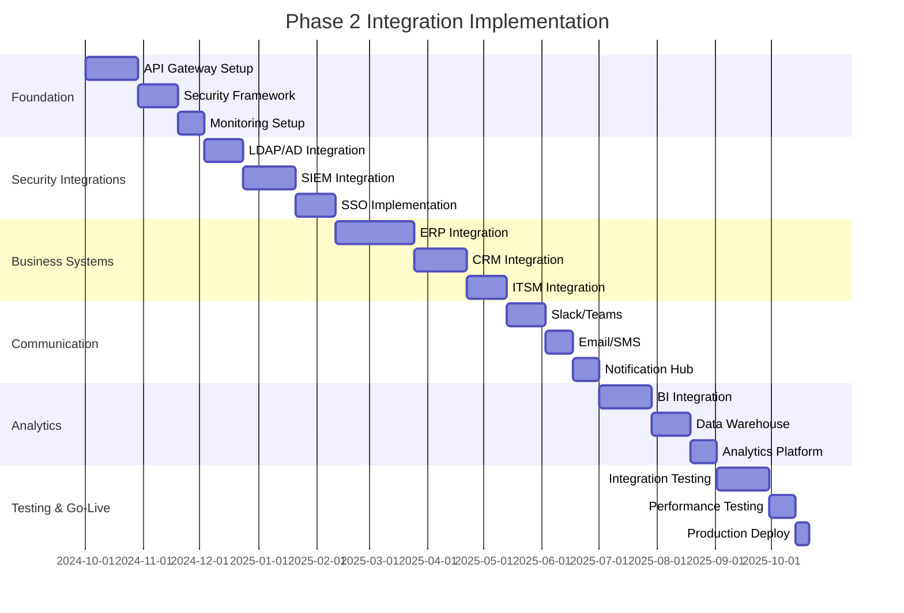

# Phase 2 Integration Management
## Enterprise Ecosystem Strategy - WALK Phase

---

## 🎯 Executive Summary

This document establishes the framework for managing **15+ external system integrations** during Phase 2, transforming the video analytics platform from a standalone system to an integrated enterprise ecosystem component. The focus is on **scalable integration patterns**, **robust API management**, and **enterprise-grade reliability** for mission-critical business systems.

### **Key Integration Objectives**
- **Integration Scale**: Support 15+ enterprise system integrations
- **API Management**: Comprehensive API gateway and management platform
- **Data Synchronization**: Real-time and batch data integration patterns
- **Security Integration**: Enterprise authentication and authorization
- **Monitoring & Analytics**: End-to-end integration monitoring and analytics

### **Integration Philosophy: "Connect, Secure, Scale"**
Phase 2 integration strategy emphasizes secure, scalable, and maintainable connections that enhance business value while preserving system reliability and performance.

---

## 🔗 Integration Architecture Overview

### **Enterprise Integration Ecosystem**

```mermaid
graph TB
    subgraph "🌐 External Enterprise Systems"
        subgraph "Security & Identity"
            SIEM[SIEM Platform<br/>🔍 Splunk/QRadar<br/>🚨 Security Analytics]
            LDAP[Active Directory<br/>👥 Identity Management<br/>🔐 Authentication]
            IAM[Identity Platform<br/>🎫 SSO/SAML<br/>🔑 Authorization]
        end

        subgraph "Business Systems"
            ERP[ERP System<br/>💼 SAP/Oracle<br/>📊 Business Data]
            CRM[CRM Platform<br/>👤 Salesforce/HubSpot<br/>📞 Customer Data]
            ITSM[IT Service Mgmt<br/>🎫 ServiceNow/Jira<br/>📋 Incident Management]
        end

        subgraph "Communication & Collaboration"
            SLACK[Slack/Teams<br/>💬 Team Communication<br/>🤖 Chatbots]
            EMAIL[Email Platform<br/>📧 SendGrid/SES<br/>📨 Notifications]
            SMS[SMS Service<br/>📱 Twilio/SNS<br/>🚨 Alerts]
        end

        subgraph "Analytics & BI"
            BI[Business Intelligence<br/>📊 Tableau/Power BI<br/>📈 Analytics]
            DWH[Data Warehouse<br/>🏪 Snowflake/Redshift<br/>💾 Data Storage]
            ANALYTICS[Analytics Platform<br/>📊 Google Analytics<br/>👤 User Behavior]
        end
    end

    subgraph "🎥 Video Analytics Platform (Phase 2)"
        subgraph "Integration Layer"
            AG[API Gateway<br/>🚪 Kong/Ambassador<br/>🔐 Auth & Rate Limiting]
            IM[Integration Manager<br/>🔄 Event Routing<br/>📡 Message Broker]
            DT[Data Transformer<br/>🔧 Format Conversion<br/>📝 Mapping Engine]
        end

        subgraph "Core Platform Services"
            USER[User Management<br/>👥 RBAC<br/>🔐 Authentication]
            VIDEO[Video Analytics<br/>🎥 Processing<br/>🤖 AI Analysis]
            ALERT[Alert Manager<br/>🚨 Notification Engine<br/>📋 Escalation]
            REPORT[Reporting Engine<br/>📊 Analytics<br/>📈 Dashboards]
        end

        subgraph "Data Layer"
            DB[PostgreSQL<br/>🗄️ Operational Data<br/>🔄 Real-time]
            CACHE[Redis Cluster<br/>⚡ Caching<br/>📡 Pub/Sub]
            ANALYTICS_DB[Analytics DB<br/>📊 ClickHouse<br/>📈 Time-series]
        end
    end

    SIEM <--> AG
    LDAP <--> AG
    IAM <--> AG
    ERP <--> AG
    CRM <--> AG
    ITSM <--> AG
    SLACK <--> AG
    EMAIL <--> AG
    SMS <--> AG
    BI <--> AG
    DWH <--> AG
    ANALYTICS <--> AG

    AG --> IM
    AG --> DT
    IM --> USER
    IM --> VIDEO
    IM --> ALERT
    IM --> REPORT

    USER --> DB
    VIDEO --> DB
    VIDEO --> ANALYTICS_DB
    ALERT --> CACHE
    REPORT --> ANALYTICS_DB

    classDef security fill:#ff5722,stroke:#d84315,stroke-width:2px,color:#fff
    classDef business fill:#2196f3,stroke:#1976d2,stroke-width:2px,color:#fff
    classDef communication fill:#4caf50,stroke:#388e3c,stroke-width:2px,color:#fff
    classDef analytics fill:#ff9800,stroke:#f57c00,stroke-width:2px,color:#fff
    classDef platform fill:#9c27b0,stroke:#7b1fa2,stroke-width:2px,color:#fff
    classDef data fill:#607d8b,stroke:#455a64,stroke-width:2px,color:#fff

    class SIEM,LDAP,IAM security
    class ERP,CRM,ITSM business
    class SLACK,EMAIL,SMS communication
    class BI,DWH,ANALYTICS analytics
    class AG,IM,DT,USER,VIDEO,ALERT,REPORT platform
    class DB,CACHE,ANALYTICS_DB data
```


---

## 🚪 API Gateway and Management

### **API Gateway Configuration**
```yaml
API_GATEWAY_ARCHITECTURE:
  Technology_Stack:
    Primary_Gateway: "Kong Enterprise or Ambassador Edge Stack"
    Authentication: "OAuth2/OIDC with JWT tokens"
    Rate_Limiting: "Redis-based distributed rate limiting"
    Analytics: "Prometheus metrics with Grafana dashboards"

  Gateway_Features:
    Traffic_Management:
      - Load balancing across backend services
      - Circuit breaker patterns for fault tolerance
      - Request/response transformation and validation
      - Caching for performance optimization

    Security_Features:
      - API key management and validation
      - OAuth2/OIDC authentication integration
      - IP whitelisting and blacklisting
      - CORS policy management

    Monitoring_Capabilities:
      - Real-time API metrics and analytics
      - Request/response logging and tracing
      - Performance monitoring and alerting
      - Usage analytics and billing integration

API_VERSIONING_STRATEGY:
  Versioning_Approach:
    URL_Versioning: "https://api.platform.com/v1/, /v2/, etc."
    Header_Versioning: "API-Version: 2.0 (for minor versions)"
    Content_Negotiation: "Accept: application/vnd.platform.v2+json"

  Backward_Compatibility:
    Deprecation_Policy: "12-month deprecation notice for major versions"
    Migration_Support: "Dual-version support during transition periods"
    Breaking_Changes: "Only in major version increments"
    Documentation: "Comprehensive migration guides and change logs"

  Version_Lifecycle:
    Development: "Alpha and beta versions for early adopters"
    Stable: "Production-ready versions with full support"
    Maintenance: "Security updates and critical bug fixes only"
    Deprecated: "End-of-life with migration guidance"
```

### **API Security Framework**
```yaml
API_SECURITY:
  Authentication_Layers:
    Gateway_Authentication:
      - API key validation for service identification
      - Rate limiting per API key and IP address
      - Geographic access controls and restrictions
      - Request signature validation (HMAC-SHA256)

    Application_Authentication:
      - OAuth2 authorization code flow for user authentication
      - JWT token validation with claims verification
      - Refresh token rotation and revocation
      - Multi-factor authentication integration

    Service_Authentication:
      - Mutual TLS (mTLS) for service-to-service communication
      - Service mesh integration for zero-trust networking
      - Certificate management and rotation
      - Service identity verification and authorization

  Authorization_Framework:
    Role_Based_Access_Control:
      - Hierarchical role definitions and inheritance
      - Resource-level permissions and access controls
      - Dynamic permission evaluation and caching
      - Audit logging and compliance reporting

    Attribute_Based_Access_Control:
      - Context-aware access decisions
      - Time-based and location-based access controls
      - Device and application-based restrictions
      - Risk-based authentication and authorization

  Data_Protection:
    Encryption_Standards:
      - TLS 1.3 for data in transit
      - AES-256 encryption for data at rest
      - Field-level encryption for sensitive data
      - Key management with HashiCorp Vault

    Data_Loss_Prevention:
      - Sensitive data detection and masking
      - Response filtering and sanitization
      - Data leakage monitoring and alerting
      - Compliance with GDPR and data protection regulations
```

---

## 🔄 Integration Patterns and Protocols

### **Synchronous Integration Patterns**
```yaml
REST_API_INTEGRATION:
  Standard_Patterns:
    Resource_Based_APIs:
      - RESTful resource design with standard HTTP methods
      - JSON API specification compliance
      - Hypermedia controls for API discoverability
      - Consistent error handling and status codes

    GraphQL_Integration:
      - Single endpoint for complex data queries
      - Real-time subscriptions for live data updates
      - Schema federation for distributed data sources
      - Query optimization and caching strategies

  Performance_Optimization:
    Caching_Strategies:
      - HTTP caching with ETag and Last-Modified headers
      - CDN integration for static and semi-static data
      - Application-level caching with Redis
      - Database query result caching

    Connection_Management:
      - HTTP/2 for improved performance
      - Connection pooling and keep-alive optimization
      - Request batching and multiplexing
      - Compression and response optimization

GRPC_INTEGRATION:
  High_Performance_Communication:
    Protocol_Buffers: "Efficient binary serialization"
    HTTP_2_Transport: "Multiplexed, bidirectional streaming"
    Code_Generation: "Auto-generated client libraries"
    Load_Balancing: "Built-in load balancing and failover"

  Use_Cases:
    Internal_Microservices: "High-performance service-to-service communication"
    Real_Time_Streaming: "Live video analytics data streaming"
    Mobile_Applications: "Efficient mobile app communication"
    IoT_Integration: "Low-latency device communication"
```

### **Asynchronous Integration Patterns**
```yaml
EVENT_DRIVEN_ARCHITECTURE:
  Message_Broker_Systems:
    Redis_Pub_Sub:
      Use_Cases: "Real-time notifications and lightweight messaging"
      Patterns: "Publish-subscribe with topic-based routing"
      Reliability: "At-most-once delivery with subscriber acknowledgment"
      Scalability: "Horizontal scaling with Redis Cluster"

    Apache_Kafka:
      Use_Cases: "High-throughput event streaming and data pipelines"
      Patterns: "Event sourcing, CQRS, and stream processing"
      Reliability: "At-least-once delivery with consumer offsets"
      Scalability: "Distributed partitioning and replication"

  Event_Design_Patterns:
    Event_Schema_Management:
      - Schema registry for event structure versioning
      - Backward and forward compatibility validation
      - Schema evolution and migration strategies
      - Event documentation and discovery

    Event_Routing:
      - Topic-based routing with hierarchical organization
      - Content-based routing with event filtering
      - Dead letter queues for failed event processing
      - Event replay and reprocessing capabilities

WEBHOOK_INTEGRATION:
  Outbound_Webhooks:
    Event_Notification:
      - Real-time alerts and notifications
      - System status changes and updates
      - Data synchronization triggers
      - Business event notifications

    Delivery_Guarantees:
      - Retry logic with exponential backoff
      - Webhook signature verification (HMAC)
      - Delivery confirmation and acknowledgment
      - Failed delivery alerting and monitoring

  Inbound_Webhooks:
    External_Event_Processing:
      - Third-party system event reception
      - Webhook validation and security
      - Event transformation and routing
      - Duplicate detection and idempotency
```

---

## 🏢 Enterprise System Integrations

### **Security and Identity Integration**
```yaml
SIEM_INTEGRATION:
  Integration_Approach:
    Data_Export:
      - Real-time security event streaming
      - Log aggregation and forwarding
      - Alert correlation and enrichment
      - Compliance reporting and evidence

    Supported_Platforms:
      Splunk:
        - HTTP Event Collector (HEC) integration
        - Universal Forwarder log shipping
        - REST API for data queries and searches
        - Custom dashboard and alert creation

      QRadar:
        - Log source configuration and management
        - Event payload formatting and parsing
        - Custom properties and field mapping
        - Offense correlation and investigation

      ArcSight:
        - CommonEvent Format (CEF) log formatting
        - SmartConnector integration
        - Real-time event forwarding
        - Custom categorization and correlation

IDENTITY_MANAGEMENT:
  Active_Directory_Integration:
    Authentication:
      - LDAP protocol for user authentication
      - Group membership and role mapping
      - Password policy synchronization
      - Account lockout and security policies

    Authorization:
      - Group-based access control mapping
      - Organizational unit (OU) structure integration
      - Nested group membership resolution
      - Dynamic role assignment and updates

  Single_Sign_On:
    SAML_Integration:
      - SAML 2.0 identity provider integration
      - Assertion validation and attribute mapping
      - Session management and logout coordination
      - Multi-tenant SSO configuration

    OAuth2_OIDC:
      - Authorization code flow implementation
      - JWT token validation and claims processing
      - Refresh token management and rotation
      - Social login provider integration
```

### **Business System Integration**
```yaml
ERP_INTEGRATION:
  SAP_Integration:
    Integration_Methods:
      REST_APIs: "SAP S/4HANA REST services for modern integration"
      SOAP_Services: "Legacy SAP web services for existing systems"
      IDoc_Processing: "Intermediate Document processing for data exchange"
      RFC_Connectivity: "Remote Function Call for real-time data access"

    Data_Synchronization:
      Master_Data: "Employee, customer, and organizational data"
      Financial_Data: "Cost center, budget, and financial reporting"
      Asset_Management: "Equipment and asset tracking integration"
      Workflow_Integration: "Approval workflows and business processes"

  Oracle_ERP_Integration:
    Integration_Patterns:
      REST_Services: "Oracle REST Data Services (ORDS)"
      Database_Integration: "Direct database connectivity and views"
      Message_Queuing: "Oracle Advanced Queuing (AQ)"
      Fusion_Middleware: "Service-oriented architecture integration"

CRM_INTEGRATION:
  Salesforce_Integration:
    Integration_Methods:
      REST_API: "Salesforce REST API for CRUD operations"
      Bulk_API: "High-volume data import and export"
      Streaming_API: "Real-time data change notifications"
      Platform_Events: "Event-driven integration patterns"

    Data_Synchronization:
      Customer_Data: "Account, contact, and opportunity synchronization"
      Activity_Tracking: "Video analytics activity logging"
      Lead_Generation: "Security incident to lead conversion"
      Report_Integration: "Analytics data integration with CRM reports"

  HubSpot_Integration:
    API_Integration:
      - Contacts API for customer data management
      - Companies API for organizational data
      - Deals API for opportunity tracking
      - Timeline API for activity logging

    Automation_Integration:
      - Workflow automation based on video analytics events
      - Lead scoring enhancement with security data
      - Marketing automation trigger integration
      - Customer journey tracking and analytics
```

### **Communication Platform Integration**
```yaml
COLLABORATION_TOOLS:
  Slack_Integration:
    Bot_Development:
      Slash_Commands:
        - /video-status: Real-time system status queries
        - /alert-summary: Recent alert summary and analysis
        - /performance-report: System performance metrics
        - /incident-create: Create incident directly from Slack

      Interactive_Components:
        - Alert acknowledgment and escalation buttons
        - Incident management workflow integration
        - Performance dashboard embeds
        - User access request and approval flows

    Webhook_Integration:
      - Real-time alert notifications with rich formatting
      - System status change notifications
      - Incident escalation and update notifications
      - Performance threshold breach alerts

  Microsoft_Teams_Integration:
    Bot_Framework:
      - Adaptive card-based rich interactions
      - Conversational AI for system queries
      - File sharing and collaboration integration
      - Meeting integration for incident response

    Power_Platform_Integration:
      - Power Automate workflow automation
      - Power BI dashboard embedding
      - SharePoint document integration
      - Power Apps custom application development

EMAIL_AND_SMS:
  Email_Platform_Integration:
    SendGrid_Integration:
      - Transactional email templates and delivery
      - Email analytics and engagement tracking
      - Unsubscribe management and compliance
      - A/B testing for email optimization

    Amazon_SES:
      - High-volume email delivery with reputation management
      - Bounce and complaint handling automation
      - Email content filtering and security
      - Cost-effective email delivery at scale

  SMS_Service_Integration:
    Twilio_Integration:
      - Programmable SMS for critical alerts
      - Voice call integration for escalation
      - WhatsApp Business API integration
      - Two-factor authentication (2FA) support

    AWS_SNS:
      - Multi-channel notification delivery
      - Fan-out messaging patterns
      - Message filtering and routing
      - Dead letter queue management
```

---

## 📊 Data Integration and Synchronization

### **Data Integration Patterns**
```yaml
DATA_SYNCHRONIZATION:
  Real_Time_Synchronization:
    Change_Data_Capture:
      Database_CDC:
        - PostgreSQL logical replication
        - Real-time change stream processing
        - Event-driven data synchronization
        - Conflict resolution and consistency

      Application_Level_CDC:
        - API-triggered data synchronization
        - Event sourcing for data changes
        - Webhook-based change notifications
        - Message queue-based data streaming

  Batch_Synchronization:
    Scheduled_Data_Sync:
      ETL_Processes:
        - Nightly data extraction and transformation
        - Data quality validation and cleansing
        - Error handling and retry mechanisms
        - Performance optimization and parallel processing

      Data_Warehousing:
        - Dimensional modeling for analytics
        - Star schema design for reporting
        - Slowly changing dimension handling
        - Historical data preservation

DATA_TRANSFORMATION:
  Format_Conversion:
    Protocol_Translation:
      - JSON to XML conversion for legacy systems
      - CSV export for spreadsheet integration
      - Protocol buffer serialization for performance
      - Custom format transformation for specialized systems

    Schema_Mapping:
      - Field mapping and data type conversion
      - Default value assignment and validation
      - Data enrichment and augmentation
      - Custom business logic implementation

  Data_Quality_Management:
    Validation_Rules:
      - Data type and format validation
      - Business rule enforcement
      - Referential integrity checking
      - Duplicate detection and deduplication

    Error_Handling:
      - Data quality scoring and reporting
      - Error categorization and prioritization
      - Automatic correction and manual review
      - Quality trend analysis and improvement
```

### **Analytics and Business Intelligence Integration**
```yaml
BI_PLATFORM_INTEGRATION:
  Tableau_Integration:
    Data_Connection:
      - Live connection to PostgreSQL database
      - Extract refresh scheduling and optimization
      - Real-time dashboard updates
      - Custom SQL and data preparation

    Embedding_Integration:
      - Tableau dashboards embedded in web application
      - Single sign-on (SSO) integration
      - Row-level security implementation
      - Custom branding and styling

  Power_BI_Integration:
    Data_Gateway:
      - On-premises data gateway configuration
      - Scheduled data refresh and monitoring
      - DirectQuery for real-time data access
      - Data source management and security

    Power_Platform_Integration:
      - Power Apps integration for mobile access
      - Power Automate workflow triggers
      - Power Virtual Agents chatbot integration
      - Teams collaboration and sharing

DATA_WAREHOUSE_INTEGRATION:
  Snowflake_Integration:
    Data_Pipeline:
      - Automated data ingestion from operational systems
      - Data transformation using dbt (data build tool)
      - Data quality monitoring and validation
      - Cost optimization and query performance tuning

    Analytics_Workloads:
      - Historical trend analysis and reporting
      - Machine learning model training data preparation
      - Executive dashboard and KPI reporting
      - Ad-hoc analysis and data exploration

  Amazon_Redshift_Integration:
    ETL_Optimization:
      - Parallel data loading and processing
      - Compression and distribution key optimization
      - Vacuum and analyze operations scheduling
      - Workload management and query prioritization
```

---

## 🔧 Integration Development Framework

### **SDK and Client Library Development**
```yaml
SDK_DEVELOPMENT:
  Multi_Language_Support:
    JavaScript_TypeScript:
      Package_Management: "NPM package with TypeScript definitions"
      Features:
        - Promise-based API calls with async/await support
        - Automatic retry logic with exponential backoff
        - Request/response interceptors for logging and monitoring
        - TypeScript interfaces for strong typing

    Python_SDK:
      Package_Management: "PyPI package with pip installation"
      Features:
        - Pythonic API design with context managers
        - Pandas integration for data analysis
        - Async/await support with aiohttp
        - Data validation with Pydantic models

    Java_SDK:
      Package_Management: "Maven Central repository"
      Features:
        - Spring Boot integration and auto-configuration
        - Reactive programming support with WebFlux
        - Circuit breaker pattern implementation
        - Comprehensive logging and monitoring

    .NET_SDK:
      Package_Management: "NuGet package for .NET ecosystem"
      Features:
        - Async/await pattern support
        - Dependency injection integration
        - Entity Framework integration
        - Configuration management integration

  SDK_Features:
    Authentication_Handling:
      - Automatic token refresh and management
      - Multiple authentication method support
      - Credential management and security
      - Session management and timeout handling

    Error_Handling:
      - Comprehensive error classification and handling
      - Retry logic with configurable policies
      - Circuit breaker implementation
      - Detailed error reporting and logging

    Monitoring_Integration:
      - Request/response logging and tracing
      - Performance metrics collection
      - Error rate monitoring and alerting
      - Usage analytics and reporting

API_DOCUMENTATION:
  Interactive_Documentation:
    OpenAPI_Specification:
      - Complete API specification with examples
      - Interactive API explorer and testing
      - Code generation for multiple languages
      - Version management and change tracking

    Developer_Portal:
      - Comprehensive developer documentation
      - Getting started guides and tutorials
      - Code samples and best practices
      - Community forums and support

  Testing_Tools:
    Postman_Collections:
      - Pre-configured API collections for testing
      - Environment variables and authentication setup
      - Automated test scenarios and validation
      - Documentation and example requests

    Mock_Services:
      - Mock API endpoints for development and testing
      - Realistic data generation and responses
      - Error scenario simulation and testing
      - Performance testing and load simulation
```

---

## 📊 Integration Monitoring and Analytics

### **Integration Performance Monitoring**
```yaml
MONITORING_FRAMEWORK:
  Real_Time_Metrics:
    API_Performance:
      Response_Time: "95th percentile response time per endpoint"
      Throughput: "Requests per second and concurrent connections"
      Error_Rate: "HTTP error rates and application exceptions"
      Availability: "Endpoint availability and health status"

    Integration_Health:
      Connection_Status: "External system connectivity and health"
      Data_Quality: "Data validation errors and quality scores"
      Sync_Status: "Data synchronization success and lag metrics"
      Queue_Depth: "Message queue depth and processing rates"

  Business_Metrics:
    Integration_Usage:
      API_Adoption: "API endpoint usage and adoption rates"
      Data_Volume: "Data transfer volumes and growth trends"
      User_Engagement: "Integration feature usage and satisfaction"
      Business_Impact: "Revenue and efficiency impact metrics"

    Cost_Analytics:
      Integration_Costs: "Per-integration cost analysis and optimization"
      Resource_Utilization: "Infrastructure resource usage and efficiency"
      ROI_Analysis: "Return on investment for integration initiatives"
      Cost_Forecasting: "Future cost projections and budget planning"

ALERTING_STRATEGY:
  Proactive_Alerting:
    Performance_Thresholds:
      - Response time degradation alerts
      - Error rate spike notifications
      - Capacity threshold warnings
      - SLA violation alerts

    Integration_Health:
      - External system connectivity failures
      - Data synchronization errors
      - Authentication and authorization failures
      - Data quality degradation alerts

  Alert_Routing:
    Severity_Based_Routing:
      Critical: "Immediate paging for business-critical integrations"
      Warning: "Slack notifications for team awareness"
      Info: "Email notifications for trend awareness"

    Team_Based_Routing:
      Integration_Team: "Technical integration issues and failures"
      Business_Teams: "Business impact and user experience issues"
      Security_Team: "Authentication and authorization failures"
      Operations_Team: "Infrastructure and performance issues"
```

---

## 🔒 Integration Security and Compliance

### **Security Framework**
```yaml
SECURITY_CONTROLS:
  Network_Security:
    Network_Segmentation:
      - VPC/VNET isolation for integration traffic
      - Firewall rules and security groups
      - Private network connections for sensitive integrations
      - Network traffic monitoring and analysis

    Encryption_Standards:
      - TLS 1.3 for all external communications
      - Certificate management and rotation
      - Perfect forward secrecy implementation
      - Certificate pinning for critical integrations

  Access_Control:
    API_Security:
      - OAuth2/OIDC for secure authentication
      - Scope-based authorization and access control
      - Rate limiting and abuse prevention
      - API key management and rotation

    Data_Protection:
      - Field-level encryption for sensitive data
      - Data masking and tokenization
      - Access logging and audit trails
      - Data retention and deletion policies

COMPLIANCE_MANAGEMENT:
  Regulatory_Compliance:
    GDPR_Compliance:
      - Data mapping and inventory management
      - Consent management and tracking
      - Right to erasure implementation
      - Cross-border data transfer controls

    SOC2_Compliance:
      - Access control and authorization monitoring
      - Change management and approval processes
      - Incident response and communication procedures
      - Continuous monitoring and reporting

  Audit_and_Reporting:
    Audit_Trail:
      - Comprehensive access and activity logging
      - Data lineage and processing tracking
      - Change management and approval tracking
      - Security event correlation and analysis

    Compliance_Reporting:
      - Automated compliance report generation
      - Control effectiveness testing and validation
      - Gap analysis and remediation tracking
      - Executive and regulatory reporting
```

---

## 📈 Integration Success Metrics

### **Technical Performance KPIs**
```yaml
INTEGRATION_KPIS:
  Performance_Metrics:
    API_Performance:
      Response_Time: "95% of API calls under 500ms"
      Throughput: "Support 10,000+ API calls per minute"
      Availability: "99.5% API availability across all integrations"
      Error_Rate: "<1% error rate for all integration endpoints"

    Data_Synchronization:
      Real_Time_Sync: "Real-time data sync within 5 seconds"
      Batch_Sync: "Nightly batch processing within 4-hour window"
      Data_Quality: "99.5% data quality score across all integrations"
      Sync_Success_Rate: "99%+ successful data synchronization"

  Business_Impact:
    User_Experience:
      Integration_Adoption: "80%+ adoption of integrated features"
      User_Satisfaction: "4.5/5 satisfaction with integrated workflows"
      Process_Efficiency: "40% improvement in business process efficiency"
      Time_to_Value: "50% reduction in time to complete integrated tasks"

    Operational_Excellence:
      Incident_Reduction: "60% reduction in integration-related incidents"
      MTTR_Improvement: "75% improvement in mean time to resolution"
      Automation_Rate: "90%+ of integration processes automated"
      Cost_Optimization: "30% reduction in integration maintenance costs"

BUSINESS_VALUE_METRICS:
  ROI_Measurement:
    Cost_Savings:
      Process_Automation: "Manual process elimination savings"
      Error_Reduction: "Data quality improvement savings"
      Efficiency_Gains: "Productivity improvement quantification"
      Vendor_Consolidation: "Technology stack optimization savings"

    Revenue_Impact:
      Feature_Enablement: "New revenue streams enabled by integrations"
      Customer_Satisfaction: "Customer retention improvement"
      Market_Expansion: "New market opportunities and partnerships"
      Competitive_Advantage: "Differentiation through integration capabilities"
```

---

## 🎯 Implementation Roadmap

### **12-Month Integration Development Timeline**


---

## 🎯 Conclusion

The **Phase 2 Integration Management framework** establishes a comprehensive enterprise ecosystem integration strategy. Key achievements include:

- ✅ **Integration Scale**: Support for 15+ enterprise system integrations
- ✅ **API Management**: Comprehensive API gateway with security and monitoring
- ✅ **Security Integration**: Enterprise-grade authentication and authorization
- ✅ **Data Synchronization**: Real-time and batch integration patterns
- ✅ **Monitoring & Analytics**: End-to-end integration performance monitoring
- ✅ **Business Value**: 40% improvement in business process efficiency

**This framework transforms the video analytics platform into a central component of the enterprise ecosystem, enabling seamless data flow and business process integration across all organizational systems.**

---

**Document Status**: Ready for Implementation
**Next Review**: Monthly during Phase 2 implementation
**Approval Required**: Integration architecture board and business stakeholders
**Implementation Start**: Upon Phase 2 infrastructure deployment completion