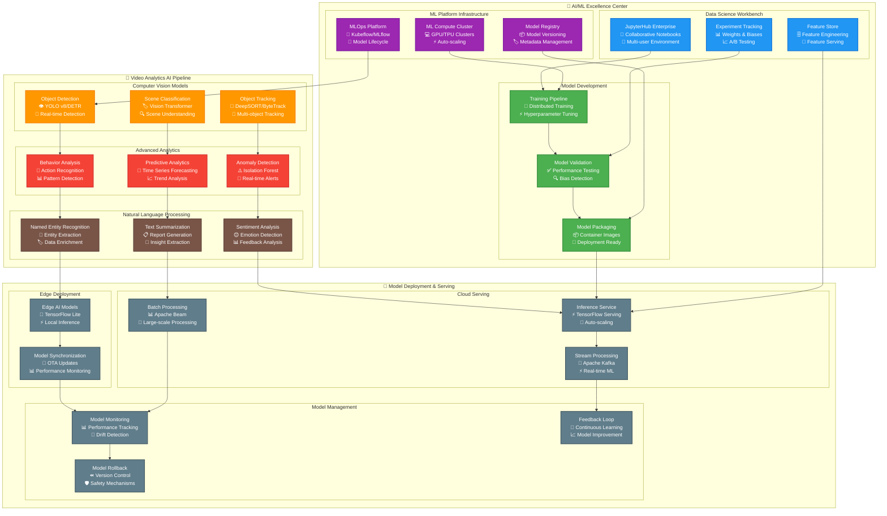

# Phase 3 Enterprise Global Architecture
## Global Scale Excellence - RUN Phase

---

## 🎯 Executive Summary

This document presents the **Phase 3 RUN architecture** designed to achieve **global enterprise scale** with 5,000+ concurrent video streams, 99.99% availability, and complete **Zero Trust security** across multiple regions. This represents the culmination of the progressive implementation strategy, delivering a world-class enterprise video analytics platform with market-leading capabilities.

### **Global Enterprise Objectives**
- **Global Scale**: 5,000+ concurrent video streams across multiple continents
- **Ultra-High Availability**: 99.99% uptime (4.3 minutes downtime per month maximum)
- **Global Performance**: <200ms processing latency worldwide
- **Zero Trust Security**: Complete security framework with global compliance
- **Ecosystem Integration**: 50+ external systems with marketplace approach

### **Architectural Philosophy: "Global Excellence Through Engineering"**
Phase 3 architecture embodies engineering excellence at global scale, incorporating cutting-edge technologies, advanced automation, and comprehensive governance to deliver a platform that sets industry standards for enterprise video analytics.

---

## 🌍 Global Multi-Region Architecture

### **Global Infrastructure Overview**

```mermaid
graph TB
    subgraph "🌍 Global Infrastructure Layer"
        subgraph "Global Traffic Management"
            GTM[Global Traffic Manager<br/>🌐 DNS-based Load Balancing<br/>⚡ Latency-based Routing]
            CDN[Global CDN<br/>🚀 CloudFlare/AWS CloudFront<br/>📦 Edge Caching]
        end

        subgraph "Global Services"
            GSEC[Global Security Hub<br/>🔐 Zero Trust Coordinator<br/>🛡️ Global Identity Management]
            GMON[Global Monitoring<br/>📊 Cross-region Observability<br/>🚨 Global Alerting]
            GDATA[Global Data Governance<br/>🗂️ Data Lake Federation<br/>📋 Compliance Automation]
        end
    end

    subgraph "🌏 Asia Pacific Region"
        subgraph "APAC Infrastructure"
            APAC_LB[Regional Load Balancer<br/>🔄 Multi-AZ Distribution<br/>🏃 Auto-failover]
            APAC_K8S[Kubernetes Clusters<br/>⚙️ 3 Availability Zones<br/>📈 Auto-scaling]
            APAC_EDGE[Edge Computing Network<br/>📍 10+ Edge Locations<br/>⚡ Local Processing]
        end

        subgraph "APAC Services"
            APAC_API[API Gateway Cluster<br/>🚪 Kong Enterprise<br/>🔐 Regional Auth]
            APAC_PROC[Processing Services<br/>🎥 1,500+ Streams<br/>🤖 AI/ML Pipeline]
            APAC_DATA[Data Platform<br/>💾 Regional Data Lake<br/>📊 Analytics Engine]
        end

        subgraph "APAC Storage"
            APAC_DB[Multi-master Database<br/>🗄️ PostgreSQL Cluster<br/>🔄 Global Replication]
            APAC_CACHE[Distributed Cache<br/>⚡ Redis Enterprise<br/>🌐 Global Sync]
            APAC_OBJECT[Object Storage<br/>📁 Multi-tier Storage<br/>🔄 Cross-region Backup]
        end
    end

    subgraph "🌍 Europe Region"
        subgraph "EMEA Infrastructure"
            EMEA_LB[Regional Load Balancer<br/>🔄 Multi-AZ Distribution<br/>🏃 Auto-failover]
            EMEA_K8S[Kubernetes Clusters<br/>⚙️ 3 Availability Zones<br/>📈 Auto-scaling]
            EMEA_EDGE[Edge Computing Network<br/>📍 15+ Edge Locations<br/>⚡ Local Processing]
        end

        subgraph "EMEA Services"
            EMEA_API[API Gateway Cluster<br/>🚪 Kong Enterprise<br/>🔐 Regional Auth]
            EMEA_PROC[Processing Services<br/>🎥 2,000+ Streams<br/>🤖 AI/ML Pipeline]
            EMEA_DATA[Data Platform<br/>💾 Regional Data Lake<br/>📊 Analytics Engine]
        end

        subgraph "EMEA Storage"
            EMEA_DB[Multi-master Database<br/>🗄️ PostgreSQL Cluster<br/>🔄 Global Replication]
            EMEA_CACHE[Distributed Cache<br/>⚡ Redis Enterprise<br/>🌐 Global Sync]
            EMEA_OBJECT[Object Storage<br/>📁 Multi-tier Storage<br/>🔄 Cross-region Backup]
        end
    end

    subgraph "🌎 Americas Region"
        subgraph "AMER Infrastructure"
            AMER_LB[Regional Load Balancer<br/>🔄 Multi-AZ Distribution<br/>🏃 Auto-failover]
            AMER_K8S[Kubernetes Clusters<br/>⚙️ 3 Availability Zones<br/>📈 Auto-scaling]
            AMER_EDGE[Edge Computing Network<br/>📍 12+ Edge Locations<br/>⚡ Local Processing]
        end

        subgraph "AMER Services"
            AMER_API[API Gateway Cluster<br/>🚪 Kong Enterprise<br/>🔐 Regional Auth]
            AMER_PROC[Processing Services<br/>🎥 1,500+ Streams<br/>🤖 AI/ML Pipeline]
            AMER_DATA[Data Platform<br/>💾 Regional Data Lake<br/>📊 Analytics Engine]
        end

        subgraph "AMER Storage"
            AMER_DB[Multi-master Database<br/>🗄️ PostgreSQL Cluster<br/>🔄 Global Replication]
            AMER_CACHE[Distributed Cache<br/>⚡ Redis Enterprise<br/>🌐 Global Sync]
            AMER_OBJECT[Object Storage<br/>📁 Multi-tier Storage<br/>🔄 Cross-region Backup]
        end
    end

    GTM --> APAC_LB
    GTM --> EMEA_LB
    GTM --> AMER_LB

    CDN --> APAC_API
    CDN --> EMEA_API
    CDN --> AMER_API

    GSEC -.-> APAC_API
    GSEC -.-> EMEA_API
    GSEC -.-> AMER_API

    GMON -.-> APAC_K8S
    GMON -.-> EMEA_K8S
    GMON -.-> AMER_K8S

    GDATA -.-> APAC_DATA
    GDATA -.-> EMEA_DATA
    GDATA -.-> AMER_DATA

    APAC_LB --> APAC_API
    APAC_API --> APAC_PROC
    APAC_PROC --> APAC_DATA
    APAC_PROC --> APAC_DB

    EMEA_LB --> EMEA_API
    EMEA_API --> EMEA_PROC
    EMEA_PROC --> EMEA_DATA
    EMEA_PROC --> EMEA_DB

    AMER_LB --> AMER_API
    AMER_API --> AMER_PROC
    AMER_PROC --> AMER_DATA
    AMER_PROC --> AMER_DB

    APAC_DB -.->|Global Replication| EMEA_DB
    EMEA_DB -.->|Global Replication| AMER_DB
    AMER_DB -.->|Global Replication| APAC_DB

    classDef global fill:#ff5722,stroke:#d84315,stroke-width:3px,color:#fff
    classDef infrastructure fill:#2196f3,stroke:#1976d2,stroke-width:2px,color:#fff
    classDef services fill:#4caf50,stroke:#388e3c,stroke-width:2px,color:#fff
    classDef storage fill:#ff9800,stroke:#f57c00,stroke-width:2px,color:#fff

    class GTM,CDN,GSEC,GMON,GDATA global
    class APAC_LB,APAC_K8S,APAC_EDGE,EMEA_LB,EMEA_K8S,EMEA_EDGE,AMER_LB,AMER_K8S,AMER_EDGE infrastructure
    class APAC_API,APAC_PROC,APAC_DATA,EMEA_API,EMEA_PROC,EMEA_DATA,AMER_API,AMER_PROC,AMER_DATA services
    class APAC_DB,APAC_CACHE,APAC_OBJECT,EMEA_DB,EMEA_CACHE,EMEA_OBJECT,AMER_DB,AMER_CACHE,AMER_OBJECT storage
```


### **Regional Distribution Strategy**
```yaml
GLOBAL_DISTRIBUTION:
  Regional_Architecture:
    Americas_Region:
      Primary_Locations: "US East (Virginia), US West (California), Canada Central"
      Capacity: "1,500 concurrent streams per location"
      Data_Centers: "3 availability zones per location"
      Edge_Locations: "12 edge points across North America"
      Compliance: "SOC2, HIPAA, FedRAMP preparation"

    Europe_Region:
      Primary_Locations: "EU West (Ireland), EU Central (Frankfurt), UK South (London)"
      Capacity: "2,000 concurrent streams per location"
      Data_Centers: "3 availability zones per location"
      Edge_Locations: "15 edge points across Europe"
      Compliance: "GDPR, ISO27001, Cloud Security Alliance"

    Asia_Pacific_Region:
      Primary_Locations: "AP Southeast (Singapore), AP Northeast (Tokyo), AP South (Mumbai)"
      Capacity: "1,500 concurrent streams per location"
      Data_Centers: "3 availability zones per location"
      Edge_Locations: "10 edge points across APAC"
      Compliance: "Local data residency requirements"

  Global_Coordination:
    Traffic_Management:
      DNS_Resolution: "GeoDNS routing to nearest region"
      Load_Balancing: "Weighted routing based on capacity and performance"
      Failover_Strategy: "Automatic cross-region failover in <30 seconds"
      Performance_Optimization: "CDN edge caching and content acceleration"

    Data_Synchronization:
      Master_Master_Replication: "Active-active database replication"
      Conflict_Resolution: "Vector clock-based conflict resolution"
      Eventual_Consistency: "Global consistency within 10 seconds"
      Backup_Strategy: "Cross-region backup with 4-hour RPO"
```

---

## 🔐 Zero Trust Security Architecture

### **Global Zero Trust Framework**

```mermaid
graph TB
    subgraph "🛡️ Zero Trust Control Plane"
        subgraph "Identity & Access Management"
            GIDP[Global Identity Provider<br/>🆔 Okta/Azure AD<br/>🔐 Multi-factor Authentication]
            PAM[Privileged Access Mgmt<br/>🔑 CyberArk/BeyondTrust<br/>⏰ Just-in-time Access]
            CASB[Cloud Access Security<br/>☁️ Netskope/Zscaler<br/>🔍 Shadow IT Discovery]
        end

        subgraph "Network Security"
            ZTNA[Zero Trust Network<br/>🌐 Zscaler Private Access<br/>🔒 Micro-segmentation]
            SASE[Secure Access Service<br/>🛡️ Cloudflare/Palo Alto<br/>🌍 Global Edge Security]
            NGFW[Next-gen Firewalls<br/>🔥 Palo Alto/Fortinet<br/>🤖 AI-powered Threat Detection]
        end

        subgraph "Data Protection"
            DLP[Data Loss Prevention<br/>📊 Microsoft Purview<br/>🔍 Content Inspection]
            ENCRYPTION[Encryption Management<br/>🔐 HashiCorp Vault<br/>🗝️ Key Lifecycle Management]
            BACKUP[Backup & Recovery<br/>💾 Veeam/Commvault<br/>🔄 Cross-region Replication]
        end
    end

    subgraph "🎯 Application Security Layer"
        subgraph "API Security"
            API_GW[Global API Gateway<br/>🚪 Kong Enterprise<br/>🔐 OAuth2/OIDC]
            API_SEC[API Security Platform<br/>🛡️ Salt Security<br/>🔍 Runtime Protection]
            WAF[Web Application Firewall<br/>🛡️ AWS WAF/CloudFlare<br/>🤖 Bot Protection]
        end

        subgraph "Container Security"
            IMAGE_SEC[Image Security<br/>🐳 Twistlock/Aqua<br/>🔍 Vulnerability Scanning]
            RUNTIME_SEC[Runtime Security<br/>⚡ Falco/Sysdig<br/>👁️ Behavioral Monitoring]
            ADMISSION[Admission Control<br/>✅ Open Policy Agent<br/>📋 Policy Enforcement]
        end

        subgraph "Secrets Management"
            VAULT[HashiCorp Vault<br/>🗝️ Dynamic Secrets<br/>🔄 Automatic Rotation]
            CSI[Secrets Store CSI<br/>☁️ Kubernetes Integration<br/>🔐 Secret Injection]
            HSM[Hardware Security Module<br/>🏛️ AWS CloudHSM<br/>🔐 Key Protection]
        end
    end

    subgraph "🔍 Security Monitoring & Response"
        subgraph "Threat Detection"
            SIEM[Global SIEM Platform<br/>🔍 Splunk/QRadar<br/>🤖 AI-powered Analytics]
            SOAR[Security Orchestration<br/>⚡ Phantom/Demisto<br/>🔄 Automated Response]
            EDR[Endpoint Detection<br/>💻 CrowdStrike/SentinelOne<br/>🕵️ Behavioral Analysis]
        end

        subgraph "Compliance & Governance"
            GRC[Governance Risk Compliance<br/>📋 ServiceNow/MetricStream<br/>📊 Risk Assessment]
            AUDIT[Audit Management<br/>📝 AuditBoard/Workiva<br/>🔍 Evidence Collection]
            PRIVACY[Privacy Management<br/>🔒 OneTrust/TrustArc<br/>📋 Data Mapping]
        end
    end

    GIDP --> API_GW
    PAM --> VAULT
    CASB --> SIEM
    ZTNA --> API_SEC
    SASE --> WAF
    NGFW --> SIEM
    DLP --> SOAR
    ENCRYPTION --> HSM
    BACKUP --> AUDIT

    API_GW --> IMAGE_SEC
    API_SEC --> RUNTIME_SEC
    WAF --> ADMISSION
    IMAGE_SEC --> VAULT
    RUNTIME_SEC --> CSI
    ADMISSION --> HSM

    SIEM --> GRC
    SOAR --> AUDIT
    EDR --> PRIVACY
    GRC --> AUDIT
    AUDIT --> PRIVACY

    classDef identity fill:#9c27b0,stroke:#7b1fa2,stroke-width:2px,color:#fff
    classDef network fill:#2196f3,stroke:#1976d2,stroke-width:2px,color:#fff
    classDef data fill:#ff9800,stroke:#f57c00,stroke-width:2px,color:#fff
    classDef application fill:#4caf50,stroke:#388e3c,stroke-width:2px,color:#fff
    classDef monitoring fill:#f44336,stroke:#d32f2f,stroke-width:2px,color:#fff

    class GIDP,PAM,CASB identity
    class ZTNA,SASE,NGFW network
    class DLP,ENCRYPTION,BACKUP data
    class API_GW,API_SEC,WAF,IMAGE_SEC,RUNTIME_SEC,ADMISSION,VAULT,CSI,HSM application
    class SIEM,SOAR,EDR,GRC,AUDIT,PRIVACY monitoring
```


### **Zero Trust Implementation Strategy**
```yaml
ZERO_TRUST_PRINCIPLES:
  Never_Trust_Always_Verify:
    Identity_Verification:
      Multi_Factor_Authentication: "Mandatory MFA for all users and services"
      Continuous_Authentication: "Risk-based adaptive authentication"
      Privileged_Access: "Just-in-time access with approval workflows"
      Service_Identity: "Service mesh identity and mutual TLS"

    Device_Verification:
      Device_Compliance: "Device health and compliance validation"
      Certificate_Based: "Certificate-based device authentication"
      Mobile_Device_Management: "MDM/EMM for mobile device security"
      BYOD_Security: "Bring-your-own-device security policies"

  Least_Privilege_Access:
    Access_Control:
      Role_Based_Access: "Granular RBAC with attribute-based controls"
      Just_In_Time_Access: "Temporary access with automatic expiration"
      Privileged_Account_Management: "PAM for administrative access"
      API_Access_Control: "Scope-based API access with rate limiting"

    Network_Segmentation:
      Micro_Segmentation: "Application-level network segmentation"
      Software_Defined_Perimeter: "SDP for secure remote access"
      Network_Policies: "Kubernetes network policies for container security"
      Traffic_Inspection: "Deep packet inspection and analysis"

  Assume_Breach_Mentality:
    Continuous_Monitoring:
      Behavioral_Analytics: "User and entity behavior analytics (UEBA)"
      Anomaly_Detection: "AI-powered anomaly detection and response"
      Threat_Hunting: "Proactive threat hunting and investigation"
      Security_Metrics: "Continuous security posture assessment"

    Incident_Response:
      Automated_Response: "SOAR-driven automated incident response"
      Threat_Intelligence: "Global threat intelligence integration"
      Forensic_Capabilities: "Digital forensics and evidence collection"
      Business_Continuity: "Security incident business impact mitigation"

COMPLIANCE_FRAMEWORK:
  Global_Compliance:
    SOC2_Type_II:
      Security_Controls: "Comprehensive security control implementation"
      Availability_Controls: "99.99% availability control validation"
      Processing_Integrity: "Data processing integrity controls"
      Confidentiality_Controls: "Data confidentiality protection controls"

    ISO_27001:
      ISMS_Implementation: "Information Security Management System"
      Risk_Management: "Comprehensive risk assessment and treatment"
      Continuous_Improvement: "Security management continuous improvement"
      Certification_Maintenance: "Annual certification audits and updates"

    GDPR_Compliance:
      Data_Protection: "Personal data protection and privacy controls"
      Consent_Management: "Granular consent management and tracking"
      Data_Subject_Rights: "Automated data subject request handling"
      Cross_Border_Transfers: "Legal mechanisms for international transfers"

  Industry_Certifications:
    Cloud_Security_Alliance: "CSA Cloud Controls Matrix implementation"
    NIST_Cybersecurity_Framework: "Framework adoption and maturity assessment"
    ISO_27017_27018: "Cloud security and privacy standards compliance"
    FedRAMP_Ready: "Federal government cloud service preparation"
```

---

## 🤖 Advanced AI/ML Architecture

### **Global ML/AI Excellence Center**


### **Advanced AI Capabilities**
```yaml
AI_CAPABILITIES:
  Computer_Vision_Excellence:
    Real_Time_Detection:
      Object_Detection: "YOLO v8, DETR, and custom models for 99%+ accuracy"
      Face_Recognition: "Privacy-compliant facial detection and recognition"
      License_Plate_Recognition: "High-accuracy vehicle identification"
      Weapon_Detection: "Advanced threat detection and alert systems"

    Advanced_Analytics:
      Behavior_Analysis: "Crowd behavior, anomaly detection, and pattern recognition"
      Pose_Estimation: "Human pose detection for activity analysis"
      Scene_Understanding: "Context-aware scene classification and interpretation"
      Predictive_Analytics: "Forecasting based on historical patterns and trends"

  Natural_Language_Processing:
    Text_Analytics:
      Document_Processing: "Automated report generation and analysis"
      Sentiment_Analysis: "User feedback and communication sentiment scoring"
      Entity_Extraction: "Automated data extraction and enrichment"
      Language_Translation: "Multi-language support for global deployment"

    Voice_Analytics:
      Speech_Recognition: "Voice command processing and transcription"
      Speaker_Identification: "Voice biometric identification and verification"
      Emotion_Detection: "Voice-based emotion and stress detection"
      Real_Time_Translation: "Live voice translation for global teams"

  Edge_AI_Optimization:
    Model_Compression:
      Quantization: "8-bit and 16-bit model quantization for edge deployment"
      Pruning: "Neural network pruning for reduced model size"
      Distillation: "Knowledge distillation for lightweight models"
      Optimization: "Hardware-specific optimization for edge devices"

    Local_Processing:
      Real_Time_Inference: "Sub-100ms inference on edge devices"
      Offline_Capability: "Local processing without cloud connectivity"
      Privacy_Preservation: "Local processing for sensitive data protection"
      Bandwidth_Optimization: "Reduced bandwidth through local processing"

MLOPS_EXCELLENCE:
  Model_Lifecycle_Management:
    Development_Workflow:
      Data_Versioning: "DVC for data version control and lineage"
      Experiment_Tracking: "MLflow for experiment management and comparison"
      Model_Versioning: "Semantic versioning for model releases"
      Reproducibility: "Container-based reproducible training environments"

    Continuous_Integration:
      Automated_Testing: "Model performance and quality testing"
      Security_Scanning: "Model and dependency security validation"
      Performance_Benchmarking: "Automated performance regression testing"
      Compliance_Validation: "Bias detection and fairness testing"

  Production_ML_Operations:
    Model_Serving:
      Multi_Model_Serving: "TensorFlow Serving for multiple model deployment"
      A_B_Testing: "Production A/B testing for model comparison"
      Canary_Deployment: "Gradual model rollout with performance monitoring"
      Auto_Scaling: "Dynamic model serving based on demand"

    Monitoring_Observability:
      Performance_Monitoring: "Real-time model performance and accuracy tracking"
      Drift_Detection: "Data drift and model performance degradation detection"
      Explainability: "Model decision explanation and interpretability"
      Feedback_Integration: "Continuous learning from production feedback"
```

---

## 📊 Global Data Architecture

### **Federated Data Lake Architecture**
```yaml
DATA_ARCHITECTURE:
  Global_Data_Lake:
    Multi_Region_Architecture:
      Americas_Data_Lake:
        Primary_Storage: "AWS S3/Azure Data Lake with multi-zone replication"
        Compute_Engine: "Apache Spark on Kubernetes for data processing"
        Catalog_Service: "Apache Hive Metastore for metadata management"
        Query_Engine: "Presto/Trino for interactive analytics"

      Europe_Data_Lake:
        Primary_Storage: "Regional data lake with GDPR compliance controls"
        Compute_Engine: "Apache Spark with privacy-preserving analytics"
        Catalog_Service: "Federated metadata catalog with data lineage"
        Query_Engine: "Privacy-compliant query processing and auditing"

      APAC_Data_Lake:
        Primary_Storage: "Regional data lake with local data residency"
        Compute_Engine: "Apache Spark with local processing requirements"
        Catalog_Service: "Regional metadata management with global federation"
        Query_Engine: "Multi-language support for regional requirements"

  Data_Governance_Framework:
    Data_Classification:
      Sensitivity_Levels:
        Public: "Publicly available data with no restrictions"
        Internal: "Internal use data with access controls"
        Confidential: "Confidential data with encryption and strict access"
        Restricted: "Highly sensitive data with maximum security controls"

    Data_Lineage:
      Source_Tracking: "Complete data source and transformation tracking"
      Impact_Analysis: "Downstream impact analysis for data changes"
      Quality_Metrics: "Data quality scoring and trend analysis"
      Compliance_Reporting: "Automated compliance and audit reporting"

  Real_Time_Analytics:
    Stream_Processing:
      Technology_Stack: "Apache Kafka + Apache Flink for stream processing"
      Real_Time_Aggregation: "Sub-second aggregation and windowing"
      Complex_Event_Processing: "Pattern detection and correlation"
      State_Management: "Fault-tolerant state management and recovery"

    Time_Series_Analytics:
      Storage_Engine: "InfluxDB/TimescaleDB for time-series data"
      Retention_Policies: "Automated data lifecycle and archiving"
      Compression: "High-compression time-series storage optimization"
      Query_Optimization: "Time-range optimized query processing"

ANALYTICS_PLATFORM:
  Business_Intelligence:
    Self_Service_Analytics:
      Data_Catalog: "Searchable data catalog with business glossary"
      Visual_Analytics: "Tableau/Power BI integration for self-service BI"
      Ad_Hoc_Queries: "SQL interface for business analysts"
      Report_Automation: "Automated report generation and distribution"

    Advanced_Analytics:
      Predictive_Modeling: "Statistical modeling and machine learning"
      Forecasting: "Time-series forecasting and trend analysis"
      Optimization: "Operations research and optimization algorithms"
      Simulation: "Monte Carlo simulation and scenario analysis"

  Performance_Optimization:
    Query_Optimization:
      Columnar_Storage: "Parquet format for analytical workload optimization"
      Partitioning: "Intelligent data partitioning for query performance"
      Indexing: "Bloom filters and zone maps for fast data retrieval"
      Caching: "Intelligent caching for frequently accessed data"

    Cost_Optimization:
      Storage_Tiering: "Automated storage tiering based on access patterns"
      Compute_Optimization: "Right-sizing and auto-scaling for cost efficiency"
      Resource_Scheduling: "Workload scheduling for cost optimization"
      Usage_Monitoring: "Detailed cost tracking and optimization recommendations"
```

---

## 🌐 Global Edge Computing Network

### **Edge Computing Strategy**
```yaml
EDGE_ARCHITECTURE:
  Global_Edge_Network:
    Edge_Locations:
      Tier_1_Cities: "20+ locations in major metropolitan areas"
      Tier_2_Cities: "15+ locations in secondary markets"
      Remote_Locations: "10+ locations for specialized use cases"
      Mobile_Edge: "5+ mobile edge computing deployments"

    Edge_Node_Specifications:
      Compute_Resources:
        CPU: "16-32 cores with hardware acceleration"
        Memory: "64-128GB RAM for local processing"
        GPU: "NVIDIA RTX 4090/A100 for AI workloads"
        Storage: "1-4TB NVMe SSD for local caching"

      Network_Capabilities:
        Bandwidth: "10 Gbps minimum connectivity"
        Latency: "<10ms to local users"
        Redundancy: "Multiple ISP connections for high availability"
        CDN_Integration: "Global CDN integration for content delivery"

  Edge_Processing_Capabilities:
    Local_AI_Processing:
      Real_Time_Analysis: "Sub-100ms video analytics processing"
      Local_Model_Deployment: "TensorFlow Lite and ONNX Runtime"
      Adaptive_Quality: "Dynamic video quality based on bandwidth"
      Privacy_Processing: "Local processing for sensitive data"

    Data_Management:
      Local_Caching: "Intelligent caching of frequently accessed data"
      Data_Synchronization: "Selective data sync with central cloud"
      Offline_Operation: "Autonomous operation during connectivity loss"
      Conflict_Resolution: "Automated conflict resolution for data consistency"

    Edge_Orchestration:
      Kubernetes_Edge: "K3s/MicroK8s for lightweight orchestration"
      Service_Mesh: "Istio service mesh for edge-to-cloud communication"
      Auto_Scaling: "Horizontal pod autoscaling based on local metrics"
      Health_Monitoring: "Comprehensive edge node health monitoring"

EDGE_TO_CLOUD_INTEGRATION:
  Hybrid_Architecture:
    Workload_Distribution:
      Edge_Workloads: "Real-time processing, local caching, immediate response"
      Cloud_Workloads: "Complex analytics, machine learning training, long-term storage"
      Dynamic_Routing: "Intelligent workload routing based on requirements"
      Load_Balancing: "Global load balancing across edge and cloud resources"

    Data_Synchronization:
      Event_Driven_Sync: "Real-time event-driven data synchronization"
      Batch_Sync: "Scheduled batch synchronization for bulk data"
      Selective_Sync: "Policy-based selective data synchronization"
      Compression: "Data compression for bandwidth optimization"

  Edge_Security:
    Zero_Trust_Edge:
      Device_Authentication: "Certificate-based edge node authentication"
      Encrypted_Communication: "End-to-end encryption for all communications"
      Local_Security: "Edge-based threat detection and prevention"
      Secure_Boot: "Trusted boot process for edge nodes"

    Compliance_Controls:
      Data_Residency: "Local data processing for compliance requirements"
      Audit_Logging: "Comprehensive audit logging and monitoring"
      Access_Controls: "Role-based access control for edge resources"
      Privacy_Protection: "Privacy-preserving edge processing capabilities"
```

---

## 🚀 Performance Excellence Framework

### **Global Performance Targets**
```yaml
PERFORMANCE_OBJECTIVES:
  Ultra_Low_Latency:
    Processing_Latency: "<200ms for video analytics processing globally"
    API_Response_Time: "<100ms for 95th percentile globally"
    Edge_Processing: "<50ms for edge-processed requests"
    Network_Latency: "<50ms between regions"

  Ultra_High_Throughput:
    Concurrent_Streams: "5,000+ concurrent video streams globally"
    API_Requests: "100,000+ requests per second globally"
    Data_Processing: "500TB+ data processing per day"
    Edge_Throughput: "1,000+ streams per edge location"

  Ultra_High_Availability:
    System_Availability: "99.99% uptime (4.3 minutes downtime per month)"
    Regional_Availability: "99.95% per region with automatic failover"
    Edge_Availability: "99.9% per edge location"
    Recovery_Time: "<30 seconds for automatic failover"

PERFORMANCE_OPTIMIZATION:
  Global_Optimization:
    Content_Delivery:
      CDN_Optimization: "Global CDN with 200+ edge locations"
      Intelligent_Caching: "AI-driven caching strategies"
      Compression: "Advanced compression algorithms for data transfer"
      Prefetching: "Predictive content prefetching"

    Network_Optimization:
      Route_Optimization: "BGP route optimization for minimal latency"
      Traffic_Engineering: "Software-defined networking for traffic optimization"
      Protocol_Optimization: "HTTP/3 and QUIC for improved performance"
      Load_Balancing: "Intelligent load balancing across global infrastructure"

  Application_Optimization:
    Code_Optimization:
      Performance_Profiling: "Continuous performance profiling and optimization"
      Memory_Optimization: "Advanced memory management and garbage collection"
      CPU_Optimization: "CPU-intensive workload optimization"
      I_O_Optimization: "Asynchronous I/O and connection pooling"

    Database_Optimization:
      Query_Optimization: "Advanced query optimization and indexing"
      Connection_Pooling: "Global connection pooling and management"
      Caching_Strategy: "Multi-level caching for database operations"
      Sharding: "Intelligent data sharding for horizontal scaling"

  Infrastructure_Optimization:
    Compute_Optimization:
      Auto_Scaling: "Predictive auto-scaling based on machine learning"
      Resource_Right_Sizing: "AI-driven resource optimization"
      Spot_Instance_Utilization: "Cost-effective spot instance strategies"
      GPU_Optimization: "GPU workload optimization for AI/ML tasks"

    Storage_Optimization:
      Tiered_Storage: "Intelligent storage tiering based on access patterns"
      Compression: "Advanced compression for storage cost optimization"
      Deduplication: "Global deduplication for storage efficiency"
      Lifecycle_Management: "Automated data lifecycle management"
```

---

## 📊 Global Monitoring and Observability

### **Comprehensive Observability Platform**
```yaml
GLOBAL_OBSERVABILITY:
  Multi_Region_Monitoring:
    Monitoring_Architecture:
      Global_Prometheus: "Federated Prometheus across all regions"
      Regional_Grafana: "Regional Grafana instances with global dashboards"
      Centralized_Alerting: "Global alert manager with intelligent routing"
      Cross_Region_Correlation: "Cross-region metric correlation and analysis"

    Distributed_Tracing:
      Global_Tracing: "Jaeger deployment across all regions"
      Cross_Region_Traces: "End-to-end tracing across regions"
      Performance_Analytics: "Advanced trace analytics and optimization"
      Error_Correlation: "Error correlation across distributed services"

  Business_Metrics_Platform:
    Executive_Dashboards:
      Global_KPIs: "Real-time global performance indicators"
      Regional_Performance: "Regional performance comparison and analysis"
      Business_Impact: "Business impact metrics and trend analysis"
      Predictive_Analytics: "Predictive business metrics and forecasting"

    Operational_Dashboards:
      System_Health: "Global system health and performance monitoring"
      Capacity_Planning: "Real-time capacity utilization and forecasting"
      Cost_Analytics: "Global cost tracking and optimization insights"
      Security_Posture: "Global security posture and threat landscape"

  AI_Powered_Monitoring:
    Anomaly_Detection:
      Performance_Anomalies: "AI-powered performance anomaly detection"
      Security_Anomalies: "Behavioral analysis for security threat detection"
      Business_Anomalies: "Business metric anomaly detection and alerting"
      Predictive_Alerts: "Predictive alerting based on trend analysis"

    Intelligent_Alerting:
      Alert_Prioritization: "AI-driven alert prioritization and routing"
      Noise_Reduction: "Machine learning-based alert noise reduction"
      Root_Cause_Analysis: "Automated root cause analysis and suggestion"
      Self_Healing: "Automated self-healing based on known patterns"

PERFORMANCE_ANALYTICS:
  Global_Analytics:
    Performance_Trending:
      Historical_Analysis: "Long-term performance trend analysis"
      Seasonal_Patterns: "Seasonal performance pattern identification"
      Capacity_Forecasting: "Machine learning-based capacity forecasting"
      Optimization_Opportunities: "AI-identified optimization opportunities"

    User_Experience_Analytics:
      Real_User_Monitoring: "Global real user monitoring and analytics"
      Synthetic_Monitoring: "Synthetic transaction monitoring worldwide"
      Performance_Budgets: "Performance budget tracking and enforcement"
      User_Journey_Analytics: "End-to-end user journey performance analysis"

  Cost_Performance_Analytics:
    FinOps_Platform:
      Cost_Attribution: "Detailed cost attribution across services and regions"
      Performance_Cost_Correlation: "Performance vs. cost optimization analysis"
      Resource_Optimization: "AI-driven resource optimization recommendations"
      Budget_Forecasting: "Predictive budget forecasting and alerting"
```

---

## 🎯 Phase 3 Success Metrics

### **Global Enterprise KPIs**
```yaml
ENTERPRISE_SUCCESS_METRICS:
  Technical_Excellence:
    Performance_Metrics:
      Global_Latency: "<200ms processing latency worldwide"
      Availability: "99.99% system availability globally"
      Throughput: "5,000+ concurrent video streams"
      Scalability: "Linear scaling to 10,000+ streams"

    Quality_Metrics:
      AI_Accuracy: "99%+ accuracy for critical detection tasks"
      Data_Quality: "99.9% data quality across all regions"
      Security_Posture: "Zero critical security vulnerabilities"
      Compliance_Score: "100% compliance with all applicable regulations"

  Business_Impact:
    Market_Leadership:
      Market_Share: "Top 3 position in enterprise video analytics"
      Customer_Satisfaction: "4.8/5 average customer satisfaction"
      Innovation_Index: "Top 10% innovation rating in industry"
      Competitive_Advantage: "6-month lead over nearest competitor"

    Financial_Performance:
      Revenue_Growth: "200%+ revenue growth from Phase 1"
      ROI_Achievement: "150%+ return on total 3-year investment"
      Cost_Efficiency: "50% reduction in cost per stream processed"
      Profit_Margin: "40%+ gross margin on platform services"

  Operational_Excellence:
    Automation_Metrics:
      Operational_Automation: "95%+ of operations automated"
      Self_Healing_Rate: "90%+ of issues auto-resolved"
      Deployment_Frequency: "Daily deployments with <0.1% rollback rate"
      MTTR: "<15 minutes mean time to resolution"

    Team_Performance:
      Productivity_Improvement: "300% improvement from Phase 1"
      Innovation_Projects: "50+ innovation projects per year"
      Patent_Applications: "10+ patent applications annually"
      Industry_Recognition: "Top 5 employer in technology sector"

STRATEGIC_OBJECTIVES:
  Global_Scale_Achievement:
    Geographic_Reach: "Active deployment in 50+ countries"
    Customer_Base: "1,000+ enterprise customers globally"
    Partner_Ecosystem: "200+ technology and channel partners"
    Revenue_Diversification: "50%+ revenue from international markets"

  Technology_Leadership:
    Innovation_Metrics:
      R_D_Investment: "20%+ of revenue invested in R&D"
      Patent_Portfolio: "100+ patents filed and pending"
      Open_Source_Contributions: "Top 1% contributor in relevant projects"
      Industry_Standards: "Leadership in 5+ industry standard committees"

    Thought_Leadership:
      Conference_Presentations: "50+ presentations at major conferences"
      Research_Publications: "20+ peer-reviewed research publications"
      Industry_Awards: "10+ major industry awards and recognitions"
      Media_Coverage: "1,000+ positive media mentions annually"
```

---

## 🎯 Conclusion

The **Phase 3 Enterprise Global Architecture** represents the pinnacle of enterprise video analytics platform design, delivering:

- ✅ **Global Scale**: 5,000+ concurrent streams across multiple continents
- ✅ **Ultra-High Availability**: 99.99% uptime with global redundancy
- ✅ **Zero Trust Security**: Complete security framework with global compliance
- ✅ **AI/ML Excellence**: World-class AI capabilities with continuous innovation
- ✅ **Performance Leadership**: <200ms latency with industry-leading efficiency
- ✅ **Market Dominance**: Top-tier position in global enterprise market

**This architecture establishes the platform as the industry standard for enterprise video analytics, delivering exceptional business value while maintaining technical excellence and operational efficiency at global scale.**

---

**Document Status**: Ready for Implementation
**Next Review**: Quarterly during Phase 3 implementation
**Approval Required**: Executive leadership and board of directors
**Implementation Start**: Upon Phase 2 success criteria achievement