# Phase 3 Global Enterprise Architecture
## Worldwide Technology Platform - RUN Phase

---

## 🎯 Global Architecture Overview

Phase 3 establishes a **globally distributed enterprise platform** capable of processing 5,000+ concurrent video streams across multiple regions and continents. The architecture emphasizes **global scalability**, **data sovereignty**, **edge computing integration**, and **autonomous operations** at unprecedented scale.

### **Global Architecture Objectives**
- **Worldwide Deployment**: Multi-region, multi-cloud global infrastructure
- **Massive Scale**: 5,000+ concurrent streams with linear scalability
- **Edge Integration**: Comprehensive edge-cloud hybrid architecture
- **Data Sovereignty**: Regional data compliance and governance
- **Autonomous Operations**: Self-managing and self-healing global platform

---

## 🌍 Global Infrastructure Architecture

### **Multi-Region Deployment Framework**

```mermaid
graph TB
    subgraph "Global Control Plane"
        GLOBAL_CONTROL[Global Control Center]
        GLOBAL_DNS[Global DNS Management]
        GLOBAL_MONITOR[Global Monitoring]
        GLOBAL_CONFIG[Global Configuration]
    end

    subgraph "Americas Region"
        US_EAST[US East Coast Cluster]
        US_WEST[US West Coast Cluster]
        CANADA[Canada Cluster]
        BRAZIL[Brazil Cluster]
        AMERICAS_EDGE[Americas Edge Nodes]
    end

    subgraph "EMEA Region"
        EU_WEST[EU West Cluster]
        EU_CENTRAL[EU Central Cluster]
        UK[UK Cluster]
        MIDDLE_EAST[Middle East Cluster]
        EMEA_EDGE[EMEA Edge Nodes]
    end

    subgraph "APAC Region"
        JAPAN[Japan Cluster]
        SINGAPORE[Singapore Cluster]
        AUSTRALIA[Australia Cluster]
        INDIA[India Cluster]
        APAC_EDGE[APAC Edge Nodes]
    end

    subgraph "Global Data Layer"
        GLOBAL_DATA[Global Data Federation]
        REGIONAL_DATA[Regional Data Stores]
        EDGE_DATA[Edge Data Caches]
        DATA_SYNC[Global Data Synchronization]
    end

    GLOBAL_CONTROL --> US_EAST
    GLOBAL_CONTROL --> EU_WEST
    GLOBAL_CONTROL --> JAPAN

    GLOBAL_DNS --> AMERICAS_EDGE
    GLOBAL_DNS --> EMEA_EDGE
    GLOBAL_DNS --> APAC_EDGE

    GLOBAL_DATA --> REGIONAL_DATA
    REGIONAL_DATA --> EDGE_DATA
    DATA_SYNC --> GLOBAL_DATA
```


---

## 🏗️ Massive Scale Architecture

### **Hyperscale Platform Design**
```yaml
HYPERSCALE_ARCHITECTURE:
  Global_Cluster_Federation:
    cluster_mesh: "Istio multi-cluster service mesh spanning regions"
    global_load_balancing: "Global traffic management and load distribution"
    cross_cluster_communication: "Secure cross-cluster service communication"
    federated_services: "Global service discovery and federation"

  Horizontal_Scaling_Framework:
    cluster_autoscaling: "Automatic cluster scaling across regions"
    workload_distribution: "Intelligent workload distribution globally"
    resource_optimization: "Global resource optimization and allocation"
    capacity_forecasting: "Predictive capacity planning and provisioning"

  Multi_Cloud_Architecture:
    cloud_agnostic_deployment: "Kubernetes deployment across AWS, Azure, GCP"
    cloud_arbitrage: "Cost and performance optimization across clouds"
    disaster_recovery: "Cross-cloud disaster recovery and failover"
    vendor_independence: "No single cloud vendor dependency"

  Performance_At_Scale:
    stream_processing: "5,000+ concurrent video streams globally"
    latency_optimization: "Sub-200ms global processing latency"
    throughput_maximization: "Maximum throughput with resource efficiency"
    quality_assurance: "Consistent quality across all regions"
```

### **Edge Computing Integration**
```yaml
EDGE_COMPUTING_FRAMEWORK:
  Edge_Node_Architecture:
    kubernetes_edge: "Lightweight Kubernetes at edge locations"
    ai_acceleration: "Edge AI processing with GPU/TPU support"
    local_processing: "Local video processing and decision making"
    intelligent_caching: "Intelligent data and model caching"

  Edge_Cloud_Orchestration:
    workload_placement: "Intelligent workload placement between edge and cloud"
    data_locality: "Data processing near source for latency optimization"
    model_distribution: "AI model distribution and synchronization"
    edge_management: "Centralized edge node management and monitoring"

  5G_Integration:
    mobile_edge_computing: "5G MEC integration for ultra-low latency"
    network_slicing: "5G network slicing for guaranteed performance"
    edge_connectivity: "High-bandwidth edge connectivity"
    mobile_optimization: "Mobile device and network optimization"

  Edge_Intelligence:
    local_ai_inference: "Local AI inference for real-time decisions"
    edge_analytics: "Edge analytics and pattern recognition"
    autonomous_operation: "Autonomous edge operation and management"
    predictive_maintenance: "Predictive maintenance and optimization"
```

---

## 🧠 AI Excellence Center Architecture

### **Global AI/ML Platform**
```yaml
AI_EXCELLENCE_ARCHITECTURE:
  Distributed_AI_Training:
    multi_region_training: "Distributed training across multiple regions"
    federated_learning: "Privacy-preserving federated learning"
    model_collaboration: "Cross-regional model development collaboration"
    knowledge_sharing: "Global AI knowledge sharing and transfer"

  AI_Model_Marketplace:
    model_repository: "Global AI model repository and marketplace"
    model_versioning: "Global model versioning and lifecycle management"
    custom_models: "Industry and region-specific custom models"
    model_trading: "Internal model sharing and trading platform"

  Real_Time_Intelligence:
    global_pattern_recognition: "Global pattern recognition and correlation"
    cross_regional_insights: "Cross-regional intelligence and insights"
    predictive_analytics: "Global predictive analytics and forecasting"
    anomaly_detection: "Global anomaly detection and threat intelligence"

  AI_Research_Platform:
    research_infrastructure: "Global research infrastructure and resources"
    innovation_labs: "Regional innovation labs and research centers"
    academic_collaboration: "University and research institution partnerships"
    continuous_innovation: "Continuous AI research and development"
```

### **Autonomous Operations Framework**
```yaml
AUTONOMOUS_OPERATIONS:
  Self_Healing_Systems:
    automated_recovery: "Automatic system recovery and healing"
    predictive_maintenance: "Predictive maintenance and prevention"
    fault_tolerance: "Advanced fault tolerance and resilience"
    chaos_engineering: "Continuous chaos engineering and testing"

  Self_Optimizing_Platform:
    performance_optimization: "Continuous performance optimization"
    resource_optimization: "Automatic resource optimization and allocation"
    cost_optimization: "Continuous cost optimization and efficiency"
    workflow_optimization: "Workflow and process optimization"

  Self_Managing_Infrastructure:
    automated_provisioning: "Automatic infrastructure provisioning"
    capacity_management: "Automatic capacity management and scaling"
    security_management: "Automated security management and response"
    compliance_management: "Automated compliance and governance"

  Intelligent_Automation:
    ai_powered_operations: "AI-powered operational decision making"
    predictive_scaling: "Predictive scaling and resource management"
    intelligent_routing: "Intelligent traffic routing and optimization"
    automated_troubleshooting: "Automated problem detection and resolution"
```

---

## 🔐 Global Security and Compliance

### **Zero Trust Global Security**
```yaml
GLOBAL_SECURITY_ARCHITECTURE:
  Distributed_Security_Framework:
    global_identity_management: "Global identity and access management"
    cross_region_authentication: "Cross-regional authentication and federation"
    distributed_authorization: "Distributed authorization and policy enforcement"
    global_threat_detection: "Global threat detection and intelligence sharing"

  Regional_Compliance_Framework:
    gdpr_compliance: "GDPR compliance for European operations"
    ccpa_compliance: "CCPA compliance for California operations"
    data_residency: "Regional data residency and sovereignty"
    local_regulations: "Local regulatory compliance and adaptation"

  Advanced_Threat_Protection:
    global_threat_intelligence: "Global threat intelligence and sharing"
    ai_powered_security: "AI-powered security threat detection"
    automated_response: "Automated threat response and mitigation"
    security_orchestration: "Global security orchestration and coordination"

  Data_Protection_Framework:
    end_to_end_encryption: "End-to-end encryption across all regions"
    data_classification: "Global data classification and protection"
    privacy_preservation: "Privacy-preserving analytics and processing"
    secure_computation: "Secure multi-party computation capabilities"
```

### **Compliance Automation Platform**
```yaml
COMPLIANCE_AUTOMATION:
  Regulatory_Compliance:
    automated_compliance: "Automated compliance monitoring and reporting"
    policy_enforcement: "Automated policy enforcement and validation"
    audit_automation: "Automated audit preparation and evidence collection"
    certification_management: "Automated certification management and renewal"

  Data_Governance:
    global_data_governance: "Global data governance and stewardship"
    data_lineage: "Comprehensive data lineage and provenance"
    retention_policies: "Automated data retention and disposal"
    consent_management: "Global consent management and preferences"

  Risk_Management:
    continuous_risk_assessment: "Continuous risk assessment and monitoring"
    risk_mitigation: "Automated risk mitigation and controls"
    compliance_reporting: "Real-time compliance reporting and dashboards"
    regulatory_intelligence: "Regulatory change monitoring and adaptation"

  Audit_and_Certification:
    continuous_auditing: "Continuous auditing and compliance validation"
    evidence_automation: "Automated evidence collection and management"
    certification_tracking: "Certification status tracking and renewal"
    stakeholder_reporting: "Automated stakeholder reporting and communication"
```

---

## 📊 Global Data Architecture

### **Data Sovereignty and Federation**
```yaml
GLOBAL_DATA_ARCHITECTURE:
  Data_Sovereignty_Framework:
    regional_data_residency: "Data residency compliance by region"
    cross_border_controls: "Cross-border data transfer controls"
    sovereignty_enforcement: "Automated sovereignty policy enforcement"
    local_processing: "Local data processing and analytics"

  Data_Federation_Platform:
    global_data_catalog: "Global data catalog and discovery"
    federated_queries: "Cross-regional federated query capabilities"
    data_virtualization: "Global data virtualization and access"
    metadata_management: "Global metadata management and governance"

  Real_Time_Data_Processing:
    global_streaming: "Global real-time data streaming"
    edge_processing: "Edge data processing and filtering"
    regional_aggregation: "Regional data aggregation and analysis"
    global_insights: "Global insights and intelligence synthesis"

  Advanced_Analytics:
    global_machine_learning: "Global machine learning and AI analytics"
    cross_regional_patterns: "Cross-regional pattern recognition"
    predictive_modeling: "Global predictive modeling and forecasting"
    business_intelligence: "Global business intelligence and reporting"
```

### **Performance at Global Scale**
```yaml
GLOBAL_PERFORMANCE:
  Latency_Optimization:
    edge_processing: "Edge processing for ultra-low latency"
    content_delivery: "Global content delivery and caching"
    intelligent_routing: "Intelligent request routing and optimization"
    regional_optimization: "Regional performance optimization"

  Throughput_Maximization:
    horizontal_scaling: "Massive horizontal scaling capabilities"
    load_distribution: "Intelligent global load distribution"
    resource_pooling: "Global resource pooling and optimization"
    capacity_elasticity: "Elastic capacity scaling and management"

  Availability_Excellence:
    multi_region_redundancy: "Multi-region redundancy and failover"
    disaster_recovery: "Global disaster recovery and business continuity"
    fault_tolerance: "Advanced fault tolerance and resilience"
    zero_downtime_operations: "Zero downtime deployment and operations"

  Quality_Assurance:
    global_monitoring: "Global monitoring and observability"
    performance_analytics: "Global performance analytics and optimization"
    quality_metrics: "Consistent quality metrics across regions"
    sla_management: "Global SLA management and enforcement"
```

---

## 🚀 Innovation and Research Platform

### **Global Innovation Framework**
```yaml
INNOVATION_PLATFORM:
  Research_Infrastructure:
    global_research_labs: "Global network of research and innovation labs"
    academic_partnerships: "University and research institution partnerships"
    open_innovation: "Open innovation and collaboration platforms"
    technology_scouting: "Global technology scouting and evaluation"

  Innovation_Accelerator:
    startup_incubator: "Startup incubator and acceleration program"
    innovation_challenges: "Global innovation challenges and competitions"
    proof_of_concept: "Rapid proof-of-concept development and testing"
    technology_transfer: "Technology transfer and commercialization"

  Emerging_Technology_Integration:
    quantum_computing: "Quantum computing research and integration"
    neuromorphic_computing: "Neuromorphic computing exploration"
    edge_ai_advancement: "Advanced edge AI and processing"
    next_generation_networking: "6G and beyond networking research"

  Intellectual_Property:
    patent_portfolio: "Global patent portfolio management"
    ip_protection: "Intellectual property protection and licensing"
    technology_licensing: "Technology licensing and partnerships"
    innovation_monetization: "Innovation monetization and value creation"
```

---

## 📈 Global Performance Specifications

### **Enterprise Scale Performance**
```yaml
GLOBAL_PERFORMANCE_TARGETS:
  Massive_Scale_Processing:
    concurrent_streams: "5,000+ simultaneous video streams globally"
    processing_latency: "<200ms end-to-end processing worldwide"
    global_throughput: "Linear scaling across regions and continents"
    quality_consistency: "99%+ accuracy consistency across all regions"

  Global_Availability:
    system_uptime: "99.99% global system availability"
    regional_redundancy: "Zero single points of failure globally"
    disaster_recovery: "Sub-5 minute global disaster recovery"
    business_continuity: "100% business continuity assurance"

  Edge_Performance:
    edge_latency: "<50ms edge processing latency"
    edge_intelligence: "90%+ decisions made at edge"
    bandwidth_optimization: "80% bandwidth reduction through edge processing"
    offline_capability: "Full offline operation capability"

  Innovation_Velocity:
    feature_delivery: "Weekly global feature deployment"
    research_to_production: "90-day research to production pipeline"
    innovation_adoption: "Monthly new technology integration"
    market_responsiveness: "Real-time market adaptation capability"
```

---

## 🎯 Phase 3 Global Architecture Success

The **Phase 3 Global Enterprise Architecture** delivers worldwide technology excellence:

- ✅ **Global Scale**: 5,000+ concurrent streams across multiple continents
- ✅ **Edge Integration**: Comprehensive edge-cloud hybrid architecture
- ✅ **Autonomous Operations**: Self-managing and self-healing global platform
- ✅ **Data Sovereignty**: Regional compliance with global intelligence
- ✅ **Innovation Excellence**: Continuous innovation and technology advancement

**This global architecture provides the worldwide technology foundation needed for market dominance and sustained competitive advantage.**

---

**Document Status**: Ready for Implementation
**Next Document**: [AI Innovation Center](./02-ai-innovation-center.md)
**Related**: [Business Considerations](../business-considerations/) | [Implementation Considerations](../implementation-considerations/)