# Phase 3 Global Enterprise Architecture
## Worldwide Technology Platform - RUN Phase

---

## 🎯 Executive Summary

This document presents the **Phase 3 RUN architecture** designed to achieve **global enterprise scale** with 5,000+ concurrent video streams, 99.99% availability, and complete **Zero Trust security** across multiple regions. This represents the culmination of the progressive implementation strategy, delivering a world-class enterprise video analytics platform with market-leading capabilities.

### **Global Enterprise Objectives**
- **Global Scale**: 5,000+ concurrent video streams across multiple continents
- **Ultra-High Availability**: 99.99% uptime (4.3 minutes downtime per month maximum)
- **Global Performance**: <200ms processing latency worldwide
- **Zero Trust Security**: Complete security framework with global compliance
- **Ecosystem Integration**: 50+ external systems with marketplace approach

### **Architectural Philosophy: "Global Excellence Through Engineering"**
Phase 3 architecture embodies engineering excellence at global scale, incorporating cutting-edge technologies, advanced automation, and comprehensive governance to deliver a platform that sets industry standards for enterprise video analytics.

### **Global Architecture Objectives**
- **Worldwide Deployment**: Multi-region, multi-cloud global infrastructure
- **Massive Scale**: 5,000+ concurrent streams with linear scalability
- **Edge Integration**: Comprehensive edge-cloud hybrid architecture
- **Data Sovereignty**: Regional data compliance and governance
- **Autonomous Operations**: Self-managing and self-healing global platform

---

## 🌍 Global Infrastructure Architecture

### **Multi-Region Deployment Framework**

```mermaid
graph TB
    subgraph "Global Control Plane"
        GLOBAL_CONTROL[Global Control Center]
        GLOBAL_DNS[Global DNS Management]
        GLOBAL_MONITOR[Global Monitoring]
        GLOBAL_CONFIG[Global Configuration]
    end

    subgraph "Americas Region"
        US_EAST[US East Coast Cluster]
        US_WEST[US West Coast Cluster]
        CANADA[Canada Cluster]
        BRAZIL[Brazil Cluster]
        AMERICAS_EDGE[Americas Edge Nodes]
    end

    subgraph "EMEA Region"
        EU_WEST[EU West Cluster]
        EU_CENTRAL[EU Central Cluster]
        UK[UK Cluster]
        MIDDLE_EAST[Middle East Cluster]
        EMEA_EDGE[EMEA Edge Nodes]
    end

    subgraph "APAC Region"
        JAPAN[Japan Cluster]
        SINGAPORE[Singapore Cluster]
        AUSTRALIA[Australia Cluster]
        INDIA[India Cluster]
        APAC_EDGE[APAC Edge Nodes]
    end

    subgraph "Global Data Layer"
        GLOBAL_DATA[Global Data Federation]
        REGIONAL_DATA[Regional Data Stores]
        EDGE_DATA[Edge Data Caches]
        DATA_SYNC[Global Data Synchronization]
    end

    GLOBAL_CONTROL --> US_EAST
    GLOBAL_CONTROL --> EU_WEST
    GLOBAL_CONTROL --> JAPAN

    GLOBAL_DNS --> AMERICAS_EDGE
    GLOBAL_DNS --> EMEA_EDGE
    GLOBAL_DNS --> APAC_EDGE

    GLOBAL_DATA --> REGIONAL_DATA
    REGIONAL_DATA --> EDGE_DATA
    DATA_SYNC --> GLOBAL_DATA
```


### **Regional Distribution Strategy**
```yaml
GLOBAL_DISTRIBUTION:
  Regional_Architecture:
    Americas_Region:
      Primary_Locations: "US East (Virginia), US West (California), Canada Central"
      Capacity: "1,500 concurrent streams per location"
      Data_Centers: "3 availability zones per location"
      Edge_Locations: "12 edge points across North America"
      Compliance: "SOC2, HIPAA, FedRAMP preparation"

    Europe_Region:
      Primary_Locations: "EU West (Ireland), EU Central (Frankfurt), UK South (London)"
      Capacity: "2,000 concurrent streams per location"
      Data_Centers: "3 availability zones per location"
      Edge_Locations: "15 edge points across Europe"
      Compliance: "GDPR, ISO27001, Cloud Security Alliance"

    Asia_Pacific_Region:
      Primary_Locations: "AP Southeast (Singapore), AP Northeast (Tokyo), AP South (Mumbai)"
      Capacity: "1,500 concurrent streams per location"
      Data_Centers: "3 availability zones per location"
      Edge_Locations: "10 edge points across APAC"
      Compliance: "Local data residency requirements"

  Global_Coordination:
    Traffic_Management:
      DNS_Resolution: "GeoDNS routing to nearest region"
      Load_Balancing: "Weighted routing based on capacity and performance"
      Failover_Strategy: "Automatic cross-region failover in <30 seconds"
      Performance_Optimization: "CDN edge caching and content acceleration"

    Data_Synchronization:
      Master_Master_Replication: "Active-active database replication"
      Conflict_Resolution: "Vector clock-based conflict resolution"
      Eventual_Consistency: "Global consistency within 10 seconds"
      Backup_Strategy: "Cross-region backup with 4-hour RPO"
```

---

## 🏗️ Massive Scale Architecture

### **Hyperscale Platform Design**
```yaml
HYPERSCALE_ARCHITECTURE:
  Global_Cluster_Federation:
    cluster_mesh: "Istio multi-cluster service mesh spanning regions"
    global_load_balancing: "Global traffic management and load distribution"
    cross_cluster_communication: "Secure cross-cluster service communication"
    federated_services: "Global service discovery and federation"

  Horizontal_Scaling_Framework:
    cluster_autoscaling: "Automatic cluster scaling across regions"
    workload_distribution: "Intelligent workload distribution globally"
    resource_optimization: "Global resource optimization and allocation"
    capacity_forecasting: "Predictive capacity planning and provisioning"

  Multi_Cloud_Architecture:
    cloud_agnostic_deployment: "Kubernetes deployment across AWS, Azure, GCP"
    cloud_arbitrage: "Cost and performance optimization across clouds"
    disaster_recovery: "Cross-cloud disaster recovery and failover"
    vendor_independence: "No single cloud vendor dependency"

  Performance_At_Scale:
    stream_processing: "5,000+ concurrent video streams globally"
    latency_optimization: "Sub-200ms global processing latency"
    throughput_maximization: "Maximum throughput with resource efficiency"
    quality_assurance: "Consistent quality across all regions"
```

### **Edge Computing Integration**
```yaml
EDGE_COMPUTING_FRAMEWORK:
  Edge_Node_Architecture:
    kubernetes_edge: "Lightweight Kubernetes at edge locations"
    ai_acceleration: "Edge AI processing with GPU/TPU support"
    local_processing: "Local video processing and decision making"
    intelligent_caching: "Intelligent data and model caching"

  Edge_Cloud_Orchestration:
    workload_placement: "Intelligent workload placement between edge and cloud"
    data_locality: "Data processing near source for latency optimization"
    model_distribution: "AI model distribution and synchronization"
    edge_management: "Centralized edge node management and monitoring"

  5G_Integration:
    mobile_edge_computing: "5G MEC integration for ultra-low latency"
    network_slicing: "5G network slicing for guaranteed performance"
    edge_connectivity: "High-bandwidth edge connectivity"
    mobile_optimization: "Mobile device and network optimization"

  Edge_Intelligence:
    local_ai_inference: "Local AI inference for real-time decisions"
    edge_analytics: "Edge analytics and pattern recognition"
    autonomous_operation: "Autonomous edge operation and management"
    predictive_maintenance: "Predictive maintenance and optimization"
```

---

## 🧠 AI Excellence Center Architecture

### **Global AI/ML Platform**
```yaml
AI_EXCELLENCE_ARCHITECTURE:
  Distributed_AI_Training:
    multi_region_training: "Distributed training across multiple regions"
    federated_learning: "Privacy-preserving federated learning"
    model_collaboration: "Cross-regional model development collaboration"
    knowledge_sharing: "Global AI knowledge sharing and transfer"

  AI_Model_Marketplace:
    model_repository: "Global AI model repository and marketplace"
    model_versioning: "Global model versioning and lifecycle management"
    custom_models: "Industry and region-specific custom models"
    model_trading: "Internal model sharing and trading platform"

  Real_Time_Intelligence:
    global_pattern_recognition: "Global pattern recognition and correlation"
    cross_regional_insights: "Cross-regional intelligence and insights"
    predictive_analytics: "Global predictive analytics and forecasting"
    anomaly_detection: "Global anomaly detection and threat intelligence"

  AI_Research_Platform:
    research_infrastructure: "Global research infrastructure and resources"
    innovation_labs: "Regional innovation labs and research centers"
    academic_collaboration: "University and research institution partnerships"
    continuous_innovation: "Continuous AI research and development"
```

### **Autonomous Operations Framework**
```yaml
AUTONOMOUS_OPERATIONS:
  Self_Healing_Systems:
    automated_recovery: "Automatic system recovery and healing"
    predictive_maintenance: "Predictive maintenance and prevention"
    fault_tolerance: "Advanced fault tolerance and resilience"
    chaos_engineering: "Continuous chaos engineering and testing"

  Self_Optimizing_Platform:
    performance_optimization: "Continuous performance optimization"
    resource_optimization: "Automatic resource optimization and allocation"
    cost_optimization: "Continuous cost optimization and efficiency"
    workflow_optimization: "Workflow and process optimization"

  Self_Managing_Infrastructure:
    automated_provisioning: "Automatic infrastructure provisioning"
    capacity_management: "Automatic capacity management and scaling"
    security_management: "Automated security management and response"
    compliance_management: "Automated compliance and governance"

  Intelligent_Automation:
    ai_powered_operations: "AI-powered operational decision making"
    predictive_scaling: "Predictive scaling and resource management"
    intelligent_routing: "Intelligent traffic routing and optimization"
    automated_troubleshooting: "Automated problem detection and resolution"
```

---

## 🔐 Global Security and Compliance

### **Zero Trust Global Security**
```yaml
GLOBAL_SECURITY_ARCHITECTURE:
  Distributed_Security_Framework:
    global_identity_management: "Global identity and access management"
    cross_region_authentication: "Cross-regional authentication and federation"
    distributed_authorization: "Distributed authorization and policy enforcement"
    global_threat_detection: "Global threat detection and intelligence sharing"

  Regional_Compliance_Framework:
    gdpr_compliance: "GDPR compliance for European operations"
    ccpa_compliance: "CCPA compliance for California operations"
    data_residency: "Regional data residency and sovereignty"
    local_regulations: "Local regulatory compliance and adaptation"

  Advanced_Threat_Protection:
    global_threat_intelligence: "Global threat intelligence and sharing"
    ai_powered_security: "AI-powered security threat detection"
    automated_response: "Automated threat response and mitigation"
    security_orchestration: "Global security orchestration and coordination"

  Data_Protection_Framework:
    end_to_end_encryption: "End-to-end encryption across all regions"
    data_classification: "Global data classification and protection"
    privacy_preservation: "Privacy-preserving analytics and processing"
    secure_computation: "Secure multi-party computation capabilities"
```

### **Compliance Automation Platform**
```yaml
COMPLIANCE_AUTOMATION:
  Regulatory_Compliance:
    automated_compliance: "Automated compliance monitoring and reporting"
    policy_enforcement: "Automated policy enforcement and validation"
    audit_automation: "Automated audit preparation and evidence collection"
    certification_management: "Automated certification management and renewal"

  Data_Governance:
    global_data_governance: "Global data governance and stewardship"
    data_lineage: "Comprehensive data lineage and provenance"
    retention_policies: "Automated data retention and disposal"
    consent_management: "Global consent management and preferences"

  Risk_Management:
    continuous_risk_assessment: "Continuous risk assessment and monitoring"
    risk_mitigation: "Automated risk mitigation and controls"
    compliance_reporting: "Real-time compliance reporting and dashboards"
    regulatory_intelligence: "Regulatory change monitoring and adaptation"

  Audit_and_Certification:
    continuous_auditing: "Continuous auditing and compliance validation"
    evidence_automation: "Automated evidence collection and management"
    certification_tracking: "Certification status tracking and renewal"
    stakeholder_reporting: "Automated stakeholder reporting and communication"
```

### **Zero Trust Implementation Strategy**
```yaml
ZERO_TRUST_PRINCIPLES:
  Never_Trust_Always_Verify:
    Identity_Verification:
      Multi_Factor_Authentication: "Mandatory MFA for all users and services"
      Continuous_Authentication: "Risk-based adaptive authentication"
      Privileged_Access: "Just-in-time access with approval workflows"
      Service_Identity: "Service mesh identity and mutual TLS"

    Device_Verification:
      Device_Compliance: "Device health and compliance validation"
      Certificate_Based: "Certificate-based device authentication"
      Mobile_Device_Management: "MDM/EMM for mobile device security"
      BYOD_Security: "Bring-your-own-device security policies"

  Least_Privilege_Access:
    Access_Control:
      Role_Based_Access: "Granular RBAC with attribute-based controls"
      Just_In_Time_Access: "Temporary access with automatic expiration"
      Privileged_Account_Management: "PAM for administrative access"
      API_Access_Control: "Scope-based API access with rate limiting"

    Network_Segmentation:
      Micro_Segmentation: "Application-level network segmentation"
      Software_Defined_Perimeter: "SDP for secure remote access"
      Network_Policies: "Kubernetes network policies for container security"
      Traffic_Inspection: "Deep packet inspection and analysis"

  Assume_Breach_Mentality:
    Continuous_Monitoring:
      Behavioral_Analytics: "User and entity behavior analytics (UEBA)"
      Anomaly_Detection: "AI-powered anomaly detection and response"
      Threat_Hunting: "Proactive threat hunting and investigation"
      Security_Metrics: "Continuous security posture assessment"

    Incident_Response:
      Automated_Response: "SOAR-driven automated incident response"
      Threat_Intelligence: "Global threat intelligence integration"
      Forensic_Capabilities: "Digital forensics and evidence collection"
      Business_Continuity: "Security incident business impact mitigation"

COMPLIANCE_FRAMEWORK:
  Global_Compliance:
    SOC2_Type_II:
      Security_Controls: "Comprehensive security control implementation"
      Availability_Controls: "99.99% availability control validation"
      Processing_Integrity: "Data processing integrity controls"
      Confidentiality_Controls: "Data confidentiality protection controls"

    ISO_27001:
      ISMS_Implementation: "Information Security Management System"
      Risk_Management: "Comprehensive risk assessment and treatment"
      Continuous_Improvement: "Security management continuous improvement"
      Certification_Maintenance: "Annual certification audits and updates"

    GDPR_Compliance:
      Data_Protection: "Personal data protection and privacy controls"
      Consent_Management: "Granular consent management and tracking"
      Data_Subject_Rights: "Automated data subject request handling"
      Cross_Border_Transfers: "Legal mechanisms for international transfers"

  Industry_Certifications:
    Cloud_Security_Alliance: "CSA Cloud Controls Matrix implementation"
    NIST_Cybersecurity_Framework: "Framework adoption and maturity assessment"
    ISO_27017_27018: "Cloud security and privacy standards compliance"
    FedRAMP_Ready: "Federal government cloud service preparation"
```

---

## 📊 Global Data Architecture

### **Data Sovereignty and Federation**
```yaml
GLOBAL_DATA_ARCHITECTURE:
  Data_Sovereignty_Framework:
    regional_data_residency: "Data residency compliance by region"
    cross_border_controls: "Cross-border data transfer controls"
    sovereignty_enforcement: "Automated sovereignty policy enforcement"
    local_processing: "Local data processing and analytics"

  Data_Federation_Platform:
    global_data_catalog: "Global data catalog and discovery"
    federated_queries: "Cross-regional federated query capabilities"
    data_virtualization: "Global data virtualization and access"
    metadata_management: "Global metadata management and governance"

  Real_Time_Data_Processing:
    global_streaming: "Global real-time data streaming"
    edge_processing: "Edge data processing and filtering"
    regional_aggregation: "Regional data aggregation and analysis"
    global_insights: "Global insights and intelligence synthesis"

  Advanced_Analytics:
    global_machine_learning: "Global machine learning and AI analytics"
    cross_regional_patterns: "Cross-regional pattern recognition"
    predictive_modeling: "Global predictive modeling and forecasting"
    business_intelligence: "Global business intelligence and reporting"
```

### **Performance at Global Scale**
```yaml
GLOBAL_PERFORMANCE:
  Latency_Optimization:
    edge_processing: "Edge processing for ultra-low latency"
    content_delivery: "Global content delivery and caching"
    intelligent_routing: "Intelligent request routing and optimization"
    regional_optimization: "Regional performance optimization"

  Throughput_Maximization:
    horizontal_scaling: "Massive horizontal scaling capabilities"
    load_distribution: "Intelligent global load distribution"
    resource_pooling: "Global resource pooling and optimization"
    capacity_elasticity: "Elastic capacity scaling and management"

  Availability_Excellence:
    multi_region_redundancy: "Multi-region redundancy and failover"
    disaster_recovery: "Global disaster recovery and business continuity"
    fault_tolerance: "Advanced fault tolerance and resilience"
    zero_downtime_operations: "Zero downtime deployment and operations"

  Quality_Assurance:
    global_monitoring: "Global monitoring and observability"
    performance_analytics: "Global performance analytics and optimization"
    quality_metrics: "Consistent quality metrics across regions"
    sla_management: "Global SLA management and enforcement"
```

### **Federated Data Lake Architecture**
```yaml
DATA_LAKE_ARCHITECTURE:
  Multi_Region_Design:
    Americas_Data_Lake:
      Primary_Storage: "AWS S3/Azure Data Lake with multi-zone replication"
      Compute_Engine: "Apache Spark on Kubernetes for data processing"
      Catalog_Service: "Apache Hive Metastore for metadata management"
      Query_Engine: "Presto/Trino for interactive analytics"

    Europe_Data_Lake:
      Primary_Storage: "Regional data lake with GDPR compliance controls"
      Compute_Engine: "Apache Spark with privacy-preserving analytics"
      Catalog_Service: "Federated metadata catalog with data lineage"
      Query_Engine: "Privacy-compliant query processing and auditing"

    APAC_Data_Lake:
      Primary_Storage: "Regional data lake with local data residency"
      Compute_Engine: "Apache Spark with local processing requirements"
      Catalog_Service: "Regional metadata management with global federation"
      Query_Engine: "Multi-language support for regional requirements"

  Data_Governance_Framework:
    Data_Classification:
      Sensitivity_Levels:
        Public: "Publicly available data with no restrictions"
        Internal: "Internal use data with access controls"
        Confidential: "Confidential data with encryption and strict access"
        Restricted: "Highly sensitive data with maximum security controls"

    Data_Lineage:
      Source_Tracking: "Complete data source and transformation tracking"
      Impact_Analysis: "Downstream impact analysis for data changes"
      Quality_Metrics: "Data quality scoring and trend analysis"
      Compliance_Reporting: "Automated compliance and audit reporting"

  Real_Time_Analytics:
    Stream_Processing:
      Technology_Stack: "Apache Kafka + Apache Flink for stream processing"
      Real_Time_Aggregation: "Sub-second aggregation and windowing"
      Complex_Event_Processing: "Pattern detection and correlation"
      State_Management: "Fault-tolerant state management and recovery"

    Time_Series_Analytics:
      Storage_Engine: "InfluxDB/TimescaleDB for time-series data"
      Retention_Policies: "Automated data lifecycle and archiving"
      Compression: "High-compression time-series storage optimization"
      Query_Optimization: "Time-range optimized query processing"

  Analytics_Platform:
    Self_Service_Analytics:
      Data_Catalog: "Searchable data catalog with business glossary"
      Visual_Analytics: "Tableau/Power BI integration for self-service BI"
      Ad_Hoc_Queries: "SQL interface for business analysts"
      Report_Automation: "Automated report generation and distribution"
```

---

## 🚀 Performance Excellence Framework

### **Global Performance Targets**
```yaml
PERFORMANCE_OBJECTIVES:
  Ultra_Low_Latency:
    Processing_Latency: "<200ms for video analytics processing globally"
    API_Response_Time: "<100ms for 95th percentile globally"
    Edge_Processing: "<50ms for edge-processed requests"
    Network_Latency: "<50ms between regions"

  Ultra_High_Throughput:
    Concurrent_Streams: "5,000+ concurrent video streams globally"
    API_Requests: "100,000+ requests per second globally"
    Data_Processing: "500TB+ data processing per day"
    Edge_Throughput: "1,000+ streams per edge location"

  Ultra_High_Availability:
    System_Availability: "99.99% uptime (4.3 minutes downtime per month)"
    Regional_Availability: "99.95% per region with automatic failover"
    Edge_Availability: "99.9% per edge location"
    Recovery_Time: "<30 seconds for automatic failover"

PERFORMANCE_OPTIMIZATION:
  Global_Optimization:
    Content_Delivery:
      CDN_Optimization: "Global CDN with 200+ edge locations"
      Intelligent_Caching: "AI-driven caching strategies"
      Compression: "Advanced compression algorithms for data transfer"
      Prefetching: "Predictive content prefetching"

    Network_Optimization:
      Route_Optimization: "BGP route optimization for minimal latency"
      Traffic_Engineering: "Software-defined networking for traffic optimization"
      Protocol_Optimization: "HTTP/3 and QUIC for improved performance"
      Load_Balancing: "Intelligent load balancing across global infrastructure"

  Infrastructure_Optimization:
    Compute_Optimization:
      Auto_Scaling: "Predictive auto-scaling based on machine learning"
      Resource_Right_Sizing: "AI-driven resource optimization"
      Spot_Instance_Utilization: "Cost-effective spot instance strategies"
      GPU_Optimization: "GPU workload optimization for AI/ML tasks"

    Storage_Optimization:
      Tiered_Storage: "Intelligent storage tiering based on access patterns"
      Compression: "Advanced compression for storage cost optimization"
      Deduplication: "Global deduplication for storage efficiency"
      Lifecycle_Management: "Automated data lifecycle management"
```

---

## 📊 Global Monitoring and Observability

### **Comprehensive Observability Platform**
```yaml
GLOBAL_OBSERVABILITY:
  Multi_Region_Monitoring:
    Monitoring_Architecture:
      Global_Prometheus: "Federated Prometheus across all regions"
      Regional_Grafana: "Regional Grafana instances with global dashboards"
      Centralized_Alerting: "Global alert manager with intelligent routing"
      Cross_Region_Correlation: "Cross-region metric correlation and analysis"

    Distributed_Tracing:
      Global_Tracing: "Jaeger deployment across all regions"
      Cross_Region_Traces: "End-to-end tracing across regions"
      Performance_Analytics: "Advanced trace analytics and optimization"
      Error_Correlation: "Error correlation across distributed services"

  AI_Powered_Monitoring:
    Anomaly_Detection:
      Performance_Anomalies: "AI-powered performance anomaly detection"
      Security_Anomalies: "Behavioral analysis for security threat detection"
      Predictive_Alerts: "Predictive alerting based on trend analysis"
      Self_Healing: "Automated self-healing based on known patterns"

    Intelligent_Alerting:
      Alert_Prioritization: "AI-driven alert prioritization and routing"
      Noise_Reduction: "Machine learning-based alert noise reduction"
      Root_Cause_Analysis: "Automated root cause analysis and suggestion"

  Business_Metrics_Platform:
    Executive_Dashboards:
      Global_KPIs: "Real-time global performance indicators"
      Regional_Performance: "Regional performance comparison and analysis"
      Business_Impact: "Business impact metrics and trend analysis"
      Cost_Analytics: "Global cost tracking and optimization insights"
```

---

## 🚀 Innovation and Research Platform

### **Global Innovation Framework**
```yaml
INNOVATION_PLATFORM:
  Research_Infrastructure:
    global_research_labs: "Global network of research and innovation labs"
    academic_partnerships: "University and research institution partnerships"
    open_innovation: "Open innovation and collaboration platforms"
    technology_scouting: "Global technology scouting and evaluation"

  Innovation_Accelerator:
    startup_incubator: "Startup incubator and acceleration program"
    innovation_challenges: "Global innovation challenges and competitions"
    proof_of_concept: "Rapid proof-of-concept development and testing"
    technology_transfer: "Technology transfer and commercialization"

  Emerging_Technology_Integration:
    quantum_computing: "Quantum computing research and integration"
    neuromorphic_computing: "Neuromorphic computing exploration"
    edge_ai_advancement: "Advanced edge AI and processing"
    next_generation_networking: "6G and beyond networking research"

  Intellectual_Property:
    patent_portfolio: "Global patent portfolio management"
    ip_protection: "Intellectual property protection and licensing"
    technology_licensing: "Technology licensing and partnerships"
    innovation_monetization: "Innovation monetization and value creation"
```

---

## 📈 Global Performance Specifications

### **Enterprise Scale Performance**
```yaml
GLOBAL_PERFORMANCE_TARGETS:
  Massive_Scale_Processing:
    concurrent_streams: "5,000+ simultaneous video streams globally"
    processing_latency: "<200ms end-to-end processing worldwide"
    global_throughput: "Linear scaling across regions and continents"
    quality_consistency: "99%+ accuracy consistency across all regions"

  Global_Availability:
    system_uptime: "99.99% global system availability"
    regional_redundancy: "Zero single points of failure globally"
    disaster_recovery: "Sub-5 minute global disaster recovery"
    business_continuity: "100% business continuity assurance"

  Edge_Performance:
    edge_latency: "<50ms edge processing latency"
    edge_intelligence: "90%+ decisions made at edge"
    bandwidth_optimization: "80% bandwidth reduction through edge processing"
    offline_capability: "Full offline operation capability"

  Innovation_Velocity:
    feature_delivery: "Weekly global feature deployment"
    research_to_production: "90-day research to production pipeline"
    innovation_adoption: "Monthly new technology integration"
    market_responsiveness: "Real-time market adaptation capability"
```

---

## 🎯 Phase 3 Success Metrics

### **Global Enterprise KPIs**
```yaml
ENTERPRISE_SUCCESS_METRICS:
  Technical_Excellence:
    Performance_Metrics:
      Global_Latency: "<200ms processing latency worldwide"
      Availability: "99.99% system availability globally"
      Throughput: "5,000+ concurrent video streams"
      Scalability: "Linear scaling to 10,000+ streams"

    Quality_Metrics:
      AI_Accuracy: "99%+ accuracy for critical detection tasks"
      Data_Quality: "99.9% data quality across all regions"
      Security_Posture: "Zero critical security vulnerabilities"
      Compliance_Score: "100% compliance with all applicable regulations"

  Business_Impact:
    Market_Leadership:
      Market_Share: "Top 3 position in enterprise video analytics"
      Customer_Satisfaction: "4.8/5 average customer satisfaction"
      Innovation_Index: "Top 10% innovation rating in industry"
      Competitive_Advantage: "6-month lead over nearest competitor"

    Financial_Performance:
      Revenue_Growth: "200%+ revenue growth from Phase 1"
      ROI_Achievement: "150%+ return on total 3-year investment"
      Cost_Efficiency: "50% reduction in cost per stream processed"
      Profit_Margin: "40%+ gross margin on platform services"

  Operational_Excellence:
    Automation_Metrics:
      Operational_Automation: "95%+ of operations automated"
      Self_Healing_Rate: "90%+ of issues auto-resolved"
      Deployment_Frequency: "Daily deployments with <0.1% rollback rate"
      MTTR: "<15 minutes mean time to resolution"

STRATEGIC_OBJECTIVES:
  Global_Scale_Achievement:
    Geographic_Reach: "Active deployment in 50+ countries"
    Customer_Base: "1,000+ enterprise customers globally"
    Partner_Ecosystem: "200+ technology and channel partners"
    Revenue_Diversification: "50%+ revenue from international markets"

  Technology_Leadership:
    Innovation_Metrics:
      R_D_Investment: "20%+ of revenue invested in R&D"
      Patent_Portfolio: "100+ patents filed and pending"
      Open_Source_Contributions: "Top 1% contributor in relevant projects"
      Industry_Standards: "Leadership in 5+ industry standard committees"
```

---

## 🎯 Phase 3 Global Architecture Success

The **Phase 3 Global Enterprise Architecture** delivers worldwide technology excellence:

- ✅ **Global Scale**: 5,000+ concurrent streams across multiple continents
- ✅ **Edge Integration**: Comprehensive edge-cloud hybrid architecture
- ✅ **Autonomous Operations**: Self-managing and self-healing global platform
- ✅ **Data Sovereignty**: Regional compliance with global intelligence
- ✅ **Zero Trust Security**: Complete security framework with global compliance
- ✅ **AI/ML Excellence**: World-class AI capabilities with continuous innovation
- ✅ **Innovation Excellence**: Continuous innovation and technology advancement

**This global architecture provides the worldwide technology foundation needed for market dominance and sustained competitive advantage.**

---

**Document Status**: Ready for Implementation
**Next Document**: [AI/ML Excellence Center](./02-ai-ml-excellence-center.md)
**Related**: [Business Considerations](../business-considerations/) | [Implementation Considerations](../implementation-considerations/)