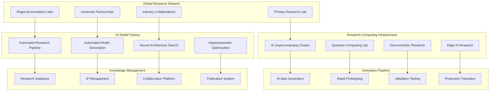

# Phase 3 AI Innovation Center
## Advanced Intelligence Excellence - RUN Phase

---

## 🎯 AI Innovation Center Overview

Phase 3 establishes a **world-class AI Innovation Center** that pushes the boundaries of artificial intelligence in video analytics. The center focuses on **breakthrough research**, **next-generation AI architectures**, **autonomous intelligence**, and **industry-leading innovation** that maintains technological superiority.

### **Innovation Center Objectives**
- **Research Excellence**: World-class AI research and development capabilities
- **Technology Breakthrough**: Next-generation AI architectures and algorithms
- **Autonomous Intelligence**: Self-evolving and self-improving AI systems
- **Industry Leadership**: Setting industry standards and innovation direction
- **Ecosystem Innovation**: Collaborative innovation with global research community

---

## 🧠 Advanced AI Research Platform

### **Research Infrastructure Architecture**


---

## 🔬 Breakthrough AI Research Domains

### **Next-Generation Computer Vision**
```yaml
ADVANCED_COMPUTER_VISION:
  Multimodal_Intelligence:
    vision_language_models: "Advanced vision-language understanding and reasoning"
    temporal_understanding: "Long-term temporal pattern recognition and prediction"
    spatial_reasoning: "3D spatial understanding and navigation"
    causal_inference: "Visual causal reasoning and understanding"

  Self_Supervised_Learning:
    unsupervised_representation: "Self-supervised visual representation learning"
    contrastive_learning: "Advanced contrastive learning methods"
    masked_modeling: "Masked visual modeling and reconstruction"
    predictive_coding: "Predictive coding for temporal understanding"

  Few_Shot_Learning:
    meta_learning: "Meta-learning for rapid adaptation"
    transfer_learning: "Advanced transfer learning techniques"
    domain_adaptation: "Cross-domain adaptation and generalization"
    continual_learning: "Continual learning without catastrophic forgetting"

  Explainable_AI:
    attention_visualization: "Advanced attention mechanism visualization"
    concept_discovery: "Automated concept discovery and explanation"
    counterfactual_analysis: "Counterfactual explanation generation"
    human_interpretable_models: "Human-interpretable model architectures"
```

### **Autonomous AI Systems**
```yaml
AUTONOMOUS_AI_RESEARCH:
  Self_Evolving_Models:
    neural_evolution: "Neural architecture evolution and optimization"
    adaptive_learning: "Adaptive learning rate and algorithm selection"
    self_modification: "Self-modifying neural network architectures"
    emergent_behaviors: "Emergent behavior discovery and utilization"

  Automated_Machine_Learning:
    automl_systems: "Automated machine learning pipeline generation"
    hyperparameter_automation: "Automated hyperparameter optimization"
    feature_engineering: "Automated feature engineering and selection"
    model_selection: "Automated model architecture selection"

  Reinforcement_Learning:
    deep_reinforcement: "Deep reinforcement learning for control systems"
    multi_agent_systems: "Multi-agent reinforcement learning"
    hierarchical_rl: "Hierarchical reinforcement learning"
    safe_rl: "Safe reinforcement learning with constraints"

  Causal_AI:
    causal_discovery: "Automated causal discovery from data"
    causal_inference: "Causal inference and reasoning systems"
    counterfactual_reasoning: "Counterfactual reasoning and analysis"
    interventional_learning: "Learning from interventions and experiments"
```

---

## 🚀 Next-Generation AI Architectures

### **Advanced Neural Network Designs**
```yaml
NEURAL_ARCHITECTURE_INNOVATION:
  Transformer_Evolution:
    video_transformers: "Advanced video transformer architectures"
    efficient_attention: "Efficient attention mechanisms for video"
    hierarchical_transformers: "Hierarchical transformer designs"
    sparse_transformers: "Sparse transformer architectures"

  Graph_Neural_Networks:
    temporal_graphs: "Temporal graph neural networks"
    dynamic_graphs: "Dynamic graph learning and adaptation"
    heterogeneous_graphs: "Heterogeneous graph neural networks"
    graph_attention: "Graph attention mechanisms"

  Neuromorphic_Computing:
    spiking_networks: "Spiking neural network architectures"
    event_driven_processing: "Event-driven processing systems"
    memristor_networks: "Memristor-based neural networks"
    bio_inspired_learning: "Bio-inspired learning algorithms"

  Quantum_Neural_Networks:
    quantum_cnns: "Quantum convolutional neural networks"
    quantum_rnns: "Quantum recurrent neural networks"
    quantum_attention: "Quantum attention mechanisms"
    hybrid_quantum_classical: "Hybrid quantum-classical architectures"
```

### **Edge AI Innovation**
```yaml
EDGE_AI_RESEARCH:
  Ultra_Efficient_Models:
    model_compression: "Advanced model compression techniques"
    pruning_methods: "Advanced pruning and sparsification"
    quantization_research: "Novel quantization methods"
    distillation_techniques: "Advanced knowledge distillation"

  Mobile_Optimization:
    mobile_architectures: "Mobile-optimized neural architectures"
    dynamic_inference: "Dynamic inference and adaptive computation"
    resource_aware_learning: "Resource-aware learning and optimization"
    energy_efficient_ai: "Energy-efficient AI algorithms"

  Real_Time_Processing:
    streaming_models: "Streaming neural network architectures"
    online_learning: "Online learning and adaptation"
    incremental_models: "Incremental model updates"
    latency_optimization: "Latency-optimized inference"

  Federated_Intelligence:
    federated_learning: "Advanced federated learning methods"
    privacy_preserving: "Privacy-preserving learning techniques"
    decentralized_ai: "Decentralized AI coordination"
    edge_collaboration: "Edge device collaboration protocols"
```

---

## 🔧 Research Computing Infrastructure

### **AI Supercomputing Platform**
```yaml
SUPERCOMPUTING_INFRASTRUCTURE:
  Petascale_Computing:
    gpu_clusters: "Petascale GPU computing clusters"
    distributed_training: "Massive distributed training capabilities"
    model_parallelism: "Advanced model parallelism techniques"
    data_parallelism: "Efficient data parallelism optimization"

  Quantum_Computing_Integration:
    quantum_simulators: "Quantum computing simulators"
    quantum_hardware: "Access to quantum computing hardware"
    hybrid_algorithms: "Hybrid quantum-classical algorithms"
    quantum_advantage: "Quantum advantage identification"

  Neuromorphic_Research:
    neuromorphic_chips: "Neuromorphic computing hardware"
    spiking_simulators: "Spiking neural network simulators"
    bio_inspired_hardware: "Bio-inspired computing platforms"
    brain_inspired_architectures: "Brain-inspired system architectures"

  High_Performance_Storage:
    parallel_filesystems: "High-performance parallel filesystems"
    distributed_storage: "Distributed storage for large datasets"
    fast_access_storage: "Ultra-fast access storage systems"
    data_management: "Advanced data management and versioning"
```

### **Automated Research Pipeline**
```yaml
AUTOMATED_RESEARCH:
  Experiment_Automation:
    automated_experimentation: "Fully automated experiment design and execution"
    hypothesis_generation: "AI-driven hypothesis generation"
    experiment_planning: "Automated experiment planning and scheduling"
    result_analysis: "Automated result analysis and interpretation"

  Model_Discovery:
    architecture_search: "Automated neural architecture search"
    hyperparameter_optimization: "Advanced hyperparameter optimization"
    loss_function_discovery: "Automated loss function discovery"
    optimizer_design: "Automated optimizer design and selection"

  Knowledge_Synthesis:
    literature_mining: "Automated literature mining and synthesis"
    patent_analysis: "Automated patent analysis and landscape mapping"
    trend_identification: "Automated research trend identification"
    innovation_opportunities: "Innovation opportunity identification"

  Research_Acceleration:
    parallel_research: "Parallel research track execution"
    rapid_prototyping: "Rapid prototype development and testing"
    continuous_validation: "Continuous validation and improvement"
    fast_iteration: "Fast research iteration and optimization"
```

---

## 🌐 Global Research Collaboration

### **Research Network Architecture**
```yaml
GLOBAL_RESEARCH_NETWORK:
  Academic_Partnerships:
    university_collaboration: "Leading university research partnerships"
    joint_research_programs: "Joint research programs and initiatives"
    student_exchange: "Graduate student and researcher exchange"
    shared_resources: "Shared research resources and infrastructure"

  Industry_Collaboration:
    research_consortiums: "Industry research consortium participation"
    joint_ventures: "Joint research venture partnerships"
    technology_sharing: "Technology sharing and cross-licensing"
    innovation_networks: "Innovation network participation"

  Open_Source_Contribution:
    open_research: "Open research and publication strategy"
    code_sharing: "Open source code and model sharing"
    dataset_contribution: "Public dataset contribution and curation"
    community_building: "Research community building and leadership"

  International_Cooperation:
    global_initiatives: "Global AI research initiative participation"
    standards_development: "AI standards development and contribution"
    policy_influence: "AI policy and regulation influence"
    ethical_guidelines: "AI ethics and responsibility leadership"
```

### **Innovation Ecosystem**
```yaml
INNOVATION_ECOSYSTEM:
  Startup_Incubation:
    ai_incubator: "AI startup incubation and acceleration"
    venture_investment: "Strategic venture investment in AI startups"
    technology_licensing: "Technology licensing to startups"
    mentorship_programs: "Entrepreneur mentorship and support"

  Innovation_Challenges:
    global_competitions: "Global AI innovation competitions"
    hackathons: "AI research hackathons and challenges"
    crowdsourcing: "Crowdsourced innovation and problem solving"
    prize_competitions: "Innovation prize competitions and awards"

  Technology_Transfer:
    commercialization: "Research commercialization and productization"
    licensing_programs: "Technology licensing programs"
    spin_off_companies: "Research spin-off company creation"
    market_adoption: "Technology market adoption acceleration"

  Intellectual_Property:
    patent_strategy: "Strategic patent portfolio development"
    ip_protection: "Intellectual property protection and enforcement"
    licensing_revenue: "IP licensing revenue generation"
    defensive_patents: "Defensive patent portfolio development"
```

---

## 📊 Research Impact and Metrics

### **Innovation Performance Framework**
```yaml
RESEARCH_METRICS:
  Scientific_Impact:
    publication_quality: "High-impact publication and citation metrics"
    conference_presence: "Leading conference participation and presentations"
    peer_recognition: "Peer recognition and awards"
    research_influence: "Research influence and citation impact"

  Technology_Innovation:
    patent_generation: "Patent generation and innovation metrics"
    technology_transfer: "Technology transfer and commercialization success"
    product_integration: "Research to product integration timeline"
    market_impact: "Market impact and adoption metrics"

  Collaboration_Success:
    partnership_outcomes: "Research partnership success metrics"
    joint_publications: "Joint publication and collaboration metrics"
    knowledge_exchange: "Knowledge exchange and sharing metrics"
    network_growth: "Research network growth and expansion"

  Business_Impact:
    revenue_generation: "Research-driven revenue generation"
    competitive_advantage: "Technology competitive advantage metrics"
    market_leadership: "Market leadership and positioning"
    innovation_pipeline: "Innovation pipeline strength and depth"
```

### **Research Excellence Framework**
```yaml
EXCELLENCE_FRAMEWORK:
  Quality_Assurance:
    peer_review: "Rigorous peer review and validation"
    reproducibility: "Research reproducibility and verification"
    ethical_standards: "Research ethics and responsibility standards"
    quality_metrics: "Research quality and impact metrics"

  Continuous_Improvement:
    research_optimization: "Continuous research process optimization"
    methodology_advancement: "Research methodology advancement"
    tool_development: "Research tool and platform development"
    capacity_building: "Research capacity building and expansion"

  Knowledge_Management:
    research_database: "Comprehensive research database and archive"
    knowledge_capture: "Research knowledge capture and preservation"
    institutional_memory: "Institutional research memory and continuity"
    expertise_development: "Research expertise development and retention"

  Strategic_Alignment:
    business_alignment: "Research and business strategy alignment"
    market_relevance: "Research market relevance and applicability"
    future_positioning: "Future technology positioning and readiness"
    competitive_intelligence: "Competitive technology intelligence"
```

---

## 🎯 Phase 3 AI Innovation Success

The **Phase 3 AI Innovation Center** delivers world-class research excellence:

- ✅ **Research Leadership**: World-class AI research and development capabilities
- ✅ **Technology Breakthrough**: Next-generation AI architectures and algorithms
- ✅ **Autonomous Intelligence**: Self-evolving and self-improving AI systems
- ✅ **Global Collaboration**: Extensive global research network and partnerships
- ✅ **Innovation Pipeline**: Continuous innovation and technology advancement

**This AI Innovation Center establishes sustained technology leadership and competitive advantage through breakthrough research and innovation.**

---

**Document Status**: Ready for Implementation
**Next Document**: [Autonomous Operations Platform](./03-autonomous-operations-platform.md)
**Related**: [Global Architecture](./01-global-enterprise-architecture.md) | [Business Considerations](../business-considerations/)