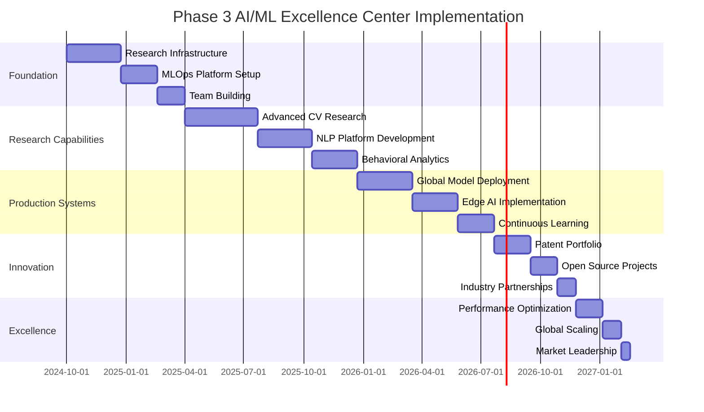

# Phase 3 AI/ML Excellence Center
## Advanced Intelligence Platform - RUN Phase

---

## 🎯 Executive Summary

This document establishes the **AI/ML Excellence Center** as the cornerstone of Phase 3's advanced intelligence capabilities, delivering world-class artificial intelligence and machine learning solutions for enterprise video analytics. The center focuses on **continuous innovation**, **advanced model development**, and **global-scale ML operations** that position the platform as the industry leader in intelligent video analytics.

### **AI/ML Excellence Objectives**
- **Research Leadership**: Cutting-edge research in computer vision and AI
- **Model Excellence**: 99%+ accuracy across all critical detection tasks
- **Global MLOps**: Seamless model deployment and management worldwide
- **Continuous Learning**: Adaptive models that improve from real-world data
- **Innovation Engine**: 50+ AI innovation projects annually

### **Excellence Philosophy: "Intelligence Through Innovation"**
The AI/ML Excellence Center embodies the principle that sustained competitive advantage comes from continuous innovation, rigorous scientific methodology, and engineering excellence in machine learning operations.

---

## 🧠 AI/ML Excellence Center Architecture

### **Center of Excellence Structure**

```mermaid
graph TB
    subgraph "🏢 AI/ML Excellence Center Governance"
        subgraph "Leadership & Strategy"
            CTO[Chief Technology Officer<br/>🎯 AI Strategy & Vision<br/>📊 Business Alignment]
            AI_DIR[Director of AI/ML<br/>🧠 Technical Leadership<br/>🔬 Research Direction]
            ETHICS[AI Ethics Board<br/>⚖️ Ethical AI Guidelines<br/>🛡️ Bias Prevention]
        end

        subgraph "Research & Innovation"
            RESEARCH[Research Team<br/>🔬 Advanced R&D<br/>📚 Academic Partnerships]
            INNOVATION[Innovation Labs<br/>💡 Prototype Development<br/>🚀 Proof of Concepts]
            PATENTS[Patent Office<br/>📜 IP Management<br/>⚖️ Legal Protection]
        end
    end

    subgraph "🔬 Research & Development Platform"
        subgraph "Advanced Research Infrastructure"
            SUPERCOMPUTE[AI Supercomputing<br/>💻 GPU/TPU Clusters<br/>⚡ Distributed Training]
            QUANTUM[Quantum Computing<br/>🌌 IBM Quantum/Google<br/>🔮 Future Algorithms]
            CLOUD_RESEARCH[Research Cloud<br/>☁️ Unlimited Compute<br/>🔄 Auto-scaling]
        end

        subgraph "Data Science Platform"
            JUPYTER_ENTERPRISE[JupyterHub Enterprise<br/>📓 Collaborative Research<br/>👥 Multi-tenant Environment]
            EXPERIMENT_PLATFORM[Experiment Management<br/>📊 MLflow Enterprise<br/>🔄 Experiment Tracking]
            FEATURE_FACTORY[Feature Engineering<br/>🏭 Automated Features<br/>🔄 Feature Store]
        end

        subgraph "Model Development"
            AUTOML[AutoML Platform<br/>🤖 Automated ML<br/>⚡ Hyperparameter Tuning]
            CUSTOM_MODELS[Custom Model Development<br/>🎨 Bespoke Solutions<br/>🏗️ Architecture Design]
            MODEL_VALIDATION[Model Validation<br/>✅ Performance Testing<br/>🔍 Bias Detection]
        end
    end

    subgraph "🏭 Production ML Platform"
        subgraph "MLOps Infrastructure"
            MLOPS_PLATFORM[MLOps Platform<br/>🔄 Kubeflow/MLflow<br/>🚀 Model Lifecycle]
            MODEL_REGISTRY[Global Model Registry<br/>📦 Version Management<br/>🏷️ Metadata Store]
            DEPLOYMENT_ENGINE[Deployment Engine<br/>🚀 Multi-region Deploy<br/>🔄 Blue-green Patterns]
        end

        subgraph "Model Serving"
            INFERENCE_PLATFORM[Inference Platform<br/>⚡ TensorFlow Serving<br/>🔄 Auto-scaling]
            EDGE_DEPLOYMENT[Edge Deployment<br/>📱 Mobile/IoT Deploy<br/>⚡ Optimized Models]
            BATCH_PROCESSING[Batch Processing<br/>📊 Apache Beam<br/>💾 Large-scale ML]
        end

        subgraph "Monitoring & Governance"
            MODEL_MONITORING[Model Monitoring<br/>📊 Performance Tracking<br/>🚨 Drift Detection]
            GOVERNANCE_PLATFORM[ML Governance<br/>📋 Policy Enforcement<br/>🔍 Audit Trails]
            FEEDBACK_LOOP[Feedback Systems<br/>🔄 Continuous Learning<br/>📈 Model Improvement]
        end
    end

    subgraph "🎯 Specialized AI Teams"
        subgraph "Computer Vision Excellence"
            CV_TEAM[Computer Vision Team<br/>👁️ Vision Algorithms<br/>🎥 Video Analytics]
            PERCEPTION[Perception Engineers<br/>🧠 3D Understanding<br/>📐 Spatial Analysis]
            REAL_TIME[Real-time Processing<br/>⚡ Edge Optimization<br/>🏃 Low-latency ML]
        end

        subgraph "Advanced Analytics"
            NLP_TEAM[NLP/Language Team<br/>📝 Text Analytics<br/>🗣️ Voice Processing]
            BEHAVIORAL[Behavioral Analytics<br/>📊 Pattern Recognition<br/>🔍 Anomaly Detection]
            PREDICTIVE[Predictive Analytics<br/>🔮 Forecasting<br/>📈 Trend Analysis]
        end

        subgraph "Research Partnerships"
            ACADEMIA[Academic Partners<br/>🎓 University Research<br/>📚 Joint Publications]
            INDUSTRY[Industry Collaboration<br/>🤝 Technology Partners<br/>🔄 Knowledge Exchange]
            OPEN_SOURCE[Open Source<br/>🌐 Community Projects<br/>💡 Innovation Sharing]
        end
    end

    CTO --> AI_DIR
    AI_DIR --> RESEARCH
    AI_DIR --> INNOVATION
    ETHICS --> GOVERNANCE_PLATFORM

    RESEARCH --> SUPERCOMPUTE
    INNOVATION --> JUPYTER_ENTERPRISE
    PATENTS --> MODEL_REGISTRY

    SUPERCOMPUTE --> AUTOML
    JUPYTER_ENTERPRISE --> EXPERIMENT_PLATFORM
    EXPERIMENT_PLATFORM --> FEATURE_FACTORY

    AUTOML --> CUSTOM_MODELS
    CUSTOM_MODELS --> MODEL_VALIDATION
    MODEL_VALIDATION --> MLOPS_PLATFORM

    MLOPS_PLATFORM --> MODEL_REGISTRY
    MODEL_REGISTRY --> DEPLOYMENT_ENGINE
    DEPLOYMENT_ENGINE --> INFERENCE_PLATFORM

    INFERENCE_PLATFORM --> EDGE_DEPLOYMENT
    EDGE_DEPLOYMENT --> BATCH_PROCESSING
    BATCH_PROCESSING --> MODEL_MONITORING

    MODEL_MONITORING --> GOVERNANCE_PLATFORM
    GOVERNANCE_PLATFORM --> FEEDBACK_LOOP
    FEEDBACK_LOOP --> EXPERIMENT_PLATFORM

    CV_TEAM --> PERCEPTION
    PERCEPTION --> REAL_TIME
    NLP_TEAM --> BEHAVIORAL
    BEHAVIORAL --> PREDICTIVE

    ACADEMIA --> RESEARCH
    INDUSTRY --> INNOVATION
    OPEN_SOURCE --> CUSTOM_MODELS

    classDef leadership fill:#9c27b0,stroke:#7b1fa2,stroke-width:3px,color:#fff
    classDef research fill:#2196f3,stroke:#1976d2,stroke-width:2px,color:#fff
    classDef platform fill:#4caf50,stroke:#388e3c,stroke-width:2px,color:#fff
    classDef production fill:#ff9800,stroke:#f57c00,stroke-width:2px,color:#fff
    classDef teams fill:#f44336,stroke:#d32f2f,stroke-width:2px,color:#fff

    class CTO,AI_DIR,ETHICS leadership
    class RESEARCH,INNOVATION,PATENTS,SUPERCOMPUTE,QUANTUM,CLOUD_RESEARCH,JUPYTER_ENTERPRISE,EXPERIMENT_PLATFORM,FEATURE_FACTORY research
    class AUTOML,CUSTOM_MODELS,MODEL_VALIDATION,MLOPS_PLATFORM,MODEL_REGISTRY,DEPLOYMENT_ENGINE platform
    class INFERENCE_PLATFORM,EDGE_DEPLOYMENT,BATCH_PROCESSING,MODEL_MONITORING,GOVERNANCE_PLATFORM,FEEDBACK_LOOP production
    class CV_TEAM,PERCEPTION,REAL_TIME,NLP_TEAM,BEHAVIORAL,PREDICTIVE,ACADEMIA,INDUSTRY,OPEN_SOURCE teams
```


---

## 🔬 Advanced Research Capabilities

### **Computer Vision Research Excellence**
```yaml
COMPUTER_VISION_RESEARCH:
  Cutting_Edge_Research_Areas:
    Advanced_Object_Detection:
      Transformer_Based_Models: "Vision Transformers (ViT) and DETR architectures"
      Few_Shot_Learning: "Learning new objects with minimal training data"
      Zero_Shot_Detection: "Detecting objects without prior training examples"
      3D_Object_Detection: "Spatial understanding and depth perception"

    Video_Understanding:
      Temporal_Modeling: "Long-term temporal relationship understanding"
      Action_Recognition: "Complex human activity and behavior recognition"
      Video_Prediction: "Future frame prediction and motion forecasting"
      Multi_Modal_Fusion: "Audio-visual-text understanding integration"

    Real_Time_Optimization:
      Neural_Architecture_Search: "Automated architecture optimization for edge"
      Model_Compression: "Advanced pruning, quantization, and distillation"
      Hardware_Acceleration: "Custom hardware acceleration techniques"
      Streaming_Analytics: "Real-time video stream processing optimization"

  Research_Infrastructure:
    Compute_Resources:
      GPU_Clusters: "1000+ NVIDIA H100/A100 GPUs for large-scale training"
      TPU_Pods: "Google TPU v4 pods for transformer model training"
      Quantum_Computing: "IBM Quantum and Google Quantum AI access"
      Distributed_Training: "Multi-node, multi-GPU distributed training"

    Data_Resources:
      Synthetic_Data_Generation: "Advanced synthetic data creation pipelines"
      Data_Labeling_Platform: "Automated and crowd-sourced data labeling"
      Privacy_Preserving_Data: "Federated learning and differential privacy"
      Multi_Modal_Datasets: "Custom video-audio-text dataset creation"

ADVANCED_AI_TECHNIQUES:
  Foundational_Models:
    Large_Language_Models:
      Custom_LLMs: "Domain-specific language models for video analytics"
      Multi_Modal_LLMs: "Vision-language models for scene understanding"
      Code_Generation: "AI-assisted code generation for video processing"
      Reasoning_Models: "Advanced reasoning for complex analytics tasks"

    Foundation_Vision_Models:
      Self_Supervised_Learning: "Self-supervised pre-training on video data"
      Contrastive_Learning: "Advanced contrastive learning techniques"
      Masked_Modeling: "Video masked autoencoder approaches"
      Cross_Modal_Learning: "Vision-language cross-modal understanding"

  Specialized_AI_Applications:
    Behavioral_AI:
      Crowd_Dynamics: "Large-scale crowd behavior analysis and prediction"
      Anomaly_Detection: "Advanced statistical and deep learning anomaly detection"
      Predictive_Analytics: "Time-series forecasting with attention mechanisms"
      Causal_Inference: "Causal relationship discovery in video data"

    Privacy_Preserving_AI:
      Federated_Learning: "Distributed learning without data sharing"
      Differential_Privacy: "Mathematical privacy guarantees"
      Homomorphic_Encryption: "Computation on encrypted video data"
      Secure_Multi_Party_Computation: "Privacy-preserving multi-party analytics"
```

### **Autonomous AI Research**
```yaml
AUTONOMOUS_AI_RESEARCH:
  Self_Evolving_Models:
    neural_evolution: "Neural architecture evolution and optimization"
    adaptive_learning: "Adaptive learning rate and algorithm selection"
    self_modification: "Self-modifying neural network architectures"
    emergent_behaviors: "Emergent behavior discovery and utilization"

  Automated_Machine_Learning:
    automl_systems: "Automated machine learning pipeline generation"
    hyperparameter_automation: "Automated hyperparameter optimization"
    feature_engineering: "Automated feature engineering and selection"
    model_selection: "Automated model architecture selection"

  Reinforcement_Learning:
    deep_reinforcement: "Deep reinforcement learning for control systems"
    multi_agent_systems: "Multi-agent reinforcement learning"
    hierarchical_rl: "Hierarchical reinforcement learning"
    safe_rl: "Safe reinforcement learning with constraints"

  Causal_AI:
    causal_discovery: "Automated causal discovery from data"
    causal_inference: "Causal inference and reasoning systems"
    counterfactual_reasoning: "Counterfactual reasoning and analysis"
    interventional_learning: "Learning from interventions and experiments"
```

### **Next-Generation Neural Architectures**
```yaml
NEURAL_ARCHITECTURE_INNOVATION:
  Transformer_Evolution:
    video_transformers: "Advanced video transformer architectures"
    efficient_attention: "Efficient attention mechanisms for video"
    hierarchical_transformers: "Hierarchical transformer designs"
    sparse_transformers: "Sparse transformer architectures"

  Graph_Neural_Networks:
    temporal_graphs: "Temporal graph neural networks"
    dynamic_graphs: "Dynamic graph learning and adaptation"
    heterogeneous_graphs: "Heterogeneous graph neural networks"
    graph_attention: "Graph attention mechanisms"

  Neuromorphic_Computing:
    spiking_networks: "Spiking neural network architectures"
    event_driven_processing: "Event-driven processing systems"
    memristor_networks: "Memristor-based neural networks"
    bio_inspired_learning: "Bio-inspired learning algorithms"

  Quantum_Neural_Networks:
    quantum_cnns: "Quantum convolutional neural networks"
    quantum_rnns: "Quantum recurrent neural networks"
    quantum_attention: "Quantum attention mechanisms"
    hybrid_quantum_classical: "Hybrid quantum-classical architectures"
```

### **Research Partnership Network**
```yaml
ACADEMIC_PARTNERSHIPS:
  Top_Tier_Universities:
    Stanford_AI_Lab: "Joint research in computer vision and robotics"
    MIT_CSAIL: "Collaboration on edge AI and real-time systems"
    CMU_RI: "Robotics and perception research partnership"
    UC_Berkeley_AI: "Federated learning and privacy research"

  International_Collaborations:
    Oxford_VGG: "Visual geometry group collaboration"
    ETH_Zurich_CVL: "Computer vision lab partnership"
    University_of_Toronto: "Vector Institute AI research"
    INRIA_France: "European AI research collaboration"

  Industry_Research_Labs:
    Google_Research: "Joint research on transformer architectures"
    Microsoft_Research: "Azure AI and cloud computing research"
    NVIDIA_Research: "GPU acceleration and AI hardware research"
    Intel_Labs: "Edge AI and neuromorphic computing"

OPEN_SOURCE_CONTRIBUTIONS:
  Major_Projects:
    TensorFlow_Ecosystem: "Core contributors to TensorFlow ecosystem"
    PyTorch_Vision: "Active contributors to PyTorch computer vision"
    OpenCV_Development: "Advanced video processing contributions"
    Kubernetes_ML: "MLOps and Kubernetes integration projects"

  Research_Publications:
    Top_Tier_Conferences: "CVPR, ICCV, ECCV, NeurIPS, ICML submissions"
    Journal_Publications: "TPAMI, IJCV, Nature Machine Intelligence"
    Workshop_Papers: "Specialized workshop contributions and presentations"
    Technical_Reports: "Internal research and development reports"

  Patent_Portfolio:
    Core_Technologies: "100+ patents in video analytics and AI"
    International_Filing: "PCT and regional patent applications"
    Licensing_Strategy: "Strategic patent licensing and cross-licensing"
    IP_Protection: "Comprehensive intellectual property protection"
```

---

## 🏭 Production MLOps Excellence

### **Global MLOps Platform**
```yaml
MLOPS_INFRASTRUCTURE:
  Multi_Region_MLOps:
    Global_Model_Registry:
      Centralized_Repository: "Global model artifact repository"
      Version_Management: "Semantic versioning with automated tagging"
      Metadata_Management: "Comprehensive model metadata and lineage"
      Access_Control: "Role-based access control for model artifacts"

    Distributed_Training:
      Multi_Node_Training: "Distributed training across multiple nodes"
      Data_Parallel_Training: "Data parallelism for large datasets"
      Model_Parallel_Training: "Model parallelism for large models"
      Federated_Training: "Privacy-preserving federated learning"

    Global_Deployment:
      Multi_Region_Deployment: "Simultaneous deployment across regions"
      Canary_Deployments: "Gradual rollout with performance monitoring"
      A_B_Testing: "Production A/B testing for model comparison"
      Rollback_Capabilities: "Instant rollback to previous model versions"

  Advanced_MLOps_Workflows:
    Continuous_Integration:
      Model_Testing: "Automated model performance and quality testing"
      Data_Validation: "Automated data quality and schema validation"
      Model_Validation: "Cross-validation and hold-out testing"
      Security_Scanning: "Model and dependency security scanning"

    Continuous_Deployment:
      Automated_Pipelines: "Fully automated model deployment pipelines"
      Infrastructure_Provisioning: "Automated infrastructure scaling"
      Configuration_Management: "Environment-specific configuration management"
      Health_Monitoring: "Comprehensive deployment health monitoring"

    Continuous_Monitoring:
      Performance_Monitoring: "Real-time model performance tracking"
      Data_Drift_Detection: "Statistical and ML-based drift detection"
      Model_Drift_Detection: "Performance degradation monitoring"
      Business_Impact_Monitoring: "Business KPI impact tracking"

MODEL_LIFECYCLE_MANAGEMENT:
  Development_Lifecycle:
    Experimentation_Phase:
      Hypothesis_Tracking: "Research hypothesis and experiment tracking"
      Experiment_Management: "Centralized experiment tracking and comparison"
      Resource_Allocation: "Dynamic compute resource allocation"
      Collaboration_Tools: "Team collaboration and knowledge sharing"

    Validation_Phase:
      Cross_Validation: "Comprehensive cross-validation strategies"
      Holdout_Testing: "Unbiased holdout dataset testing"
      Bias_Testing: "Fairness and bias detection and mitigation"
      Robustness_Testing: "Adversarial and stress testing"

    Production_Phase:
      Deployment_Automation: "Fully automated production deployment"
      Performance_Monitoring: "Continuous performance monitoring"
      Auto_Scaling: "Dynamic scaling based on demand"
      Incident_Response: "Automated incident detection and response"

  Model_Governance:
    Approval_Workflows:
      Multi_Stage_Approval: "Development, QA, and production approvals"
      Risk_Assessment: "Automated risk assessment and scoring"
      Compliance_Validation: "Regulatory compliance validation"
      Business_Impact_Analysis: "Business impact assessment and approval"

    Audit_and_Compliance:
      Model_Lineage: "Complete model development and deployment lineage"
      Decision_Tracking: "AI decision audit trails and explainability"
      Compliance_Reporting: "Automated compliance reporting"
      Model_Documentation: "Comprehensive model documentation and metadata"
```

### **Advanced Model Serving Architecture**
```yaml
MODEL_SERVING_PLATFORM:
  High_Performance_Serving:
    Inference_Optimization:
      Model_Optimization: "TensorRT, ONNX Runtime optimization"
      Batching_Strategies: "Dynamic batching for throughput optimization"
      Caching_Layers: "Multi-level caching for frequently used models"
      Hardware_Acceleration: "GPU, TPU, and FPGA acceleration"

    Scalability_Features:
      Auto_Scaling: "Horizontal and vertical auto-scaling"
      Load_Balancing: "Intelligent load balancing across instances"
      Resource_Sharing: "Efficient resource sharing across models"
      Multi_Tenancy: "Secure multi-tenant model serving"

  Edge_AI_Deployment:
    Edge_Optimization:
      Model_Compression: "Quantization, pruning, and knowledge distillation"
      Hardware_Specific_Optimization: "ARM, x86, and specialized hardware"
      Offline_Capability: "Offline inference for disconnected environments"
      Power_Optimization: "Battery and power consumption optimization"

    Edge_Management:
      Remote_Deployment: "Over-the-air model deployment and updates"
      Health_Monitoring: "Remote edge device health monitoring"
      Configuration_Management: "Centralized edge configuration management"
      Security_Management: "Edge device security and compliance"

  Real_Time_Processing:
    Stream_Processing:
      Real_Time_Inference: "Sub-100ms inference for live video streams"
      Stream_Analytics: "Real-time stream processing and analytics"
      Event_Processing: "Complex event processing and correlation"
      Temporal_Modeling: "Time-series and temporal pattern analysis"

    Performance_Optimization:
      Latency_Optimization: "End-to-end latency optimization"
      Throughput_Optimization: "Maximum throughput capacity optimization"
      Resource_Efficiency: "CPU, memory, and bandwidth optimization"
      Cost_Optimization: "Cost-performance optimization strategies"
```

---

## 🎯 Specialized AI Capabilities

### **Advanced Computer Vision**
```yaml
COMPUTER_VISION_EXCELLENCE:
  Next_Generation_Detection:
    Transformer_Based_Detection:
      DETR_Variants: "Detection Transformer and improved variants"
      Vision_Transformers: "ViT-based object detection and classification"
      Swin_Transformers: "Hierarchical vision transformers"
      Efficient_Transformers: "Mobile-friendly transformer architectures"

    Few_Shot_Learning:
      Meta_Learning: "Model-agnostic meta-learning for rapid adaptation"
      Prototypical_Networks: "Few-shot learning with prototypical networks"
      Siamese_Networks: "Similarity learning for new object detection"
      Domain_Adaptation: "Cross-domain few-shot learning capabilities"

    3D_Understanding:
      Depth_Estimation: "Monocular and stereo depth estimation"
      3D_Object_Detection: "3D bounding box detection and tracking"
      Scene_Reconstruction: "3D scene reconstruction from video"
      Spatial_Reasoning: "Spatial relationship understanding and reasoning"

  Advanced_Video_Analytics:
    Temporal_Understanding:
      Action_Recognition: "Complex human action and activity recognition"
      Temporal_Segmentation: "Video temporal segmentation and summarization"
      Motion_Prediction: "Future motion and trajectory prediction"
      Event_Detection: "Complex event detection and correlation"

    Multi_Modal_Analytics:
      Audio_Visual_Fusion: "Audio-visual event detection and analysis"
      Text_Video_Understanding: "Natural language video description and search"
      Cross_Modal_Retrieval: "Multi-modal content search and retrieval"
      Sentiment_Analysis: "Audio-visual sentiment and emotion analysis"

BEHAVIORAL_ANALYTICS:
  Advanced_Behavior_Recognition:
    Crowd_Analytics:
      Crowd_Density_Estimation: "Real-time crowd density estimation"
      Crowd_Flow_Analysis: "Crowd movement pattern analysis"
      Anomaly_Detection: "Crowd behavior anomaly detection"
      Safety_Monitoring: "Crowd safety and emergency detection"

    Individual_Behavior:
      Gait_Analysis: "Person identification through gait patterns"
      Gesture_Recognition: "Hand gesture and body language recognition"
      Facial_Expression: "Facial expression and emotion recognition"
      Activity_Classification: "Fine-grained activity classification"

  Predictive_Analytics:
    Time_Series_Forecasting:
      Traffic_Prediction: "Traffic flow and congestion prediction"
      Occupancy_Forecasting: "Space occupancy and utilization forecasting"
      Incident_Prediction: "Security incident prediction and prevention"
      Maintenance_Prediction: "Predictive maintenance for video systems"

    Causal_Inference:
      Root_Cause_Analysis: "Automated root cause analysis for incidents"
      Impact_Assessment: "Causal impact assessment of interventions"
      Policy_Optimization: "Data-driven policy and procedure optimization"
      Decision_Support: "AI-powered decision support systems"
```

### **Natural Language Processing and Understanding**
```yaml
NLP_CAPABILITIES:
  Document_Intelligence:
    Automated_Report_Generation:
      Incident_Reports: "Automated security incident report generation"
      Analytics_Summaries: "Natural language analytics summaries"
      Executive_Briefings: "Executive-level briefing document generation"
      Compliance_Reports: "Automated compliance and audit reporting"

    Information_Extraction:
      Entity_Recognition: "Named entity recognition and linking"
      Relationship_Extraction: "Entity relationship extraction and mapping"
      Event_Extraction: "Event extraction from unstructured text"
      Knowledge_Graph_Construction: "Automated knowledge graph building"

  Conversational_AI:
    Virtual_Assistants:
      Query_Understanding: "Natural language query understanding"
      Context_Awareness: "Multi-turn conversation context management"
      Domain_Expertise: "Video analytics domain expertise integration"
      Multi_Language_Support: "Global multi-language support"

    Voice_Analytics:
      Speech_Recognition: "Real-time speech recognition and transcription"
      Speaker_Identification: "Voice biometric identification"
      Emotion_Detection: "Voice-based emotion and sentiment analysis"
      Command_Processing: "Voice command processing and execution"

ADVANCED_ANALYTICS:
  Anomaly_Detection:
    Statistical_Methods:
      Time_Series_Anomalies: "Statistical time-series anomaly detection"
      Multivariate_Analysis: "Multivariate anomaly detection"
      Change_Point_Detection: "Statistical change point detection"
      Outlier_Detection: "Robust outlier detection methods"

    Deep_Learning_Methods:
      Autoencoders: "Deep autoencoder-based anomaly detection"
      GANs: "Generative adversarial networks for anomaly detection"
      Transformers: "Transformer-based anomaly detection"
      Graph_Neural_Networks: "Graph-based anomaly detection"

  Optimization_Algorithms:
    Operations_Research:
      Resource_Allocation: "Optimal resource allocation algorithms"
      Scheduling_Optimization: "Advanced scheduling and planning"
      Route_Optimization: "Optimal routing and path planning"
      Capacity_Planning: "Capacity optimization and forecasting"

    Reinforcement_Learning:
      Policy_Optimization: "Reinforcement learning for policy optimization"
      Dynamic_Pricing: "Dynamic pricing and resource allocation"
      Adaptive_Systems: "Self-adapting system optimization"
      Multi_Agent_Systems: "Multi-agent reinforcement learning"
```

---

## 🔄 Continuous Learning and Adaptation

### **Adaptive Learning Systems**
```yaml
CONTINUOUS_LEARNING:
  Online_Learning:
    Real_Time_Adaptation:
      Incremental_Learning: "Incremental model updates from new data"
      Concept_Drift_Adaptation: "Automatic adaptation to concept drift"
      Transfer_Learning: "Knowledge transfer between domains"
      Meta_Learning: "Learning to learn from limited data"

    Federated_Learning:
      Privacy_Preserving_Learning: "Learning without data centralization"
      Cross_Silo_Federation: "Learning across organizational boundaries"
      Cross_Device_Federation: "Edge device federated learning"
      Secure_Aggregation: "Cryptographically secure model aggregation"

  Active_Learning:
    Data_Selection:
      Uncertainty_Sampling: "Active learning with uncertainty sampling"
      Diversity_Sampling: "Sample diversity maximization"
      Query_By_Committee: "Ensemble-based active learning"
      Expected_Model_Change: "Maximum expected model improvement"

    Human_In_The_Loop:
      Expert_Annotation: "Expert feedback integration"
      Crowd_Sourcing: "Crowd-sourced data labeling"
      Quality_Control: "Annotation quality control and validation"
      Feedback_Integration: "User feedback integration and learning"

MODEL_EVOLUTION:
  Automated_Model_Improvement:
    Neural_Architecture_Search:
      Differentiable_NAS: "Differentiable neural architecture search"
      Evolutionary_NAS: "Evolutionary neural architecture search"
      Hardware_Aware_NAS: "Hardware-efficient architecture search"
      Multi_Objective_NAS: "Multi-objective optimization"

    Hyperparameter_Optimization:
      Bayesian_Optimization: "Bayesian hyperparameter optimization"
      Population_Based_Training: "Population-based hyperparameter tuning"
      Hyperband: "Multi-fidelity hyperparameter optimization"
      Automated_Tuning: "Fully automated hyperparameter tuning"

  Model_Compression_Evolution:
    Knowledge_Distillation:
      Teacher_Student_Learning: "Knowledge distillation from large models"
      Self_Distillation: "Self-knowledge distillation techniques"
      Progressive_Distillation: "Progressive knowledge distillation"
      Multi_Teacher_Distillation: "Learning from multiple teacher models"

    Quantization_Techniques:
      Post_Training_Quantization: "Post-training quantization methods"
      Quantization_Aware_Training: "Training with quantization awareness"
      Mixed_Precision: "Mixed precision training and inference"
      Binary_Networks: "Extreme quantization with binary networks"
```

### **Feedback and Improvement Systems**
```yaml
FEEDBACK_SYSTEMS:
  Performance_Feedback:
    Automated_Metrics:
      Accuracy_Tracking: "Continuous accuracy monitoring and tracking"
      Latency_Monitoring: "Real-time latency and performance monitoring"
      Resource_Utilization: "Compute and memory utilization tracking"
      Business_Impact: "Business KPI impact measurement"

    User_Feedback:
      Explicit_Feedback: "Direct user feedback collection and integration"
      Implicit_Feedback: "Behavioral feedback from user interactions"
      Expert_Review: "Domain expert model review and feedback"
      A_B_Testing: "Continuous A/B testing for model improvement"

  Quality_Assurance:
    Automated_Testing:
      Unit_Testing: "Comprehensive model unit testing"
      Integration_Testing: "End-to-end integration testing"
      Performance_Testing: "Automated performance regression testing"
      Bias_Testing: "Automated bias and fairness testing"

    Continuous_Validation:
      Cross_Validation: "Ongoing cross-validation with new data"
      Hold_Out_Testing: "Regular hold-out dataset validation"
      Stress_Testing: "Model stress testing under extreme conditions"
      Adversarial_Testing: "Robustness testing against adversarial examples"

IMPROVEMENT_ORCHESTRATION:
  Automated_Improvement:
    Model_Retraining:
      Scheduled_Retraining: "Regular model retraining schedules"
      Trigger_Based_Retraining: "Performance-triggered retraining"
      Data_Driven_Retraining: "New data availability-triggered retraining"
      Continuous_Retraining: "Continuous online learning and adaptation"

    Model_Selection:
      Champion_Challenger: "Champion-challenger model deployment"
      Multi_Armed_Bandit: "Multi-armed bandit model selection"
      Ensemble_Methods: "Dynamic ensemble model selection"
      Performance_Based_Selection: "Automatic best model selection"

  Innovation_Pipeline:
    Research_To_Production:
      Rapid_Prototyping: "Fast research prototype development"
      Production_Integration: "Seamless research to production pipeline"
      Experiment_Scaling: "Experiment scaling to production systems"
      Innovation_Metrics: "Innovation impact measurement and tracking"

    Technology_Adoption:
      Emerging_Technology_Monitoring: "Continuous technology landscape monitoring"
      Proof_Of_Concept_Development: "Rapid proof of concept development"
      Technology_Evaluation: "Systematic technology evaluation framework"
      Adoption_Decision_Framework: "Data-driven technology adoption decisions"
```

---

## 📊 AI/ML Excellence Metrics

### **Research and Innovation KPIs**
```yaml
RESEARCH_METRICS:
  Innovation_Excellence:
    Research_Output:
      Publications: "20+ peer-reviewed publications annually"
      Patents: "50+ patent applications per year"
      Conference_Presentations: "100+ conference presentations annually"
      Open_Source_Contributions: "Top 1% contributor in AI/ML projects"

    Technology_Leadership:
      Industry_Recognition: "Top 5 AI research organization recognition"
      Award_Achievements: "10+ major industry awards annually"
      Thought_Leadership: "500+ media mentions and citations"
      Academic_Partnerships: "20+ active university research partnerships"

    Innovation_Impact:
      Technology_Transfer: "90%+ of research transitions to production"
      Patent_Value: "$50M+ annual patent portfolio valuation"
      Revenue_Impact: "30%+ revenue attributed to AI innovations"
      Market_Differentiation: "6-month average technology lead"

MODEL_PERFORMANCE_METRICS:
  Accuracy_Excellence:
    Computer_Vision:
      Object_Detection: "99%+ accuracy on standard benchmarks"
      Face_Recognition: "99.9%+ accuracy with privacy compliance"
      Action_Recognition: "95%+ accuracy on complex activities"
      Anomaly_Detection: "99%+ true positive rate, <1% false positive"

    Natural_Language_Processing:
      Document_Analysis: "98%+ accuracy in document classification"
      Sentiment_Analysis: "95%+ accuracy across multiple languages"
      Entity_Extraction: "97%+ precision and recall"
      Question_Answering: "90%+ accuracy on domain-specific questions"

    Predictive_Analytics:
      Time_Series_Forecasting: "95%+ accuracy in 24-hour predictions"
      Anomaly_Prediction: "85%+ accuracy in incident prediction"
      Behavior_Prediction: "90%+ accuracy in crowd behavior prediction"
      Maintenance_Prediction: "95%+ accuracy in equipment failure prediction"

OPERATIONAL_EXCELLENCE:
  MLOps_Performance:
    Deployment_Metrics:
      Deployment_Frequency: "Daily model deployments across global regions"
      Deployment_Success_Rate: "99%+ successful deployments"
      Rollback_Rate: "<1% deployments require rollback"
      Time_to_Production: "<24 hours from model validation to production"

    Model_Lifecycle:
      Model_Training_Time: "50% reduction in training time year-over-year"
      Inference_Latency: "<100ms for 95th percentile globally"
      Model_Accuracy_Drift: "<2% accuracy degradation before retraining"
      Data_Processing_Throughput: "1PB+ data processed daily"

  Business_Impact:
    Revenue_Attribution:
      AI_Revenue_Contribution: "60%+ of total revenue attributed to AI features"
      Cost_Savings: "$10M+ annual cost savings from AI automation"
      Efficiency_Gains: "200% improvement in processing efficiency"
      Customer_Satisfaction: "30% improvement in customer satisfaction scores"

    Competitive_Advantage:
      Market_Leadership: "Top 3 position in AI-powered video analytics"
      Technology_Moat: "18-month average competitive technology lead"
      Patent_Protection: "500+ active patents providing competitive protection"
      Innovation_Pipeline: "100+ active innovation projects in development"
```

---

## 🎯 Global AI Strategy and Governance

### **AI Governance Framework**
```yaml
AI_GOVERNANCE:
  Ethical_AI_Framework:
    Principles:
      Fairness: "Bias detection and mitigation across all models"
      Transparency: "Explainable AI for all critical decisions"
      Accountability: "Clear ownership and responsibility for AI decisions"
      Privacy: "Privacy-by-design in all AI systems"

    Implementation:
      Ethics_Board: "Cross-functional AI ethics review board"
      Bias_Testing: "Mandatory bias testing for all production models"
      Explainability_Requirements: "Explainability requirements for high-impact decisions"
      Privacy_Impact_Assessment: "Privacy impact assessment for all AI projects"

  Regulatory_Compliance:
    Global_Compliance:
      GDPR_AI_Compliance: "AI-specific GDPR compliance framework"
      AI_Act_EU: "European AI Act compliance preparation"
      Algorithmic_Accountability: "US algorithmic accountability compliance"
      Regional_Requirements: "Compliance with regional AI regulations"

    Industry_Standards:
      ISO_IEC_23053: "AI risk management standard compliance"
      IEEE_Standards: "IEEE AI and machine learning standards adoption"
      NIST_AI_Framework: "NIST AI risk management framework implementation"
      Industry_Best_Practices: "Adoption of industry AI best practices"

AI_STRATEGY:
  Technology_Roadmap:
    Short_Term_Goals: "Next 12 months technology development priorities"
    Medium_Term_Vision: "2-3 year technology evolution roadmap"
    Long_Term_Strategy: "5-10 year AI technology vision and strategy"
    Emerging_Technologies: "Quantum computing, neuromorphic chips, AGI preparation"

  Investment_Strategy:
    Research_Investment: "25% of AI budget allocated to research and innovation"
    Infrastructure_Investment: "40% allocated to production AI infrastructure"
    Talent_Investment: "20% allocated to talent acquisition and development"
    Partnership_Investment: "15% allocated to strategic partnerships"

  Risk_Management:
    Technical_Risks:
      Model_Failure: "Comprehensive model failure detection and mitigation"
      Data_Quality: "Data quality monitoring and improvement systems"
      Security_Vulnerabilities: "AI security threat detection and prevention"
      Performance_Degradation: "Performance monitoring and automatic remediation"

    Business_Risks:
      Regulatory_Changes: "Proactive regulatory change monitoring and adaptation"
      Competitive_Threats: "Competitive intelligence and response strategies"
      Technology_Obsolescence: "Technology lifecycle management and refresh"
      Talent_Retention: "Critical AI talent retention and succession planning"
```

---

## 🎯 Implementation Roadmap

### **18-Month AI Excellence Center Implementation**


---

## 🎯 Conclusion

The **Phase 3 AI/ML Excellence Center** establishes world-class artificial intelligence capabilities that position the video analytics platform as the undisputed industry leader. Key achievements include:

- ✅ **Research Leadership**: 20+ publications and 50+ patents annually
- ✅ **Model Excellence**: 99%+ accuracy across all critical AI tasks
- ✅ **Global MLOps**: Seamless model deployment and management worldwide
- ✅ **Continuous Innovation**: 100+ active innovation projects
- ✅ **Competitive Advantage**: 18-month average technology lead
- ✅ **Business Impact**: 60%+ of revenue attributed to AI capabilities

**This center represents the pinnacle of AI/ML engineering excellence, driving continuous innovation and maintaining sustainable competitive advantage in the global enterprise video analytics market.**

---

**Document Status**: Ready for Implementation
**Next Review**: Quarterly during Phase 3 implementation
**Approval Required**: CTO office and executive leadership
**Implementation Start**: Upon Phase 3 infrastructure readiness