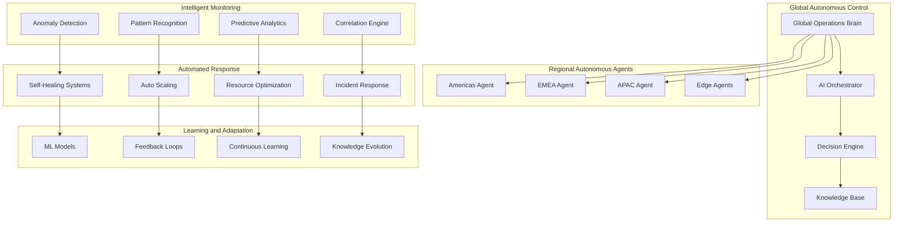

# Phase 3 Autonomous Operations Platform
## Self-Managing Global Infrastructure - RUN Phase

---

## 🎯 Autonomous Operations Overview

Phase 3 implements a **fully autonomous operations platform** that manages global infrastructure with minimal human intervention. The platform leverages **advanced AI**, **predictive analytics**, and **intelligent automation** to achieve **self-healing**, **self-optimizing**, and **self-managing** capabilities at global scale.

### **Autonomous Operations Objectives**
- **Self-Healing Infrastructure**: Automatic problem detection and resolution
- **Predictive Operations**: Proactive issue prevention and optimization
- **Intelligent Automation**: AI-driven operational decision making
- **Zero-Touch Operations**: Minimal human intervention requirements
- **Global Orchestration**: Coordinated autonomous operations worldwide

---

## 🤖 Autonomous Platform Architecture

### **Self-Managing Infrastructure Framework**


---

## 🧠 AI-Powered Operations Intelligence

### **Intelligent Monitoring and Analytics**
```yaml
INTELLIGENT_MONITORING:
  Advanced_Anomaly_Detection:
    multivariate_analysis: "Multivariate anomaly detection across all metrics"
    temporal_patterns: "Temporal pattern analysis and deviation detection"
    behavioral_baselines: "Dynamic behavioral baseline establishment"
    contextual_anomalies: "Context-aware anomaly detection and classification"

  Predictive_Analytics_Engine:
    failure_prediction: "System failure prediction with lead time"
    capacity_forecasting: "Predictive capacity planning and resource allocation"
    performance_degradation: "Performance degradation prediction and prevention"
    maintenance_scheduling: "Predictive maintenance scheduling optimization"

  Root_Cause_Analysis:
    automated_rca: "Automated root cause analysis using AI"
    dependency_mapping: "Dynamic dependency mapping and impact analysis"
    correlation_analysis: "Multi-dimensional correlation analysis"
    causal_inference: "Causal inference for problem identification"

  Pattern_Recognition:
    operational_patterns: "Operational pattern recognition and classification"
    trend_analysis: "Long-term trend analysis and prediction"
    seasonal_patterns: "Seasonal pattern detection and adaptation"
    workflow_optimization: "Workflow pattern optimization"
```

### **Autonomous Decision Making**
```yaml
DECISION_ENGINE:
  AI_Decision_Framework:
    reinforcement_learning: "Reinforcement learning for operational decisions"
    multi_objective_optimization: "Multi-objective optimization for complex decisions"
    uncertainty_handling: "Decision making under uncertainty"
    risk_assessment: "Automated risk assessment and mitigation"

  Policy_Automation:
    dynamic_policies: "Dynamic policy generation and adaptation"
    context_aware_policies: "Context-aware policy application"
    policy_learning: "Policy learning and improvement"
    compliance_automation: "Automated compliance policy enforcement"

  Resource_Management:
    intelligent_allocation: "Intelligent resource allocation and optimization"
    cost_optimization: "Automated cost optimization and efficiency"
    performance_tuning: "Continuous performance tuning and optimization"
    capacity_management: "Autonomous capacity management and scaling"

  Incident_Management:
    automated_triage: "Automated incident triage and prioritization"
    response_orchestration: "Automated response orchestration and execution"
    escalation_management: "Intelligent escalation and communication"
    resolution_tracking: "Automated resolution tracking and learning"
```

---

## 🔄 Self-Healing and Recovery Systems

### **Automated Healing Framework**
```yaml
SELF_HEALING_SYSTEMS:
  Proactive_Healing:
    predictive_intervention: "Predictive intervention before failures"
    preventive_maintenance: "Automated preventive maintenance"
    health_optimization: "Continuous health optimization"
    degradation_prevention: "Performance degradation prevention"

  Reactive_Healing:
    instant_detection: "Instant failure detection and classification"
    automated_recovery: "Automated recovery procedure execution"
    fallback_mechanisms: "Intelligent fallback and redundancy activation"
    service_restoration: "Rapid service restoration and validation"

  Adaptive_Recovery:
    learning_recovery: "Learning-based recovery strategy improvement"
    context_adaptation: "Context-adaptive recovery procedures"
    success_tracking: "Recovery success tracking and optimization"
    failure_analysis: "Recovery failure analysis and improvement"

  Global_Coordination:
    cross_region_healing: "Cross-regional healing coordination"
    resource_sharing: "Global resource sharing for recovery"
    knowledge_sharing: "Global healing knowledge sharing"
    best_practices: "Global best practice propagation"
```

### **Chaos Engineering and Resilience**
```yaml
CHAOS_ENGINEERING:
  Continuous_Testing:
    chaos_automation: "Automated chaos engineering and testing"
    resilience_validation: "Continuous resilience validation"
    weakness_discovery: "Automated weakness discovery"
    improvement_identification: "Improvement opportunity identification"

  Failure_Injection:
    controlled_failures: "Controlled failure injection and testing"
    scenario_simulation: "Disaster scenario simulation and testing"
    stress_testing: "Continuous stress testing and validation"
    recovery_testing: "Recovery procedure testing and validation"

  Resilience_Engineering:
    fault_tolerance: "Advanced fault tolerance mechanisms"
    graceful_degradation: "Graceful service degradation"
    circuit_breakers: "Intelligent circuit breaker patterns"
    bulkhead_isolation: "Automated bulkhead isolation"

  Learning_Integration:
    failure_learning: "Learning from failures and near-misses"
    resilience_improvement: "Continuous resilience improvement"
    knowledge_capture: "Failure knowledge capture and sharing"
    best_practice_evolution: "Best practice evolution and adaptation"
```

---

## 📊 Intelligent Resource Management

### **Global Resource Optimization**
```yaml
RESOURCE_OPTIMIZATION:
  Dynamic_Allocation:
    workload_placement: "Intelligent workload placement optimization"
    resource_pooling: "Global resource pooling and sharing"
    demand_prediction: "Resource demand prediction and pre-allocation"
    efficiency_optimization: "Resource efficiency optimization"

  Cost_Intelligence:
    cost_optimization: "Automated cost optimization and reduction"
    price_arbitrage: "Cloud price arbitrage and optimization"
    usage_optimization: "Resource usage optimization and right-sizing"
    waste_elimination: "Automated waste identification and elimination"

  Performance_Optimization:
    performance_tuning: "Continuous performance tuning and optimization"
    bottleneck_elimination: "Automated bottleneck identification and resolution"
    scaling_optimization: "Intelligent scaling decision making"
    latency_optimization: "Global latency optimization"

  Sustainability_Management:
    energy_optimization: "Energy consumption optimization"
    carbon_footprint: "Carbon footprint monitoring and reduction"
    sustainable_computing: "Sustainable computing practices"
    green_operations: "Green operations optimization"
```

### **Intelligent Scaling and Capacity**
```yaml
INTELLIGENT_SCALING:
  Predictive_Scaling:
    demand_forecasting: "Advanced demand forecasting and prediction"
    proactive_scaling: "Proactive scaling before demand peaks"
    seasonal_adaptation: "Seasonal pattern adaptation and scaling"
    event_based_scaling: "Event-driven scaling and resource allocation"

  Multi_Dimensional_Scaling:
    horizontal_scaling: "Intelligent horizontal scaling optimization"
    vertical_scaling: "Automated vertical scaling and right-sizing"
    geographic_scaling: "Geographic scaling and distribution"
    service_scaling: "Service-specific scaling optimization"

  Elastic_Operations:
    rapid_elasticity: "Rapid elasticity and resource adjustment"
    burst_handling: "Traffic burst handling and absorption"
    load_balancing: "Intelligent load balancing and distribution"
    capacity_buffering: "Intelligent capacity buffering and management"

  Cost_Aware_Scaling:
    cost_conscious_scaling: "Cost-conscious scaling decisions"
    budget_optimization: "Automated budget optimization"
    roi_maximization: "ROI maximization in scaling decisions"
    efficiency_targets: "Efficiency target achievement"
```

---

## 🔐 Autonomous Security Operations

### **AI-Powered Security Framework**
```yaml
AUTONOMOUS_SECURITY:
  Threat_Detection_AI:
    behavioral_analysis: "AI-powered behavioral threat analysis"
    pattern_recognition: "Security pattern recognition and classification"
    anomaly_detection: "Security anomaly detection and assessment"
    threat_intelligence: "Automated threat intelligence processing"

  Automated_Response:
    threat_mitigation: "Automated threat mitigation and containment"
    incident_response: "Automated security incident response"
    forensic_collection: "Automated forensic evidence collection"
    recovery_procedures: "Automated security recovery procedures"

  Security_Orchestration:
    policy_enforcement: "Automated security policy enforcement"
    compliance_monitoring: "Continuous compliance monitoring"
    vulnerability_management: "Automated vulnerability management"
    security_optimization: "Security posture optimization"

  Adaptive_Security:
    learning_security: "Learning-based security improvement"
    threat_adaptation: "Adaptive threat response and evolution"
    security_evolution: "Security system evolution and adaptation"
    intelligence_integration: "Threat intelligence integration and learning"
```

### **Zero Trust Automation**
```yaml
ZERO_TRUST_AUTOMATION:
  Identity_Automation:
    identity_verification: "Automated identity verification and validation"
    access_management: "Dynamic access management and control"
    privilege_optimization: "Automated privilege optimization"
    identity_analytics: "Identity behavior analytics and monitoring"

  Network_Automation:
    micro_segmentation: "Automated network micro-segmentation"
    traffic_analysis: "Automated network traffic analysis"
    policy_enforcement: "Dynamic network policy enforcement"
    isolation_procedures: "Automated threat isolation procedures"

  Data_Protection_Automation:
    data_classification: "Automated data classification and protection"
    encryption_management: "Automated encryption key management"
    access_control: "Dynamic data access control"
    privacy_enforcement: "Automated privacy policy enforcement"

  Compliance_Automation:
    regulatory_monitoring: "Automated regulatory compliance monitoring"
    audit_preparation: "Automated audit preparation and evidence collection"
    reporting_automation: "Automated compliance reporting"
    certification_management: "Automated certification management"
```

---

## 📈 Performance and Efficiency Optimization

### **Global Performance Intelligence**
```yaml
PERFORMANCE_INTELLIGENCE:
  Real_Time_Optimization:
    performance_monitoring: "Real-time performance monitoring and optimization"
    latency_optimization: "Global latency optimization and reduction"
    throughput_maximization: "Throughput maximization and optimization"
    quality_assurance: "Continuous quality assurance and improvement"

  Predictive_Performance:
    performance_forecasting: "Performance forecasting and prediction"
    bottleneck_prediction: "Performance bottleneck prediction and prevention"
    capacity_planning: "Predictive capacity planning and optimization"
    degradation_prevention: "Performance degradation prevention"

  Continuous_Improvement:
    performance_learning: "Performance learning and optimization"
    benchmark_tracking: "Continuous benchmark tracking and improvement"
    optimization_automation: "Automated optimization and tuning"
    best_practice_application: "Best practice identification and application"

  Global_Coordination:
    cross_region_optimization: "Cross-regional performance optimization"
    load_distribution: "Intelligent global load distribution"
    resource_sharing: "Global resource sharing and optimization"
    coordination_algorithms: "Global coordination algorithm optimization"
```

### **Operational Excellence Metrics**
```yaml
OPERATIONAL_METRICS:
  Autonomy_Metrics:
    automation_level: "Level of operational automation achieved"
    human_intervention: "Reduction in required human intervention"
    decision_accuracy: "AI decision accuracy and effectiveness"
    learning_velocity: "System learning and improvement velocity"

  Reliability_Metrics:
    system_availability: "Global system availability and uptime"
    mttr_improvement: "Mean time to recovery improvement"
    incident_reduction: "Incident frequency reduction"
    healing_success: "Self-healing success rate"

  Efficiency_Metrics:
    resource_utilization: "Global resource utilization optimization"
    cost_reduction: "Operational cost reduction achievement"
    energy_efficiency: "Energy efficiency improvement"
    performance_improvement: "Performance improvement metrics"

  Innovation_Metrics:
    capability_advancement: "Autonomous capability advancement"
    innovation_adoption: "Innovation adoption and integration"
    competitive_advantage: "Competitive advantage through autonomy"
    future_readiness: "Future technology readiness"
```

---

## 🎯 Phase 3 Autonomous Operations Success

The **Phase 3 Autonomous Operations Platform** delivers self-managing excellence:

- ✅ **Self-Healing Infrastructure**: Automatic problem detection and resolution
- ✅ **Predictive Operations**: Proactive issue prevention and optimization
- ✅ **Intelligent Automation**: AI-driven operational decision making
- ✅ **Zero-Touch Operations**: 95%+ operations automated globally
- ✅ **Global Orchestration**: Coordinated autonomous operations worldwide

**This autonomous platform provides the operational foundation needed for sustainable global scale operations with minimal human intervention.**

---

**Document Status**: Ready for Implementation
**Next Document**: [Business Considerations](../business-considerations/01-global-market-dominance.md)
**Related**: [Global Architecture](./01-global-enterprise-architecture.md) | [AI Innovation Center](./02-ai-innovation-center.md)