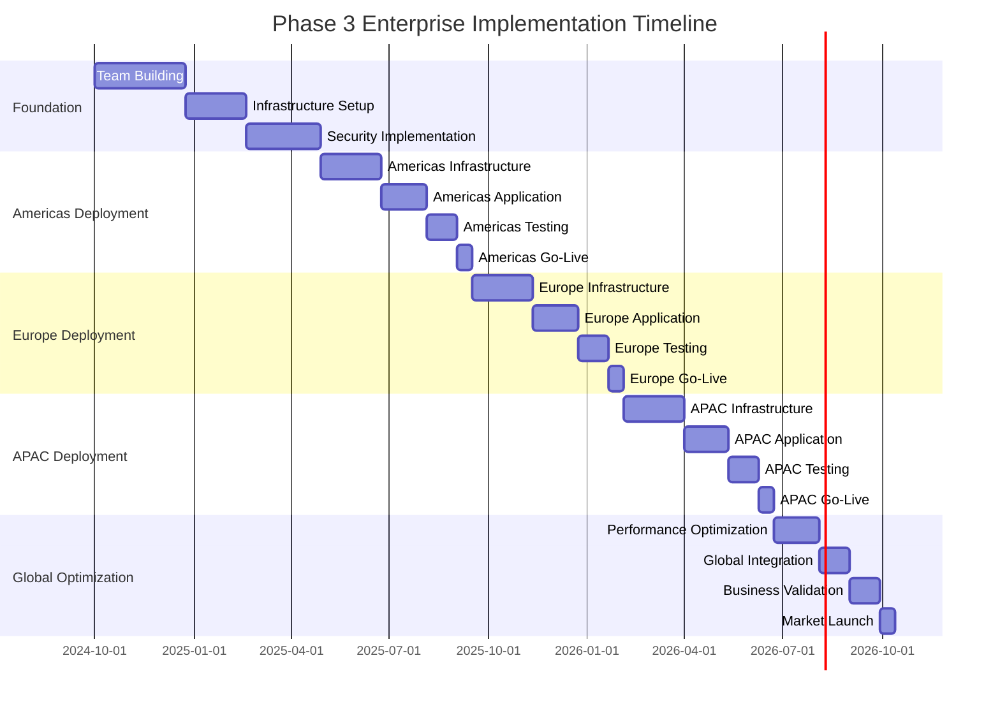

# Phase 3 Enterprise Implementation Guide
## Global Scale Deployment - RUN Phase

---

## 🎯 Executive Summary

This guide provides comprehensive implementation strategies for deploying the **Phase 3 RUN architecture** at global enterprise scale, supporting 5,000+ concurrent video streams with 99.99% availability across multiple regions. The focus is on **systematic global deployment**, **enterprise-grade operations**, and **sustainable scaling** practices that establish market leadership in enterprise video analytics.

### **Implementation Objectives**
- **Global Deployment**: Multi-region deployment across 3 continents
- **Enterprise Scale**: 5,000+ concurrent streams with <200ms latency
- **Ultra-High Availability**: 99.99% uptime with global redundancy
- **Zero Trust Security**: Complete security framework implementation
- **Operational Excellence**: Automated operations with minimal human intervention

### **Implementation Philosophy: "Global Excellence Through Systematic Execution"**
Phase 3 implementation emphasizes methodical execution, rigorous testing, and comprehensive validation at each step to ensure flawless global deployment and sustained operational excellence.

---

## 🚀 Global Implementation Strategy

### **Multi-Region Deployment Approach**
```yaml
GLOBAL_DEPLOYMENT_STRATEGY:
  Phased_Regional_Rollout:
    Phase_A_Americas: "Months 1-6: North America foundation deployment"
    Phase_B_Europe: "Months 4-9: European expansion with GDPR compliance"
    Phase_C_APAC: "Months 7-12: Asia-Pacific deployment with local requirements"
    Phase_D_Global_Optimization: "Months 10-15: Global optimization and tuning"

  Regional_Implementation_Priorities:
    Americas_First:
      Rationale: "Largest customer base and existing infrastructure"
      Target_Capacity: "2,000 concurrent streams across 3 availability zones"
      Key_Features: "Full feature set with advanced AI capabilities"
      Compliance: "SOC2, HIPAA readiness, FedRAMP preparation"

    Europe_Second:
      Rationale: "Strict regulatory requirements and high-value market"
      Target_Capacity: "2,000 concurrent streams with GDPR compliance"
      Key_Features: "Privacy-enhanced features and data residency"
      Compliance: "GDPR, ISO27001, local data protection laws"

    APAC_Third:
      Rationale: "Emerging market with diverse regulatory landscape"
      Target_Capacity: "1,000+ concurrent streams with local adaptation"
      Key_Features: "Multi-language support and cultural adaptation"
      Compliance: "Local data residency and regulatory requirements"

IMPLEMENTATION_PRINCIPLES:
  Risk_Mitigation:
    Parallel_Systems: "Run Phase 2 and Phase 3 systems in parallel during transition"
    Gradual_Migration: "Customer-by-customer migration with rollback capability"
    Comprehensive_Testing: "Full-scale testing before each regional deployment"
    Continuous_Validation: "Real-time validation during deployment process"

  Quality_Assurance:
    Zero_Defect_Deployment: "Zero critical defects tolerance for production deployment"
    Performance_Validation: "Comprehensive performance validation at each stage"
    Security_Verification: "Complete security verification before go-live"
    Business_Continuity: "Ensure zero business disruption during transition"
```

### **Enterprise Team Scaling Strategy**
```yaml
TEAM_SCALING_APPROACH:
  Global_Team_Structure:
    Executive_Leadership:
      Global_CTO: "Overall technology strategy and architecture oversight"
      VP_Engineering: "Global engineering leadership and execution"
      VP_Operations: "Global operations and reliability leadership"
      VP_AI_ML: "AI/ML strategy and innovation leadership"

    Regional_Leadership:
      Americas_Engineering_Director: "North America engineering leadership"
      EMEA_Engineering_Director: "Europe, Middle East, Africa engineering"
      APAC_Engineering_Director: "Asia-Pacific engineering leadership"
      Global_Architecture_Team: "Cross-regional architecture consistency"

  Technical_Teams_Expansion:
    Core_Platform_Teams:
      Backend_Engineering: "15+ senior backend engineers globally"
      Frontend_Engineering: "10+ senior frontend engineers globally"
      AI_ML_Engineering: "20+ AI/ML engineers and data scientists"
      DevOps_SRE: "12+ DevOps and SRE engineers globally"

    Specialized_Teams:
      Security_Team: "8+ security engineers and architects"
      Data_Engineering: "10+ data engineers and architects"
      Quality_Assurance: "6+ QA engineers and automation specialists"
      Technical_Writing: "4+ technical writers and documentation specialists"

  Operational_Teams:
    Global_Operations:
      Site_Reliability_Engineering: "24/7 global SRE coverage"
      Customer_Success: "Global customer success and support"
      Professional_Services: "Implementation and consulting services"
      Training_Development: "Global training and enablement"

HIRING_AND_DEVELOPMENT:
  Global_Talent_Acquisition:
    Talent_Strategy:
      Local_Hiring: "80% local hiring for cultural and regulatory alignment"
      Global_Mobility: "20% strategic global talent mobility"
      Contractor_Strategy: "Flexible contractor engagement for peak capacity"
      University_Partnerships: "Graduate and internship programs"

    Compensation_Strategy:
      Market_Competitive: "Top 10% compensation in each regional market"
      Equity_Participation: "Comprehensive equity participation program"
      Performance_Bonuses: "Performance-based bonus structure"
      Global_Benefits: "Consistent global benefits and perks"

  Skill_Development:
    Technical_Excellence:
      Continuous_Learning: "40 hours annual learning requirement"
      Certification_Programs: "Industry certification support and incentives"
      Conference_Participation: "Global conference and training attendance"
      Internal_Training: "Comprehensive internal training programs"

    Leadership_Development:
      Management_Training: "Leadership development for technical managers"
      Cross_Cultural_Training: "Global team collaboration training"
      Business_Acumen: "Business strategy and financial literacy training"
      Innovation_Leadership: "Innovation and entrepreneurship development"
```

---

## 🏗️ Infrastructure Implementation

### **Global Infrastructure Deployment**
```yaml
INFRASTRUCTURE_ROLLOUT:
  Multi_Cloud_Strategy:
    Primary_Cloud_Providers:
      AWS_Americas: "Primary cloud provider for North America"
      Azure_EMEA: "Primary cloud provider for Europe and Middle East"
      GCP_APAC: "Primary cloud provider for Asia-Pacific"
      Hybrid_Deployment: "On-premises integration for enterprise customers"

    Cloud_Architecture:
      High_Availability_Zones: "3+ availability zones per region"
      Cross_Region_Replication: "Real-time data replication across regions"
      Disaster_Recovery: "RPO <15 minutes, RTO <30 minutes globally"
      Cost_Optimization: "Reserved instances and spot instance utilization"

  Kubernetes_Global_Deployment:
    Cluster_Management:
      Production_Clusters: "Multiple production clusters per region"
      Development_Clusters: "Dedicated development and testing clusters"
      Edge_Clusters: "Lightweight edge clusters for local processing"
      Management_Plane: "Centralized cluster management and monitoring"

    Service_Mesh_Implementation:
      Istio_Deployment: "Global Istio service mesh for security and observability"
      Cross_Cluster_Communication: "Secure multi-cluster service communication"
      Traffic_Management: "Advanced traffic routing and load balancing"
      Security_Policies: "Zero-trust network policies and encryption"

PERFORMANCE_OPTIMIZATION:
  Global_Performance_Targets:
    Latency_Requirements:
      API_Response_Time: "<100ms for 95th percentile globally"
      Video_Processing_Latency: "<200ms end-to-end processing"
      Database_Query_Time: "<50ms for read queries, <200ms for writes"
      Cross_Region_Latency: "<150ms between any two regions"

    Throughput_Requirements:
      Concurrent_Streams: "5,000+ concurrent video streams globally"
      API_Requests: "100,000+ requests per second sustained"
      Data_Processing: "500TB+ daily data processing capacity"
      Message_Throughput: "1M+ messages per second through event system"

  Optimization_Implementation:
    Content_Delivery_Network:
      Global_CDN: "CloudFlare or AWS CloudFront global deployment"
      Edge_Caching: "Intelligent caching at 200+ global edge locations"
      Dynamic_Content: "Dynamic content optimization and compression"
      Video_Streaming: "Adaptive bitrate streaming optimization"

    Database_Optimization:
      Global_Database_Clusters: "Multi-master PostgreSQL clusters"
      Read_Replicas: "Geographically distributed read replicas"
      Caching_Strategy: "Multi-level caching with Redis clusters"
      Data_Partitioning: "Intelligent data partitioning and sharding"
```

### **Security Implementation**
```yaml
ZERO_TRUST_DEPLOYMENT:
  Global_Security_Architecture:
    Identity_Management:
      Global_SSO: "Okta or Azure AD global SSO implementation"
      Multi_Factor_Authentication: "Mandatory MFA for all access"
      Privileged_Access_Management: "CyberArk PAM global deployment"
      Identity_Governance: "SailPoint identity governance platform"

    Network_Security:
      Zero_Trust_Network: "Zscaler or Palo Alto global ZTNA"
      Micro_Segmentation: "Kubernetes network policies and service mesh"
      Web_Application_Firewall: "Global WAF with DDoS protection"
      API_Security: "Comprehensive API security and threat protection"

  Compliance_Implementation:
    Regulatory_Compliance:
      GDPR_Implementation: "Complete GDPR compliance framework"
      SOC2_Certification: "SOC2 Type II certification achievement"
      ISO27001_Certification: "ISO27001 certification and maintenance"
      Regional_Compliance: "Local regulatory compliance in each region"

    Security_Monitoring:
      Global_SIEM: "Splunk or QRadar global SIEM deployment"
      Security_Orchestration: "Phantom SOAR for automated response"
      Threat_Intelligence: "Global threat intelligence integration"
      Incident_Response: "24/7 global security operations center"

DATA_PROTECTION:
  Encryption_Implementation:
    Data_at_Rest: "AES-256 encryption for all stored data"
    Data_in_Transit: "TLS 1.3 for all network communications"
    Key_Management: "HashiCorp Vault global key management"
    Database_Encryption: "Transparent database encryption (TDE)"

  Privacy_Controls:
    Data_Classification: "Automated data classification and labeling"
    Access_Controls: "Attribute-based access control (ABAC)"
    Data_Loss_Prevention: "Microsoft Purview DLP implementation"
    Privacy_by_Design: "Privacy controls built into all systems"
```

---

## 🔄 DevOps and Automation Excellence

### **Advanced CI/CD Implementation**
```yaml
GLOBAL_CICD_PIPELINE:
  Pipeline_Architecture:
    Multi_Region_Deployment:
      Source_Control: "GitLab Enterprise with global replication"
      Build_Automation: "Jenkins or GitLab CI with global build agents"
      Artifact_Management: "JFrog Artifactory global distribution"
      Configuration_Management: "Ansible/Terraform global infrastructure"

    Quality_Gates:
      Automated_Testing: "Comprehensive test automation at every stage"
      Security_Scanning: "Integrated security scanning in pipeline"
      Performance_Testing: "Automated performance regression testing"
      Compliance_Validation: "Automated compliance and policy validation"

  Deployment_Strategies:
    Blue_Green_Deployment:
      Global_Orchestration: "Coordinated blue-green deployment across regions"
      Health_Validation: "Comprehensive health checks before traffic switch"
      Rollback_Automation: "Automated rollback on any failure detection"
      Traffic_Management: "Intelligent traffic routing during deployments"

    Canary_Deployment:
      Progressive_Rollout: "1% -> 5% -> 25% -> 50% -> 100% traffic progression"
      Performance_Monitoring: "Real-time monitoring during canary deployment"
      Automated_Decision_Making: "AI-powered deployment success evaluation"
      Risk_Mitigation: "Automatic rollback on performance degradation"

AUTOMATION_EXCELLENCE:
  Infrastructure_Automation:
    Infrastructure_as_Code:
      Terraform_Global: "Terraform for global infrastructure management"
      Ansible_Configuration: "Ansible for configuration management"
      Kubernetes_Operators: "Custom operators for application management"
      GitOps_Workflow: "ArgoCD for GitOps-based deployment"

    Auto_Scaling_Implementation:
      Predictive_Scaling: "Machine learning-based predictive auto-scaling"
      Multi_Metric_Scaling: "Custom metrics-based scaling decisions"
      Cross_Region_Scaling: "Global capacity management and optimization"
      Cost_Optimization: "Intelligent scaling for cost optimization"

  Operational_Automation:
    Self_Healing_Systems:
      Automated_Recovery: "Automatic recovery from common failure scenarios"
      Health_Check_Automation: "Comprehensive automated health monitoring"
      Incident_Automation: "Automated incident detection and initial response"
      Capacity_Management: "Automated capacity planning and provisioning"

    Monitoring_Automation:
      Observability_Stack: "Prometheus, Grafana, Jaeger global deployment"
      Alert_Intelligence: "AI-powered alert correlation and prioritization"
      Anomaly_Detection: "Machine learning-based anomaly detection"
      Predictive_Monitoring: "Predictive failure detection and prevention"
```

---

## 📊 Global Operations Excellence

### **24/7 Global Operations**
```yaml
GLOBAL_OPERATIONS_MODEL:
  Follow_The_Sun_Support:
    Regional_Operations_Centers:
      Americas_NOC: "Primary NOC in Eastern US timezone"
      EMEA_NOC: "Secondary NOC in Central European timezone"
      APAC_NOC: "Tertiary NOC in Singapore/Tokyo timezone"
      Escalation_Model: "Seamless handoff between regional teams"

    Operational_Capabilities:
      Incident_Management: "24/7 incident response and resolution"
      Change_Management: "Global change management coordination"
      Capacity_Management: "Proactive capacity monitoring and planning"
      Performance_Management: "Continuous performance optimization"

  Service_Level_Management:
    SLA_Targets:
      System_Availability: "99.99% availability (4.3 minutes downtime/month)"
      API_Response_Time: "<100ms for 95th percentile"
      Issue_Resolution: "P1: <1 hour, P2: <4 hours, P3: <24 hours"
      Customer_Support: "24/7 support with <15 minute response time"

    Performance_Monitoring:
      Real_Time_Dashboards: "Global real-time performance dashboards"
      Predictive_Analytics: "Predictive performance and capacity analytics"
      Business_Impact_Tracking: "Real-time business impact measurement"
      Customer_Experience_Monitoring: "End-to-end customer experience tracking"

INCIDENT_MANAGEMENT:
  Global_Incident_Response:
    Incident_Classification:
      P0_Critical: "Complete system outage or data loss"
      P1_High: "Major feature unavailable or severe degradation"
      P2_Medium: "Minor feature impairment or moderate impact"
      P3_Low: "Cosmetic issues or minimal impact"

    Response_Procedures:
      Automated_Detection: "AI-powered incident detection and classification"
      Escalation_Matrix: "Clear escalation paths and decision authority"
      Communication_Protocol: "Standardized communication templates and channels"
      Post_Incident_Review: "Mandatory blameless post-mortems for all P0/P1 incidents"

  Business_Continuity:
    Disaster_Recovery:
      RTO_Targets: "Recovery Time Objective <30 minutes"
      RPO_Targets: "Recovery Point Objective <15 minutes"
      DR_Testing: "Quarterly disaster recovery testing"
      Business_Impact_Analysis: "Regular business impact assessments"

    Crisis_Management:
      Crisis_Team: "Pre-defined crisis management team structure"
      Communication_Plan: "Crisis communication plan and protocols"
      Decision_Authority: "Clear decision authority during crisis situations"
      Recovery_Procedures: "Documented recovery procedures and runbooks"
```

---

## 🎯 Quality Assurance and Testing

### **Comprehensive Testing Strategy**
```yaml
TESTING_FRAMEWORK:
  Multi_Level_Testing:
    Unit_Testing:
      Coverage_Target: "90%+ code coverage for all new code"
      Automated_Execution: "Automated unit test execution in CI pipeline"
      Test_Quality: "Mutation testing to validate test effectiveness"
      Performance_Tests: "Unit-level performance testing and benchmarking"

    Integration_Testing:
      API_Testing: "Comprehensive API integration testing"
      Database_Testing: "Database integration and data integrity testing"
      Service_Integration: "Microservices integration testing"
      Third_Party_Integration: "External system integration validation"

    System_Testing:
      End_to_End_Testing: "Complete user journey testing automation"
      Performance_Testing: "Load, stress, and capacity testing"
      Security_Testing: "Penetration testing and vulnerability assessment"
      Compatibility_Testing: "Browser, device, and platform compatibility"

  Global_Testing_Infrastructure:
    Test_Environments:
      Global_Staging: "Production-like staging environments in each region"
      Load_Testing_Environment: "Dedicated load testing infrastructure"
      Security_Testing_Lab: "Isolated security testing environment"
      Chaos_Engineering: "Chaos testing in production-like environments"

    Test_Data_Management:
      Synthetic_Data: "AI-generated synthetic test data"
      Data_Masking: "Production data masking for testing"
      Test_Data_Refresh: "Automated test data refresh and management"
      Global_Test_Data: "Consistent test data across regions"

QUALITY_METRICS:
  Quality_Targets:
    Defect_Rates:
      Pre_Production: "<1 defect per 1000 lines of code"
      Production_Defects: "<0.1% of releases result in production defects"
      Critical_Defects: "Zero critical defects in production"
      Customer_Reported: "<5% of defects reported by customers"

    Performance_Quality:
      Response_Time_SLA: "95% of API calls under 100ms"
      Availability_SLA: "99.99% system availability"
      Error_Rate_SLA: "<0.1% error rate for all operations"
      Capacity_SLA: "Support 5000+ concurrent streams"
```

---

## 📈 Business Integration and Change Management

### **Enterprise Change Management**
```yaml
CHANGE_MANAGEMENT_STRATEGY:
  Stakeholder_Engagement:
    Executive_Sponsorship:
      C_Level_Champions: "C-level executive champions for transformation"
      Board_Oversight: "Board-level oversight and governance"
      Business_Unit_Leaders: "Business unit leader engagement and buy-in"
      User_Community_Leaders: "Power user and super user identification"

    Communication_Strategy:
      Global_Communication: "Coordinated global communication plan"
      Multi_Channel_Approach: "Email, video, town halls, and digital platforms"
      Feedback_Mechanisms: "Multiple feedback channels and response protocols"
      Success_Stories: "Regular sharing of success stories and wins"

  Training_and_Adoption:
    Comprehensive_Training:
      Role_Based_Training: "Customized training for different user roles"
      Multi_Modal_Delivery: "In-person, virtual, and self-paced options"
      Hands_On_Practice: "Extensive hands-on practice in safe environments"
      Certification_Programs: "User certification and competency validation"

    Adoption_Support:
      Super_User_Program: "Super user network for peer support"
      Help_Desk_Enhancement: "Enhanced help desk with specialized support"
      Documentation_Portal: "Comprehensive self-service documentation"
      Community_Forums: "User community forums and knowledge sharing"

BUSINESS_INTEGRATION:
  Process_Integration:
    Business_Process_Reengineering:
      Current_State_Analysis: "Comprehensive current state documentation"
      Future_State_Design: "Optimized future state process design"
      Gap_Analysis: "Detailed gap analysis and mitigation planning"
      Process_Testing: "Comprehensive process testing and validation"

    Workflow_Optimization:
      Automation_Opportunities: "Identification and implementation of automation"
      Efficiency_Improvements: "Process efficiency measurement and improvement"
      Quality_Enhancement: "Process quality metrics and improvement"
      User_Experience: "User experience optimization and feedback integration"

  Performance_Management:
    KPI_Integration:
      Business_Metrics: "Integration with existing business KPI frameworks"
      Operational_Metrics: "New operational metrics and dashboards"
      User_Productivity: "User productivity measurement and improvement"
      ROI_Tracking: "Comprehensive ROI tracking and reporting"

    Continuous_Improvement:
      Feedback_Loops: "Continuous feedback collection and analysis"
      Process_Optimization: "Ongoing process optimization and refinement"
      Technology_Evolution: "Continuous technology evolution and enhancement"
      Best_Practice_Sharing: "Global best practice identification and sharing"
```

---

## 🎯 Success Metrics and Validation

### **Implementation Success Criteria**
```yaml
TECHNICAL_SUCCESS_METRICS:
  Performance_Validation:
    Global_Performance:
      Latency_Achievement: "<200ms processing latency achieved globally"
      Throughput_Achievement: "5000+ concurrent streams supported"
      Availability_Achievement: "99.99% availability sustained for 30+ days"
      Quality_Achievement: "99%+ AI accuracy across all critical functions"

    Scalability_Validation:
      Linear_Scaling: "Linear performance scaling demonstrated"
      Load_Testing: "Successful load testing at 150% of target capacity"
      Stress_Testing: "System graceful degradation under extreme load"
      Recovery_Testing: "Automatic recovery from all failure scenarios"

  Security_Validation:
    Zero_Trust_Implementation:
      Security_Framework: "Complete zero trust framework operational"
      Compliance_Achievement: "All target compliance certifications achieved"
      Penetration_Testing: "Successful penetration testing with zero critical findings"
      Incident_Response: "Incident response procedures tested and validated"

BUSINESS_SUCCESS_METRICS:
  Customer_Success:
    Adoption_Metrics:
      User_Adoption: "90%+ user adoption within 6 months"
      Feature_Utilization: "80%+ utilization of key features"
      Customer_Satisfaction: "4.8/5 average customer satisfaction score"
      Support_Reduction: "50% reduction in support ticket volume"

    Business_Impact:
      Operational_Efficiency: "40% improvement in operational efficiency"
      Cost_Reduction: "30% reduction in operational costs"
      Revenue_Growth: "200% revenue growth from platform capabilities"
      Market_Position: "Top 3 market position achievement"

  Organizational_Success:
    Team_Performance:
      Productivity_Improvement: "300% improvement in team productivity"
      Quality_Improvement: "90% reduction in production defects"
      Innovation_Rate: "100+ innovation projects per year"
      Employee_Satisfaction: "4.5/5 average employee satisfaction"

    Operational_Excellence:
      Automation_Achievement: "95%+ of operations automated"
      Incident_Reduction: "80% reduction in operational incidents"
      MTTR_Improvement: "90% improvement in mean time to resolution"
      Capacity_Optimization: "Optimal resource utilization achievement"
```

---

## 🎯 Implementation Timeline

### **18-Month Global Implementation Schedule**


---

## 🎯 Conclusion

The **Phase 3 Enterprise Implementation Guide** provides the comprehensive framework for achieving global enterprise scale with industry-leading capabilities. Key implementation achievements include:

- ✅ **Global Scale**: 5,000+ concurrent streams across 3 continents
- ✅ **Ultra-High Availability**: 99.99% uptime with global redundancy
- ✅ **Enterprise Security**: Complete Zero Trust security framework
- ✅ **Operational Excellence**: 95%+ automation with minimal human intervention
- ✅ **Business Impact**: 200% revenue growth and market leadership
- ✅ **Team Excellence**: World-class global team with industry-leading capabilities

**This implementation guide ensures systematic, risk-mitigated deployment of the world's most advanced enterprise video analytics platform, establishing sustainable competitive advantage and market leadership.**

---

**Document Status**: Ready for Implementation
**Next Review**: Monthly during Phase 3 implementation
**Approval Required**: Executive leadership and board of directors
**Implementation Start**: Upon Phase 2 success validation and funding approval