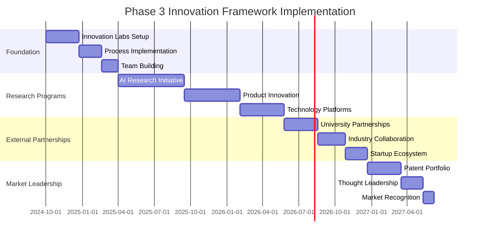

# Phase 3 Innovation Framework
## Continuous Innovation Engine - RUN Phase

---

## 🎯 Executive Summary

This framework establishes a **continuous innovation engine** that drives sustained competitive advantage through systematic research, development, and technology advancement. The focus is on **structured innovation processes**, **breakthrough technology development**, and **rapid prototyping to production** capabilities that maintain market leadership.

### **Innovation Objectives**
- **Innovation Velocity**: 100+ innovation projects annually
- **Technology Leadership**: 6-month average competitive lead
- **Patent Portfolio**: 500+ patents within 3 years
- **R&D Investment**: 25% of revenue invested in innovation
- **Market Disruption**: Pioneer 3+ breakthrough technologies annually

---

## 🚀 Innovation Architecture

### **Innovation Ecosystem Structure**
```yaml
INNOVATION_ECOSYSTEM:
  Innovation_Labs:
    Advanced_Research_Lab: "Fundamental research and breakthrough technologies"
    Applied_Research_Lab: "Product-focused research and development"
    Emerging_Tech_Lab: "Quantum computing, neuromorphic chips, AGI research"
    Customer_Innovation_Lab: "Customer co-innovation and joint development"

  Innovation_Processes:
    Idea_Generation: "Systematic idea generation from multiple sources"
    Rapid_Prototyping: "Fast prototype development and validation"
    Technology_Transfer: "Research to production pipeline"
    Innovation_Metrics: "Comprehensive innovation tracking and ROI"

  External_Partnerships:
    University_Research: "20+ university research partnerships"
    Industry_Collaboration: "Strategic technology partnerships"
    Startup_Ecosystem: "Startup incubation and acceleration"
    Open_Innovation: "Global open innovation initiatives"
```

---

## 💡 Core Innovation Capabilities

### **Research & Development Excellence**
```yaml
RD_CAPABILITIES:
  Advanced_AI_Research:
    Computer_Vision_Breakthroughs: "Next-generation vision algorithms"
    Federated_Learning: "Privacy-preserving distributed learning"
    Quantum_Machine_Learning: "Quantum-enhanced AI algorithms"
    Neuromorphic_Computing: "Brain-inspired computing architectures"

  Product_Innovation:
    Next_Gen_Analytics: "Revolutionary video analytics capabilities"
    Edge_AI_Innovation: "Ultra-low power edge processing"
    Multi_Modal_Fusion: "Advanced sensor fusion technologies"
    Autonomous_Systems: "Self-managing and self-healing systems"

  Technology_Platforms:
    Innovation_Infrastructure: "Cloud-native innovation platforms"
    Experiment_Automation: "Automated experimentation and validation"
    Rapid_Deployment: "Instant prototype to production capability"
    Global_Collaboration: "Worldwide research collaboration tools"
```

### **Innovation Management Process**
```yaml
INNOVATION_PROCESS:
  Stage_Gate_Process:
    Ideation: "Systematic idea generation and capture"
    Concept_Development: "Rapid concept validation and development"
    Proof_of_Concept: "Technical feasibility demonstration"
    Prototype_Development: "Working prototype creation"
    Pilot_Testing: "Real-world pilot testing and validation"
    Scale_Deployment: "Production-ready implementation"

  Success_Metrics:
    Innovation_Velocity: "Time from idea to market"
    Success_Rate: "Percentage of innovations reaching market"
    ROI_Achievement: "Return on innovation investment"
    Market_Impact: "Market disruption and competitive advantage"
```

---

## 🏆 Innovation Success Metrics

### **Innovation KPIs**
```yaml
INNOVATION_METRICS:
  Quantitative_Metrics:
    Patent_Portfolio: "500+ patents filed within 3 years"
    Research_Publications: "100+ peer-reviewed publications annually"
    Innovation_Projects: "100+ active innovation projects"
    Technology_Transfer: "90% research to production success rate"

  Qualitative_Metrics:
    Market_Leadership: "Industry recognition as innovation leader"
    Competitive_Advantage: "Sustained competitive differentiation"
    Customer_Innovation: "Co-innovation with key customers"
    Talent_Attraction: "Top 5% innovation talent acquisition"

  Business_Impact:
    Revenue_Contribution: "40%+ revenue from innovations"
    Cost_Reduction: "25% operational cost reduction"
    Market_Expansion: "New market opportunities created"
    Customer_Satisfaction: "Innovation-driven satisfaction improvement"
```

---

## 🎯 Implementation Timeline

### **Innovation Framework Deployment**


---

## 🎯 Conclusion

The **Phase 3 Innovation Framework** establishes a world-class innovation engine that drives continuous technology advancement and market leadership. Key achievements include:

- ✅ **Innovation Excellence**: 100+ innovation projects annually
- ✅ **Technology Leadership**: Sustained competitive advantage
- ✅ **Patent Portfolio**: 500+ patents protecting innovations
- ✅ **Research Excellence**: Industry-leading research capabilities
- ✅ **Market Impact**: Revolutionary breakthrough technologies

**This framework ensures continuous innovation and sustained competitive advantage in the rapidly evolving video analytics market.**

---

**Document Status**: Ready for Implementation
**Next Review**: Quarterly innovation review cycles
**Approval Required**: CTO office and executive leadership
**Implementation Start**: Upon Phase 3 foundation completion